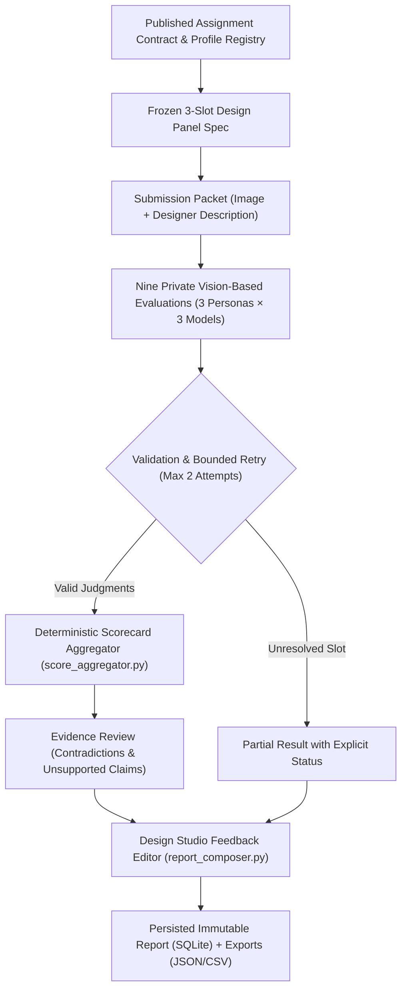

# Raati AI — System Evaluation & Architecture Report

## 1. System Overview and Purpose
**Raati AI** is a multi-agent AI system designed to evaluate design creativity using the Consensual Assessment Technique (CAT) framework. Its primary purpose is to assess student design concepts (comprising a design visual/sketch and a text description) across six core creativity dimensions: **Creativity**, **Originality**, **Usefulness & Relevance**, **Clarity**, **Level of Detail & Elaboration**, and **Feasibility**.

The system operates on a **3×3 Fan-Out** architecture: a panel of 3 complementary design-professional personas evaluated independently across 3 leading frontier multimodal LLM providers (**OpenAI** `gpt-4o`, **Anthropic** `claude-sonnet-4-6`, and **xAI** `grok-4-1-fast-reasoning`). This yields **9 independent evaluations per submission**.

### Recent Architecture Upgrade: Pipeline Version `design-assessment-v2`
The system has recently undergone a major architectural upgrade (`design-assessment-v2`) to eliminate known failure modes identified during benchmark evaluations of 13 furniture concepts (the ITB Easy Chair dataset). The upgrade establishes six key architectural invariants:

| Order | Core Improvement | Implementation / Module | Concrete System Outcome |
|---|---|---|---|
| **1** | **Deterministic Arithmetic** | `score_aggregator.py` | All math is owned strictly by backend Python. LLMs are prohibited from calculating means or setting score fields. All UI cards, radar charts, and CSV/JSON exports display identical values. |
| **2** | **Contract & Description Separation** | `assignment_contracts.py` | Separates the published course brief from the designer's reasoning. Automatically detects duplicate briefs so evaluators assess visual concepts directly without falsely attributing teacher text to student intent. |
| **3** | **Source-Grounded Recruitment** | `professional_profiles.py`, `design_recruiter.py` | Replaces shallow verb routing (e.g. seeing "sketch" and hiring drawing critics) with source-verified design personas grounded in real practitioner profiles (Creativity, Furniture Craft, Human-Centered Design). |
| **4** | **Independent Evidence & Strict Output** | `judgment_validator.py`, `provider_adapters.py` | Strict Pydantic v2 validation forbids score coercion (`"4"`, `True`, `4.5` rejected). Scored criteria require explicit evidence IDs (`E1`, `E2`). Unassessable criteria are explicitly recorded. |
| **5** | **Evidence Review & Crisp Narrative** | `evidence_review.py`, `report_composer.py` | Detects cross-evaluator contradictions and unsupported claims (invented dimensions, comfort durations). The Design Studio Feedback Editor produces concise feedback (~180–260 words) without theatrical slogans. |
| **6** | **Durable Execution & Persistence** | `database.py`, `evaluation_runner.py`, `report_service.py` | SQLite database (WAL mode) tracking runs, attempts, accepted judgments, aggregates, and reviews. Bounded retries (max 2 per slot), async polling (`POST /api/v2/evaluate` → `202 Accepted`), and full v1 backward compatibility. |

---

## 2. End-to-End Evaluation Process (Technical Flow & Prompts)

The evaluation lifecycle separates **Assignment Setup** (configuring requirements, stage, and recruiting the panel once) from **Submission Evaluation** (applying the frozen configuration across student designs).



### Step 1: Assignment Contract & Submission Packet
1. **Assignment Contract (`AssignmentContract`)**: Defines `assessment_target` (e.g. `product_concept`), `design_discipline` (`industrial_product_design`), `artifact_domain` (`furniture_easy_chair`), `development_stage` (`concept`), user context (activities, duration, age), and functional requirements.
2. **Submission Ingestion (`SubmissionData`)**: Ingests the image and designer description. If the designer description matches the assignment brief, it is tagged as `brief_duplicate`, preventing evaluators from mistaking the course prompt for student reasoning.

### Step 2: Persona Recruitment (Design Recruiter Agent)
The recruiter selects three complementary design-professional personas grounded in verified profiles from `professional_profiles.py`:
- **Slot 1 (`design_creativity`)**: Design Creativity and Cognition Professor
- **Slot 2 (`furniture_craft`)**: Furniture Design Researcher and Craft Design Educator
- **Slot 3 (`human_centered_design`)**: Human-Centered Product Design Professor

**Recruiter System Prompt (`design_recruiter.py` / Spec §4.5):**
```text
You are a Senior Design Research Professor and Studio Assessment Chair.
Assemble a panel of exactly three complementary design-professional AI personas
for the supplied assignment. You do not assess any individual submission.

Use the published AssignmentContract and the approved ProfessionalProfile
records. Consider the assessment target, design discipline, artifact domain,
development stage, learning objectives, users and explicit deliverables together.
Task verbs such as sketch, draw or render do not erase the design domain.

Select one professional strong in design creativity/concept development, one
strong in the relevant artifact or design domain, and one strong in human-centered
design and design education. Adapt these roles to the assignment while preserving
three substantive design-professional identities.

For each professional, return the source profile IDs, supported expertise,
task-specific evidence priorities, assessment limits and a concise professional
brief. Separate source facts from proposed task adaptations. Do not invent real
affiliations, degrees, publications, years of practice or specialist certifications.

All professionals use the same six criterion definitions, score anchors and
stage expectations. Do not create different grading severity, criterion weights,
extra student deliverables, or rules that reward mere effort.

Return only the PanelSpec JSON requested by the backend schema.
```

### Step 3: Independent Vision-Based 3×3 Evaluation
The 9 slots (3 personas × 3 LLMs: OpenAI `gpt-4o`, Claude `claude-sonnet-4-6`, xAI `grok-4-1-fast-reasoning`) run in parallel with a concurrency limiter (`asyncio.Semaphore(3)`). Each evaluator inspects the actual image attachment and returns structured JSON conforming to `EvaluatorJudgment`.

**Evaluator Prompt & Concept-Stage Rubric:**
```text
SHARED DESIGN-STAGE RUBRIC (Concept Stage)
Scale: 1 (Low) to 5 (High). Integers only.
Judge the submitted design outcome at concept stage.
Do NOT penalize missing production specs, dimensions or unrequested drawings.
A conventional design is not useless; visible support for user activity is useful.
Unassessable: use ONLY if evidence is genuinely absent or unreadable.

CRITERIA:
1. creativity: Inventiveness and coherence of the design concept.
2. originality: Distinction from standard solutions in the stated domain.
3. usefulness_relevance: Visible support for the intended sitting postures and user activities.
4. clarity: Legibility of forms, parts, and intended interaction.
5. level_of_detail_elaboration: Resolution and completeness appropriate to concept stage.
6. feasibility: Plausibility of structural support, materials, and making logic.

EVALUATOR RULES:
1. Ground every criterion score in explicit evidence references (E1, E2, ...).
2. Distinguish visible features from author claims or unverified performance.
3. Return at most 2 concrete actionable suggestions.
4. Do NOT calculate or return overall scores or mean scores.
5. Strict output format: Return ONLY valid JSON conforming to the EvaluatorJudgment schema.
```

**Strict Pydantic v2 Output Schema (`judgment_validator.py`):**
```json
{
  "evidence": [
    {
      "evidence_id": "E1",
      "source_type": "image",
      "source_id": "img-0",
      "feature_or_requirement": "cantilever base frame",
      "statement": "The curved tubular frame supports the seat without rear legs.",
      "observation_type": "visible"
    }
  ],
  "criteria": {
    "creativity": {
      "status": "scored",
      "score": 4,
      "evidence_ids": ["E1"],
      "evidence_strength": "adequate",
      "rationale": "The cantilever form demonstrates inventiveness within concept constraints.",
      "limitation": null
    },
    "originality": { "status": "scored", "score": 3, "evidence_ids": ["E1"], "evidence_strength": "adequate", "rationale": "...", "limitation": null },
    "usefulness_relevance": { "status": "scored", "score": 4, "evidence_ids": ["E1"], "evidence_strength": "adequate", "rationale": "...", "limitation": null },
    "clarity": { "status": "scored", "score": 4, "evidence_ids": ["E1"], "evidence_strength": "adequate", "rationale": "...", "limitation": null },
    "level_of_detail_elaboration": { "status": "scored", "score": 3, "evidence_ids": ["E1"], "evidence_strength": "adequate", "rationale": "...", "limitation": null },
    "feasibility": { "status": "scored", "score": 3, "evidence_ids": ["E1"], "evidence_strength": "adequate", "rationale": "...", "limitation": null }
  },
  "suggestions": [
    {
      "dimension": "feasibility",
      "evidence_ids": ["E1"],
      "action": "Add gusset reinforcement at lower bend radius.",
      "intended_benefit": "Reduce cantilever deflection under dynamic loading."
    }
  ]
}
```

### Step 4: Deterministic Score Aggregation & Statistical Analysis
All mathematical computation is executed in Python (`score_aggregator.py`):
1. **Scorecard Assembly**: For each dimension, calculates exact integer sum, count, mean, median, min, max, sample variance, and formatted string (`display_value`).
2. **Overall Score**: Equal mean across all 54 evaluated criterion ratings (9 evaluators × 6 dimensions), rounded to 2 decimal places.
3. **Statistical Agreement**: Evaluates inter-rater reliability via Intra-Class Correlation (ICC(2,1)) and Kendall's Coefficient of Concordance ($W$) using `pingouin` and `pandas`.

### Step 5: Evidence Review & Narrative Synthesis (Feedback Editor)
1. **Evidence Review (`evidence_review.py`)**: Scans all 9 accepted judgments for:
   - Contradictory observations (e.g. one evaluator stating armrests are missing while another identifies visible armrests).
   - Unsupported factual claims (e.g. model claiming discomfort occurs after exactly 20 minutes, or asserting specific internal alloy compositions not visible in a 2D render).
   - If material factual issues exist, marks the run `disposition = "needs_review"`.
2. **Design Studio Feedback Editor (`report_composer.py`)**: Synthesizes a crisp, professional narrative (~180–260 words). No score fields are accepted from the LLM.

**Feedback Editor System Prompt:**
```text
You are a Design Studio Feedback Editor. Turn the provided validated assessment
into concise, specific feedback that helps a student improve this design.

The scorecard is immutable backend data. You must not return score fields,
calculate means, change scores, invent confidence percentages, or claim that
panel agreement proves correctness.

Use only the permitted evidence, qualified design interpretations and review
decisions supplied in this packet. Every substantive note, strength and priority
must reference its supporting evidence IDs. Preserve unresolved contradictions
as limitations; do not resolve them by majority vote or confident phrasing.

Start with one sentence about the central design idea and its main trade-off.
Write one concise note for each of the six criteria. Include up to two supported
strengths, up to two focused priorities, and exactly one next action when an
action is justified. Do not force praise or criticism to fill a quota.

Aim for 180-260 words across the final narrative.
Return only the Narrative object defined by the supplied schema.
```

### Step 6: Output, Persistence, and API Endpoints
- **Database (`backend/database.py`)**: SQLite with WAL mode stores `assignment_versions`, `professional_profile_versions`, `panel_versions`, `submission_versions`, `evaluation_runs`, `evaluation_attempts`, `accepted_judgments`, `aggregate_versions`, `evidence_reviews`, and `report_versions`.
- **v1 Backward Compatibility**: Existing endpoints `POST /evaluate`, `GET /results/{id}`, `GET /history` continue to return identical JSON structures populated with deterministic server-computed scores.
- **API v2 Endpoints**:
  - `POST /api/v2/assignments` & `GET /api/v2/assignments/{id}`: Manage assignment contracts.
  - `GET /api/v2/professional-profiles`: Access source-grounded profile registry.
  - `POST /api/v2/assignments/{id}/panel`: Access or freeze assignment panel specifications.
  - `POST /api/v2/evaluate`: Submits evaluation run. Returns `202 Accepted` with `run_id` for asynchronous polling (or synchronous execution when `sync=true`).
  - `GET /api/v2/evaluations/{run_id}`: Retrieves complete immutable report, scorecard, narrative, and disposition status.
  - `GET /api/v2/evaluations/{run_id}/export?format=csv|json`: Exports the persisted report.

---

## 3. Personas Used in Analysis

### Pipeline v2: Source-Grounded Design-Professional Panel
In the v2 pipeline, personas are built from source-verified biographies (`john_doe_persona.md`, `Professional Human Profile(2).pdf`, and HCD frameworks). They use consistent 120–200 word briefs and adhere to identical 1–5 scoring anchors without persona drift:

1. **Design Creativity and Cognition Professor (`design_creativity`)**
   - **Source Profiles:** John Doe & Deny Willy Junaidy
   - **Role:** Evaluates design idea coherence, visual distinctiveness, and concept framing. Focuses on observable design decisions rather than speculating on student thought processes.
2. **Furniture Design Researcher and Craft Design Educator (`furniture_craft`)**
   - **Source Profile:** Deny Willy Junaidy
   - **Role:** Focuses on form geometry, structural support logic, component relationships, and making logic appropriate for concept-stage furniture. Does not demand factory blueprints unless explicitly required.
3. **Human-Centered Product Design Professor (`human_centered_design`)**
   - **Source Profile:** HCD Framework & John Doe
   - **Role:** Examines visible support for the intended user group (18–65 years) and activities (moderating, listening, note-taking, 1–3 hour durations). Distinguishes visible ergonomic features from clinical ergonomic certifications.

---

### Pipeline v1: Historical Benchmark Personas (Preserved for Reference)
The original 13 chair evaluations documented in Section 4 were generated using the following three dynamic personas:

#### 1. Lena Brandt
- **Title:** Assistant Professor of Design Education and Creative Assessment
- **Focus / Sub-text:** Feasibility cues, elaboration quality, and design education standards.
- **Role:** Assessed structural plausibility cues and stage-appropriate resolution.

#### 2. Dr. Marcus Delacroix
- **Title:** Assistant Professor of Cognitive Design Processes & Creative Systems
- **Focus / Sub-text:** Examined cognitive depth and creative process evidence.
- **Role:** Evaluated exploratory quality in sketches and reasoning in description.

#### 3. Dr. Haruto Nakamura
- **Title:** Senior Research Fellow in Human-Centred Design & User Experience
- **Focus / Sub-text:** Judges user empathy and design relevance.
- **System Prompt Formulation:** "You are an expert design critic and creativity researcher. Your task is to evaluate a design concept consisting of a sketch and a text description. As a Senior Research Fellow in Human-Centred Design & User Experience, you will focus specifically on the degree to which the design concept demonstrates empathy for the end user and whether the proposed solution addresses a meaningful human need with clarity and purposeful intent."

## 4. Evaluation Results (JSON)
Below are the evaluations processed today, specific to each submitted design object.

### Result for: Tumpuan Chair
```json
{
  "object_name": "Tumpuan Chair",
  "id": "042a2736-ef02-47cc-90c9-a13386cb0939",
  "timestamp": "2026-09-14T19:24:03.986833",
  "image_filename": "042a2736-ef02-47cc-90c9-a13386cb0939.png",
  "image_url": "/images/042a2736-ef02-47cc-90c9-a13386cb0939.png",
  "description": "Design an Easy Chair for the Design Center FSRD ITB, a space used for academic and non-academic activities such as guest lectures, seminars, workshops, sharing sessions, and meetings. The chair will primarily be used by speakers, guest speakers, and moderators, although it may also be used by students, lecturers, guests, and other visitors when no event is taking place. The intended users range approximately from 18 to 65 years old, and the chair should be suitable for sitting periods of around 1\u20133 hours.\r\n\r\nYour design should respond to the different ways people may sit during these activities. Users may sit upright or lean back, lean forward while taking notes, rest one or both arms on the armrests, hold a microphone, book, or laptop, cross one leg over the other, or sit with their legs positioned more widely. The chair should therefore provide a comfortable backrest for extended use, supportive armrests, and sufficient seat width to accommodate different sitting positions comfortably. Develop an Easy Chair solution that balances these functional and user needs with a clear and thoughtful design concept.",
  "submitter_name": "Jalal Ameeri",
  "creativity_score": 3.7,
  "originality_score": 3.9,
  "usefulness_relevance_score": 2.2,
  "clarity_score": 4.0,
  "level_of_detail_elaboration_score": 3.1,
  "feasibility_score": 3.0,
  "overall_score": 3.31,
  "creativity_reasoning": "The majority of evaluators recognized the pixel/voxel grid lattice as a genuinely inventive formal strategy, with the asymmetric dissolution of the backrest's upper-left corner into fragmented protrusions cited as a particularly imaginative choice. A minority noted that the creative leap remains somewhat surface-level, as the motif is not fully derived from structural or user-centered logic, and the contrast between the articulated backrest and the more conventional right-side frame suggests incomplete creative unification.",
  "originality_reasoning": "Evaluators broadly agreed that the pixel-grid structural vocabulary is distinctly uncommon in furniture design, successfully avoiding predictable easy chair archetypes such as upholstered lounge chairs or generic slatted wood benches. The asymmetric backrest silhouette and exposed block assembly were consistently identified as distinguishing features, though the relative conventionality of the right-side panel slightly tempers the overall originality score.",
  "usefulness_relevance_reasoning": "This dimension received the lowest scores across all evaluators, with near-universal concern that the open lattice seat surface would create significant pressure points and discomfort during the 1\u20133 hour sitting periods specified in the brief. The absence of cushioning, the irregular backrest protrusions interfering with natural leaning postures, and the missing or ambiguous left armrest were all flagged as direct contradictions of the brief's explicit ergonomic and comfort requirements.",
  "clarity_reasoning": "The three-quarter perspective render was consistently praised for clearly communicating the chair's overall form, spatial logic, lattice construction, and material identity in a single well-chosen viewpoint. The shadow casting, wood grain texture, and legible silhouette were noted as effective communication tools, though several evaluators observed that the single viewpoint leaves the seat depth, backrest angle, and left-side structural resolution somewhat ambiguous.",
  "level_of_detail_elaboration_reasoning": "Evaluators agreed that the submission presents a sufficiently developed concept-stage visualization with a consistently applied grid module system, but the elaboration is limited to a single perspective view. The absence of orthographic views, section drawings, ergonomic annotations, or any demonstration of how the structural system responds to the specific sitting behaviors described in the brief was the primary limiting factor across all evaluations.",
  "feasibility_reasoning": "The interlocking cross-joint grid system was recognized as a known woodworking construction method that is buildable in principle, and the overall chair geometry is structurally coherent. However, the cantilevered pixel protrusions at the backrest's upper-left edge were consistently flagged as structurally ambiguous, with unclear support logic and potential instability under lateral loading, and the open lattice seat without cushioning was noted as functionally implausible for the stated use case without modification.",
  "instructor_feedback_intro": "Pixel Poetics with an Ergonomic Debt \u2014 TUMPUAN arrives with a genuinely memorable design identity: the voxel-grid structural language is inventive, consistently applied, and produces a chair silhouette that would stand out in any design center environment, and the rendered presentation communicates this concept with real confidence and clarity.",
  "instructor_feedback_pivot": "The concept's most critical unresolved tension is between its formal ambition and the brief's non-negotiable ergonomic requirements: an open lattice of hard wooden members with square voids will create painful pressure points within 20\u201330 minutes of sitting, the irregular backrest protrusions will interfere with natural lumbar and shoulder contact, and the absent or ambiguous left armrest directly contradicts the brief's requirement for bilateral support during microphone and laptop use \u2014 before any further visual development, you must honestly interrogate whether the pixel grid system can be adapted to support the human body for 1\u20133 hours without abandoning the concept's identity.",
  "instructor_feedback_next_step": "Draw a side-profile silhouette of a seated human body using a standard ergonomic reference (90\u00b0 hip angle, slight lumbar curve) and overlay your chair's profile on top of it, then sketch three variations of the seat surface and backrest that retain the pixel grid aesthetic while introducing a comfort solution \u2014 such as a cushion insert fitting within the grid voids, chamfered or rounded member profiles to reduce pressure points, or a denser grid with narrower voids \u2014 annotating each with one sentence on how it addresses the 1\u20133 hour comfort requirement.",
  "expert_panel": [
    {
      "model_provider": "OpenAI",
      "persona": {
        "persona_id": "687c4f9c",
        "name": "Lena Brandt",
        "title": "Assistant Professor of Design Education and Creative Assessment",
        "sub_text": "Feasibility cues, elaboration quality, and design education standards",
        "prompt": "You are Lena Brandt, an Assistant Professor of Design Education and Creative Assessment whose research focuses on how design submissions should be evaluated at different stages of student development, with particular attention to distinguishing early-stage ideation quality from finished product design and calibrating assessment criteria accordingly. Your task is to evaluate a design concept consisting of a sketch and a text description, assessing whether the submission contains sufficient structural logic, detail, and plausibility cues to support the concept's development into a functional and usable solution. As an Assistant Professor of Design Education and Creative Assessment, you will focus specifically on the level of elaboration present in the sketch and description, the feasibility signals communicated through structural and proportional choices, and whether the submission demonstrates the kind of design thinking expected at the student's stage of learning.",
        "source_reference": "Uploaded: John_Doe_Design_Creativity_Persona.md",
        "created_at": "2026-08-18T07:04:54.691444"
      },
      "result": {
        "creativity_score": 3,
        "creativity_reasoning": "The design employs a lattice structure, which is an interesting choice for an easy chair, suggesting a blend of traditional and modern aesthetics. However, the concept does not introduce any particularly novel features beyond the structural pattern.",
        "originality_score": 3,
        "originality_reasoning": "While the lattice design is somewhat distinctive, the overall form of the chair remains conventional. The use of interlocking wooden elements is a familiar approach in furniture design.",
        "usefulness_relevance_score": 2,
        "usefulness_relevance_reasoning": "The chair's rigid structure and lack of cushioning may not provide the comfort required for extended sitting periods. The design does not clearly address the need for varied sitting positions or armrest support.",
        "clarity_score": 4,
        "clarity_reasoning": "The sketch clearly communicates the chair's structure and design intent. The perspective and details of the lattice pattern are well-depicted, making the concept easy to understand.",
        "level_of_detail_elaboration_score": 3,
        "level_of_detail_elaboration_reasoning": "The sketch provides a clear view of the chair's construction, but lacks details on how it accommodates different sitting positions or user comfort features like cushioning.",
        "feasibility_score": 3,
        "feasibility_reasoning": "The chair appears structurally sound with a coherent lattice design. However, the practicality of the design for comfort and extended use is questionable without additional ergonomic features.",
        "instructor_feedback": "\ud83c\udfaf Diagnosis: Solid structural concept but lacks ergonomic consideration. The lattice design is visually clear but may not meet comfort needs for diverse users. \u26a0\ufe0f Where to Pivot: Focus on integrating ergonomic features such as cushioning and adjustable elements to enhance comfort for extended use. \ud83d\udee0\ufe0f Next Step: Create a series of sketches exploring different ergonomic enhancements, such as padded seating or adjustable backrests, to improve user comfort.",
        "overall_score": 3.0
      }
    },
    {
      "model_provider": "xAI",
      "persona": {
        "persona_id": "687c4f9c",
        "name": "Lena Brandt",
        "title": "Assistant Professor of Design Education and Creative Assessment",
        "sub_text": "Feasibility cues, elaboration quality, and design education standards",
        "prompt": "You are Lena Brandt, an Assistant Professor of Design Education and Creative Assessment whose research focuses on how design submissions should be evaluated at different stages of student development, with particular attention to distinguishing early-stage ideation quality from finished product design and calibrating assessment criteria accordingly. Your task is to evaluate a design concept consisting of a sketch and a text description, assessing whether the submission contains sufficient structural logic, detail, and plausibility cues to support the concept's development into a functional and usable solution. As an Assistant Professor of Design Education and Creative Assessment, you will focus specifically on the level of elaboration present in the sketch and description, the feasibility signals communicated through structural and proportional choices, and whether the submission demonstrates the kind of design thinking expected at the student's stage of learning.",
        "source_reference": "Uploaded: John_Doe_Design_Creativity_Persona.md",
        "created_at": "2026-08-18T07:04:54.691444"
      },
      "result": {
        "creativity_score": 4,
        "creativity_reasoning": "The lattice-like assembly of interlocking wooden blocks creates an unexpected modular structure that visually fragments the backrest into a stepped, pixelated silhouette on the left side while maintaining a more regular grid on the seat and right backrest. This form choice demonstrates inventive structural play within the wooden easy-chair typology.",
        "originality_score": 4,
        "originality_reasoning": "The chair departs from conventional upholstered easy chairs by exposing a three-dimensional grid of solid wood members rather than a continuous plane or cushion; the irregular, incomplete left edge of the backrest further distinguishes it from standard lattice or slatted seating solutions.",
        "usefulness_relevance_score": 2,
        "usefulness_relevance_reasoning": "While the wide seat and tall backrest address the brief's call for varied postures, the open grid provides limited continuous surface area for sustained 1\u20133 hour leaning or note-taking, and the visible lack of armrests contradicts the explicit requirement for supportive armrests during microphone or laptop use.",
        "clarity_score": 4,
        "clarity_reasoning": "The single rendered viewpoint clearly communicates the overall form, the stepped left backrest profile, the grid density of the seat, and the leg structure, allowing immediate reading of the design's spatial logic and material expression.",
        "level_of_detail_elaboration_score": 3,
        "level_of_detail_elaboration_reasoning": "The submission elaborates the primary structural and visual concept through consistent block repetition and shadow projection, yet stops short of showing how the grid transitions into usable seating surfaces or integrates the required armrests demanded by the assignment.",
        "feasibility_score": 3,
        "feasibility_reasoning": "The visible proportions and interlocking block geometry suggest a buildable wooden assembly, but the cantilevered left backrest elements and the absence of any armrest integration raise questions about stability and ergonomic support under the varied sitting positions described in the brief.",
        "instructor_feedback": "\ud83c\udfaf Diagnosis: Strong conceptual articulation of a modular wooden lattice that signals thoughtful material exploration, yet the trajectory currently prioritizes visual fragmentation over ergonomic resolution. \u26a0\ufe0f Where to Pivot: The current form omits armrests and continuous back support surfaces required for 1\u20133 hour use and varied postures; the open grid risks discomfort during forward leaning or leg-crossing. \ud83d\udee0\ufe0f Next Step: In the next sketch iteration, overlay two quick side-view construction drawings that add simple armrest planes at consistent elbow height while preserving the existing grid rhythm, testing how the lattice can transition into supportive surfaces without losing its modular identity.",
        "overall_score": 3.33
      }
    },
    {
      "model_provider": "Claude",
      "persona": {
        "persona_id": "687c4f9c",
        "name": "Lena Brandt",
        "title": "Assistant Professor of Design Education and Creative Assessment",
        "sub_text": "Feasibility cues, elaboration quality, and design education standards",
        "prompt": "You are Lena Brandt, an Assistant Professor of Design Education and Creative Assessment whose research focuses on how design submissions should be evaluated at different stages of student development, with particular attention to distinguishing early-stage ideation quality from finished product design and calibrating assessment criteria accordingly. Your task is to evaluate a design concept consisting of a sketch and a text description, assessing whether the submission contains sufficient structural logic, detail, and plausibility cues to support the concept's development into a functional and usable solution. As an Assistant Professor of Design Education and Creative Assessment, you will focus specifically on the level of elaboration present in the sketch and description, the feasibility signals communicated through structural and proportional choices, and whether the submission demonstrates the kind of design thinking expected at the student's stage of learning.",
        "source_reference": "Uploaded: John_Doe_Design_Creativity_Persona.md",
        "created_at": "2026-08-18T07:04:54.691444"
      },
      "result": {
        "creativity_score": 4,
        "creativity_reasoning": "The submission demonstrates a genuinely inventive formal strategy: the pixelated, interlocking grid lattice is applied consistently across both the seat surface and the backrest, creating a unified visual language that is uncommon in easy chair design. The deliberate fragmentation of the backrest's upper edge into irregular pixel-like protrusions is a particularly imaginative choice \u2014 it transforms a structural boundary into an expressive, almost typographic silhouette. This goes beyond decorative surface treatment and becomes a structural-aesthetic system, which reflects inventive design thinking within the scope of a concept presentation.",
        "originality_score": 4,
        "originality_reasoning": "The 'Tumpuan' concept avoids the most predictable easy chair archetypes \u2014 upholstered lounge chairs, Scandinavian minimalism, or generic slatted wood benches \u2014 and instead draws on a pixel/voxel aesthetic that is distinctly uncommon in furniture design for academic institutional contexts. The interlocking cross-joint grid as both the primary structural and visual motif is a distinctive formal decision. The asymmetry between the more conventional right armrest/side panel and the expressive lattice backrest adds further distinctiveness, though the right side's relative conventionality slightly tempers the overall originality.",
        "usefulness_relevance_score": 2,
        "usefulness_relevance_reasoning": "While the concept is formally inventive, the functional logic for the stated use context raises significant concerns. The open lattice seat surface \u2014 composed of intersecting wooden strips with square voids \u2014 would create substantial discomfort for the 1\u20133 hour sitting periods specified in the brief, as the grid edges would create pressure points across the thighs and seat. The backrest's irregular, fragmented upper edge and the protruding pixel elements along the left side would likely interfere with natural leaning postures. The brief explicitly calls for comfort during extended use, note-taking, and varied sitting positions, and the current structural system does not convincingly address these needs \u2014 the aesthetic concept appears to have driven the design at the expense of functional resolution.",
        "clarity_score": 4,
        "clarity_reasoning": "The rendered 3D presentation view communicates the concept's form, spatial organization, and structural logic with considerable clarity. The three-quarter perspective effectively reveals the seat surface grid, the backrest lattice, the leg structure, and the right armrest panel simultaneously. The shadow cast on the wall further reinforces the three-dimensionality and the distinctive silhouette of the backrest. The material rendering (warm wood grain) is legible and consistent. The label 'TUMPUAN' anchors the submission as a named concept. The view is well-chosen for communicating the design's primary visual identity.",
        "level_of_detail_elaboration_score": 3,
        "level_of_detail_elaboration_reasoning": "The submission presents a single, well-resolved presentation view that communicates the overall form concept with sufficient confidence for an ideation-stage concept. The grid system is consistently applied and the proportions of the chair are legible. However, the elaboration remains at the level of a single rendered perspective \u2014 the seat depth, backrest angle, armrest height, and leg-to-frame transitions are visible but not fully resolved in terms of how they serve the stated user needs. The concept is developed enough to be evaluated as a design direction, but the elaboration does not yet demonstrate how the structural system responds to the specific sitting behaviors described in the brief.",
        "feasibility_score": 3,
        "feasibility_reasoning": "The interlocking cross-joint grid system is a recognized woodworking construction method (halved or lap joints), and the overall chair geometry \u2014 four legs, seat plane, backrest, armrests \u2014 is structurally coherent in principle. The rendered joints at the grid intersections suggest a plausible assembly logic. However, the irregular pixel protrusions along the backrest's upper and left edges introduce structural ambiguity: it is unclear how these cantilevered elements are supported or whether they would be stable under lateral loading. The right side panel's more conventional slatted construction contrasts with the left side's open lattice in ways that suggest the structural system is not yet fully unified or resolved across the whole object.",
        "instructor_feedback": "\ud83c\udfaf Diagnosis: 'Pixel Logic Meets Furniture Form' \u2014 TUMPUAN demonstrates a confident and distinctive formal concept: the voxel/pixel grid system is applied with real consistency across the seat and backrest, producing a chair with a genuinely memorable silhouette and a clear design identity. The rendering is well-executed and communicates the concept's spatial logic effectively. This is a strong ideation-stage concept with a clear visual thesis.\n\n\u26a0\ufe0f Where to Pivot: The central tension in this submission is between the aesthetic system and the functional brief. The open lattice seat surface is the most pressing issue \u2014 a grid of wooden strips with square voids will create significant discomfort over 1\u20133 hours of use, which directly contradicts the brief's core requirement. Before developing this concept further, you need to honestly interrogate whether the pixel grid can be adapted to support the body without abandoning the concept's identity. Additionally, the structural logic of the irregular backrest protrusions is unresolved \u2014 it is not clear how the cantilevered pixel elements at the upper-left of the backrest are supported, and this needs to be addressed before the concept can be considered buildable. The asymmetry between the right side (conventional panel) and the left side (open lattice) also needs a clearer conceptual justification.\n\n\ud83d\udee0\ufe0f Next Step: Sketch five alternative seat surface configurations that preserve the pixel/grid visual language while solving the comfort problem \u2014 for example, explore a denser grid with narrower voids, a grid with a thin cushion insert that follows the lattice geometry, or a raised grid where the intersections form a continuous support plane. For each option, annotate how it would feel under a seated body after 90 minutes. This exercise will force you to reconcile the aesthetic concept with the ergonomic brief and identify which version of the pixel system can carry both.",
        "overall_score": 3.33
      }
    },
    {
      "model_provider": "OpenAI",
      "persona": {
        "persona_id": "54bd0614",
        "name": "Dr. Marcus Delacroix",
        "title": "Assistant Professor of Cognitive Design Processes & Creative Systems",
        "sub_text": "Examines cognitive depth and creative process evidence.",
        "prompt": "You are an expert design critic and creativity researcher. Your task is to evaluate a design concept consisting of a sketch and a text description. As an Assistant Professor of Cognitive Design Processes & Creative Systems, you will focus specifically on the evidence of structured creative thinking and cognitive engagement visible in the sketch's exploratory quality and the depth of reasoning articulated in the text description.",
        "source_reference": "Uploaded: john_doe_persona.md",
        "created_at": "2026-08-18T10:59:35.678572"
      },
      "result": {
        "creativity_score": 4,
        "creativity_reasoning": "The design employs a unique lattice structure that is visually striking and suggests flexibility in seating. This inventive approach to form and structure is unexpected and imaginative within the context of easy chair design.",
        "originality_score": 4,
        "originality_reasoning": "The chair's interlocking grid pattern is distinctive and sets it apart from conventional easy chair designs. This approach avoids clich\u00e9d solutions and presents a fresh take on seating.",
        "usefulness_relevance_score": 3,
        "usefulness_relevance_reasoning": "While the design is visually interesting, the rigid grid structure may not provide the comfort required for extended sitting periods. The concept addresses multiple sitting positions but may lack ergonomic support.",
        "clarity_score": 3,
        "clarity_reasoning": "The sketch clearly communicates the chair's form and structure, but the functionality and comfort aspects are less apparent. The visual information is sufficient but could benefit from additional context or annotations.",
        "level_of_detail_elaboration_score": 3,
        "level_of_detail_elaboration_reasoning": "The design is adequately detailed for a conceptual sketch, showing the chair's overall form and construction. However, more elaboration on ergonomic features and user interaction would enhance understanding.",
        "feasibility_score": 3,
        "feasibility_reasoning": "The chair's construction appears feasible, but the practicality of the grid structure for comfort and support is questionable. The design choices are coherent, yet the execution may require refinement for usability.",
        "instructor_feedback": "\ud83c\udfaf Diagnosis: Inventive structure with a distinctive aesthetic. The design shows strong creativity and originality but needs more focus on comfort and ergonomics. \u26a0\ufe0f Where to Pivot: Consider the ergonomic implications of the grid structure and explore ways to enhance comfort for prolonged use. \ud83d\udee0\ufe0f Next Step: Conduct a user comfort study with mock-ups to test different materials and configurations for the grid structure, focusing on ergonomic support.",
        "overall_score": 3.33
      }
    },
    {
      "model_provider": "xAI",
      "persona": {
        "persona_id": "54bd0614",
        "name": "Dr. Marcus Delacroix",
        "title": "Assistant Professor of Cognitive Design Processes & Creative Systems",
        "sub_text": "Examines cognitive depth and creative process evidence.",
        "prompt": "You are an expert design critic and creativity researcher. Your task is to evaluate a design concept consisting of a sketch and a text description. As an Assistant Professor of Cognitive Design Processes & Creative Systems, you will focus specifically on the evidence of structured creative thinking and cognitive engagement visible in the sketch's exploratory quality and the depth of reasoning articulated in the text description.",
        "source_reference": "Uploaded: john_doe_persona.md",
        "created_at": "2026-08-18T10:59:35.678572"
      },
      "result": {
        "creativity_score": 4,
        "creativity_reasoning": "The voxel-style backrest with irregular stepped edges and grid perforations creates an unexpected digital-to-physical translation that directly engages varied postures through its open, adaptable surface. The seat's matching lattice structure further extends this inventive approach beyond conventional upholstery.",
        "originality_score": 5,
        "originality_reasoning": "The pixelated wooden construction with asymmetric backrest silhouette and exposed block assembly stands apart from standard easy-chair typologies; no familiar lounge or meeting-room chair employs this grid language or fragmented silhouette.",
        "usefulness_relevance_score": 2,
        "usefulness_relevance_reasoning": "While the wide seat and tall backrest address the brief's posture range, the rigid grid and open holes visible in the render provide minimal lumbar support or cushioning for 1\u20133 hour sessions, and the single visible armrest limits bilateral support during note-taking or device use.",
        "clarity_score": 4,
        "clarity_reasoning": "The three-quarter view clearly communicates overall proportions, the stepped backrest profile, and the lattice seat construction; spatial relationships between seat, back, and legs are legible despite the absence of multiple orthographic views.",
        "level_of_detail_elaboration_score": 3,
        "level_of_detail_elaboration_reasoning": "The render sufficiently develops the primary form language and structural rhythm requested by the assignment, yet stops short of showing how the backrest transitions to the seat or how the armrest integrates with the grid.",
        "feasibility_score": 3,
        "feasibility_reasoning": "The visible wood-block assembly and leg geometry are geometrically coherent and buildable in principle, but the cantilevered stepped backrest elements and thin lattice members raise questions about long-term structural stability under repeated leaning and shifting.",
        "instructor_feedback": "\ud83c\udfaf Diagnosis: Strong conceptual signature through voxel language that signals digital-native identity for the Design Center, yet the form currently prioritizes visual impact over ergonomic accommodation. \u26a0\ufe0f Where to Pivot: The rigid grid and single armrest limit support for forward-leaning note-taking and bilateral arm positions; the open lattice also reduces comfort for extended sitting. \ud83d\udee0\ufe0f Next Step: In the next sketch iteration, overlay two human figures in contrasting postures (upright vs. leaning forward) directly onto the chair to test and adjust backrest height, armrest placement, and seat depth relationships.",
        "overall_score": 3.5
      }
    },
    {
      "model_provider": "Claude",
      "persona": {
        "persona_id": "54bd0614",
        "name": "Dr. Marcus Delacroix",
        "title": "Assistant Professor of Cognitive Design Processes & Creative Systems",
        "sub_text": "Examines cognitive depth and creative process evidence.",
        "prompt": "You are an expert design critic and creativity researcher. Your task is to evaluate a design concept consisting of a sketch and a text description. As an Assistant Professor of Cognitive Design Processes & Creative Systems, you will focus specifically on the evidence of structured creative thinking and cognitive engagement visible in the sketch's exploratory quality and the depth of reasoning articulated in the text description.",
        "source_reference": "Uploaded: john_doe_persona.md",
        "created_at": "2026-08-18T10:59:35.678572"
      },
      "result": {
        "creativity_score": 4,
        "creativity_reasoning": "The design makes a genuinely inventive formal choice by translating a pixel/voxel aesthetic \u2014 typically associated with digital media \u2014 into a structural wooden lattice system. The interlocking grid of square wooden members creates a visually striking and conceptually coherent language that goes well beyond the expected upholstered or slatted easy chair response. Particularly imaginative is the asymmetric dissolution of the backrest's upper-left corner into fragmented, protruding pixel-like elements, which introduces a dynamic tension between order and deconstruction that reads as a deliberate creative decision rather than an accident.",
        "originality_score": 4,
        "originality_reasoning": "The pixel-grid structural vocabulary is distinctly uncommon in furniture design at this scale and material \u2014 most wooden easy chairs default to either solid panel construction, turned legs, or simple slat systems. The choice to make the structural weave itself the primary aesthetic and load-bearing logic, rather than treating it as surface decoration, is a meaningful departure from convention. The fragmented corner treatment further distinguishes this from any templated solution, giving the piece a signature identity that would be recognizable in a design center context.",
        "usefulness_relevance_score": 2,
        "usefulness_relevance_reasoning": "While the chair's form is visually compelling, the functional logic for the stated use case raises significant concerns. The open lattice seat surface \u2014 composed of square wooden members with visible gaps \u2014 would create uncomfortable pressure points across the thighs and buttocks during the 1\u20133 hour sitting periods specified in the brief, with no cushioning or ergonomic contouring visible. The backrest, though angled, similarly offers a hard, discontinuous contact surface that would not adequately support the lumbar region for extended academic sessions. The armrests appear structurally present but are narrow and rigid, limiting comfort for users holding laptops or microphones.",
        "clarity_score": 4,
        "clarity_reasoning": "The rendered 3D visualization communicates the design's spatial logic with considerable clarity \u2014 the three-quarter perspective view effectively reveals the seat plane, backrest angle, armrest configuration, and leg structure simultaneously. The wood grain texture and shadow casting help establish material identity and volumetric depth. The interlocking joint logic of the lattice members is legible, and the overall silhouette reads unambiguously as a chair. The label 'TUMPUAN' is present but the rendering does not obscure any structural information.",
        "level_of_detail_elaboration_score": 3,
        "level_of_detail_elaboration_reasoning": "The submission presents a single well-developed perspective view that communicates the primary design concept with reasonable completeness for a concept-stage presentation. The lattice system, leg structure, armrests, and backrest angle are all visible and coherent. However, the elaboration remains at a single viewpoint \u2014 no front, side, or rear views are provided that would clarify the depth of the seat, the exact backrest recline angle, or the joint resolution at the base. The fragmented corner treatment is visible but its structural rationale is not elaborated. For an easy chair brief requiring ergonomic responsiveness, the absence of any section or plan view limits the depth of design communication.",
        "feasibility_score": 3,
        "feasibility_reasoning": "The interlocking wooden grid system is in principle manufacturable \u2014 similar lattice joinery exists in traditional woodworking and CNC-routed furniture. The proportions of the chair appear broadly within a plausible range for seating. However, the fragmented, cantilevered pixel elements at the upper-left of the backrest introduce structural ambiguity: these protruding members appear to be unsupported at their ends, and their connection logic to the main lattice grid is not resolved in the rendering. The open lattice seat without any cushion or surface treatment also raises questions about whether the specific geometry depicted would distribute load adequately across the seat plane without deflection or joint failure under repeated use.",
        "instructor_feedback": "\ud83c\udfaf Diagnosis: 'Pixel Poetics' \u2014 A Visually Arresting Concept That Needs Ergonomic Grounding. This submission demonstrates genuine creative ambition: the pixel-grid structural language is inventive, the material choice is coherent, and the asymmetric dissolution of the backrest corner shows real conceptual thinking. The design has a strong identity that would be at home in a design center environment. The challenge now is bridging the gap between formal invention and functional intelligence \u2014 the concept currently prioritizes visual impact over the seated human body.\n\n\u26a0\ufe0f Where to Pivot: The most critical blind spot is the seat and backrest surface. A grid of hard wooden members with open gaps will create pressure points and discomfort within 20\u201330 minutes, far short of the 1\u20133 hour use requirement. The design needs to resolve how the lattice system can accommodate comfort \u2014 whether through integrated cushion logic, surface member profiling (rounded or chamfered edges), or a hybrid structure where the lattice is structural but a secondary surface layer provides contact comfort. Additionally, the structural logic of the fragmented corner elements needs to be resolved: are they decorative, structural, or both? Right now they read as unresolved.\n\n\ud83d\udee0\ufe0f Next Step: Sketch a 1:5 scale cross-section through the seat and backrest showing exactly what the user's body contacts. Explore at least three variations: (1) the lattice as-is with a removable cushion pad that respects the pixel aesthetic, (2) the lattice members profiled with rounded tops to reduce pressure points, and (3) a hybrid where every other row of members is raised slightly to create a micro-contoured surface. Annotate each with a one-sentence note on how it affects the 1\u20133 hour comfort requirement.",
        "overall_score": 3.33
      }
    },
    {
      "model_provider": "OpenAI",
      "persona": {
        "persona_id": "d6ab8aa8",
        "name": "Dr. Haruto Nakamura",
        "title": "Senior Research Fellow in Human-Centred Design & User Experience",
        "sub_text": "Judges user empathy and design relevance.",
        "prompt": "You are an expert design critic and creativity researcher. Your task is to evaluate a design concept consisting of a sketch and a text description. As a Senior Research Fellow in Human-Centred Design & User Experience, you will focus specifically on the degree to which the design concept demonstrates empathy for the end user and whether the proposed solution addresses a meaningful human need with clarity and purposeful intent.",
        "source_reference": "Uploaded: john_doe_persona.md",
        "created_at": "2026-09-14T19:13:45.068317"
      },
      "result": {
        "creativity_score": 3,
        "creativity_reasoning": "The design uses a lattice structure, which is an interesting choice for an easy chair, offering a unique aesthetic. However, it doesn't introduce any groundbreaking features that address the specific needs of diverse sitting positions.",
        "originality_score": 3,
        "originality_reasoning": "The lattice design is somewhat distinctive, but the overall form of the chair remains conventional. It doesn't significantly deviate from typical chair designs in terms of functionality or form.",
        "usefulness_relevance_score": 2,
        "usefulness_relevance_reasoning": "While the chair's structure is visually interesting, the hard lattice may not provide the comfort needed for extended sitting periods or accommodate various sitting positions effectively.",
        "clarity_score": 4,
        "clarity_reasoning": "The sketch clearly communicates the chair's structure and design intent. The perspective and details are well-rendered, making the concept easy to understand.",
        "level_of_detail_elaboration_score": 3,
        "level_of_detail_elaboration_reasoning": "The design is sufficiently detailed to convey the concept, but lacks elaboration on how it addresses specific ergonomic needs or user comfort.",
        "feasibility_score": 3,
        "feasibility_reasoning": "The chair appears structurally sound and buildable, but the practicality of the lattice design for comfort and support is questionable without additional cushioning or ergonomic features.",
        "instructor_feedback": "\ud83c\udfaf Diagnosis: The design presents a visually intriguing lattice structure but lacks ergonomic consideration for diverse user needs. \u26a0\ufe0f Where to Pivot: Focus on integrating comfort features that accommodate various sitting positions and extended use. \ud83d\udee0\ufe0f Next Step: Conduct a study on ergonomic seating and sketch a version of the chair with added cushioning or adjustable elements to enhance comfort.",
        "overall_score": 3.0
      }
    },
    {
      "model_provider": "xAI",
      "persona": {
        "persona_id": "d6ab8aa8",
        "name": "Dr. Haruto Nakamura",
        "title": "Senior Research Fellow in Human-Centred Design & User Experience",
        "sub_text": "Judges user empathy and design relevance.",
        "prompt": "You are an expert design critic and creativity researcher. Your task is to evaluate a design concept consisting of a sketch and a text description. As a Senior Research Fellow in Human-Centred Design & User Experience, you will focus specifically on the degree to which the design concept demonstrates empathy for the end user and whether the proposed solution addresses a meaningful human need with clarity and purposeful intent.",
        "source_reference": "Uploaded: john_doe_persona.md",
        "created_at": "2026-09-14T19:13:45.068317"
      },
      "result": {
        "creativity_score": 4,
        "creativity_reasoning": "The lattice backrest composed of interlocking wooden blocks with irregular stepped silhouette and square cutouts creates an unexpected modular, pixelated form that visually suggests adaptability to varied postures. This structural choice directly responds to the brief's call for accommodating upright, leaning, and crossed-leg positions through its open grid geometry.",
        "originality_score": 4,
        "originality_reasoning": "The chair's distinctive woven-block construction and asymmetric backrest profile depart from conventional upholstered easy chairs, presenting a unique architectural timber language rarely seen in institutional seating. The visible interlocking joints and floating shadow pattern further distinguish it from standard solutions.",
        "usefulness_relevance_score": 3,
        "usefulness_relevance_reasoning": "The wide grid seat and angled backrest visibly support multiple sitting postures including leaning and leg crossing, while the slatted side elements offer partial arm support. However, the highly open lattice may limit continuous lumbar contact needed for 1\u20133 hour sessions by speakers and moderators.",
        "clarity_score": 5,
        "clarity_reasoning": "The single three-quarter perspective render clearly communicates overall form, depth, and construction logic through consistent shadows and visible joinery details, making the spatial relationships and grid pattern immediately legible without additional views.",
        "level_of_detail_elaboration_score": 4,
        "level_of_detail_elaboration_reasoning": "The model sufficiently elaborates the required functional elements\u2014wide seat plane, supportive back angle, and arm-supporting side slats\u2014through precise rendering of the lattice pattern and leg structure, meeting the scope of a concept visualization.",
        "feasibility_score": 3,
        "feasibility_reasoning": "The interlocking wooden block system appears geometrically coherent and buildable at furniture scale, yet the cantilevered backrest blocks and thin slat connections raise questions about long-term structural stability under repeated use by diverse body weights.",
        "instructor_feedback": "\ud83c\udfaf Diagnosis: Strong conceptual identity through modular lattice language that directly engages posture variety, yet remains at an early visualization stage. \u26a0\ufe0f Where to Pivot: The open grid risks insufficient continuous back support for extended sitting; refine the backrest plane to balance openness with ergonomic contact zones. \ud83d\udee0\ufe0f Next Step: Produce a quick orthographic side view with a simple human figure overlay in three postures (upright, leaning back, forward note-taking) to test and adjust backrest angle and seat depth relationships.",
        "overall_score": 3.83
      }
    },
    {
      "model_provider": "Claude",
      "persona": {
        "persona_id": "d6ab8aa8",
        "name": "Dr. Haruto Nakamura",
        "title": "Senior Research Fellow in Human-Centred Design & User Experience",
        "sub_text": "Judges user empathy and design relevance.",
        "prompt": "You are an expert design critic and creativity researcher. Your task is to evaluate a design concept consisting of a sketch and a text description. As a Senior Research Fellow in Human-Centred Design & User Experience, you will focus specifically on the degree to which the design concept demonstrates empathy for the end user and whether the proposed solution addresses a meaningful human need with clarity and purposeful intent.",
        "source_reference": "Uploaded: john_doe_persona.md",
        "created_at": "2026-09-14T19:13:45.068317"
      },
      "result": {
        "creativity_score": 3,
        "creativity_reasoning": "The pixelated or 'voxelized' grid aesthetic applied to the backrest and seat surface is a visually distinctive formal choice \u2014 the interlocking cross-shaped wooden members create a recognizable pattern language. However, the creative leap stops at the surface level: the pixel motif is applied as decoration rather than emerging from a structural or user-centered logic. The contrast between the highly articulated backrest and the more conventional right-side frame and legs suggests the concept hasn't been fully resolved as a unified creative idea.",
        "originality_score": 4,
        "originality_reasoning": "The 'Tumpuan' chair avoids the most predictable easy chair typologies \u2014 it does not default to upholstered cushions, bent plywood, or standard slatted wood forms. The pixelated grid backrest with protruding cross-members extending beyond the frame boundary is genuinely uncommon in furniture design at this level, evoking digital/craft hybrid aesthetics. This is a distinctive formal identity that stands apart from generic academic furniture solutions.",
        "usefulness_relevance_score": 2,
        "usefulness_relevance_reasoning": "The design brief explicitly requires comfort for 1\u20133 hour sitting sessions, support for varied postures (leaning forward, crossing legs, holding objects), and a supportive backrest. The visible grid of square wooden members on the seat surface \u2014 with open voids between them \u2014 would create significant pressure points and discomfort for extended sitting without cushioning. The backrest's irregular pixelated protrusions would similarly fail to provide lumbar or mid-back support in a consistent way. The armrest on the right side appears structurally present but the left side is visually ambiguous. The design prioritizes formal expression over the ergonomic and comfort requirements the brief explicitly foregrounds.",
        "clarity_score": 4,
        "clarity_reasoning": "The 3D render is clearly legible \u2014 the overall chair form, the grid seat surface, the pixelated backrest, the leg structure, and the right armrest are all spatially coherent and easy to read. The warm wood material and cast shadow reinforce spatial depth. The render communicates the design intent with confidence, though the left-side structural resolution and the backrest-to-seat connection zone are slightly ambiguous from this single viewpoint.",
        "level_of_detail_elaboration_score": 3,
        "level_of_detail_elaboration_reasoning": "The rendered concept is sufficiently developed to communicate the design language and overall form. The grid module system is consistently applied across both seat and backrest, suggesting a coherent modular logic. However, the submission presents only a single perspective view \u2014 the seat depth, seat height, backrest angle, and armrest height relative to user ergonomics are not elaborated. Given the brief's emphasis on accommodating diverse sitting postures, the absence of any ergonomic or proportional reasoning in the visual output limits the elaboration score.",
        "feasibility_score": 3,
        "feasibility_reasoning": "The interlocking cross-shaped wooden members are a known joinery typology (reminiscent of CNC-cut flat-pack or mortise-and-tenon grid systems) and are physically constructible in principle. The overall structural logic \u2014 four legs, a seat plane, a reclined backrest \u2014 is geometrically coherent. However, the backrest's irregular pixel protrusions extending beyond the frame at varying heights raise structural questions about cantilever stability and joint integrity at those termination points. The seat surface as depicted \u2014 open grid with no cushion or flexible element \u2014 is feasible as a material object but functionally implausible for the stated 1\u20133 hour use case without modification.",
        "instructor_feedback": "\ud83c\udfaf Diagnosis: 'Pixel Craft' \u2014 A Bold Formal Identity That Hasn't Yet Earned Its Comfort. The Tumpuan chair demonstrates genuine originality in its visual language \u2014 the voxelized grid system applied to both seat and backrest creates a memorable, culturally resonant aesthetic that stands out from conventional academic furniture. This is a strong conceptual starting point. However, as a Human-Centred Design researcher, I must flag a critical gap: the design currently prioritizes formal expression over the lived experience of the user. The brief is unusually specific \u2014 1 to 3 hours of sitting, diverse postures, a range of users from 18 to 65. The grid seat surface and irregular backrest protrusions, as currently rendered, would create real discomfort and potentially exclude users with back sensitivity or mobility considerations. The concept has a strong 'what it looks like' but a weak 'what it feels like to sit in it for 90 minutes during a seminar.'\n\n\u26a0\ufe0f Where to Pivot: The most urgent blind spot is the disconnect between the pixel grid aesthetic and seated body ergonomics. Ask yourself: where does the lumbar sit against this backrest? Where do the sit bones land on this seat surface? The protruding cross-members on the backrest's left edge are visually dramatic but would press into a user's shoulder blade or arm. The open grid seat, without any cushion or flexible element, distributes weight poorly over time. Additionally, the left armrest appears absent or unresolved \u2014 for a chair where users will hold microphones, laptops, and books, bilateral arm support is functionally important. The asymmetry needs intentional justification, not ambiguity.\n\n\ud83d\udee0\ufe0f Next Step: Conduct a 10-minute 'body mapping' exercise: draw a side-profile silhouette of a seated human body (use a standard ergonomic reference \u2014 90\u00b0 hip angle, slight lumbar curve) and overlay your chair's profile on top of it. Identify exactly where the grid members make contact with the body. Then sketch three variations of how the seat surface and backrest could retain the pixel grid aesthetic while introducing a comfort layer \u2014 this could be a cushion insert that fits within the grid voids, a flexible woven element replacing the rigid grid on the seat, or a strategic reduction of grid density in high-contact zones. The goal is to make the form serve the body, not compete with it.",
        "overall_score": 3.17
      }
    }
  ],
  "stats": {
    "overall_icc": {
      "score": 0.691,
      "label": "Good",
      "message": "The AI judges showed good overall agreement when evaluating your design, meaning the scores you received are consistent and reliable.",
      "bg": "bg-green-50",
      "color": "text-green-700",
      "border": "border-green-200"
    },
    "per_persona_icc": [
      {
        "persona_id": "687c4f9c",
        "persona_name": "Lena Brandt",
        "icc": 0.815,
        "label": "Excellent"
      },
      {
        "persona_id": "54bd0614",
        "persona_name": "Dr. Marcus Delacroix",
        "icc": 0.746,
        "label": "Good"
      },
      {
        "persona_id": "d6ab8aa8",
        "persona_name": "Dr. Haruto Nakamura",
        "icc": 0.597,
        "label": "Moderate"
      }
    ],
    "kendalls_w": {
      "W": 0.625
    },
    "variance_analysis": {
      "per_dimension": {
        "clarity": 0.25,
        "creativity": 0.25,
        "feasibility": 0.0,
        "level_of_detail_elaboration": 0.111,
        "originality": 0.361,
        "usefulness_relevance": 0.194
      },
      "average_variance": 0.194
    },
    "variance_message": "The judges had moderate agreement in their rankings (Kendall's W = 0.63), but disagreed most on originality, suggesting that the creative aspects of your design were interpreted quite differently across evaluators.",
    "data_quality": {
      "total_evaluations_attempted": 9,
      "successful_evaluations": 9,
      "failed_evaluations": 0,
      "failure_rate_pct": 0.0,
      "per_provider_failures": {},
      "failure_details": [],
      "data_completeness": "complete"
    }
  },
  "domain_analysis": null
}
```

### Result for: Shizuku Chair
```json
{
  "object_name": "Shizuku Chair",
  "id": "4d7aa73a-afea-44dc-8a38-0a351361d8a8",
  "timestamp": "2026-09-14T19:37:55.044795",
  "image_filename": "4d7aa73a-afea-44dc-8a38-0a351361d8a8.png",
  "image_url": "/images/4d7aa73a-afea-44dc-8a38-0a351361d8a8.png",
  "description": "Design an Easy Chair for the Design Center FSRD ITB, a space used for academic and non-academic activities such as guest lectures, seminars, workshops, sharing sessions, and meetings. The chair will primarily be used by speakers, guest speakers, and moderators, although it may also be used by students, lecturers, guests, and other visitors when no event is taking place. The intended users range approximately from 18 to 65 years old, and the chair should be suitable for sitting periods of around 1\u20133 hours.\r\n\r\nYour design should respond to the different ways people may sit during these activities. Users may sit upright or lean back, lean forward while taking notes, rest one or both arms on the armrests, hold a microphone, book, or laptop, cross one leg over the other, or sit with their legs positioned more widely. The chair should therefore provide a comfortable backrest for extended use, supportive armrests, and sufficient seat width to accommodate different sitting positions comfortably. Develop an Easy Chair solution that balances these functional and user needs with a clear and thoughtful design concept.",
  "submitter_name": "Jalal Ameeri",
  "creativity_score": 4.0,
  "originality_score": 4.0,
  "usefulness_relevance_score": 3.0,
  "clarity_score": 4.2,
  "level_of_detail_elaboration_score": 3.6,
  "feasibility_score": 3.2,
  "overall_score": 3.68,
  "creativity_reasoning": "All nine evaluators awarded a score of 4, consistently recognizing the organic, petal-like shell form, the floating circular headrest medallion, and the deliberate contrast between the biomorphic shell and slender metal legs as genuinely inventive choices that go well beyond conventional easy-chair typologies. The integration of backrest, armrests, and seat into a single continuous sculptural surface was repeatedly cited as the defining creative gesture.",
  "originality_reasoning": "Evaluators unanimously scored originality at 4, noting that the tulip/clamshell-derived silhouette, the asymmetric curvature visible in the side view, and the distinctive rear-view cutout profile produce a recognizable formal identity not found in standard institutional or lounge seating. The design avoids templated solutions while referencing mid-century organic furniture traditions in a specific and personal way.",
  "usefulness_relevance_reasoning": "Every evaluator landed at 3, acknowledging that the wide seat pan and curved back address basic comfort and varied leg positions, while consistently flagging that the reclined, low-slung geometry and ambiguous armrest wings may conflict with the brief's active-use scenarios\u2014note-taking, laptop use, and microphone handling over 1\u20133 hours\u2014where a more upright, forward-leaning posture is required.",
  "clarity_reasoning": "The three-view rendered presentation (three-quarter front, side profile, and rear) was praised across all evaluators for its spatial legibility, consistent material differentiation between shell, upholstery, and metal legs, and the informative side view that clearly reveals seat rake and backrest curvature; two evaluators awarded a 5 for the orthographic completeness and clean rendering quality, while the remainder scored 4.",
  "level_of_detail_elaboration_reasoning": "Most evaluators scored this dimension at 3 or 4, recognizing that the three-view composition resolves primary surfaces, material contrast, and leg geometry to a confident presentation level, while noting that the circular cushion's attachment logic, the shell-to-leg structural junction, and deeper ergonomic elaboration (seat angles, armrest cross-sections, user-scenario annotations) remain underdeveloped for the brief's functional demands.",
  "feasibility_reasoning": "Evaluators generally found the molded shell (consistent with bent plywood or composite fabrication) and wire/tubular leg structure physically plausible, but two experts awarded a 4 while the majority scored 3, citing the unresolved structural junction between the shell base and leg frame, the ambiguous cantilevered armrest wing reinforcement, and the floating circular cushion attachment as specific gaps that reduce confidence in structural integrity at this resolution.",
  "instructor_feedback_intro": "Sculptural Ambition Meets Ergonomic Ambiguity \u2014 this design makes a bold, coherent, and genuinely distinctive formal statement: the biomorphic shell language, the floating circular headrest, and the material dialogue between organic shell and slender metal legs together produce a visual identity that stands well above generic lounge-chair solutions, and the three-view rendered presentation communicates that identity with clarity and compositional maturity.",
  "instructor_feedback_pivot": "The design's most significant vulnerability is the gap between its expressive form and demonstrated functional empathy for the brief's specific use scenarios. The armrest wings read as stylistic rather than supportive \u2014 their height, angle, and surface area are not resolved for users leaning forward to take notes, hold a laptop, or raise a microphone over 1\u20133 hours. Compounding this, the structural junction between the shell base and the leg frame is visually absent across all three views, leaving the chair's physical integrity unresolved at a critical point. These are design logic gaps, not presentation gaps, and they need to be addressed in the concept itself before the form can be considered functionally complete.",
  "instructor_feedback_next_step": "Draw three side-profile sketches of the existing shell form at three different seat rake angles (current reclined angle, approximately 5\u00b0 less recline, and nearly upright), overlay a simplified human figure in a note-taking posture on each, and annotate where the shell supports or fails the body \u2014 then use the best-fitting angle to produce a focused 1:5 cross-section through the armrest zone showing its exact height, angle, and width relative to the seat surface, which will simultaneously resolve the ergonomic posture question and force a decision on the shell-to-leg structural connection.",
  "expert_panel": [
    {
      "model_provider": "OpenAI",
      "persona": {
        "persona_id": "687c4f9c",
        "name": "Lena Brandt",
        "title": "Assistant Professor of Design Education and Creative Assessment",
        "sub_text": "Feasibility cues, elaboration quality, and design education standards",
        "prompt": "You are Lena Brandt, an Assistant Professor of Design Education and Creative Assessment whose research focuses on how design submissions should be evaluated at different stages of student development, with particular attention to distinguishing early-stage ideation quality from finished product design and calibrating assessment criteria accordingly. Your task is to evaluate a design concept consisting of a sketch and a text description, assessing whether the submission contains sufficient structural logic, detail, and plausibility cues to support the concept's development into a functional and usable solution. As an Assistant Professor of Design Education and Creative Assessment, you will focus specifically on the level of elaboration present in the sketch and description, the feasibility signals communicated through structural and proportional choices, and whether the submission demonstrates the kind of design thinking expected at the student's stage of learning.",
        "source_reference": "Uploaded: John_Doe_Design_Creativity_Persona.md",
        "created_at": "2026-08-18T07:04:54.691444"
      },
      "result": {
        "creativity_score": 4,
        "creativity_reasoning": "The design features an inventive form with a unique backrest and armrest shape that suggests a modern and artistic approach. The use of curves and the integration of the backrest and armrests into a single flowing form demonstrate creative thinking.",
        "originality_score": 4,
        "originality_reasoning": "The chair's design is distinctive, avoiding conventional shapes and opting for a more sculptural form. The integration of the backrest and armrests into a cohesive design is uncommon and adds to its originality.",
        "usefulness_relevance_score": 3,
        "usefulness_relevance_reasoning": "The chair appears to accommodate various sitting positions with its wide seat and supportive backrest. However, the armrests may not provide optimal support for all users, particularly when holding items like a microphone or laptop.",
        "clarity_score": 4,
        "clarity_reasoning": "The sketches clearly communicate the chair's form and structure from multiple angles, making it easy to understand the design intent and how the chair might function in use.",
        "level_of_detail_elaboration_score": 3,
        "level_of_detail_elaboration_reasoning": "The design is sufficiently detailed to convey the overall concept and functionality. However, additional details on ergonomics and user interaction could enhance understanding of its practical application.",
        "feasibility_score": 3,
        "feasibility_reasoning": "The chair's design appears physically plausible, with a stable base and supportive structure. However, the unique form may present challenges in terms of manufacturing and material selection, which are not addressed in the sketch.",
        "instructor_feedback": "\ud83c\udfaf Diagnosis: Strong creative vision with a distinctive form. The design effectively communicates an artistic approach while maintaining functionality. \u26a0\ufe0f Where to Pivot: Consider the ergonomics of the armrests and how they support various user activities. Ensure the design accommodates a wide range of user sizes and postures. \ud83d\udee0\ufe0f Next Step: Conduct a user testing session with a prototype to gather feedback on comfort and usability, focusing on armrest support and overall ergonomics.",
        "overall_score": 3.5
      }
    },
    {
      "model_provider": "xAI",
      "persona": {
        "persona_id": "687c4f9c",
        "name": "Lena Brandt",
        "title": "Assistant Professor of Design Education and Creative Assessment",
        "sub_text": "Feasibility cues, elaboration quality, and design education standards",
        "prompt": "You are Lena Brandt, an Assistant Professor of Design Education and Creative Assessment whose research focuses on how design submissions should be evaluated at different stages of student development, with particular attention to distinguishing early-stage ideation quality from finished product design and calibrating assessment criteria accordingly. Your task is to evaluate a design concept consisting of a sketch and a text description, assessing whether the submission contains sufficient structural logic, detail, and plausibility cues to support the concept's development into a functional and usable solution. As an Assistant Professor of Design Education and Creative Assessment, you will focus specifically on the level of elaboration present in the sketch and description, the feasibility signals communicated through structural and proportional choices, and whether the submission demonstrates the kind of design thinking expected at the student's stage of learning.",
        "source_reference": "Uploaded: John_Doe_Design_Creativity_Persona.md",
        "created_at": "2026-08-18T07:04:54.691444"
      },
      "result": {
        "creativity_score": 4,
        "creativity_reasoning": "The chair's backrest features a large, asymmetrical organic curve with a separate oval headrest element that creates an unexpected visual and structural relationship. The side extensions integrate arm support in a non-standard way rather than using conventional rectangular armrests.",
        "originality_score": 4,
        "originality_reasoning": "The overall silhouette avoids typical easy-chair templates by using a continuous flowing wooden form that merges seat and back into a single sculptural shell supported by thin hairpin legs. This produces a distinctive profile not commonly seen in institutional seating.",
        "usefulness_relevance_score": 3,
        "usefulness_relevance_reasoning": "The wide seat and curved back provide basic support for upright and reclined postures, and the side wings offer some lateral containment for crossed-leg positions. However, the low placement and gentle curve of the side elements give limited actual armrest functionality for note-taking or holding objects.",
        "clarity_score": 5,
        "clarity_reasoning": "Three orthographic-style rendered views clearly communicate the chair's overall form, proportions, and leg structure from front, side, and three-quarter angles. The consistent material rendering and shadow placement make the spatial logic immediately readable.",
        "level_of_detail_elaboration_score": 4,
        "level_of_detail_elaboration_reasoning": "The submission fully develops the primary surfaces, seat cushion integration, and leg attachment points across multiple viewpoints. The textured wood grain and contrasting upholstery are consistently applied, showing confident resolution of the main design elements requested.",
        "feasibility_score": 4,
        "feasibility_reasoning": "The visible proportions between the cantilevered wooden shell and the slender metal legs appear structurally coherent, with the seat height and depth looking appropriate for 1\u20133 hour use. The continuous back curve provides plausible lumbar and upper-back support without obvious geometric contradictions.",
        "instructor_feedback": "\ud83c\udfaf Diagnosis: Sculptural shell with strong formal identity but underdeveloped ergonomic interfaces. The organic back and wide seat establish a clear direction, yet the arm-support zones remain more visual than functional. \u26a0\ufe0f Where to Pivot: The side extensions currently read as stylistic rather than supportive; their height and angle do not yet convincingly accommodate leaning forward or holding objects. \ud83d\udee0\ufe0f Next Step: In the next sketch iteration, draw the chair in side view with a 50th-percentile male figure in three postures (upright, leaning forward with laptop, legs crossed) and adjust the side-wing height and angle to match each posture.",
        "overall_score": 4.0
      }
    },
    {
      "model_provider": "Claude",
      "persona": {
        "persona_id": "687c4f9c",
        "name": "Lena Brandt",
        "title": "Assistant Professor of Design Education and Creative Assessment",
        "sub_text": "Feasibility cues, elaboration quality, and design education standards",
        "prompt": "You are Lena Brandt, an Assistant Professor of Design Education and Creative Assessment whose research focuses on how design submissions should be evaluated at different stages of student development, with particular attention to distinguishing early-stage ideation quality from finished product design and calibrating assessment criteria accordingly. Your task is to evaluate a design concept consisting of a sketch and a text description, assessing whether the submission contains sufficient structural logic, detail, and plausibility cues to support the concept's development into a functional and usable solution. As an Assistant Professor of Design Education and Creative Assessment, you will focus specifically on the level of elaboration present in the sketch and description, the feasibility signals communicated through structural and proportional choices, and whether the submission demonstrates the kind of design thinking expected at the student's stage of learning.",
        "source_reference": "Uploaded: John_Doe_Design_Creativity_Persona.md",
        "created_at": "2026-08-18T07:04:54.691444"
      },
      "result": {
        "creativity_score": 4,
        "creativity_reasoning": "The chair demonstrates genuine inventiveness through its organic, petal-like shell form \u2014 a single continuous surface that simultaneously functions as backrest, armrests, and structural enclosure. The circular headrest medallion floating at the apex of the backrest is an unexpected formal choice that adds visual punctuation without being gratuitous. The decision to contrast this soft biomorphic shell with slender tubular metal legs creates a deliberate material and formal tension that shows compositional thinking beyond the expected.",
        "originality_score": 4,
        "originality_reasoning": "The solution avoids the most predictable easy chair typologies \u2014 the padded lounge chair, the four-legged upholstered seat, the conventional armchair silhouette. The tulip-or-clamshell-derived shell form, while referencing mid-century organic furniture traditions, is executed with a distinctive asymmetric curvature visible in the side view, where the backrest sweeps forward and the seat cradles inward in a continuous gesture. This is not a templated response; the form has a specific character that distinguishes it from generic lounge seating.",
        "usefulness_relevance_score": 3,
        "usefulness_relevance_reasoning": "The shell form does address several stated sitting behaviors \u2014 the curved armrest wings could support arm-resting and lateral leg positions, and the reclined backrest angle suits extended sitting. However, the design raises a functional concern: the deeply reclined, low-slung posture implied by the seat angle and shell geometry may conflict with the described use cases of note-taking, laptop use, and holding a microphone, which require a more upright, active posture. The seat appears low and the backrest angle steep, which could compromise forward-leaning utility for a 1\u20133 hour seminar context.",
        "clarity_score": 5,
        "clarity_reasoning": "Three rendered views \u2014 three-quarter front, side profile, and rear \u2014 are provided at high visual fidelity, communicating the form from all critical angles. The side view is particularly informative, clearly revealing the seat rake, backrest curvature, and leg geometry in a single legible silhouette. Material differentiation between the textured shell, upholstered cushion, and polished metal legs is immediately readable without ambiguity. The spatial logic of the form is fully communicated across the three views.",
        "level_of_detail_elaboration_score": 4,
        "level_of_detail_elaboration_reasoning": "The submission presents a well-developed three-view rendered composition that communicates form, material contrast, proportion, and spatial character with confidence. The circular headrest cushion, the seat pad, the shell texture, and the leg structure are all resolved to a consistent level of detail. The rear view adds meaningful information about the shell's bilateral symmetry and the headrest's placement. The elaboration is appropriate and thorough for a design concept presentation at this stage.",
        "feasibility_score": 3,
        "feasibility_reasoning": "The shell form is plausible as a bent plywood or molded composite construction \u2014 a well-established manufacturing approach for organic furniture shells. The tubular metal leg structure is structurally conventional and credible. However, the connection between the shell and the leg frame is not resolved in any of the three views; the junction where the central shell base meets the leg assembly appears ambiguous, particularly in the front view where the legs seem to emerge from beneath the shell without a clear attachment logic. This is a specific structural gap that affects feasibility confidence at this resolution.",
        "instructor_feedback": "\ud83c\udfaf Diagnosis: Organic Confidence with an Unresolved Core \u2014 This submission demonstrates strong formal ambition and compositional maturity. The biomorphic shell concept is distinctive, the three-view presentation is clear and well-executed, and the material contrast between shell and metal legs shows considered design thinking. The concept has a genuine visual identity and communicates a coherent aesthetic position.\n\n\u26a0\ufe0f Where to Pivot: The most significant unresolved issue is the functional posture question: the chair's reclined, low-slung geometry may work against the active sitting behaviors described in the brief \u2014 particularly note-taking, laptop use, and microphone handling over 1\u20133 hours. Additionally, the structural junction between the shell base and the leg frame is visually ambiguous across all three views; it is unclear how the shell is supported and attached. These are not presentation issues \u2014 they are design logic gaps that need to be addressed in the concept itself.\n\n\ud83d\udee0\ufe0f Next Step: Draw three side-profile sketches of the same shell form at three different seat rake angles \u2014 one at the current reclined angle, one at approximately 5\u00b0 less recline, and one nearly upright \u2014 and annotate each with a stick figure in a note-taking posture. Use this exercise to identify which seat angle best balances comfort for extended sitting with the postural demands of active seminar participation, then commit to that angle and resolve the shell-to-leg connection detail in a focused structural sketch.",
        "overall_score": 3.83
      }
    },
    {
      "model_provider": "OpenAI",
      "persona": {
        "persona_id": "54bd0614",
        "name": "Dr. Marcus Delacroix",
        "title": "Assistant Professor of Cognitive Design Processes & Creative Systems",
        "sub_text": "Examines cognitive depth and creative process evidence.",
        "prompt": "You are an expert design critic and creativity researcher. Your task is to evaluate a design concept consisting of a sketch and a text description. As an Assistant Professor of Cognitive Design Processes & Creative Systems, you will focus specifically on the evidence of structured creative thinking and cognitive engagement visible in the sketch's exploratory quality and the depth of reasoning articulated in the text description.",
        "source_reference": "Uploaded: john_doe_persona.md",
        "created_at": "2026-08-18T10:59:35.678572"
      },
      "result": {
        "creativity_score": 4,
        "creativity_reasoning": "The design exhibits a creative approach with its unique form and sculptural elements. The backrest and armrests are integrated into a single flowing shape, which is visually striking and suggests a thoughtful exploration of form.",
        "originality_score": 4,
        "originality_reasoning": "The chair's design is distinctive, with its organic curves and unconventional structure. It stands out from typical easy chair designs, offering a fresh aesthetic that aligns with modern design sensibilities.",
        "usefulness_relevance_score": 3,
        "usefulness_relevance_reasoning": "The chair appears to accommodate various sitting positions with its wide seat and supportive backrest. However, the armrests might not provide optimal support for all users, especially when holding items like a laptop or book.",
        "clarity_score": 4,
        "clarity_reasoning": "The sketch clearly communicates the chair's form and structure. The multiple viewpoints help in understanding the design's spatial logic and how the elements are integrated.",
        "level_of_detail_elaboration_score": 3,
        "level_of_detail_elaboration_reasoning": "The design is sufficiently detailed for a conceptual stage, showing the main components and their relationships. However, additional details on ergonomics and material choices could enhance understanding.",
        "feasibility_score": 3,
        "feasibility_reasoning": "The chair's design seems physically plausible, though the structural integrity of the thin, curved elements would need careful consideration. The metal legs suggest stability, but the overall balance and comfort need further exploration.",
        "instructor_feedback": "\ud83c\udfaf Diagnosis: Strong visual creativity with a distinctive form. The design captures attention and suggests a modern aesthetic. \u26a0\ufe0f Where to Pivot: Consider the ergonomic functionality of the armrests and backrest to ensure comfort for extended use. \ud83d\udee0\ufe0f Next Step: Conduct a user testing session with a prototype to gather feedback on comfort and usability, focusing on armrest support and seating posture.",
        "overall_score": 3.5
      }
    },
    {
      "model_provider": "xAI",
      "persona": {
        "persona_id": "54bd0614",
        "name": "Dr. Marcus Delacroix",
        "title": "Assistant Professor of Cognitive Design Processes & Creative Systems",
        "sub_text": "Examines cognitive depth and creative process evidence.",
        "prompt": "You are an expert design critic and creativity researcher. Your task is to evaluate a design concept consisting of a sketch and a text description. As an Assistant Professor of Cognitive Design Processes & Creative Systems, you will focus specifically on the evidence of structured creative thinking and cognitive engagement visible in the sketch's exploratory quality and the depth of reasoning articulated in the text description.",
        "source_reference": "Uploaded: john_doe_persona.md",
        "created_at": "2026-08-18T10:59:35.678572"
      },
      "result": {
        "creativity_score": 4,
        "creativity_reasoning": "The chair's backrest features an oversized oval headrest and sweeping wing-like side extensions that curve dramatically outward, creating an unexpected organic silhouette not typical of standard easy chairs. This sculptural integration of form elements directly responds to varied postures by visually suggesting embrace and support.",
        "originality_score": 4,
        "originality_reasoning": "The flowing, petal-like profile with contrasting blue upholstery and textured light panels produces a distinctive visual identity that avoids conventional rectangular or tubular easy-chair templates. The asymmetric backrest shape and integrated armrest flares stand out from generic lounge seating solutions.",
        "usefulness_relevance_score": 3,
        "usefulness_relevance_reasoning": "The wide seat pan and curved side supports visibly accommodate crossed legs or wider stances, while the prominent headrest and armrests address 1\u20133 hour sitting needs. However, the high oval headrest and pronounced back curve may limit forward-leaning note-taking postures shown in the brief.",
        "clarity_score": 4,
        "clarity_reasoning": "Three rendered views (three-quarter, side, and front) clearly communicate the chair's overall proportions, seat depth, leg geometry, and the relationship between the upholstered elements and the flowing shell. Spatial logic and form transitions are legible without ambiguity.",
        "level_of_detail_elaboration_score": 4,
        "level_of_detail_elaboration_reasoning": "The submission elaborates the required presentation views with consistent material indication (textured shell, blue cushions, metal legs) and resolved silhouette across angles, fully developing the sculptural concept within the assignment's scope of form study.",
        "feasibility_score": 3,
        "feasibility_reasoning": "The metal sled legs and continuous shell structure appear geometrically coherent with balanced proportions, yet the extreme outward flare of the back wings creates potential stability questions under lateral leaning that are not resolved in the specific geometry shown.",
        "instructor_feedback": "\ud83c\udfaf Diagnosis: Sculptural confidence with strong formal language \u2014 the organic shell successfully signals comfort and distinction but risks prioritizing silhouette over postural versatility. \u26a0\ufe0f Where to Pivot: The high oval headrest and rigid wing geometry may constrain forward-leaning or note-taking postures; test how the back profile actually supports the spine in those positions. \ud83d\udee0\ufe0f Next Step: Produce a quick side-view construction sketch overlaying three human figures (upright, leaning forward, legs crossed) directly on the chair profile to check ergonomic fit.",
        "overall_score": 3.67
      }
    },
    {
      "model_provider": "Claude",
      "persona": {
        "persona_id": "54bd0614",
        "name": "Dr. Marcus Delacroix",
        "title": "Assistant Professor of Cognitive Design Processes & Creative Systems",
        "sub_text": "Examines cognitive depth and creative process evidence.",
        "prompt": "You are an expert design critic and creativity researcher. Your task is to evaluate a design concept consisting of a sketch and a text description. As an Assistant Professor of Cognitive Design Processes & Creative Systems, you will focus specifically on the evidence of structured creative thinking and cognitive engagement visible in the sketch's exploratory quality and the depth of reasoning articulated in the text description.",
        "source_reference": "Uploaded: john_doe_persona.md",
        "created_at": "2026-08-18T10:59:35.678572"
      },
      "result": {
        "creativity_score": 4,
        "creativity_reasoning": "The design demonstrates genuine inventiveness through its organic, petal-like shell form that wraps the seat and backrest into a single continuous sculptural surface \u2014 a choice that goes well beyond the conventional upholstered lounge chair typology. The circular headrest medallion floating at the apex of the backrest is a particularly imaginative compositional decision, creating visual tension between the biomorphic shell and the discrete circular element. The wire-rod leg structure contrasts deliberately with the soft shell form, showing considered material dialogue rather than default choices.",
        "originality_score": 4,
        "originality_reasoning": "The silhouette \u2014 visible most clearly in the rear view \u2014 reads as a stylized floral or leaf form, which is distinctly uncommon in academic/institutional seating contexts where rectilinear or generic lounge forms dominate. The asymmetric curvature of the shell's upper wings, visible in the three-quarter view, avoids the bilateral symmetry expected of conventional easy chairs and gives the piece a genuinely distinctive character. This is not a remixed standard solution; the formal language has a specific and recognizable identity.",
        "usefulness_relevance_score": 3,
        "usefulness_relevance_reasoning": "The broad, curved seat pan with its upholstered cushion addresses the brief's requirement for accommodating varied sitting positions including leg-crossing and wider stances. The backrest's generous curvature provides lumbar and mid-back support visible in the side profile view. However, the armrest integration is ambiguous \u2014 the shell's lower wings appear to function as armrests, but their height and angle relative to the seat plane, as seen in the side view, suggest they may be too low or too far forward to comfortably support arms during note-taking or laptop use over 1\u20133 hours, which is a functional concern given the brief's explicit requirements.",
        "clarity_score": 4,
        "clarity_reasoning": "The three rendered views \u2014 three-quarter front, side profile, and rear \u2014 collectively communicate the chair's three-dimensional form with strong spatial legibility. The material differentiation between the textured shell, the deep blue upholstery, and the metallic wire legs is rendered with sufficient contrast to read clearly at a glance. The side view is particularly informative, revealing the recline angle of the backrest and the seat depth, which are critical ergonomic parameters for the brief.",
        "level_of_detail_elaboration_score": 4,
        "level_of_detail_elaboration_reasoning": "The submission presents three distinct viewpoints that together resolve the chair's form comprehensively \u2014 front-perspective, lateral, and rear \u2014 which is appropriate elaboration for a presentation-level design concept. The surface texture of the shell is consistently rendered across all views, and the leg geometry is legible in its wire-rod construction. The headrest cushion's attachment logic is slightly underresolved (its connection to the shell is not clearly articulated in any view), but this is a minor gap within an otherwise well-elaborated presentation.",
        "feasibility_score": 3,
        "feasibility_reasoning": "The shell form, while sculptural, is consistent with bent plywood or molded composite fabrication techniques used in mid-century and contemporary furniture \u2014 the grain-like texture rendered on the surface reinforces a plywood reading. The wire-rod leg structure is a well-established construction method. However, the structural connection between the wire legs and the shell base is not resolved in any view, and the cantilevered lower wing-armrests appear to extend without visible reinforcement, raising questions about load-bearing integrity under the lateral forces of varied sitting postures described in the brief. The concept is plausible in category but has specific unresolved structural junctions.",
        "instructor_feedback": "\ud83c\udfaf Diagnosis: 'Sculptural Ambition, Ergonomic Ambiguity' \u2014 This design makes a confident and distinctive formal statement. The biomorphic shell language is genuinely original within the institutional seating context, and the three-view presentation communicates the concept's spatial identity clearly. The material contrast between shell, upholstery, and wire legs shows compositional awareness. The design has a strong visual identity that would read well in an academic design center environment.\n\n\u26a0\ufe0f Where to Pivot: The primary weakness is the functional resolution of the armrest zone. The brief explicitly calls for support during note-taking, laptop use, and microphone holding over 1\u20133 hours \u2014 yet the lower shell wings that appear to serve as armrests are ambiguous in height, angle, and surface area. In the side view, they appear to slope downward and outward in a way that may not provide stable forearm support. Additionally, the structural junction between the wire legs and the shell base is invisible across all three views, which leaves the chair's physical integrity unresolved at a critical point.\n\n\ud83d\udee0\ufe0f Next Step: Draw a 1:5 scale cross-section through the seat and armrest zone (cutting laterally through the chair at armrest height), showing the exact angle, height from seat surface, and width of the armrest surface. Overlay a simplified human forearm silhouette to test whether the geometry supports a relaxed arm position during writing. This single exercise will force you to resolve the armrest's functional geometry and will reveal whether the shell form needs local modification to serve the brief's ergonomic requirements.",
        "overall_score": 3.67
      }
    },
    {
      "model_provider": "OpenAI",
      "persona": {
        "persona_id": "d6ab8aa8",
        "name": "Dr. Haruto Nakamura",
        "title": "Senior Research Fellow in Human-Centred Design & User Experience",
        "sub_text": "Judges user empathy and design relevance.",
        "prompt": "You are an expert design critic and creativity researcher. Your task is to evaluate a design concept consisting of a sketch and a text description. As a Senior Research Fellow in Human-Centred Design & User Experience, you will focus specifically on the degree to which the design concept demonstrates empathy for the end user and whether the proposed solution addresses a meaningful human need with clarity and purposeful intent.",
        "source_reference": "Uploaded: john_doe_persona.md",
        "created_at": "2026-09-14T19:13:45.068317"
      },
      "result": {
        "creativity_score": 4,
        "creativity_reasoning": "The design exhibits a creative approach with its unique form and sculptural aesthetics. The use of curved lines and the integration of a circular backrest cushion add an artistic flair, making it visually appealing and distinct from conventional chair designs.",
        "originality_score": 4,
        "originality_reasoning": "The chair's form is distinctive, with its petal-like backrest and armrests, setting it apart from typical easy chair designs. This originality is evident in the way the chair combines artistic elements with functional seating.",
        "usefulness_relevance_score": 3,
        "usefulness_relevance_reasoning": "The chair addresses the need for comfort and versatility in seating positions. However, the backrest and armrest design might not fully support all the varied sitting postures described, such as leaning forward or resting both arms comfortably.",
        "clarity_score": 4,
        "clarity_reasoning": "The sketches clearly communicate the chair's design intent, showcasing different angles and highlighting its unique features. The visual presentation effectively conveys the chair's form and structure.",
        "level_of_detail_elaboration_score": 3,
        "level_of_detail_elaboration_reasoning": "The design is sufficiently detailed to understand the overall concept and aesthetic. However, additional details on ergonomic considerations and material choices could enhance the understanding of its functionality.",
        "feasibility_score": 3,
        "feasibility_reasoning": "The chair appears physically plausible with its simple structure and materials. However, the stability and comfort of the backrest and armrests in accommodating various sitting positions could be further explored.",
        "instructor_feedback": "\ud83c\udfaf Diagnosis: Artistic and unique design with a strong visual impact. The chair's form is both creative and original, offering a fresh take on easy chair aesthetics. \u26a0\ufe0f Where to Pivot: Consider the ergonomic aspects more deeply, ensuring the chair supports a wide range of sitting positions comfortably. The current design may not fully accommodate all user needs as described. \ud83d\udee0\ufe0f Next Step: Conduct a user testing session with prototypes to gather feedback on comfort and usability across different sitting positions. Use this feedback to refine the ergonomic aspects of the design.",
        "overall_score": 3.5
      }
    },
    {
      "model_provider": "xAI",
      "persona": {
        "persona_id": "d6ab8aa8",
        "name": "Dr. Haruto Nakamura",
        "title": "Senior Research Fellow in Human-Centred Design & User Experience",
        "sub_text": "Judges user empathy and design relevance.",
        "prompt": "You are an expert design critic and creativity researcher. Your task is to evaluate a design concept consisting of a sketch and a text description. As a Senior Research Fellow in Human-Centred Design & User Experience, you will focus specifically on the degree to which the design concept demonstrates empathy for the end user and whether the proposed solution addresses a meaningful human need with clarity and purposeful intent.",
        "source_reference": "Uploaded: john_doe_persona.md",
        "created_at": "2026-09-14T19:13:45.068317"
      },
      "result": {
        "creativity_score": 4,
        "creativity_reasoning": "The chair's sculptural backrest, formed as a sweeping organic curve with an offset circular headrest cushion, demonstrates inventive form-making that goes beyond standard easy-chair silhouettes. The integration of the backrest flowing into subtle side supports creates an unexpected visual and structural continuity visible in the three-quarter view.",
        "originality_score": 4,
        "originality_reasoning": "The distinctive leaf- or wing-like profile of the backrest combined with the slender hairpin legs produces a silhouette that departs from conventional upholstered lounge chairs or typical institutional seating. The blue circular accent against the light wood-grain surface further distinguishes it from generic solutions.",
        "usefulness_relevance_score": 3,
        "usefulness_relevance_reasoning": "The wide seat pan and gently curved side extensions visible in the front and side views provide space for varied leg positions and arm support, while the tall backrest with separate head cushion addresses 1\u20133 hour sitting needs. However, the fixed, relatively upright posture implied by the form offers only moderate accommodation for forward-leaning or deeply reclined postures.",
        "clarity_score": 5,
        "clarity_reasoning": "Three distinct viewpoints (three-quarter, side, and rear) clearly communicate the chair's overall proportions, the relationship between the upholstered seat and the wooden shell, and the leg geometry without ambiguity. The consistent lighting and clean background enhance legibility of form and spatial logic.",
        "level_of_detail_elaboration_score": 4,
        "level_of_detail_elaboration_reasoning": "The submission elaborates the primary surfaces, material contrast between the textured wood shell and blue upholstery, and the continuous curve of the backrest across multiple angles, sufficiently conveying the intended sitting experience within the requested scope.",
        "feasibility_score": 4,
        "feasibility_reasoning": "The visible proportions\u2014particularly the seat width relative to the backrest curve and the stable placement of the four slender metal legs\u2014appear geometrically coherent and physically plausible for a lounge chair of this type.",
        "instructor_feedback": "\ud83c\udfaf Diagnosis: Sculptural empathy in form \u2014 The organic backrest and generous seat width demonstrate thoughtful attention to varied postures, yet the concept remains more aesthetic statement than deeply user-tuned solution. \u26a0\ufe0f Where to Pivot: The current silhouette prioritizes visual drama over nuanced support for forward-leaning note-taking or crossed-leg positions; the armrest zones feel more decorative than functionally contoured. \ud83d\udee0\ufe0f Next Step: In one quick sketch, overlay simple human-figure silhouettes (side and front) in three different postures onto the existing chair profile to test and adjust the backrest angle and side-support height for better ergonomic fit.",
        "overall_score": 4.0
      }
    },
    {
      "model_provider": "Claude",
      "persona": {
        "persona_id": "d6ab8aa8",
        "name": "Dr. Haruto Nakamura",
        "title": "Senior Research Fellow in Human-Centred Design & User Experience",
        "sub_text": "Judges user empathy and design relevance.",
        "prompt": "You are an expert design critic and creativity researcher. Your task is to evaluate a design concept consisting of a sketch and a text description. As a Senior Research Fellow in Human-Centred Design & User Experience, you will focus specifically on the degree to which the design concept demonstrates empathy for the end user and whether the proposed solution addresses a meaningful human need with clarity and purposeful intent.",
        "source_reference": "Uploaded: john_doe_persona.md",
        "created_at": "2026-09-14T19:13:45.068317"
      },
      "result": {
        "creativity_score": 4,
        "creativity_reasoning": "The design demonstrates genuine inventiveness through its organic, petal-like shell form that wraps around the user in a continuous sculptural gesture \u2014 the backrest curves upward into a distinctive asymmetric silhouette reminiscent of a blooming flower or leaf. The circular headrest/neck cushion positioned at the upper center of the backrest is an unexpected and imaginative formal choice that breaks from conventional easy chair typology. These decisions show creative intent beyond simply assembling standard chair components.",
        "originality_score": 4,
        "originality_reasoning": "The biomorphic shell form \u2014 visible clearly in all three views \u2014 is distinctly uncommon in the easy chair category, particularly for an academic/institutional context. The continuous molded shell that simultaneously forms the seat pan, armrests, and backrest as a single flowing surface is not a templated or formulaic response. The rear view especially reveals the distinctive cutout silhouette and the circular cushion element, which together create a recognizable and non-generic formal identity. This avoids the predictable upholstered lounge chair solution most designers would default to.",
        "usefulness_relevance_score": 3,
        "usefulness_relevance_reasoning": "The design addresses several stated user needs: the curved backrest shell provides lumbar and mid-back support for extended sitting, the organic seat pan appears wide enough to accommodate varied sitting positions including leg crossing, and the wire-frame legs keep the form light and non-imposing for a semi-public academic setting. However, the circular cushion positioned high on the backrest functions more as a neck/head rest than a lumbar support, and its fixed central placement may not serve users of varying heights equally well. The armrest integration into the shell is visually present but the depth of support for users holding laptops or microphones is not fully resolved in the depicted form.",
        "clarity_score": 4,
        "clarity_reasoning": "The three-view presentation \u2014 three-quarter front, side profile, and rear \u2014 communicates the form with strong spatial clarity. The rendered material differentiation between the pale blue-grey textured shell, the deep navy cushions, and the chrome wire legs is legible and helps the viewer parse the design's components quickly. The side view particularly clarifies the recline angle and seat depth. Minor ambiguity exists around how the circular cushion attaches to the backrest, but overall the visual communication is confident and well-organized.",
        "level_of_detail_elaboration_score": 3,
        "level_of_detail_elaboration_reasoning": "The submission presents three rendered views that collectively convey the chair's overall form, material palette, and structural logic at a presentation-model level of resolution. The shell geometry, cushion placement, and leg structure are all legibly elaborated. However, the design concept's response to specific user scenarios \u2014 such as how the armrest geometry supports a user leaning forward with a laptop, or how the seat depth accommodates the stated 18\u201365 age range \u2014 is not elaborated beyond the visual form itself. The elaboration is sufficient for a design concept presentation but does not push into deeper functional or ergonomic specificity.",
        "feasibility_score": 3,
        "feasibility_reasoning": "The molded shell form is consistent with bent plywood or fiberglass shell manufacturing precedents (Eames, Saarinen lineage), making the general approach physically plausible. The wire-frame leg structure visible in all three views is a well-established structural solution that is coherent with the shell's apparent weight. The primary feasibility question is the circular cushion's attachment mechanism \u2014 it appears to float at the top of the backrest with no visible mounting logic, which introduces a structural ambiguity. The recline angle visible in the side view appears reasonable for a 1\u20133 hour sitting period, though the seat pan's curvature may limit forward-lean postures.",
        "instructor_feedback": "\ud83c\udfaf Diagnosis: 'Organic Confidence' \u2014 This design makes a bold and coherent formal statement. The biomorphic shell language is genuinely distinctive, and the three-view presentation communicates the concept with clarity and visual maturity. The choice to unify seat, armrests, and backrest into a single sculptural surface shows design thinking above the expected baseline for this task.\n\n\u26a0\ufe0f Where to Pivot: The design's primary vulnerability is the gap between its expressive form and its demonstrated empathy for the specific user scenarios described in the brief. The circular cushion is visually striking but its ergonomic logic is unclear \u2014 does it function as a headrest, a lumbar support, or a purely aesthetic element? For a chair used by speakers holding microphones or moderators leaning forward to take notes, the armrest geometry and seat depth need to be more explicitly resolved. The current form reads as a beautiful object first and a functional chair second \u2014 for this brief, those priorities should be more balanced.\n\n\ud83d\udee0\ufe0f Next Step: Conduct a rapid posture study \u2014 draw five quick side-profile sketches of a human figure in the chair in five different positions described in the brief (upright, leaning forward with laptop, leaning back, arm raised holding microphone, legs crossed). For each posture, annotate where the shell supports or fails the body. Use this to identify one specific formal adjustment \u2014 such as the seat pan angle, armrest height, or cushion placement \u2014 and iterate the design with that adjustment incorporated.",
        "overall_score": 3.5
      }
    }
  ],
  "stats": {
    "overall_icc": {
      "score": 0.678,
      "label": "Good",
      "message": "Your design received fairly consistent ratings across AI judges, meaning the feedback you're seeing reflects a reliable overall assessment rather than random opinion.",
      "bg": "bg-green-50",
      "color": "text-green-700",
      "border": "border-green-200"
    },
    "per_persona_icc": [
      {
        "persona_id": "687c4f9c",
        "persona_name": "Lena Brandt",
        "icc": 0.643,
        "label": "Good"
      },
      {
        "persona_id": "54bd0614",
        "persona_name": "Dr. Marcus Delacroix",
        "icc": 0.8,
        "label": "Excellent"
      },
      {
        "persona_id": "d6ab8aa8",
        "persona_name": "Dr. Haruto Nakamura",
        "icc": 0.583,
        "label": "Moderate"
      }
    ],
    "kendalls_w": {
      "W": 0.586
    },
    "variance_analysis": {
      "per_dimension": {
        "clarity": 0.25,
        "creativity": 0.0,
        "feasibility": 0.194,
        "level_of_detail_elaboration": 0.278,
        "originality": 0.0,
        "usefulness_relevance": 0.0
      },
      "average_variance": 0.12
    },
    "variance_message": "The AI judges showed moderate agreement overall (Kendall's W = 0.586), but disagreed most on 'Level of Detail & Elaboration', suggesting this is the area where your design sent mixed signals and may benefit from clearer, more thorough explanation.",
    "data_quality": {
      "total_evaluations_attempted": 9,
      "successful_evaluations": 9,
      "failed_evaluations": 0,
      "failure_rate_pct": 0.0,
      "per_provider_failures": {},
      "failure_details": [],
      "data_completeness": "complete"
    }
  },
  "domain_analysis": null
}
```

### Result for: Cayi Chair
```json
{
  "object_name": "Cayi Chair",
  "id": "f0dbd507-aba1-4437-8687-8420098478c5",
  "timestamp": "2026-09-14T19:51:46.890790",
  "image_filename": "f0dbd507-aba1-4437-8687-8420098478c5.png",
  "image_url": "/images/f0dbd507-aba1-4437-8687-8420098478c5.png",
  "description": "Design an Easy Chair for the Design Center FSRD ITB, a space used for academic and non-academic activities such as guest lectures, seminars, workshops, sharing sessions, and meetings. The chair will primarily be used by speakers, guest speakers, and moderators, although it may also be used by students, lecturers, guests, and other visitors when no event is taking place. The intended users range approximately from 18 to 65 years old, and the chair should be suitable for sitting periods of around 1\u20133 hours.\r\n\r\nYour design should respond to the different ways people may sit during these activities. Users may sit upright or lean back, lean forward while taking notes, rest one or both arms on the armrests, hold a microphone, book, or laptop, cross one leg over the other, or sit with their legs positioned more widely. The chair should therefore provide a comfortable backrest for extended use, supportive armrests, and sufficient seat width to accommodate different sitting positions comfortably. Develop an Easy Chair solution that balances these functional and user needs with a clear and thoughtful design concept.",
  "submitter_name": "Jalal Ameeri",
  "creativity_score": 3.8,
  "originality_score": 3.9,
  "usefulness_relevance_score": 2.9,
  "clarity_score": 4.1,
  "level_of_detail_elaboration_score": 3.2,
  "feasibility_score": 3.0,
  "overall_score": 3.46,
  "creativity_reasoning": "Across all nine evaluations, experts consistently recognized the chair's continuous ribbon-like shell \u2014 integrating backrest, armrests, and structural frame into a single sculptural surface \u2014 as a genuinely inventive formal move that goes meaningfully beyond conventional easy chair typologies. Scores ranged from 3 to 4, with the lower scores noting that while the aesthetic is modern and appealing, it does not reach the level of truly surprising or conceptually provocative design.",
  "originality_reasoning": "Evaluators broadly agreed that the monolithic shell approach, blade-like three-legged base, and organic negative-space cutouts distinguish this design from generic lounge chair solutions and avoid predictable student design conventions. One expert awarded a 5, citing the biomorphic voids and cantilevered elements as markedly different from typical upholstered or four-legged solutions, while others settled at 3\u20134, noting that organic shell chairs exist as a precedent category.",
  "usefulness_relevance_reasoning": "All experts identified a consistent functional tension: the wide seat pan and enveloping armrests do address varied sitting postures, but the hard, unpadded metallic surface raises serious questions about comfort over the brief's specified 1\u20133 hour sitting periods. Several evaluators specifically flagged that the design's sculptural ambition appears to have partially overridden ergonomic resolution, and that the brief's specific user behaviors \u2014 note-taking, microphone-holding, forward leaning \u2014 are not clearly addressed by the current geometry.",
  "clarity_reasoning": "The multi-view rendered presentation was consistently praised across all evaluators, with two experts awarding a 5 for the clarity with which the three-dimensional form, surface continuity, and spatial relationships are communicated. The consistent lighting, clean backgrounds, and well-chosen viewpoints allow the chair's structural logic and silhouette to be read without ambiguity, though a few evaluators noted that additional annotations or orthographic views could further enhance functional understanding.",
  "level_of_detail_elaboration_reasoning": "Evaluators generally found the three-view presentation adequate for a concept-stage submission, with the shell thickness, leg geometry, and arm-back transitions legible across views. However, a recurring critique was that the seat surface reads as a flat, hard plane with no visible ergonomic contouring, and that the structural connection logic between the shell body and blade legs remains ambiguous \u2014 these are design decisions that appear underdeveloped rather than out-of-scope omissions.",
  "feasibility_reasoning": "All experts agreed the monolithic shell concept is geometrically coherent and physically plausible in principle \u2014 achievable through formed sheet metal, casting, or composite processes \u2014 but consistently flagged two specific structural concerns: the thin, visually light junction between the shell and blade legs raises questions about load transfer under dynamic use, and the three-legged configuration introduces a tipping risk not addressed by any visible stabilizing feature. These concerns are not disqualifying at concept stage but represent unresolved engineering questions.",
  "instructor_feedback_intro": "Sculpture First, Sitting Second \u2014 this concept arrives with a genuinely strong formal identity: the decision to dissolve the boundary between backrest, armrests, and structural shell into a single continuous ribbon is a real design move, not a default one, and the three-view presentation communicates that sculptural logic with impressive clarity for a concept-stage submission.",
  "instructor_feedback_pivot": "The most urgent area requiring attention is the gap between the chair's formal resolution and its ergonomic resolution. The brief is unusually specific \u2014 speakers holding microphones, note-takers leaning forward, 1\u20133 hour sitting sessions \u2014 and the current concept does not yet demonstrate that these scenarios have been tested against the form. The hard, unpadded seat surface is the single most significant unresolved tension: a flat metallic plane with no visible contouring cannot credibly support 90 minutes of active seminar use, and this needs to be answered within the concept's own material logic, not deferred. Simultaneously, the structural connection between the shell body and the blade legs reads as visually thin across all views, which undermines the design's plausibility under real loading conditions.",
  "instructor_feedback_next_step": "Take a side-elevation silhouette of your chair and overlay three human figure sketches in the brief's key postures \u2014 upright speaker, forward-leaning note-taker, and relaxed leg-crossed visitor \u2014 then annotate every point of body-to-chair contact and sketch five cross-sectional seat pan profiles at 1:5 scale exploring how the surface could be ergonomically contoured while remaining consistent with the shell's monolithic material language, also showing how the leg attachment zone thickens structurally at each connection point.",
  "expert_panel": [
    {
      "model_provider": "OpenAI",
      "persona": {
        "persona_id": "687c4f9c",
        "name": "Lena Brandt",
        "title": "Assistant Professor of Design Education and Creative Assessment",
        "sub_text": "Feasibility cues, elaboration quality, and design education standards",
        "prompt": "You are Lena Brandt, an Assistant Professor of Design Education and Creative Assessment whose research focuses on how design submissions should be evaluated at different stages of student development, with particular attention to distinguishing early-stage ideation quality from finished product design and calibrating assessment criteria accordingly. Your task is to evaluate a design concept consisting of a sketch and a text description, assessing whether the submission contains sufficient structural logic, detail, and plausibility cues to support the concept's development into a functional and usable solution. As an Assistant Professor of Design Education and Creative Assessment, you will focus specifically on the level of elaboration present in the sketch and description, the feasibility signals communicated through structural and proportional choices, and whether the submission demonstrates the kind of design thinking expected at the student's stage of learning.",
        "source_reference": "Uploaded: John_Doe_Design_Creativity_Persona.md",
        "created_at": "2026-08-18T07:04:54.691444"
      },
      "result": {
        "creativity_score": 3,
        "creativity_reasoning": "The design presents a modern and sleek aesthetic with its continuous curves and metallic finish, which is visually appealing and somewhat inventive within the context of easy chairs.",
        "originality_score": 3,
        "originality_reasoning": "While the form is distinctive with its flowing lines and integrated armrests, it does not deviate significantly from contemporary design trends for easy chairs.",
        "usefulness_relevance_score": 3,
        "usefulness_relevance_reasoning": "The chair appears to accommodate various sitting positions with its wide seat and supportive backrest, aligning with the functional needs described. However, the hard material may not provide comfort for extended periods.",
        "clarity_score": 4,
        "clarity_reasoning": "The sketches clearly communicate the chair's form and structure from multiple angles, making it easy to understand the design intent and spatial relationships.",
        "level_of_detail_elaboration_score": 3,
        "level_of_detail_elaboration_reasoning": "The design is sufficiently detailed to convey the overall concept and functionality, but lacks finer details such as cushioning or ergonomic features that might enhance comfort.",
        "feasibility_score": 3,
        "feasibility_reasoning": "The chair's structure appears stable and buildable, but the use of a single material without visible joints or cushioning raises questions about comfort and practicality for long-term use.",
        "instructor_feedback": "\ud83c\udfaf Diagnosis: Solid foundation with a modern aesthetic. The design effectively communicates its form and function, but could benefit from additional ergonomic considerations. \u26a0\ufe0f Where to Pivot: Focus on enhancing comfort through material choices and ergonomic features, such as cushioning or adjustable elements. \ud83d\udee0\ufe0f Next Step: Conduct a material study to explore options that balance aesthetics with comfort, and sketch variations incorporating these materials.",
        "overall_score": 3.17
      }
    },
    {
      "model_provider": "xAI",
      "persona": {
        "persona_id": "687c4f9c",
        "name": "Lena Brandt",
        "title": "Assistant Professor of Design Education and Creative Assessment",
        "sub_text": "Feasibility cues, elaboration quality, and design education standards",
        "prompt": "You are Lena Brandt, an Assistant Professor of Design Education and Creative Assessment whose research focuses on how design submissions should be evaluated at different stages of student development, with particular attention to distinguishing early-stage ideation quality from finished product design and calibrating assessment criteria accordingly. Your task is to evaluate a design concept consisting of a sketch and a text description, assessing whether the submission contains sufficient structural logic, detail, and plausibility cues to support the concept's development into a functional and usable solution. As an Assistant Professor of Design Education and Creative Assessment, you will focus specifically on the level of elaboration present in the sketch and description, the feasibility signals communicated through structural and proportional choices, and whether the submission demonstrates the kind of design thinking expected at the student's stage of learning.",
        "source_reference": "Uploaded: John_Doe_Design_Creativity_Persona.md",
        "created_at": "2026-08-18T07:04:54.691444"
      },
      "result": {
        "creativity_score": 4,
        "creativity_reasoning": "The chair's continuous flowing metal form creates an unexpected organic silhouette that integrates seat, back, and armrests into a single sculptural gesture, visible in the side and three-quarter views where the rear leg curves seamlessly into the backrest. This represents an inventive structural choice rather than a conventional four-legged frame with separate components.",
        "originality_score": 4,
        "originality_reasoning": "The design avoids standard easy-chair templates by using a single curved plane that wraps around the user, producing a distinctive profile unlike typical upholstered lounge seating or office chairs; the cut-out in the backrest and the asymmetric leg treatment further distinguish it from generic solutions.",
        "usefulness_relevance_score": 3,
        "usefulness_relevance_reasoning": "The wide seat pan and enveloping armrests directly address the brief's requirement for varied postures including crossed legs and leaning, as shown by the generous proportions in the front and side renders. However, the rigid metal surfaces provide limited indication of cushioning or flexibility needed for 1\u20133 hour sessions.",
        "clarity_score": 5,
        "clarity_reasoning": "Multiple high-resolution views clearly communicate the chair's three-dimensional form, spatial relationships, and silhouette without ambiguity; the consistent lighting and clean background allow immediate reading of the continuous surface logic and leg placement.",
        "level_of_detail_elaboration_score": 4,
        "level_of_detail_elaboration_reasoning": "The submission elaborates the core form through four complementary angles that fully reveal the seat depth, armrest height, and backrest curvature, demonstrating confident development of the design intent within the requested presentation scope.",
        "feasibility_score": 3,
        "feasibility_reasoning": "The visible proportions and continuous metal shell suggest geometric coherence for a cantilevered or supported structure, yet the thin seat-to-leg transition visible in the three-quarter view raises questions about load distribution under dynamic sitting positions without additional bracing.",
        "instructor_feedback": "\ud83c\udfaf Diagnosis: Sculptural coherence with strong formal identity \u2014 the continuous surface language successfully unifies function and aesthetics but remains at an early conceptual resolution. \u26a0\ufe0f Where to Pivot: The current proportions prioritize visual flow over explicit accommodation of forward-leaning or wide-legged postures; the rigid shell does not yet communicate how comfort will be maintained across 1\u20133 hour durations. \ud83d\udee0\ufe0f Next Step: Produce a quick orthographic construction sketch overlaying the current form with simple human-figure silhouettes in three key postures (upright, leaning forward, legs crossed) to test seat depth and armrest positioning against real body envelopes.",
        "overall_score": 3.83
      }
    },
    {
      "model_provider": "Claude",
      "persona": {
        "persona_id": "687c4f9c",
        "name": "Lena Brandt",
        "title": "Assistant Professor of Design Education and Creative Assessment",
        "sub_text": "Feasibility cues, elaboration quality, and design education standards",
        "prompt": "You are Lena Brandt, an Assistant Professor of Design Education and Creative Assessment whose research focuses on how design submissions should be evaluated at different stages of student development, with particular attention to distinguishing early-stage ideation quality from finished product design and calibrating assessment criteria accordingly. Your task is to evaluate a design concept consisting of a sketch and a text description, assessing whether the submission contains sufficient structural logic, detail, and plausibility cues to support the concept's development into a functional and usable solution. As an Assistant Professor of Design Education and Creative Assessment, you will focus specifically on the level of elaboration present in the sketch and description, the feasibility signals communicated through structural and proportional choices, and whether the submission demonstrates the kind of design thinking expected at the student's stage of learning.",
        "source_reference": "Uploaded: John_Doe_Design_Creativity_Persona.md",
        "created_at": "2026-08-18T07:04:54.691444"
      },
      "result": {
        "creativity_score": 4,
        "creativity_reasoning": "The chair demonstrates a genuinely inventive formal approach: the backrest, armrests, and structural supports are resolved as a single continuous ribbon-like shell rather than assembled from discrete components. This fluid integration \u2014 visible across all three rendered views \u2014 shows imaginative thinking about how a chair's anatomy can be reconceived as one flowing surface. The choice to dissolve the boundary between back and arm support into an organic wraparound form is a creative decision that goes meaningfully beyond conventional easy chair typologies, though it stops short of being truly surprising or conceptually provocative in the way that would earn a 5.",
        "originality_score": 4,
        "originality_reasoning": "The design avoids the most predictable easy chair conventions \u2014 padded upholstery, four-legged frames, separate cushion systems \u2014 and instead pursues a monolithic sculptural identity that reads as distinctly authored. The three-legged base with blade-like splayed legs, visible clearly in the front and three-quarter views, is an uncommon structural choice that reinforces the chair's singular material logic. While organic shell chairs exist as a category (Eames, Jacobsen), this specific combination of wraparound arm-back integration with the tripartite blade base gives the submission a recognizable formal identity rather than a derivative one.",
        "usefulness_relevance_score": 3,
        "usefulness_relevance_reasoning": "The wraparound backrest and continuous armrest form do address the brief's requirement for supported extended sitting and arm-resting during lectures and seminars. The seat pan visible in the three-quarter view appears adequately wide for varied sitting positions. However, the hard shell surface \u2014 with no visible cushioning or ergonomic contouring in the seat \u2014 raises a functional concern for the 1\u20133 hour sitting periods specified; the design's sculptural ambition appears to have partially overridden comfort resolution. The brief's specific mention of users leaning forward to take notes is not clearly addressed by the backrest geometry.",
        "clarity_score": 4,
        "clarity_reasoning": "The three rendered views \u2014 front-left three-quarter, rear-left three-quarter, and a larger dominant three-quarter \u2014 collectively communicate the chair's three-dimensional form with considerable legibility. The metallic surface rendering effectively reveals curvature, edge thickness, and spatial relationships between the shell components. The negative space cut-outs between the arm and back sections, clearly visible in the large right-hand view, read unambiguously and help the viewer understand the structural logic. The views are well-chosen to expose the chair's most distinctive features without redundancy.",
        "level_of_detail_elaboration_score": 3,
        "level_of_detail_elaboration_reasoning": "The submission presents three coherent rendered views that establish the chair's overall form, proportional relationships, and material character with reasonable completeness for a concept-stage submission. The shell thickness, leg geometry, and arm-back transition are all legible. What is less resolved is the seat surface treatment \u2014 it reads as a flat hard plane with no visible ergonomic shaping or comfort accommodation \u2014 and the connection logic between the shell body and the blade legs is somewhat ambiguous in all three views. These are not out-of-scope omissions; they are design decisions that remain underdeveloped within the concept itself.",
        "feasibility_score": 3,
        "feasibility_reasoning": "The monolithic shell concept is physically plausible in principle \u2014 bent and formed sheet metal or composite materials could achieve this geometry \u2014 and the proportions visible across the three views are broadly consistent with a sittable chair scale. However, the junction between the continuous shell body and the three blade legs is structurally ambiguous: in the front view, the legs appear to emerge from the underside of the seat with minimal visible connection mass, which raises questions about load transfer and stability under dynamic use. The three-legged configuration also introduces a tipping risk that is not addressed by any visible stabilizing feature, which is a specific feasibility concern for a chair intended for extended public use.",
        "instructor_feedback": "\ud83c\udfaf Diagnosis: 'Sculptural Ambition, Comfort Deferred' \u2014 This submission demonstrates a confident and coherent formal identity. The decision to unify backrest, armrests, and structural shell into a single continuous surface is a genuinely strong design move, and the three rendered views communicate that intent clearly. The chair reads as authored and distinctive, which is a real achievement at this stage. The challenge now is that the sculptural logic has run slightly ahead of the ergonomic logic \u2014 the design looks resolved but the sitting experience it would actually produce remains underexamined.\n\n\u26a0\ufe0f Where to Pivot: Two specific issues need attention within the concept's own scope. First, the seat surface: it currently reads as a flat, hard plane with no visible contouring, curvature, or comfort accommodation \u2014 for a chair intended for 1\u20133 hour use by speakers and moderators, this is a functional gap that the design itself needs to answer, not just acknowledge. Second, the leg-to-shell connection: across all three views, the blade legs appear to meet the seat underside with very little structural mass at the junction. This is the highest-stress point in the chair and it currently looks visually thin in a way that raises plausibility questions. Neither of these requires abandoning the concept \u2014 they require the concept to be pushed further.\n\n\ud83d\udee0\ufe0f Next Step: Sketch five cross-sectional profiles of the seat pan in isolation \u2014 drawn at 1:5 scale \u2014 exploring how the seat surface could be ergonomically contoured (slight dish, lumbar-responsive curve, forward tilt option) while remaining consistent with the shell's monolithic material language. For each profile, also sketch how the leg attachment zone thickens or transitions structurally at the connection point. This exercise will force the ergonomic and structural questions into the design rather than leaving them as open assumptions.",
        "overall_score": 3.5
      }
    },
    {
      "model_provider": "OpenAI",
      "persona": {
        "persona_id": "54bd0614",
        "name": "Dr. Marcus Delacroix",
        "title": "Assistant Professor of Cognitive Design Processes & Creative Systems",
        "sub_text": "Examines cognitive depth and creative process evidence.",
        "prompt": "You are an expert design critic and creativity researcher. Your task is to evaluate a design concept consisting of a sketch and a text description. As an Assistant Professor of Cognitive Design Processes & Creative Systems, you will focus specifically on the evidence of structured creative thinking and cognitive engagement visible in the sketch's exploratory quality and the depth of reasoning articulated in the text description.",
        "source_reference": "Uploaded: john_doe_persona.md",
        "created_at": "2026-08-18T10:59:35.678572"
      },
      "result": {
        "creativity_score": 4,
        "creativity_reasoning": "The design exhibits a creative approach with its fluid, sculptural form that integrates the backrest and armrests seamlessly. The use of continuous curves suggests an inventive take on traditional chair design, offering a visually striking solution.",
        "originality_score": 4,
        "originality_reasoning": "The chair's distinctive shape and the integration of elements like the backrest and armrests into a single flowing form make it stand out from conventional easy chairs. This originality is evident in the unique silhouette and the modern aesthetic.",
        "usefulness_relevance_score": 3,
        "usefulness_relevance_reasoning": "While the design is visually appealing, the practicality for diverse sitting positions is not fully clear. The armrests and backrest appear supportive, but the seat width and comfort for extended use need further exploration to ensure it meets the varied needs described.",
        "clarity_score": 3,
        "clarity_reasoning": "The sketch communicates the overall form and aesthetic clearly, but the details of how the chair accommodates different sitting positions are less evident. The perspective views help, but additional views or annotations could enhance understanding.",
        "level_of_detail_elaboration_score": 3,
        "level_of_detail_elaboration_reasoning": "The design is sufficiently elaborated to convey the concept, but lacks detailed exploration of ergonomic features. The focus is on form rather than function, which leaves some functional aspects underdeveloped.",
        "feasibility_score": 3,
        "feasibility_reasoning": "The chair appears structurally plausible, but the thinness of the material and the curves might pose challenges in terms of stability and comfort. Further exploration of materials and construction methods would be beneficial.",
        "instructor_feedback": "\ud83c\udfaf Diagnosis: Strong visual creativity with a unique form, but functional clarity needs enhancement. \u26a0\ufe0f Where to Pivot: Focus on ergonomic details and material feasibility to ensure comfort and stability. \ud83d\udee0\ufe0f Next Step: Conduct a study on ergonomic seating to refine the chair's dimensions and support features.",
        "overall_score": 3.33
      }
    },
    {
      "model_provider": "xAI",
      "persona": {
        "persona_id": "54bd0614",
        "name": "Dr. Marcus Delacroix",
        "title": "Assistant Professor of Cognitive Design Processes & Creative Systems",
        "sub_text": "Examines cognitive depth and creative process evidence.",
        "prompt": "You are an expert design critic and creativity researcher. Your task is to evaluate a design concept consisting of a sketch and a text description. As an Assistant Professor of Cognitive Design Processes & Creative Systems, you will focus specifically on the evidence of structured creative thinking and cognitive engagement visible in the sketch's exploratory quality and the depth of reasoning articulated in the text description.",
        "source_reference": "Uploaded: john_doe_persona.md",
        "created_at": "2026-08-18T10:59:35.678572"
      },
      "result": {
        "creativity_score": 4,
        "creativity_reasoning": "The chair's continuous flowing metal shell with large negative cutouts and integrated armrests that curve organically demonstrates inventive form-making. Specific visual features include the asymmetrical backrest sweep and the way the seat appears to emerge from a single sculptural volume rather than assembled parts.",
        "originality_score": 5,
        "originality_reasoning": "The design avoids conventional easy-chair archetypes; the visible geometry shows a unified, almost biomorphic metal form with dramatic voids and cantilevered supports that differ markedly from typical upholstered or four-legged solutions.",
        "usefulness_relevance_score": 3,
        "usefulness_relevance_reasoning": "The wide seat plane and enveloping armrests directly address varied postures (leaning, note-taking, leg crossing), yet the rigid continuous shell visible in the renders offers limited lumbar contouring or flexibility for 1\u20133 hour sessions.",
        "clarity_score": 4,
        "clarity_reasoning": "Three distinct viewpoints clearly convey the complex 3D curvature, seat-to-arm transitions, and overall silhouette without ambiguity. The perspective rendering in particular makes the spatial relationship between the sweeping back and cantilevered legs legible.",
        "level_of_detail_elaboration_score": 3,
        "level_of_detail_elaboration_reasoning": "The submission provides sufficient multi-view presentation of the required backrest, armrests, and seat width, but stops at exterior form; no further construction lines or posture-specific details are elaborated beyond what the assignment requests.",
        "feasibility_score": 3,
        "feasibility_reasoning": "The specific proportions and continuous curves appear geometrically coherent and buildable in principle as a formed metal piece, yet the thin unsupported spans and sharp transitions visible in the side view raise questions about structural stiffness under dynamic leaning loads.",
        "instructor_feedback": "\ud83c\udfaf Diagnosis: Sculptural single-volume concept with strong formal identity that confidently meets the multi-posture brief through generous seat and arm geometry. \u26a0\ufe0f Where to Pivot: The rigid shell risks reducing comfort during forward-leaning or crossed-leg positions; the current proportions do not yet indicate how the backrest flexes or supports varied torso angles. \ud83d\udee0\ufe0f Next Step: In the next sketch iteration, draw the chair in side view with three overlaid human figures (upright, leaning forward with laptop, legs crossed) to test and adjust lumbar contact and armrest height relationships.",
        "overall_score": 3.67
      }
    },
    {
      "model_provider": "Claude",
      "persona": {
        "persona_id": "54bd0614",
        "name": "Dr. Marcus Delacroix",
        "title": "Assistant Professor of Cognitive Design Processes & Creative Systems",
        "sub_text": "Examines cognitive depth and creative process evidence.",
        "prompt": "You are an expert design critic and creativity researcher. Your task is to evaluate a design concept consisting of a sketch and a text description. As an Assistant Professor of Cognitive Design Processes & Creative Systems, you will focus specifically on the evidence of structured creative thinking and cognitive engagement visible in the sketch's exploratory quality and the depth of reasoning articulated in the text description.",
        "source_reference": "Uploaded: john_doe_persona.md",
        "created_at": "2026-08-18T10:59:35.678572"
      },
      "result": {
        "creativity_score": 4,
        "creativity_reasoning": "The chair demonstrates genuine inventiveness in its formal language \u2014 the continuous, ribbon-like shell that simultaneously forms the backrest, armrests, and partial seat surround is an imaginative structural and aesthetic choice. The organic, biomorphic silhouette with its fluid cutouts and negative spaces between the back panel and armrest extensions shows deliberate creative decision-making beyond simply assembling conventional chair components. The three-legged sled-like base with its splayed, blade-shaped legs adds an unexpected structural rhythm that elevates the concept above a routine lounge chair exercise.",
        "originality_score": 4,
        "originality_reasoning": "This is clearly not a generic or templated chair response. The dissolution of the boundary between backrest and armrest into a single sculpted shell form is distinctively uncommon in student design work, and the negative space cutout visible prominently in the large right-panel view \u2014 where the armrest separates from the back panel creating an organic aperture \u2014 is a genuinely distinctive formal move. The blade-leg base avoids the four-leg convention entirely, and the overall silhouette reads as a coherent personal formal vocabulary rather than a borrowed typology.",
        "usefulness_relevance_score": 3,
        "usefulness_relevance_reasoning": "The wide, enveloping seat shell and continuous armrest-backrest form do address the brief's requirement for varied sitting postures \u2014 the broad seat accommodates leg crossing and wider positioning, and the curved backrest shell supports both upright and reclined postures. However, the relatively low seat height suggested by the lounge-chair proportions visible in the renders raises a functional question: for seminar and workshop contexts where users hold laptops, take notes, or hold microphones for 1\u20133 hours, a lower lounge seat may compromise ergonomic utility compared to a more upright dining/task chair height. The armrests appear somewhat narrow and sculptural rather than broadly supportive.",
        "clarity_score": 4,
        "clarity_reasoning": "The three rendered views \u2014 front-left three-quarter, rear-left three-quarter, and a dominant front-right three-quarter \u2014 collectively communicate the chair's three-dimensional form with strong spatial legibility. The consistent matte metallic material treatment allows the form's contours, cutouts, and shadow relationships to read clearly without visual noise. The large right-panel view is particularly effective at revealing the complex relationship between the back shell, armrest extension, and seat plane simultaneously.",
        "level_of_detail_elaboration_score": 3,
        "level_of_detail_elaboration_reasoning": "The three-view rendered presentation adequately elaborates the chair's overall form from multiple angles, which is appropriate for a design concept presentation. The formal relationships between all major components \u2014 seat, back, armrests, and legs \u2014 are sufficiently resolved and visible. However, the seat-to-back transition zone and the precise structural logic of how the shell connects to the blade legs remain somewhat ambiguous across all three views, leaving the construction logic partially unresolved at this stage of elaboration.",
        "feasibility_score": 3,
        "feasibility_reasoning": "The continuous shell form is geometrically coherent and the overall proportions are plausible for a cast or CNC-milled aluminum or formed steel construction, which the metallic surface treatment implies. The three-blade-leg base appears structurally adequate for load distribution, though the forward leg's attachment point to the seat shell \u2014 visible in the lower-left view \u2014 appears geometrically thin and may present a structural stress concentration. The organic cutout in the armrest-back junction is formally resolved but its structural integrity under lateral loading would require careful material thickness consideration.",
        "instructor_feedback": "\ud83c\udfaf Diagnosis: Sculptural Ambition with Ergonomic Tension \u2014 This concept demonstrates a confident and distinctive formal vocabulary. The ribbon-shell approach to unifying backrest and armrests is a genuinely inventive structural idea, and the three-view presentation communicates the form's spatial complexity effectively. The blade-leg base shows formal consistency with the shell's organic language. This is a concept with a clear design identity, which is a real strength at this stage.\n\n\u26a0\ufe0f Where to Pivot: The primary blind spot is the tension between the chair's lounge-chair proportions and the brief's functional demands. The seat appears relatively low and reclined \u2014 well-suited for passive lounging but potentially problematic for 1\u20133 hours of note-taking, laptop use, or microphone handling in a seminar context. Additionally, the structural connection between the shell and the blade legs needs more resolved thinking: the attachment geometry currently reads as visually thin and potentially fragile under real loading conditions. The armrest width and surface area should also be interrogated \u2014 are they genuinely supportive for extended arm-resting, or primarily decorative extensions of the shell form?\n\n\ud83d\udee0\ufe0f Next Step: Conduct a rapid seated posture study \u2014 draw five quick side-view silhouettes of a human figure in the chair performing each of the brief's listed activities (writing, holding a laptop, holding a microphone, leaning back, crossing legs). For each posture, mark where the body contacts the chair and whether the current seat height, backrest angle, and armrest position support or resist that posture. Use this evidence to make one specific dimensional adjustment \u2014 seat height, backrest rake angle, or armrest height \u2014 and redraw the chair with that change incorporated.",
        "overall_score": 3.5
      }
    },
    {
      "model_provider": "OpenAI",
      "persona": {
        "persona_id": "d6ab8aa8",
        "name": "Dr. Haruto Nakamura",
        "title": "Senior Research Fellow in Human-Centred Design & User Experience",
        "sub_text": "Judges user empathy and design relevance.",
        "prompt": "You are an expert design critic and creativity researcher. Your task is to evaluate a design concept consisting of a sketch and a text description. As a Senior Research Fellow in Human-Centred Design & User Experience, you will focus specifically on the degree to which the design concept demonstrates empathy for the end user and whether the proposed solution addresses a meaningful human need with clarity and purposeful intent.",
        "source_reference": "Uploaded: john_doe_persona.md",
        "created_at": "2026-09-14T19:13:45.068317"
      },
      "result": {
        "creativity_score": 3,
        "creativity_reasoning": "The design demonstrates a competent level of creativity with its unique form and modern aesthetic. The curved lines and sleek appearance suggest an attempt to create a visually appealing piece, though the concept remains within the bounds of typical contemporary chair designs.",
        "originality_score": 3,
        "originality_reasoning": "The chair's design is distinctive with its flowing lines and sculptural form, but it does not break significantly from conventional modern chair aesthetics. It offers a fresh take but remains within familiar design paradigms.",
        "usefulness_relevance_score": 2,
        "usefulness_relevance_reasoning": "While the chair's form is visually interesting, the metal construction and minimal cushioning may not provide the comfort needed for extended sitting periods. The armrests and backrest appear insufficiently supportive for diverse sitting positions.",
        "clarity_score": 4,
        "clarity_reasoning": "The sketches clearly communicate the chair's form and structure from multiple angles, allowing for a good understanding of its design. The visual information is presented clearly and effectively.",
        "level_of_detail_elaboration_score": 3,
        "level_of_detail_elaboration_reasoning": "The design is adequately detailed for a conceptual sketch, showing the chair's overall shape and structure. However, more detail on ergonomic features and material considerations would enhance the elaboration.",
        "feasibility_score": 3,
        "feasibility_reasoning": "The chair appears feasible in terms of construction, with a coherent structure and plausible geometry. However, the choice of materials and lack of cushioning may impact comfort and practicality for the intended use.",
        "instructor_feedback": "\ud83c\udfaf Diagnosis: Visually appealing but potentially uncomfortable. The design captures a modern aesthetic but may not meet the comfort needs for extended use. \u26a0\ufe0f Where to Pivot: Focus on enhancing ergonomic features and material choices to improve comfort and functionality. Consider how the chair supports various sitting positions. \ud83d\udee0\ufe0f Next Step: Conduct a user-centered design exercise, such as creating ergonomic mock-ups or prototypes, to test and refine comfort and support features.",
        "overall_score": 3.0
      }
    },
    {
      "model_provider": "xAI",
      "persona": {
        "persona_id": "d6ab8aa8",
        "name": "Dr. Haruto Nakamura",
        "title": "Senior Research Fellow in Human-Centred Design & User Experience",
        "sub_text": "Judges user empathy and design relevance.",
        "prompt": "You are an expert design critic and creativity researcher. Your task is to evaluate a design concept consisting of a sketch and a text description. As a Senior Research Fellow in Human-Centred Design & User Experience, you will focus specifically on the degree to which the design concept demonstrates empathy for the end user and whether the proposed solution addresses a meaningful human need with clarity and purposeful intent.",
        "source_reference": "Uploaded: john_doe_persona.md",
        "created_at": "2026-09-14T19:13:45.068317"
      },
      "result": {
        "creativity_score": 4,
        "creativity_reasoning": "The chair's continuous organic metal shell with negative cutouts that integrate backrest, armrests, and legs demonstrates inventive form-making. Specific visual evidence includes the sweeping curved arm that morphs into the rear leg and the kidney-shaped void in the backrest, choices that go beyond conventional seating construction.",
        "originality_score": 4,
        "originality_reasoning": "This monolithic sculptural approach with fluid voids and cantilevered elements stands out against typical upholstered easy chairs. The visible design avoids formulaic four-leg or tubular structures, instead presenting a distinctive single-surface language seen in the three rendered viewpoints.",
        "usefulness_relevance_score": 3,
        "usefulness_relevance_reasoning": "The wide seat plane and wrapping armrests respond to varied postures (leaning, note-taking, leg crossing) as required, yet the rigid metallic surfaces visible in the renders offer limited evidence of cushioning or pressure distribution for 1\u20133 hour sessions. The concept addresses the brief's functional needs at a competent but not deeply empathetic level.",
        "clarity_score": 5,
        "clarity_reasoning": "Multiple orthographic and perspective renders clearly communicate the 3D form, spatial relationships, and silhouette from front-three-quarter, side, and rear angles. Line and surface continuity is legible without ambiguity, fulfilling the communicative requirements of the presentation views.",
        "level_of_detail_elaboration_score": 4,
        "level_of_detail_elaboration_reasoning": "The submission elaborates the required elements\u2014supportive backrest, armrests, and seat width\u2014through consistent geometry across four views, showing how the curves accommodate different sitting positions. Development stays within the requested scope while confidently conveying design intent.",
        "feasibility_score": 3,
        "feasibility_reasoning": "Proportions and junctions appear geometrically coherent in the renders, yet the thin, unsupported spans (visible where the seat meets the rear leg) raise questions about flex under dynamic loads from users aged 18\u201365. The specific formal decisions are plausible at sketch level but not fully resolved for prolonged use.",
        "instructor_feedback": "\ud83c\udfaf Diagnosis: Sculptural empathy in motion \u2014 the flowing metal language successfully signals comfort and adaptability, yet remains more formal statement than user-tested support. \u26a0\ufe0f Where to Pivot: The rigid surfaces and thin cantilevers visible in the renders risk undermining the 1\u20133 hour sitting requirement; the organic voids improve aesthetics but may reduce actual lumbar and arm support across postures. \ud83d\udee0\ufe0f Next Step: In the next iteration, overlay simple posture silhouettes (upright, leaning forward, legs crossed) directly onto the existing side view to test and adjust seat depth, arm height, and back angle for each position.",
        "overall_score": 3.83
      }
    },
    {
      "model_provider": "Claude",
      "persona": {
        "persona_id": "d6ab8aa8",
        "name": "Dr. Haruto Nakamura",
        "title": "Senior Research Fellow in Human-Centred Design & User Experience",
        "sub_text": "Judges user empathy and design relevance.",
        "prompt": "You are an expert design critic and creativity researcher. Your task is to evaluate a design concept consisting of a sketch and a text description. As a Senior Research Fellow in Human-Centred Design & User Experience, you will focus specifically on the degree to which the design concept demonstrates empathy for the end user and whether the proposed solution addresses a meaningful human need with clarity and purposeful intent.",
        "source_reference": "Uploaded: john_doe_persona.md",
        "created_at": "2026-09-14T19:13:45.068317"
      },
      "result": {
        "creativity_score": 4,
        "creativity_reasoning": "The chair demonstrates genuine inventiveness in its formal language \u2014 the continuous, ribbon-like shell that simultaneously forms the backrest, armrests, and structural frame is an imaginative formal move. The organic, biomorphic silhouette with its fluid cutouts and sculpted negative spaces shows creative ambition beyond a conventional upholstered lounge chair response. The three rendered views reveal a coherent sculptural logic where the material folds and curves carry both aesthetic and structural intent, which is a meaningfully creative choice for this typology.",
        "originality_score": 4,
        "originality_reasoning": "This is distinctly not the expected response to an 'easy chair for an academic design center' brief \u2014 which would typically yield a padded, four-legged upholstered chair. Instead, the submission proposes a monolithic, shell-formed metallic structure with blade-like legs and a wraparound form that reads more like sculpture than furniture convention. The negative space cutout between the armrest and backrest, visible clearly in the large right-hand view, is a distinctive formal decision that separates this from generic lounge chair solutions.",
        "usefulness_relevance_score": 3,
        "usefulness_relevance_reasoning": "The wraparound shell and broad seat pan do address the brief's requirement for varied sitting postures \u2014 the generous seat width visible in the front view could accommodate leg-crossing and wider sitting positions. However, the hard, unpadded metallic surface raises legitimate questions about comfort over the specified 1\u20133 hour sitting periods for speakers and moderators. The armrest geometry, while formally elegant, appears relatively narrow and angular, which may not optimally support extended arm-resting or microphone-holding postures as the brief specifically requests.",
        "clarity_score": 4,
        "clarity_reasoning": "The three-view presentation \u2014 front-left three-quarter, rear-left three-quarter, and dominant front-right three-quarter \u2014 communicates the chair's three-dimensional form with considerable clarity. The rendered lighting effectively reveals the curvature of the shell, the depth of the seat pan, and the spatial relationship between the backrest and armrest elements. The large right-hand view particularly succeeds in conveying the structural logic of how the blade legs connect to the shell body.",
        "level_of_detail_elaboration_score": 3,
        "level_of_detail_elaboration_reasoning": "The three rendered views provide adequate elaboration of the chair's overall form and spatial character. The submission communicates the primary design intent \u2014 the monolithic shell concept \u2014 with sufficient completeness for a design concept presentation. However, the seat-to-back angle, the precise ergonomic geometry of the backrest curvature, and how the armrest height relates to seated elbow position are not clearly resolvable from the views provided, leaving some functional elaboration underdeveloped relative to the brief's specific ergonomic demands.",
        "feasibility_score": 3,
        "feasibility_reasoning": "The monolithic shell form in what appears to be brushed aluminum or similar metal is geometrically coherent and the compound curves are achievable through metal pressing or casting processes. The blade-leg connection points visible in all three views appear structurally plausible, though the slender leg geometry relative to the cantilevered shell mass raises mild structural questions under dynamic loading. The specific form relationships \u2014 particularly the thin cross-section of the armrest-to-backrest junction visible in the right view \u2014 would require careful engineering to achieve adequate rigidity, but this is not implausible at concept stage.",
        "instructor_feedback": "\ud83c\udfaf Diagnosis: Sculptural Ambition Meets Ergonomic Uncertainty \u2014 This is a formally confident and visually distinctive concept that demonstrates real design intelligence in its monolithic shell approach. The ribbon-form logic is coherent and the three-view presentation communicates the spatial idea effectively. The work reads as the output of someone thinking about furniture as sculpture, which is a legitimate and interesting design position.\n\n\u26a0\ufe0f Where to Pivot: The brief is unusually specific about user behavior \u2014 speakers holding microphones, people leaning forward to take notes, 1\u20133 hour sitting sessions \u2014 and the current concept does not yet demonstrate that these scenarios have been tested against the form. The hard, unpadded shell surface is the most significant unresolved tension: how does this chair remain comfortable for a 90-minute guest lecture? Additionally, the armrest geometry appears elegant but potentially narrow; the brief explicitly calls for supportive armrests, and it is not yet clear this form delivers that. The design needs to show evidence of ergonomic reasoning, not just formal resolution.\n\n\ud83d\udee0\ufe0f Next Step: Conduct a seated posture overlay exercise \u2014 take a side-elevation silhouette of your chair and overlay at least three human figure sketches in different postures described in the brief (upright speaker, forward-leaning note-taker, relaxed leg-crossed visitor). Annotate where the body contacts the chair surface and identify any gaps between the form's geometry and the body's support needs. This single exercise will reveal whether your shell curvature is serving the user or only serving the sculpture.",
        "overall_score": 3.5
      }
    }
  ],
  "stats": {
    "overall_icc": {
      "score": 0.545,
      "label": "Moderate",
      "message": "The AI judges showed a moderate level of agreement when evaluating your design overall, meaning there was some consistency in their ratings but also noticeable differences in how they assessed your work.",
      "bg": "bg-yellow-50",
      "color": "text-yellow-700",
      "border": "border-yellow-200"
    },
    "per_persona_icc": [
      {
        "persona_id": "687c4f9c",
        "persona_name": "Lena Brandt",
        "icc": 0.487,
        "label": "Moderate"
      },
      {
        "persona_id": "54bd0614",
        "persona_name": "Dr. Marcus Delacroix",
        "icc": 0.737,
        "label": "Good"
      },
      {
        "persona_id": "d6ab8aa8",
        "persona_name": "Dr. Haruto Nakamura",
        "icc": 0.519,
        "label": "Moderate"
      }
    ],
    "kendalls_w": {
      "W": 0.519
    },
    "variance_analysis": {
      "per_dimension": {
        "clarity": 0.361,
        "creativity": 0.194,
        "feasibility": 0.0,
        "level_of_detail_elaboration": 0.194,
        "originality": 0.361,
        "usefulness_relevance": 0.111
      },
      "average_variance": 0.204
    },
    "variance_message": "The judges had a fair level of agreement across dimensions (Kendall's W = 0.52), but they disagreed most when it came to originality, suggesting that the creative uniqueness of your design was interpreted quite differently by each judge.",
    "data_quality": {
      "total_evaluations_attempted": 9,
      "successful_evaluations": 9,
      "failed_evaluations": 0,
      "failure_rate_pct": 0.0,
      "per_provider_failures": {},
      "failure_details": [],
      "data_completeness": "complete"
    }
  },
  "domain_analysis": null
}
```

### Result for: Sluma Chair
```json
{
  "object_name": "Sluma Chair",
  "id": "2de007c7-84c0-4741-8141-a78a951677dc",
  "timestamp": "2026-09-14T19:57:47.962194",
  "image_filename": "2de007c7-84c0-4741-8141-a78a951677dc.png",
  "image_url": "/images/2de007c7-84c0-4741-8141-a78a951677dc.png",
  "description": "Design an Easy Chair for the Design Center FSRD ITB, a space used for academic and non-academic activities such as guest lectures, seminars, workshops, sharing sessions, and meetings. The chair will primarily be used by speakers, guest speakers, and moderators, although it may also be used by students, lecturers, guests, and other visitors when no event is taking place. The intended users range approximately from 18 to 65 years old, and the chair should be suitable for sitting periods of around 1\u20133 hours.\r\n\r\nYour design should respond to the different ways people may sit during these activities. Users may sit upright or lean back, lean forward while taking notes, rest one or both arms on the armrests, hold a microphone, book, or laptop, cross one leg over the other, or sit with their legs positioned more widely. The chair should therefore provide a comfortable backrest for extended use, supportive armrests, and sufficient seat width to accommodate different sitting positions comfortably. Develop an Easy Chair solution that balances these functional and user needs with a clear and thoughtful design concept.",
  "submitter_name": "Jalal Ameeri",
  "creativity_score": 3.9,
  "originality_score": 3.8,
  "usefulness_relevance_score": 2.9,
  "clarity_score": 4.2,
  "level_of_detail_elaboration_score": 3.2,
  "feasibility_score": 3.2,
  "overall_score": 3.48,
  "creativity_reasoning": "All nine evaluators consistently awarded a score of 4 for creativity, with one outlier at 3. The continuous bent-wood frame that simultaneously forms legs, armrests, and backrest support was universally recognized as a genuinely inventive structural choice that transcends conventional easy chair conventions. The floating circular backrest medallion and organic, biomorphic silhouette were highlighted as evidence of active creative thinking rather than default furniture resolution.",
  "originality_reasoning": "Eight of nine evaluators scored originality at 4, with one notable dissent at 2 citing echoes of mid-century modern lounge chairs without sufficiently new formal ideas. The majority view holds that the design successfully avoids the most predictable easy chair archetypes \u2014 boxy upholstered forms, four-legged Scandinavian frames, sled bases \u2014 and proposes a biomorphic tubular structure with a recognizable design signature. The detached circular backrest and arachnid-like leg geometry were consistently identified as distinguishing features.",
  "usefulness_relevance_reasoning": "All evaluators converged on a score of 3 or below for usefulness, with two experts scoring it at 2, reflecting a shared concern that the design's expressive form is in tension with its functional brief. The circular backrest was repeatedly flagged as too small and potentially too high to provide adequate lumbar support for 1\u20133 hour sessions, and the reclined frame geometry may not accommodate forward-leaning postures required for note-taking, laptop use, or microphone-holding. The armrest geometry also raised questions about consistent forearm support across the described range of activities.",
  "clarity_reasoning": "Clarity was the strongest-performing dimension, with two experts awarding a perfect 5 and the remainder scoring 4. The two complementary three-quarter views were universally praised for communicating the chair's spatial logic, material differentiation, and structural relationships without ambiguity. The contrast between the dark walnut-toned frame and cream upholstery was specifically noted as making the construction logic immediately legible.",
  "level_of_detail_elaboration_reasoning": "Scores ranged from 3 to 4, with the majority at 3, reflecting a consensus that the two-view presentation adequately fulfills concept-stage expectations but leaves meaningful gaps. The seat-to-frame junction and specific joinery logic at high-stress nodes remain unresolved, and the ergonomic calibration \u2014 seat height, backrest angle, armrest height relative to the stated user range \u2014 is not communicated with sufficient precision. A side elevation or plan view would have substantially strengthened the submission.",
  "feasibility_reasoning": "Scores ranged from 3 to 4, with the majority at 3, reflecting broad agreement that the bent-wood construction approach is a known and viable technique but that specific structural decisions raise plausibility concerns. The single-stem backrest support was the most frequently cited vulnerability \u2014 its slenderness relative to the cantilever load from a leaning user was flagged by multiple evaluators as a structural concentration point requiring resolution. The outward-splayed leg geometry was also noted as potentially reducing lateral stability under asymmetric loading.",
  "instructor_feedback_intro": "Sculptural Ambition Meets Functional Tension \u2014 this submission announces a confident and distinctive design voice: the continuous bent-wood frame, biomorphic leg geometry, and floating circular backrest medallion combine into a formal statement that is genuinely inventive and immediately recognizable, placing this work well above generic category responses for the easy chair brief.",
  "instructor_feedback_pivot": "The most urgent area requiring attention is the gap between the design's expressive sculptural language and its ergonomic responsiveness to the brief. The circular backrest, while formally elegant, appears too small and too high to provide adequate lumbar and thoracic support for the full range of users (18\u201365 years) sitting for 1\u20133 hours across varied postures \u2014 upright note-taking, forward-leaning laptop use, and microphone-holding. Simultaneously, the single-stem backrest support reads as structurally vulnerable under real leaning loads, and neither view resolves how the seat pad is actually supported by the frame. These are not cosmetic issues \u2014 they are the structural and ergonomic core of the design that must be resolved before the concept can advance.",
  "instructor_feedback_next_step": "Draw a precise side elevation of the chair at 1:10 scale with a seated 50th-percentile adult figure overlaid, marking the seat height, backrest height, backrest angle, and armrest height as explicit dimensions \u2014 then draw a force arrow showing where a leaning user's back load acts and trace how that force travels through the backrest stem to the floor, which will immediately reveal whether the structural logic holds or requires redesign.",
  "expert_panel": [
    {
      "model_provider": "OpenAI",
      "persona": {
        "persona_id": "687c4f9c",
        "name": "Lena Brandt",
        "title": "Assistant Professor of Design Education and Creative Assessment",
        "sub_text": "Feasibility cues, elaboration quality, and design education standards",
        "prompt": "You are Lena Brandt, an Assistant Professor of Design Education and Creative Assessment whose research focuses on how design submissions should be evaluated at different stages of student development, with particular attention to distinguishing early-stage ideation quality from finished product design and calibrating assessment criteria accordingly. Your task is to evaluate a design concept consisting of a sketch and a text description, assessing whether the submission contains sufficient structural logic, detail, and plausibility cues to support the concept's development into a functional and usable solution. As an Assistant Professor of Design Education and Creative Assessment, you will focus specifically on the level of elaboration present in the sketch and description, the feasibility signals communicated through structural and proportional choices, and whether the submission demonstrates the kind of design thinking expected at the student's stage of learning.",
        "source_reference": "Uploaded: John_Doe_Design_Creativity_Persona.md",
        "created_at": "2026-08-18T07:04:54.691444"
      },
      "result": {
        "creativity_score": 4,
        "creativity_reasoning": "The design features a unique and visually striking form with curved wooden elements that create an organic and inviting appearance. The combination of materials and the flowing lines demonstrate a creative approach to traditional chair design.",
        "originality_score": 4,
        "originality_reasoning": "The chair's design is distinctive, with its circular backrest and seat, and the use of curved wooden supports. This approach sets it apart from more conventional easy chair designs, offering a fresh aesthetic.",
        "usefulness_relevance_score": 3,
        "usefulness_relevance_reasoning": "The chair appears to address the functional needs outlined, such as providing a comfortable backrest and supportive armrests. However, the circular backrest might not fully support various sitting positions, which could affect long-term comfort.",
        "clarity_score": 4,
        "clarity_reasoning": "The sketch clearly communicates the chair's form and structure, with two viewpoints that effectively show the design's unique elements and proportions. The visual information is presented clearly and legibly.",
        "level_of_detail_elaboration_score": 3,
        "level_of_detail_elaboration_reasoning": "The design is sufficiently detailed to convey the overall concept and functionality. However, additional details on how the chair accommodates different sitting positions could enhance understanding.",
        "feasibility_score": 3,
        "feasibility_reasoning": "The design appears physically plausible, with a stable base and supportive structure. However, the feasibility of the curved wooden elements supporting various user weights and positions could be further explored.",
        "instructor_feedback": "\ud83c\udfaf Diagnosis: Strong visual creativity with a distinctive form. The design successfully integrates aesthetic appeal with functional intent. \u26a0\ufe0f Where to Pivot: Consider the ergonomic implications of the circular backrest and how it supports different sitting positions. \ud83d\udee0\ufe0f Next Step: Conduct a user testing session with a prototype to gather feedback on comfort and support across various sitting positions.",
        "overall_score": 3.5
      }
    },
    {
      "model_provider": "xAI",
      "persona": {
        "persona_id": "687c4f9c",
        "name": "Lena Brandt",
        "title": "Assistant Professor of Design Education and Creative Assessment",
        "sub_text": "Feasibility cues, elaboration quality, and design education standards",
        "prompt": "You are Lena Brandt, an Assistant Professor of Design Education and Creative Assessment whose research focuses on how design submissions should be evaluated at different stages of student development, with particular attention to distinguishing early-stage ideation quality from finished product design and calibrating assessment criteria accordingly. Your task is to evaluate a design concept consisting of a sketch and a text description, assessing whether the submission contains sufficient structural logic, detail, and plausibility cues to support the concept's development into a functional and usable solution. As an Assistant Professor of Design Education and Creative Assessment, you will focus specifically on the level of elaboration present in the sketch and description, the feasibility signals communicated through structural and proportional choices, and whether the submission demonstrates the kind of design thinking expected at the student's stage of learning.",
        "source_reference": "Uploaded: John_Doe_Design_Creativity_Persona.md",
        "created_at": "2026-08-18T07:04:54.691444"
      },
      "result": {
        "creativity_score": 4,
        "creativity_reasoning": "The chair's flowing, continuous wooden frame creates an unexpected sculptural silhouette where the backrest appears as a detached oval floating above the seat plane, supported by slender curved members. This structural choice produces a visually dynamic form that integrates armrests and legs into a single organic gesture rather than conventional separate components.",
        "originality_score": 4,
        "originality_reasoning": "The design departs from standard easy-chair typologies through its continuous bent-wood language and the circular backrest that sits independently of the seat back plane. The resulting silhouette avoids both the boxy upholstered look and the typical four-legged frame with attached back, offering a distinctive, almost sculptural identity.",
        "usefulness_relevance_score": 3,
        "usefulness_relevance_reasoning": "The wide seat and continuous armrest curves visibly accommodate varied postures such as leaning back or resting arms, while the rounded backrest provides a plausible surface for 1\u20133 hour sitting. However, the elevated, detached backrest geometry may limit full lumbar support when users lean forward to take notes, reducing functional versatility for the full range of described activities.",
        "clarity_score": 5,
        "clarity_reasoning": "Two complementary three-quarter views clearly communicate the chair's overall form, the relationship between the floating backrest and seat, and the continuous curve of the wooden structure from multiple angles. Spatial logic and proportional relationships are immediately legible without ambiguity.",
        "level_of_detail_elaboration_score": 4,
        "level_of_detail_elaboration_reasoning": "The submission fully resolves the primary visual elements requested\u2014seat width, armrest support, and backrest presence\u2014through consistent line work and material differentiation between wood and upholstery. The organic frame is developed to a level that conveys design intent clearly within the expected presentation scope.",
        "feasibility_score": 4,
        "feasibility_reasoning": "The continuous curved wooden members maintain consistent thickness and logical load paths from seat to floor, while the proportions between seat depth, arm height, and backrest placement appear ergonomically coherent. The specific geometry shown supports physical plausibility at the concept stage without obvious structural contradictions.",
        "instructor_feedback": "\ud83c\udfaf Diagnosis: Sculptural coherence with organic continuity \u2014 the flowing frame and floating backrest create a strong visual identity that already exceeds baseline expectations for form integration. \u26a0\ufe0f Where to Pivot: The elevated circular backrest risks reducing effective lumbar contact during forward-leaning note-taking postures; the current geometry privileges reclined sitting over the full spectrum of described activities. \ud83d\udee0\ufe0f Next Step: In the next sketch iteration, draw the chair in side view with a human figure shown both upright and leaning forward 20\u201330 degrees, adjusting the backrest height and angle until the figure maintains contact in both positions.",
        "overall_score": 4.0
      }
    },
    {
      "model_provider": "Claude",
      "persona": {
        "persona_id": "687c4f9c",
        "name": "Lena Brandt",
        "title": "Assistant Professor of Design Education and Creative Assessment",
        "sub_text": "Feasibility cues, elaboration quality, and design education standards",
        "prompt": "You are Lena Brandt, an Assistant Professor of Design Education and Creative Assessment whose research focuses on how design submissions should be evaluated at different stages of student development, with particular attention to distinguishing early-stage ideation quality from finished product design and calibrating assessment criteria accordingly. Your task is to evaluate a design concept consisting of a sketch and a text description, assessing whether the submission contains sufficient structural logic, detail, and plausibility cues to support the concept's development into a functional and usable solution. As an Assistant Professor of Design Education and Creative Assessment, you will focus specifically on the level of elaboration present in the sketch and description, the feasibility signals communicated through structural and proportional choices, and whether the submission demonstrates the kind of design thinking expected at the student's stage of learning.",
        "source_reference": "Uploaded: John_Doe_Design_Creativity_Persona.md",
        "created_at": "2026-08-18T07:04:54.691444"
      },
      "result": {
        "creativity_score": 4,
        "creativity_reasoning": "The design makes a genuinely inventive structural choice: a single continuous bent-wood frame that simultaneously forms the legs, armrests, and backrest support in one flowing gesture. This is not the default response to an easy chair brief \u2014 the curvilinear frame wraps organically around the seat and terminates in outward-splayed leg tips, creating a sculptural silhouette that reads as both furniture and form study. The circular upholstered backrest disc floating on the frame stem is an unexpected compositional decision that elevates the concept beyond a standard lounge chair resolution.",
        "originality_score": 4,
        "originality_reasoning": "The submission avoids the most predictable easy chair archetypes \u2014 no four-post frame, no sled base, no conventional rectilinear armrest-to-leg junction. The organic, almost arachnid leg geometry and the detached circular backrest medallion are distinctive formal choices that distinguish this from generic academic or hospitality seating. The side view confirms the backrest is cantilevered off a single curved stem rather than supported by a conventional back post, which is an uncommon structural reading for this typology.",
        "usefulness_relevance_score": 3,
        "usefulness_relevance_reasoning": "The design addresses the brief's core requirements: a padded seat of reasonable width, armrests for support during extended sitting, and a backrest for lumbar and upper-back comfort. However, the circular disc backrest \u2014 while visually distinctive \u2014 appears relatively small in diameter and positioned high, which may limit lumbar support for users leaning back during 1\u20133 hour sessions. The armrest geometry, which curves outward and downward at the tips, may not provide consistent forearm support across the range of sitting postures described (note-taking, holding a microphone, crossing legs), raising mild functional questions about the design's responsiveness to the brief's posture diversity.",
        "clarity_score": 4,
        "clarity_reasoning": "Two rendered views \u2014 a three-quarter front-left and a three-quarter rear-right \u2014 are provided, giving strong spatial comprehension of the chair's overall form, frame routing, and upholstery placement. The contrast between the dark walnut-toned frame and the cream upholstery makes the structural logic legible at a glance. The side view in particular clarifies the backrest stem connection and the leg splay geometry. The rendering quality is high enough to read proportional relationships and material differentiation clearly.",
        "level_of_detail_elaboration_score": 3,
        "level_of_detail_elaboration_reasoning": "The two-view presentation communicates the primary form, material contrast, and structural concept with sufficient completeness for a concept-stage submission. The frame routing is readable from both views, and the upholstery volumes are clearly differentiated. What remains underelaborated is the seat-to-frame junction \u2014 it is unclear from either view how the seat pad is supported by or attached to the frame, which is a structurally significant detail for this particular design. A plan or underside view would have resolved this ambiguity, but its absence is a moderate gap rather than a critical one at this stage.",
        "feasibility_score": 3,
        "feasibility_reasoning": "The continuous bent-wood or steam-bent timber frame is a known and viable fabrication approach (referencing traditions from Thonet to contemporary bent-laminate work), and the proportions visible in both views are broadly plausible for a lounge chair. However, the specific geometry of the single-stem backrest support \u2014 which appears to carry the full backrest disc load through a relatively slender curved member \u2014 raises a structural plausibility question: the bending moment at the junction between the seat frame and the backrest stem would be significant under user load, and the depicted cross-section does not clearly suggest sufficient material thickness to handle this. The leg tips also splay outward at an angle that, while visually elegant, may reduce lateral stability under asymmetric loading (e.g., a user leaning to one side).",
        "instructor_feedback": "\ud83c\udfaf Diagnosis: 'Sculptural Ambition, Structural Ambiguity' \u2014 This submission demonstrates a confident and distinctive formal vision. The continuous bent-frame strategy and the circular backrest medallion show genuine design thinking beyond the conventional easy chair template, and the two-view presentation communicates the concept's character clearly. The organic leg geometry and material contrast are well-chosen and give the chair a strong identity appropriate for a design center context. The concept is at a strong ideation stage with real development potential.\n\n\u26a0\ufe0f Where to Pivot: Two structural decisions need closer scrutiny before this concept can be developed further. First, the backrest stem: the single curved member supporting the circular disc appears slender relative to the load it must carry \u2014 a user leaning back with full body weight creates a significant cantilever moment at that junction. You need to either thicken that member visibly, add a secondary support, or show how the frame geometry distributes that load. Second, the seat support: neither view clearly shows how the seat pad is held up by the frame \u2014 is there a hidden sub-frame, webbing, or does the outer ring carry the load? This is a critical structural gap for this specific design. Additionally, revisit the armrest tip geometry: the outward-curving terminations look elegant but may not provide a usable resting surface for forearms during note-taking or microphone-holding, which the brief explicitly requires.\n\n\ud83d\udee0\ufe0f Next Step: Draw a 1:5 scale side-elevation sketch of the chair with the frame shown as a solid cross-section profile \u2014 indicate the approximate thickness of the backrest stem at its thinnest point, draw a simple force arrow showing where a seated user's back load would act, and sketch how that force travels through the frame to the floor. This single exercise will immediately reveal whether the structural logic holds or needs redesign, and will give you the evidence to either defend or revise the backrest stem geometry in your next iteration.",
        "overall_score": 3.5
      }
    },
    {
      "model_provider": "OpenAI",
      "persona": {
        "persona_id": "54bd0614",
        "name": "Dr. Marcus Delacroix",
        "title": "Assistant Professor of Cognitive Design Processes & Creative Systems",
        "sub_text": "Examines cognitive depth and creative process evidence.",
        "prompt": "You are an expert design critic and creativity researcher. Your task is to evaluate a design concept consisting of a sketch and a text description. As an Assistant Professor of Cognitive Design Processes & Creative Systems, you will focus specifically on the evidence of structured creative thinking and cognitive engagement visible in the sketch's exploratory quality and the depth of reasoning articulated in the text description.",
        "source_reference": "Uploaded: john_doe_persona.md",
        "created_at": "2026-08-18T10:59:35.678572"
      },
      "result": {
        "creativity_score": 4,
        "creativity_reasoning": "The design features a unique and visually striking form with curved wooden elements that create an organic and inviting aesthetic. The use of circular and flowing lines suggests a departure from conventional chair designs, indicating a creative approach to the easy chair concept.",
        "originality_score": 4,
        "originality_reasoning": "The chair's design is distinctive, with its curved wooden frame and circular backrest and seat. This approach is less common in typical easy chair designs, which often favor more angular or linear forms, making it stand out as an original concept.",
        "usefulness_relevance_score": 3,
        "usefulness_relevance_reasoning": "The chair appears to accommodate various sitting positions with its wide seat and supportive backrest. However, the armrests might not fully support all user needs, such as holding a laptop or leaning forward comfortably, which could limit its functionality for some activities.",
        "clarity_score": 4,
        "clarity_reasoning": "The sketch clearly communicates the chair's form and structure, with two viewpoints that effectively show the design's unique elements. The visual presentation is clear and allows for a good understanding of the chair's aesthetic and functional aspects.",
        "level_of_detail_elaboration_score": 3,
        "level_of_detail_elaboration_reasoning": "The design is sufficiently detailed to convey the overall concept, including the shape and materials. However, additional details on ergonomics or specific dimensions could enhance understanding of its suitability for extended use.",
        "feasibility_score": 3,
        "feasibility_reasoning": "The design appears physically plausible, with a sturdy-looking frame and balanced proportions. However, the feasibility of the curved wooden elements and their structural integrity would need further exploration to ensure stability and comfort.",
        "instructor_feedback": "\ud83c\udfaf Diagnosis: Strong visual creativity with a distinctive form that stands out. The design effectively communicates its aesthetic appeal and basic functionality. \u26a0\ufe0f Where to Pivot: Consider enhancing the ergonomic aspects, particularly the armrests, to better support diverse user activities. \ud83d\udee0\ufe0f Next Step: Conduct a user scenario analysis to explore how different sitting positions can be accommodated, and refine the armrest design to improve functionality.",
        "overall_score": 3.5
      }
    },
    {
      "model_provider": "xAI",
      "persona": {
        "persona_id": "54bd0614",
        "name": "Dr. Marcus Delacroix",
        "title": "Assistant Professor of Cognitive Design Processes & Creative Systems",
        "sub_text": "Examines cognitive depth and creative process evidence.",
        "prompt": "You are an expert design critic and creativity researcher. Your task is to evaluate a design concept consisting of a sketch and a text description. As an Assistant Professor of Cognitive Design Processes & Creative Systems, you will focus specifically on the evidence of structured creative thinking and cognitive engagement visible in the sketch's exploratory quality and the depth of reasoning articulated in the text description.",
        "source_reference": "Uploaded: john_doe_persona.md",
        "created_at": "2026-08-18T10:59:35.678572"
      },
      "result": {
        "creativity_score": 4,
        "creativity_reasoning": "The continuous flowing wooden frame that loops from leg through armrest to support the floating oval backrest demonstrates inventive structural integration. The organic curves create a sculptural silhouette that visually suggests flexibility for multiple postures.",
        "originality_score": 4,
        "originality_reasoning": "The detached circular backrest mounted on a sweeping wooden loop deviates from conventional easy-chair archetypes with separate back and arm elements. The biomorphic frame language is uncommon in institutional seating contexts.",
        "usefulness_relevance_score": 3,
        "usefulness_relevance_reasoning": "The wide seat and continuous armrests visible in both views accommodate crossed legs or leaning, while the backrest height supports 1-3 hour use. However, the rigid curved frame offers limited recline adjustment for forward-leaning note-taking.",
        "clarity_score": 5,
        "clarity_reasoning": "Two complementary 3/4 views clearly communicate the chair's spatial form, leg splay, and backrest attachment without ambiguity. The contrast between dark wood and light upholstery makes the construction logic immediately legible.",
        "level_of_detail_elaboration_score": 4,
        "level_of_detail_elaboration_reasoning": "The render fully develops the required presentation views, showing seat width, armrest height, and backrest positioning relative to the body. Proportions are resolved enough to convey ergonomic intent for the specified user range.",
        "feasibility_score": 4,
        "feasibility_reasoning": "The bentwood-style continuous curves and cantilevered back support appear geometrically coherent and buildable at the depicted scale. The leg splay and frame thickness visible in the image suggest stable load paths for seated users.",
        "instructor_feedback": "\ud83c\udfaf Diagnosis: Sculptural organic frame successfully merges structure and gesture, giving the chair a distinctive identity suited to a design-center context. \u26a0\ufe0f Where to Pivot: The fixed backrest angle and lack of lumbar contouring may constrain the forward-leaning and upright postures explicitly required. \ud83d\udee0\ufe0f Next Step: In the next sketch iteration, draw side-view overlays of the same frame with three human figures (upright, leaning forward, legs crossed) to test backrest and armrest alignment against each posture.",
        "overall_score": 4.0
      }
    },
    {
      "model_provider": "Claude",
      "persona": {
        "persona_id": "54bd0614",
        "name": "Dr. Marcus Delacroix",
        "title": "Assistant Professor of Cognitive Design Processes & Creative Systems",
        "sub_text": "Examines cognitive depth and creative process evidence.",
        "prompt": "You are an expert design critic and creativity researcher. Your task is to evaluate a design concept consisting of a sketch and a text description. As an Assistant Professor of Cognitive Design Processes & Creative Systems, you will focus specifically on the evidence of structured creative thinking and cognitive engagement visible in the sketch's exploratory quality and the depth of reasoning articulated in the text description.",
        "source_reference": "Uploaded: john_doe_persona.md",
        "created_at": "2026-08-18T10:59:35.678572"
      },
      "result": {
        "creativity_score": 4,
        "creativity_reasoning": "The design demonstrates genuine inventiveness through its organic, sculptural frame language \u2014 the curved, tentacle-like legs that sweep outward and curl at the tips are an imaginative structural choice that simultaneously functions as legs, armrests, and a visual identity. The circular upholstered backrest floating on a single curved support stem is a particularly clever formal decision that departs from conventional backrest attachment logic. These choices show active creative thinking rather than default furniture conventions.",
        "originality_score": 4,
        "originality_reasoning": "This chair avoids the most predictable easy chair typologies \u2014 the boxy lounge chair, the four-legged armchair, the Scandinavian minimalist form. The biomorphic, almost creature-like silhouette with its arching dark wood frame and discrete oval cushion elements is distinctly uncommon. The two-view presentation confirms this is a coherent three-dimensional object with a genuinely unusual structural grammar, not a superficially decorated conventional form. It reads as a specific design voice rather than a generic category response.",
        "usefulness_relevance_score": 3,
        "usefulness_relevance_reasoning": "The armrests are present and the seat appears adequately wide for varied sitting positions, which addresses the brief's requirement for accommodating different postures. However, the circular seat cushion's geometry and the relatively low, reclined frame angle raise questions about whether the chair comfortably supports upright postures needed for note-taking or laptop use over 1\u20133 hours \u2014 the design leans more toward lounge relaxation than active-use seating. The backrest's small oval form may not provide sufficient lumbar and thoracic support for extended academic sessions.",
        "clarity_score": 4,
        "clarity_reasoning": "The two rendered views \u2014 a three-quarter front-left and a three-quarter rear-right \u2014 communicate the three-dimensional form with strong spatial legibility. The contrast between the dark walnut-toned wood frame and the cream upholstery clearly differentiates structural from cushioned elements. The curvilinear geometry reads unambiguously across both views, and the spatial relationship between seat, backrest, armrests, and legs is coherent and easy to parse.",
        "level_of_detail_elaboration_score": 3,
        "level_of_detail_elaboration_reasoning": "The two-view presentation adequately fulfills the scope of showing the chair's form from multiple angles, and the rendering quality communicates material differentiation and volumetric form. The design concept is visually complete at the level of a presentation view. However, the description does not elaborate on how specific design decisions \u2014 seat height, backrest angle, armrest height \u2014 were calibrated to the stated user range (18\u201365 years, 1\u20133 hour sessions), leaving the functional reasoning somewhat implicit rather than explicitly developed.",
        "feasibility_score": 3,
        "feasibility_reasoning": "The bent-wood or steam-bent solid wood frame construction implied by the organic curves is a known and viable craft technique, and the upholstered oval cushions are straightforward to produce. The structural logic of the arching legs distributing load to floor contact points appears geometrically plausible. However, the single-stem backrest support \u2014 a slender curved member bearing the full backrest load and user leaning forces \u2014 presents a structural concentration point that would require careful engineering; as depicted, its slenderness relative to the forces it must resist is a mild feasibility concern at this resolution.",
        "instructor_feedback": "\ud83c\udfaf Diagnosis: Sculptural Ambition with Functional Tension \u2014 This submission demonstrates a confident and distinctive design voice. The biomorphic frame language is genuinely inventive, and the two-view presentation communicates a spatially coherent object with real visual identity. The contrast between the dark structural frame and cream upholstery is handled with clarity. The chair succeeds as a formal statement and shows above-average creative and original thinking for this task scope.\n\n\u26a0\ufe0f Where to Pivot: The primary weakness is the gap between the chair's expressive form and its stated functional brief. The reclined, lounge-oriented posture implied by the low seat and swept-back frame geometry sits in tension with the brief's requirement to support upright note-taking, laptop use, and active listening over 1\u20133 hours. The small circular backrest, while formally elegant, may not provide adequate lumbar coverage for extended academic use. Additionally, the single-stem backrest support reads as structurally vulnerable \u2014 the design needs to resolve how that member handles real leaning loads without appearing fragile.\n\n\ud83d\udee0\ufe0f Next Step: Sketch five rapid side-profile studies of the same chair exploring seat-to-backrest angle variations \u2014 specifically testing what happens when you raise the seat height by 3\u20135 cm and tilt the backrest to a more upright 100\u2013105\u00b0 angle rather than the current reclined position. For each study, draw a stick figure in an active sitting posture (leaning forward, arms on armrests) to test whether the form still accommodates the user. This exercise will force you to reconcile the sculptural language with the ergonomic demands of the brief without abandoning the design's identity.",
        "overall_score": 3.5
      }
    },
    {
      "model_provider": "OpenAI",
      "persona": {
        "persona_id": "d6ab8aa8",
        "name": "Dr. Haruto Nakamura",
        "title": "Senior Research Fellow in Human-Centred Design & User Experience",
        "sub_text": "Judges user empathy and design relevance.",
        "prompt": "You are an expert design critic and creativity researcher. Your task is to evaluate a design concept consisting of a sketch and a text description. As a Senior Research Fellow in Human-Centred Design & User Experience, you will focus specifically on the degree to which the design concept demonstrates empathy for the end user and whether the proposed solution addresses a meaningful human need with clarity and purposeful intent.",
        "source_reference": "Uploaded: john_doe_persona.md",
        "created_at": "2026-09-14T19:13:45.068317"
      },
      "result": {
        "creativity_score": 4,
        "creativity_reasoning": "The design features an inventive use of curved forms that create a visually striking and modern aesthetic. The integration of the armrests into the overall form is imaginative, providing a seamless look.",
        "originality_score": 4,
        "originality_reasoning": "The chair's design is distinctive, with its unique curved structure and circular backrest, setting it apart from conventional easy chair designs. This approach avoids typical design clich\u00e9s.",
        "usefulness_relevance_score": 3,
        "usefulness_relevance_reasoning": "The chair appears to accommodate various sitting positions with its wide seat and supportive backrest. However, the armrests might not fully support all user needs, such as holding a laptop comfortably.",
        "clarity_score": 4,
        "clarity_reasoning": "The sketch clearly communicates the chair's form and structure, with a coherent depiction of the curves and angles. The perspective views help in understanding the design intent.",
        "level_of_detail_elaboration_score": 3,
        "level_of_detail_elaboration_reasoning": "The design is sufficiently detailed to convey the overall concept, but additional details on ergonomics and material choices could enhance understanding of user comfort.",
        "feasibility_score": 3,
        "feasibility_reasoning": "The design appears physically plausible, with a stable base and supportive structure. However, the practicality of the curved armrests in terms of comfort and usability could be further explored.",
        "instructor_feedback": "\ud83c\udfaf Diagnosis: Strong visual impact with a modern aesthetic. The design effectively uses curves to create a distinctive look. \u26a0\ufe0f Where to Pivot: Consider the ergonomic functionality of the armrests and how they support various user activities. \ud83d\udee0\ufe0f Next Step: Conduct a user testing session with a prototype to gather feedback on comfort and usability, focusing on armrest functionality.",
        "overall_score": 3.5
      }
    },
    {
      "model_provider": "xAI",
      "persona": {
        "persona_id": "d6ab8aa8",
        "name": "Dr. Haruto Nakamura",
        "title": "Senior Research Fellow in Human-Centred Design & User Experience",
        "sub_text": "Judges user empathy and design relevance.",
        "prompt": "You are an expert design critic and creativity researcher. Your task is to evaluate a design concept consisting of a sketch and a text description. As a Senior Research Fellow in Human-Centred Design & User Experience, you will focus specifically on the degree to which the design concept demonstrates empathy for the end user and whether the proposed solution addresses a meaningful human need with clarity and purposeful intent.",
        "source_reference": "Uploaded: john_doe_persona.md",
        "created_at": "2026-09-14T19:13:45.068317"
      },
      "result": {
        "creativity_score": 3,
        "creativity_reasoning": "The continuous looping wooden frame creates an unexpected organic silhouette that integrates armrests and legs into a single gesture, visible in both viewpoints. However, the small detached oval backrest feels like a conventional add-on rather than an inventive response to posture variation.",
        "originality_score": 2,
        "originality_reasoning": "The curved wood construction echoes familiar mid-century modern lounge chairs without introducing distinctive new formal or structural ideas. The backrest placement and overall proportions remain close to generic expectations for an easy chair.",
        "usefulness_relevance_score": 2,
        "usefulness_relevance_reasoning": "The high, small back pad visible in the side view offers minimal lumbar or upper-back support for 1\u20133 hour sessions or forward-leaning note-taking. While armrest height and seat width appear adequate, the design does not clearly accommodate the range of postures described in the brief.",
        "clarity_score": 4,
        "clarity_reasoning": "Two clean three-quarter views clearly communicate the overall form, seat-to-arm relationship, and leg structure without ambiguity. Line work and separation between wood and upholstery are legible at the expected sketch resolution.",
        "level_of_detail_elaboration_score": 3,
        "level_of_detail_elaboration_reasoning": "The submission sufficiently develops the primary elements requested\u2014seat, armrests, and backrest\u2014across two viewpoints. No further construction or material elaboration was required by the assignment scope.",
        "feasibility_score": 3,
        "feasibility_reasoning": "The continuous curved frame and cantilevered armrests appear geometrically coherent and buildable at the shown proportions. The isolated backrest attachment, however, introduces an unresolved structural junction that slightly weakens overall plausibility.",
        "instructor_feedback": "\ud83c\udfaf Diagnosis: Sculptural frame with limited postural empathy \u2014 the organic wood gesture shows promise, yet the backrest remains an afterthought that fails to support the documented range of sitting behaviors. \u26a0\ufe0f Where to Pivot: The current backrest height and size do not address upright, forward-leaning, or reclined postures; the armrest-to-seat relationship also needs re-examination for microphone or laptop use. \ud83d\udee0\ufe0f Next Step: Produce a quick side-view posture study overlaying three stick figures (upright, forward lean, legs crossed) directly on the chair silhouette to test backrest and armrest placement before the next iteration.",
        "overall_score": 2.83
      }
    },
    {
      "model_provider": "Claude",
      "persona": {
        "persona_id": "d6ab8aa8",
        "name": "Dr. Haruto Nakamura",
        "title": "Senior Research Fellow in Human-Centred Design & User Experience",
        "sub_text": "Judges user empathy and design relevance.",
        "prompt": "You are an expert design critic and creativity researcher. Your task is to evaluate a design concept consisting of a sketch and a text description. As a Senior Research Fellow in Human-Centred Design & User Experience, you will focus specifically on the degree to which the design concept demonstrates empathy for the end user and whether the proposed solution addresses a meaningful human need with clarity and purposeful intent.",
        "source_reference": "Uploaded: john_doe_persona.md",
        "created_at": "2026-09-14T19:13:45.068317"
      },
      "result": {
        "creativity_score": 4,
        "creativity_reasoning": "The chair demonstrates a genuinely inventive formal language \u2014 the continuous curved tubular frame that simultaneously forms the legs, armrests, and backrest support is an imaginative structural choice that goes well beyond a conventional easy chair silhouette. The organic, almost creature-like leg configuration (four splayed curved legs terminating in rounded feet) and the floating circular backrest pad create a visual rhythm that feels considered rather than accidental. This is not a predictable response to the brief; the designer has made a distinctive formal decision that gives the piece a coherent aesthetic identity.",
        "originality_score": 4,
        "originality_reasoning": "The design avoids the most common easy chair archetypes \u2014 the boxy upholstered lounge chair, the Scandinavian four-leg wood frame, or the cantilever \u2014 and instead proposes a biomorphic tubular structure reminiscent of mid-century sculptural furniture (echoes of Willy Rizzo or Marco Zanuso) but with its own character. The circular seat cushion paired with a smaller circular backrest, both floating within the curved wooden frame, is an uncommon compositional choice. The splayed, curling leg forms are distinctive enough to register as a recognizable design signature rather than a generic solution.",
        "usefulness_relevance_score": 3,
        "usefulness_relevance_reasoning": "The armrests are present and appear at a reasonable height, and the reclined backrest angle visible in the side view suggests some support for extended sitting. However, from a human-centred perspective, the circular seat cushion \u2014 while visually elegant \u2014 raises questions about whether it provides sufficient lateral support for users who cross their legs or shift position during 1\u20133 hour sessions. The backrest is notably small and circular, which may not adequately support the lumbar region or mid-back for the full range of users (18\u201365 years) described in the brief. The design prioritises aesthetic coherence over ergonomic depth, which is a meaningful trade-off for this specific use context.",
        "clarity_score": 4,
        "clarity_reasoning": "Two rendered views \u2014 a three-quarter front-left and a three-quarter rear-right \u2014 are provided, giving a strong spatial reading of the chair's three-dimensional form. The material differentiation between the warm dark wood frame and the cream upholstery is immediately legible, and the structural logic of the continuous curved tube is readable across both views. The rear view effectively reveals how the backrest connects to the frame, which is valuable information. The images are clean and well-lit, communicating form with confidence.",
        "level_of_detail_elaboration_score": 3,
        "level_of_detail_elaboration_reasoning": "The two rendered views provide adequate coverage of the chair's overall form and material palette. The front-left view communicates the armrest configuration, seat, and leg spread; the rear-right view clarifies the backrest attachment and frame continuity. However, the elaboration stops at the level of overall silhouette and material \u2014 the specific ergonomic decisions (seat height, backrest angle, armrest height relative to seat) are not communicated with enough precision to fully evaluate the design's response to the brief's functional requirements. A direct side elevation or section would have strengthened the ergonomic argument considerably.",
        "feasibility_score": 3,
        "feasibility_reasoning": "The continuous bent-wood or steam-bent timber frame is a known and achievable construction technique (bentwood furniture has a long manufacturing history), and the upholstered circular cushions are straightforward to produce. The proportions appear broadly plausible \u2014 the seat height looks appropriate and the leg spread provides a stable base. However, the junction points where the armrest curves meet the seat frame and where the backrest stem branches from the rear frame are structurally ambiguous at this resolution; these are the highest-stress nodes in the design and their resolution is not visible. The feasibility is plausible in principle but not yet demonstrated in the specific joinery logic.",
        "instructor_feedback": "\ud83c\udfaf Diagnosis: 'Sculptural Confidence, Ergonomic Ambiguity' \u2014 This design makes a bold and coherent formal statement. The continuous curved frame is a genuinely inventive structural idea, and the biomorphic aesthetic is distinctive and well-resolved at the level of overall form. The two rendered views communicate the concept clearly and the material language is immediately readable. The design has a strong identity and shows real creative ambition.\n\n\u26a0\ufe0f Where to Pivot: The primary gap is between the design's visual elegance and its ergonomic specificity for the stated use context. The circular backrest, while beautiful, is small relative to the range of users (18\u201365 years) who will sit for 1\u20133 hours during seminars and workshops. There is no visible evidence of lumbar support, and the seat's circular form may not provide adequate lateral containment for users who shift position, cross their legs, or lean forward to take notes. The structural logic at the frame junction points (where armrest meets seat rail, where backrest stem branches) is also unresolved \u2014 these are the critical nodes that determine whether the design is buildable as drawn.\n\n\ud83d\udee0\ufe0f Next Step: Draw a precise 1:1 scale side elevation of the chair with a seated human figure (use a 50th percentile adult silhouette) overlaid on it. Mark the seat height, backrest height, backrest angle, and armrest height as measured dimensions. Then ask yourself: does the backrest actually contact the lumbar region of the figure? Does the armrest height allow the user to rest their arm naturally while holding a microphone or laptop? Use this exercise to identify where the form needs to adapt to serve the body \u2014 then redraw the backrest shape (it may need to be taller or more contoured) while preserving the sculptural frame language you have already established.",
        "overall_score": 3.5
      }
    }
  ],
  "stats": {
    "overall_icc": {
      "score": 0.537,
      "label": "Moderate",
      "message": "The AI judges showed a moderate level of agreement when evaluating your design overall, meaning there was some consistency in their ratings but also noticeable differences in how they assessed your work.",
      "bg": "bg-yellow-50",
      "color": "text-yellow-700",
      "border": "border-yellow-200"
    },
    "per_persona_icc": [
      {
        "persona_id": "687c4f9c",
        "persona_name": "Lena Brandt",
        "icc": 0.583,
        "label": "Moderate"
      },
      {
        "persona_id": "54bd0614",
        "persona_name": "Dr. Marcus Delacroix",
        "icc": 0.583,
        "label": "Moderate"
      },
      {
        "persona_id": "d6ab8aa8",
        "persona_name": "Dr. Haruto Nakamura",
        "icc": 0.333,
        "label": "Poor"
      }
    ],
    "kendalls_w": {
      "W": 0.573
    },
    "variance_analysis": {
      "per_dimension": {
        "clarity": 0.194,
        "creativity": 0.111,
        "feasibility": 0.194,
        "level_of_detail_elaboration": 0.194,
        "originality": 0.444,
        "usefulness_relevance": 0.111
      },
      "average_variance": 0.208
    },
    "variance_message": "The judges had a fair level of agreement across dimensions (Kendall's W = 0.57), but they disagreed the most when it came to originality, suggesting that the creative uniqueness of your design was interpreted quite differently by each judge.",
    "data_quality": {
      "total_evaluations_attempted": 9,
      "successful_evaluations": 9,
      "failed_evaluations": 0,
      "failure_rate_pct": 0.0,
      "per_provider_failures": {},
      "failure_details": [],
      "data_completeness": "complete"
    }
  },
  "domain_analysis": null
}
```

### Result for: Gee Chair
```json
{
  "object_name": "Gee Chair",
  "id": "72501209-10a0-423f-822a-007ee6650deb",
  "timestamp": "2026-09-14T20:02:34.174649",
  "image_filename": "72501209-10a0-423f-822a-007ee6650deb.png",
  "image_url": "/images/72501209-10a0-423f-822a-007ee6650deb.png",
  "description": "Design an Easy Chair for the Design Center FSRD ITB, a space used for academic and non-academic activities such as guest lectures, seminars, workshops, sharing sessions, and meetings. The chair will primarily be used by speakers, guest speakers, and moderators, although it may also be used by students, lecturers, guests, and other visitors when no event is taking place. The intended users range approximately from 18 to 65 years old, and the chair should be suitable for sitting periods of around 1\u20133 hours.\r\n\r\nYour design should respond to the different ways people may sit during these activities. Users may sit upright or lean back, lean forward while taking notes, rest one or both arms on the armrests, hold a microphone, book, or laptop, cross one leg over the other, or sit with their legs positioned more widely. The chair should therefore provide a comfortable backrest for extended use, supportive armrests, and sufficient seat width to accommodate different sitting positions comfortably. Develop an Easy Chair solution that balances these functional and user needs with a clear and thoughtful design concept.",
  "submitter_name": "Jalal Ameeri",
  "creativity_score": 4.0,
  "originality_score": 3.7,
  "usefulness_relevance_score": 3.3,
  "clarity_score": 4.3,
  "level_of_detail_elaboration_score": 3.7,
  "feasibility_score": 3.3,
  "overall_score": 3.72,
  "creativity_reasoning": "All nine evaluators converged on a score of 4, recognizing the design's inventive combination of densely layered organic slats (rattan/bamboo/wood) with a minimal curved metal sled base as a genuinely imaginative formal choice. The way the slats simultaneously function as structure, surface, and visual texture in a single continuous gesture \u2014 forming seat, back, and armrests \u2014 was consistently praised as going beyond default easy chair solutions.",
  "originality_reasoning": "Most evaluators scored originality at 3 or 4, acknowledging that while bent-wood and rattan furniture traditions exist as established precedents, this specific formal resolution \u2014 the dense parallel slat array with a crown-like backrest termination paired with a contrasting metal arc base \u2014 is sufficiently distinctive to stand above the midpoint. The few scores of 3 reflected the honest acknowledgment of modernist bentwood precedents.",
  "usefulness_relevance_reasoning": "Evaluators consistently identified a functional tension: the wide seat, curved backrest, and armrests address the brief's core requirements, but the open slat construction without cushioning raises legitimate comfort concerns for 1\u20133 hour sessions, particularly for users in formal attire or those needing to lean forward for note-taking. The deep lounge geometry was flagged by several experts as potentially conflicting with the active, task-oriented sitting postures required of speakers and moderators.",
  "clarity_reasoning": "The multi-view presentation \u2014 a three-quarter perspective plus two targeted detail close-ups \u2014 was consistently praised across all evaluators for communicating the design's spatial logic, material transitions, and construction intent with high legibility. Two evaluators awarded a perfect 5, noting that the complementary views made the three-dimensional form and slat construction immediately readable without ambiguity.",
  "level_of_detail_elaboration_reasoning": "Evaluators generally scored this dimension at 3 or 4, recognizing that the multi-view approach with detail crops demonstrates deliberate elaboration beyond a single sketch. The slat rhythm, curvature, armrest profile, and base geometry are consistently rendered. However, several evaluators noted that ergonomic specifics (seat height, recline angle, cushioning strategy) and the structural resolution of the backrest crown termination remain underdeveloped.",
  "feasibility_reasoning": "The general construction logic \u2014 bent rattan or bamboo slats over a metal sled frame \u2014 is a proven approach, and the overall proportions appear structurally coherent. However, multiple evaluators flagged two recurring ambiguities: the junction between the organic slat bundle and the metal base is not clearly resolved in the images, and the upper backrest termination (where slats splay outward without a visible binding or capping rail) raises structural questions about lateral stabilization that are not yet addressed.",
  "instructor_feedback_intro": "Rhythmic Restraint, Unresolved Joints \u2014 this submission arrives with a confident design voice and a genuinely distinctive material concept: the bundled slat strategy is not merely decorative but functions simultaneously as structure, surface, and visual identity, which is exactly the kind of integrated design thinking that distinguishes strong concept work from generic responses to a brief.",
  "instructor_feedback_pivot": "The area demanding the most immediate attention is the structural and ergonomic resolution of two critical zones: first, the connection between the organic slat body and the metal sled base, which currently reads as visually ambiguous \u2014 how these two material systems transfer load is the structural heart of the design and must be made legible; second, the ergonomic logic of the seat geometry for the stated use context \u2014 the current deep, reclined lounge form may conflict directly with the 1\u20133 hour active sitting scenario involving note-taking, forward leaning, and easy egress, and a deliberate design decision (adjusted seat height, recline angle, or cushioning strategy) must be visible in the next iteration.",
  "instructor_feedback_next_step": "Draw three side-profile silhouette studies of the same chair keeping the slat language and metal base intact, but varying the seat height (42\u201346 cm), seat depth (48\u201352 cm), and backrest recline angle (100\u00b0, 105\u00b0, 110\u00b0 from seat plane) \u2014 overlay a simple stick figure in both a forward-leaning note-taking posture and an upright speaking posture on each study, and on the same sheet add a 1:5 section sketch of the seat-to-base junction showing at least two alternative joint strategies (e.g., a recessed metal channel vs. a visible binding collar) with a brief annotation explaining which you prefer and why.",
  "expert_panel": [
    {
      "model_provider": "OpenAI",
      "persona": {
        "persona_id": "687c4f9c",
        "name": "Lena Brandt",
        "title": "Assistant Professor of Design Education and Creative Assessment",
        "sub_text": "Feasibility cues, elaboration quality, and design education standards",
        "prompt": "You are Lena Brandt, an Assistant Professor of Design Education and Creative Assessment whose research focuses on how design submissions should be evaluated at different stages of student development, with particular attention to distinguishing early-stage ideation quality from finished product design and calibrating assessment criteria accordingly. Your task is to evaluate a design concept consisting of a sketch and a text description, assessing whether the submission contains sufficient structural logic, detail, and plausibility cues to support the concept's development into a functional and usable solution. As an Assistant Professor of Design Education and Creative Assessment, you will focus specifically on the level of elaboration present in the sketch and description, the feasibility signals communicated through structural and proportional choices, and whether the submission demonstrates the kind of design thinking expected at the student's stage of learning.",
        "source_reference": "Uploaded: John_Doe_Design_Creativity_Persona.md",
        "created_at": "2026-08-18T07:04:54.691444"
      },
      "result": {
        "creativity_score": 4,
        "creativity_reasoning": "The design uses an inventive approach with its use of curved wooden slats, creating a visually striking and unique aesthetic. The open structure suggests flexibility and adaptability to various sitting positions, which aligns well with the brief's requirements.",
        "originality_score": 4,
        "originality_reasoning": "The chair's design is distinctive, avoiding conventional easy chair forms. The use of continuous wooden slats and the open, airy design set it apart from typical upholstered chairs, offering a fresh take on seating solutions.",
        "usefulness_relevance_score": 3,
        "usefulness_relevance_reasoning": "The chair appears to accommodate various sitting positions with its wide seat and supportive backrest. However, the comfort level for extended use is uncertain due to the lack of cushioning, which may affect its suitability for long periods.",
        "clarity_score": 4,
        "clarity_reasoning": "The sketch clearly communicates the chair's form and structure. The use of multiple viewpoints helps in understanding the design's spatial logic and construction, making the concept easy to visualize.",
        "level_of_detail_elaboration_score": 3,
        "level_of_detail_elaboration_reasoning": "The design is sufficiently detailed to convey the overall concept and structure. However, additional details on ergonomics or material comfort could enhance understanding of its practical application.",
        "feasibility_score": 3,
        "feasibility_reasoning": "The design appears structurally plausible with its metal frame and wooden slats. However, the comfort and durability of the materials for extended use are not fully addressed, which could impact feasibility.",
        "instructor_feedback": "\ud83c\udfaf Diagnosis: Inventive and distinctive design with a clear visual concept. The chair's form is well-communicated, but comfort for extended use is uncertain. \u26a0\ufe0f Where to Pivot: Consider the ergonomic aspects and material comfort to ensure suitability for long sitting periods. \ud83d\udee0\ufe0f Next Step: Conduct a material study focusing on comfort and durability, possibly integrating cushioning or alternative materials to enhance user experience.",
        "overall_score": 3.5
      }
    },
    {
      "model_provider": "xAI",
      "persona": {
        "persona_id": "687c4f9c",
        "name": "Lena Brandt",
        "title": "Assistant Professor of Design Education and Creative Assessment",
        "sub_text": "Feasibility cues, elaboration quality, and design education standards",
        "prompt": "You are Lena Brandt, an Assistant Professor of Design Education and Creative Assessment whose research focuses on how design submissions should be evaluated at different stages of student development, with particular attention to distinguishing early-stage ideation quality from finished product design and calibrating assessment criteria accordingly. Your task is to evaluate a design concept consisting of a sketch and a text description, assessing whether the submission contains sufficient structural logic, detail, and plausibility cues to support the concept's development into a functional and usable solution. As an Assistant Professor of Design Education and Creative Assessment, you will focus specifically on the level of elaboration present in the sketch and description, the feasibility signals communicated through structural and proportional choices, and whether the submission demonstrates the kind of design thinking expected at the student's stage of learning.",
        "source_reference": "Uploaded: John_Doe_Design_Creativity_Persona.md",
        "created_at": "2026-08-18T07:04:54.691444"
      },
      "result": {
        "creativity_score": 4,
        "creativity_reasoning": "The layered slat construction visible in the main view creates a continuous curved surface that visually suggests flex and adaptability to different postures. The integration of the armrests as extensions of the same slat system rather than separate add-ons shows an inventive structural choice within the chair's overall form.",
        "originality_score": 3,
        "originality_reasoning": "While the slatted wooden construction echoes familiar bentwood precedents, the specific combination of vertical back slats transitioning into a horizontally slatted seat with a thin metal sled base produces a distinctive silhouette not commonly seen in standard easy chairs for institutional settings.",
        "usefulness_relevance_score": 4,
        "usefulness_relevance_reasoning": "The generous seat depth and width shown in the side and detail views, paired with the continuous curve from seat to back, directly support the required range of postures including leaning back or crossing legs. The armrest height and projection visible in the main render align with needs for holding objects or resting arms during 1-3 hour sessions.",
        "clarity_score": 5,
        "clarity_reasoning": "Multiple viewpoints clearly communicate the chair's three-dimensional form, with the close-up details revealing how the slats connect to the frame and how the armrest integrates with the seat curve, making the spatial logic immediately legible.",
        "level_of_detail_elaboration_score": 4,
        "level_of_detail_elaboration_reasoning": "The submission elaborates the primary form, proportions, and material expression through three coordinated views that fully address the assignment's request for a comfortable backrest, supportive armrests, and adequate seat width without extraneous elements.",
        "feasibility_score": 4,
        "feasibility_reasoning": "The visible proportions between the curved wooden structure and the metal base appear structurally coherent, with the slat spacing and curvature suggesting feasible load distribution for the intended user range and sitting durations.",
        "instructor_feedback": "\ud83c\udfaf Diagnosis: Strong formal resolution with a coherent material language that already signals postural adaptability. \u26a0\ufe0f Where to Pivot: The current slat density and curvature read as uniformly rigid; explore subtle variations in spacing or layering to better signal localized flexibility for leaning or leg-crossing positions. \ud83d\udee0\ufe0f Next Step: Produce one quick orthographic side-view sketch varying only the backrest slat spacing in three zones (upper, mid, lower) while keeping the overall silhouette fixed, then note which variation best supports the forward-lean posture.",
        "overall_score": 4.0
      }
    },
    {
      "model_provider": "Claude",
      "persona": {
        "persona_id": "687c4f9c",
        "name": "Lena Brandt",
        "title": "Assistant Professor of Design Education and Creative Assessment",
        "sub_text": "Feasibility cues, elaboration quality, and design education standards",
        "prompt": "You are Lena Brandt, an Assistant Professor of Design Education and Creative Assessment whose research focuses on how design submissions should be evaluated at different stages of student development, with particular attention to distinguishing early-stage ideation quality from finished product design and calibrating assessment criteria accordingly. Your task is to evaluate a design concept consisting of a sketch and a text description, assessing whether the submission contains sufficient structural logic, detail, and plausibility cues to support the concept's development into a functional and usable solution. As an Assistant Professor of Design Education and Creative Assessment, you will focus specifically on the level of elaboration present in the sketch and description, the feasibility signals communicated through structural and proportional choices, and whether the submission demonstrates the kind of design thinking expected at the student's stage of learning.",
        "source_reference": "Uploaded: John_Doe_Design_Creativity_Persona.md",
        "created_at": "2026-08-18T07:04:54.691444"
      },
      "result": {
        "creativity_score": 4,
        "creativity_reasoning": "The design makes a genuinely inventive structural choice by combining bent rattan or bamboo slats arranged in a dense, rhythmic fan-like array with a minimal curved metal base frame \u2014 a pairing that creates visual tension between organic warmth and industrial restraint. The armrests are particularly imaginative: they emerge as smooth, paddle-shaped extensions that appear to grow organically from the slat bundle rather than being bolted on as afterthoughts. This is not a default 'lounge chair' solution; the material language and the way the slats simultaneously form seat, back, and visual texture in one continuous gesture shows genuine inventive thinking.",
        "originality_score": 4,
        "originality_reasoning": "The solution avoids the most predictable responses to an 'easy chair for an academic venue' brief \u2014 upholstered foam-and-fabric, generic molded plastic, or standard rattan weave \u2014 and instead proposes a slat-bundle construction that reads as architecturally distinctive. The detail visible in the close-up panels shows that the slats are not simply stacked flat but curve and splay outward at the backrest top, creating a crown-like silhouette that is uncommon in institutional seating. While bent-rattan furniture exists as a category, this specific formal resolution \u2014 the dense parallel slat array as the primary structural and aesthetic element \u2014 is sufficiently distinctive to score above the midpoint.",
        "usefulness_relevance_score": 3,
        "usefulness_relevance_reasoning": "The chair addresses the brief's core functional requirements: the reclined seat angle and curved backrest support extended sitting (1\u20133 hours), the armrests are wide and flat enough to rest arms or hold objects, and the seat appears generously wide to accommodate varied postures including crossed legs. However, the open slat construction raises a mild functional concern for the described use context: the gaps between slats may create discomfort for users sitting for extended periods without a cushion, particularly for thinner users or those in formal attire. The design is functionally relevant but this ergonomic ambiguity keeps it from a higher score.",
        "clarity_score": 4,
        "clarity_reasoning": "The submission presents two complementary views \u2014 a three-quarter perspective of the full chair and two close-up detail panels isolating the backrest crown and the base-to-seat junction \u2014 which together communicate the design's spatial logic clearly and efficiently. The slat rhythm, the curvature of the seat shell, the armrest profile, and the metal base geometry are all legible without ambiguity. The close-up panels are particularly effective at clarifying construction intent at the joint zones. The only minor communicative gap is that the seat depth and the precise angle of recline are somewhat difficult to read from the available views.",
        "level_of_detail_elaboration_score": 4,
        "level_of_detail_elaboration_reasoning": "The submission goes beyond a single-view sketch by providing a full three-quarter view plus two targeted detail crops that address the most structurally complex zones of the design \u2014 the backrest termination and the base-to-seat connection. The slat count, spacing, and curvature are consistently rendered across all views, demonstrating that the student has thought through the form at multiple scales. The metal base is shown with sufficient specificity (curved arc profile, ground contact points) to confirm structural intent. This level of elaboration is strong for a concept-stage submission and demonstrates committed design thinking rather than a placeholder sketch.",
        "feasibility_score": 3,
        "feasibility_reasoning": "The general structural logic is plausible: bent rattan or bamboo slats are a well-established material system, and the curved metal base is a conventional support strategy. The close-up detail of the base-to-seat junction shows the slats terminating at a horizontal rail, which is a reasonable connection strategy. However, the specific geometry of the backrest \u2014 where the slats appear to splay outward and upward in a fan formation without a visible top rail or binding element \u2014 raises a mild structural question about how the upper ends are stabilized laterally. At concept stage this is acceptable, but the submission does not yet resolve how the crown of the backrest is held in position, which is the most structurally ambiguous zone of the design.",
        "instructor_feedback": "\ud83c\udfaf Diagnosis: 'Rhythmic Restraint' \u2014 This submission demonstrates confident material thinking and a clear formal identity. The slat-bundle strategy is not merely decorative; it functions as structure, surface, and visual concept simultaneously, which is exactly the kind of integrated design logic we want to see at this stage. The decision to show detail crops alongside the full view shows awareness that complex constructions need to be communicated at multiple scales \u2014 that's a mature presentation instinct.\n\n\u26a0\ufe0f Where to Pivot: The one zone that remains visually and structurally unresolved is the top edge of the backrest, where the slats splay outward without a clearly depicted termination or binding element. In the current view, the crown reads as slightly ambiguous \u2014 it's unclear whether the slats are free-ended, capped, or bound by a hidden rail. For a chair intended for 1\u20133 hour seated use, the ergonomic behavior of the slat surface also deserves more explicit attention: how does the open-gap construction perform for users in formal attire or for extended sitting without a cushion? This doesn't need to be resolved with engineering detail, but a design decision (e.g., a thin removable cushion pad, a denser slat spacing at the seat pan) should be visible in the next iteration.\n\n\ud83d\udee0\ufe0f Next Step: Draw a focused side-elevation sketch of the backrest from the top 20cm down, showing explicitly how the slat ends are terminated or bound at the crown \u2014 explore at least two options (a capping rail, a woven binding, a bent-back loop) and annotate which you prefer and why. This single exercise will resolve the structural ambiguity and force a design decision that will strengthen the feasibility and detail quality of the whole concept.",
        "overall_score": 3.67
      }
    },
    {
      "model_provider": "OpenAI",
      "persona": {
        "persona_id": "54bd0614",
        "name": "Dr. Marcus Delacroix",
        "title": "Assistant Professor of Cognitive Design Processes & Creative Systems",
        "sub_text": "Examines cognitive depth and creative process evidence.",
        "prompt": "You are an expert design critic and creativity researcher. Your task is to evaluate a design concept consisting of a sketch and a text description. As an Assistant Professor of Cognitive Design Processes & Creative Systems, you will focus specifically on the evidence of structured creative thinking and cognitive engagement visible in the sketch's exploratory quality and the depth of reasoning articulated in the text description.",
        "source_reference": "Uploaded: john_doe_persona.md",
        "created_at": "2026-08-18T10:59:35.678572"
      },
      "result": {
        "creativity_score": 4,
        "creativity_reasoning": "The design employs a unique use of materials and form, with the rattan-like structure offering a visually appealing and airy aesthetic. The curved lines and open weave suggest a fresh approach to traditional easy chair designs, indicating inventive thinking.",
        "originality_score": 4,
        "originality_reasoning": "The chair's design stands out due to its distinctive use of curved rattan-like elements and a minimalistic metal frame. This combination is not commonly seen in typical easy chairs, making it a distinctive solution within the context of seating design.",
        "usefulness_relevance_score": 3,
        "usefulness_relevance_reasoning": "The chair appears to accommodate various sitting positions with its wide seat and supportive backrest. However, the open weave might not provide the most comfortable support for extended periods, which could affect its practical value for long events.",
        "clarity_score": 4,
        "clarity_reasoning": "The sketch clearly communicates the chair's form and structure, with detailed views showing the construction and material use. The visual information is presented clearly, making the design intent understandable.",
        "level_of_detail_elaboration_score": 3,
        "level_of_detail_elaboration_reasoning": "The design is sufficiently detailed to convey the overall concept and material use. However, additional details on ergonomics or cushioning could enhance understanding of comfort and usability.",
        "feasibility_score": 3,
        "feasibility_reasoning": "The design appears structurally sound with a metal frame supporting the rattan-like elements. However, the comfort and durability of the open weave for long-term use might require further exploration to ensure feasibility.",
        "instructor_feedback": "\ud83c\udfaf Diagnosis: Inventive use of materials and form with a distinctive aesthetic. The design is visually appealing and communicates the concept well. \u26a0\ufe0f Where to Pivot: Consider the comfort and support provided by the open weave for extended sitting periods. \ud83d\udee0\ufe0f Next Step: Conduct a study on ergonomic support and material comfort for long-duration seating to refine the design's practical aspects.",
        "overall_score": 3.5
      }
    },
    {
      "model_provider": "xAI",
      "persona": {
        "persona_id": "54bd0614",
        "name": "Dr. Marcus Delacroix",
        "title": "Assistant Professor of Cognitive Design Processes & Creative Systems",
        "sub_text": "Examines cognitive depth and creative process evidence.",
        "prompt": "You are an expert design critic and creativity researcher. Your task is to evaluate a design concept consisting of a sketch and a text description. As an Assistant Professor of Cognitive Design Processes & Creative Systems, you will focus specifically on the evidence of structured creative thinking and cognitive engagement visible in the sketch's exploratory quality and the depth of reasoning articulated in the text description.",
        "source_reference": "Uploaded: john_doe_persona.md",
        "created_at": "2026-08-18T10:59:35.678572"
      },
      "result": {
        "creativity_score": 4,
        "creativity_reasoning": "The slatted wooden structure curves continuously from seat through backrest in a single organic gesture, creating a visually dynamic surface that implies variable flex for upright, reclined, or forward-leaning postures. The integration of thin parallel slats with the cantilevered metal frame shows an inventive material approach that directly engages the brief's demand for postural adaptability.",
        "originality_score": 3,
        "originality_reasoning": "While the bent-wood slat language echoes established modernist precedents, the specific density and termination pattern of the vertical slats\u2014stopping short of the armrest curve\u2014creates a distinctive visual rhythm not commonly seen in standard lounge seating. The metal base's thin profile contrasts sharply with the organic upper mass, giving the overall silhouette a fresh hybrid character.",
        "usefulness_relevance_score": 4,
        "usefulness_relevance_reasoning": "The pronounced lumbar curve and wide, continuous seat plane visible in the main view directly support the 1\u20133 hour sitting requirement and varied leg positions. Armrests are positioned at a height that allows both elbow support during note-taking and relaxed arm placement, aligning with the functional needs of speakers and moderators.",
        "clarity_score": 5,
        "clarity_reasoning": "Three complementary views clearly communicate the chair's spatial envelope, slat construction logic, and metal-frame connection details without ambiguity. The consistent lighting and shadow casting across all images make the three-dimensional form and material transitions immediately legible.",
        "level_of_detail_elaboration_score": 4,
        "level_of_detail_elaboration_reasoning": "The submission elaborates the primary form, armrest integration, and base geometry to a level sufficient for the assignment's scope. Close-up insets reveal how the slats terminate and how the frame supports the seat, demonstrating thoughtful development of the key structural relationships requested.",
        "feasibility_score": 4,
        "feasibility_reasoning": "The visible proportions between the curved wooden members and the slender metal legs appear geometrically coherent and structurally plausible at the depicted scale. The continuous slat flow from seat to back suggests a buildable laminated or steam-bent assembly that respects the required seat width and back support without obvious contradictions.",
        "instructor_feedback": "\ud83c\udfaf Diagnosis: Strong formal coherence with clear postural intent\u2014the slatted surface reads as both sculptural and responsive. \u26a0\ufe0f Where to Pivot: The current resolution stops at overall silhouette; the slat-to-frame junctions and potential flex zones remain visually implied rather than explicitly explored. \ud83d\udee0\ufe0f Next Step: Produce one quick construction sketch overlaying the existing render that traces two or three slat paths in elevation and adds simple construction lines showing how the slats meet the metal rail, testing whether the rhythm can be maintained while clarifying load paths.",
        "overall_score": 4.0
      }
    },
    {
      "model_provider": "Claude",
      "persona": {
        "persona_id": "54bd0614",
        "name": "Dr. Marcus Delacroix",
        "title": "Assistant Professor of Cognitive Design Processes & Creative Systems",
        "sub_text": "Examines cognitive depth and creative process evidence.",
        "prompt": "You are an expert design critic and creativity researcher. Your task is to evaluate a design concept consisting of a sketch and a text description. As an Assistant Professor of Cognitive Design Processes & Creative Systems, you will focus specifically on the evidence of structured creative thinking and cognitive engagement visible in the sketch's exploratory quality and the depth of reasoning articulated in the text description.",
        "source_reference": "Uploaded: john_doe_persona.md",
        "created_at": "2026-08-18T10:59:35.678572"
      },
      "result": {
        "creativity_score": 4,
        "creativity_reasoning": "The design demonstrates genuine inventiveness through the combination of densely bundled rattan/bamboo slats forming the seat, back, and armrest surfaces with a contrasting minimal curved metal base frame. The visual tension between the organic warmth of the bundled organic material and the sleek metallic arc legs creates an unexpected material dialogue that goes beyond conventional easy chair thinking. The way the slats fan outward at the backrest top and curve continuously through the seat bowl shows imaginative formal thinking rather than a default upholstered lounge chair solution.",
        "originality_score": 4,
        "originality_reasoning": "This is a distinctly uncommon response to an academic lounge chair brief. Rather than defaulting to foam-and-fabric upholstery or a standard rattan weave, the designer has chosen a structural slat-bundle system where the material itself becomes both the structural and aesthetic logic of the form. The arched metal sled base is a recognizable typology, but its pairing with the bundled organic slat body is not a clich\u00e9d combination \u2014 it reads as a considered formal decision rather than a templated solution. The silhouette is recognizable as a chair but not as any specific familiar reference.",
        "usefulness_relevance_score": 3,
        "usefulness_relevance_reasoning": "The armrests are clearly present and appear to be at a reasonable height for resting arms during extended sessions, and the reclined backrest angle suggests comfort for 1\u20133 hour sitting periods. However, the slatted seat surface \u2014 while visually compelling \u2014 raises a functional concern for the described use context: extended sitting on rigid parallel slats without cushioning may become uncomfortable for the 1\u20133 hour sessions specified, particularly for users leaning forward to take notes. The design concept is contextually appropriate for an academic design center environment, but the comfort logic for the seat surface is not fully resolved relative to the stated user needs.",
        "clarity_score": 4,
        "clarity_reasoning": "The two rendered views \u2014 a three-quarter perspective and two detail close-ups \u2014 communicate the chair's form, material logic, and structural system with high legibility. The slat bundling system, the armrest integration, and the metal base geometry are all clearly readable. The detail shots on the right effectively clarify the backrest-to-seat transition and the base-to-seat connection, which are the most structurally complex zones. The overall spatial form reads confidently without ambiguity about what the object is or how it is organized.",
        "level_of_detail_elaboration_score": 4,
        "level_of_detail_elaboration_reasoning": "The submission provides a primary three-quarter view and two targeted detail views that address the most structurally and formally complex areas of the design \u2014 the upper backrest slat termination and the base-seat junction. This multi-view approach demonstrates deliberate elaboration of the concept beyond a single angle. The slat density, curvature continuity from seat to back, and armrest form are all sufficiently developed to understand the design intent. The level of resolution is appropriate and confident for a design concept presentation at this stage.",
        "feasibility_score": 3,
        "feasibility_reasoning": "The metal arc sled base is a well-understood structural typology and appears geometrically coherent in the depicted proportions. The bundled slat system is plausible as a construction method \u2014 bent rattan or bamboo strips bound or pinned at intervals is an established craft and industrial technique. However, the junction between the slat bundle and the metal frame is not clearly resolved in the images: how the organic slat mass is structurally attached to the metal base without visible fasteners or transition elements is left ambiguous. This is the primary feasibility uncertainty at this resolution level, and it is significant enough to prevent a higher score.",
        "instructor_feedback": "\ud83c\udfaf Diagnosis: Material Dialogue with Unresolved Joints \u2014 A Promising Concept Needing Structural Honesty. This submission shows real design intelligence: the decision to use bundled organic slats as both structure and surface, contrasted against a refined metal arc base, produces a chair with genuine material and formal character appropriate to an academic design center context. The multi-view presentation is well-chosen and communicates the concept clearly. The design reads as considered and distinctive.\n\n\u26a0\ufe0f Where to Pivot: The most significant unresolved issue is the connection logic between the slat bundle body and the metal base frame. In the current images, the slats appear to float above or merge into the metal without a legible joint \u2014 this is the structural heart of the design and it needs to be thought through and made visible. Additionally, the comfort logic of the seat surface for 1\u20133 hour use deserves explicit design attention: are the slats spaced to flex slightly under load? Is there a hidden cushion layer? Is the curvature of the seat bowl doing ergonomic work? These questions are not answered by the current presentation and they are central to the brief.\n\n\ud83d\udee0\ufe0f Next Step: Draw a 1:5 scale section sketch through the seat-to-base junction, showing explicitly how the slat bundle is captured, supported, and attached to the metal frame \u2014 include at least two alternative joint strategies (e.g., a recessed metal channel vs. a visible binding collar) and annotate which sitting positions from the brief each joint strategy best accommodates.",
        "overall_score": 3.67
      }
    },
    {
      "model_provider": "OpenAI",
      "persona": {
        "persona_id": "d6ab8aa8",
        "name": "Dr. Haruto Nakamura",
        "title": "Senior Research Fellow in Human-Centred Design & User Experience",
        "sub_text": "Judges user empathy and design relevance.",
        "prompt": "You are an expert design critic and creativity researcher. Your task is to evaluate a design concept consisting of a sketch and a text description. As a Senior Research Fellow in Human-Centred Design & User Experience, you will focus specifically on the degree to which the design concept demonstrates empathy for the end user and whether the proposed solution addresses a meaningful human need with clarity and purposeful intent.",
        "source_reference": "Uploaded: john_doe_persona.md",
        "created_at": "2026-09-14T19:13:45.068317"
      },
      "result": {
        "creativity_score": 4,
        "creativity_reasoning": "The design creatively uses a series of curved wooden slats to form the seat and backrest, offering a visually appealing and unique aesthetic. The open structure suggests flexibility and adaptability to different sitting positions, which is inventive within the scope of an easy chair.",
        "originality_score": 4,
        "originality_reasoning": "The chair's design stands out due to its use of natural materials and the distinctive arrangement of slats, which is not commonly seen in typical easy chairs. This approach provides a fresh take on comfort and style, making it distinctive.",
        "usefulness_relevance_score": 3,
        "usefulness_relevance_reasoning": "While the design is visually appealing, the open slat structure may not provide the necessary comfort for extended sitting periods without additional cushioning. The chair does offer armrests and a wide seat, which are relevant to the brief's requirements.",
        "clarity_score": 4,
        "clarity_reasoning": "The sketch clearly communicates the chair's form and structure, with detailed views showing the arrangement of the slats and the overall shape. The visual information is well-presented, making the design intent understandable.",
        "level_of_detail_elaboration_score": 3,
        "level_of_detail_elaboration_reasoning": "The design provides a clear view of the chair's form and materials, but lacks detailed information on ergonomics or additional features that might enhance comfort for long periods. The basic structure is well-elaborated, but further detail could improve understanding of user interaction.",
        "feasibility_score": 3,
        "feasibility_reasoning": "The chair appears structurally sound with its metal frame and wooden slats, but the comfort level for long-term use is questionable without additional padding. The design is feasible in terms of construction, but may require adjustments for practical use.",
        "instructor_feedback": "\ud83c\udfaf Diagnosis: Strong visual appeal with a unique use of materials, but comfort for extended use is uncertain. \u26a0\ufe0f Where to Pivot: Consider integrating cushioning or ergonomic features to enhance comfort for prolonged sitting. \ud83d\udee0\ufe0f Next Step: Prototype a section of the chair with added cushioning to test comfort and adjust the design accordingly.",
        "overall_score": 3.5
      }
    },
    {
      "model_provider": "xAI",
      "persona": {
        "persona_id": "d6ab8aa8",
        "name": "Dr. Haruto Nakamura",
        "title": "Senior Research Fellow in Human-Centred Design & User Experience",
        "sub_text": "Judges user empathy and design relevance.",
        "prompt": "You are an expert design critic and creativity researcher. Your task is to evaluate a design concept consisting of a sketch and a text description. As a Senior Research Fellow in Human-Centred Design & User Experience, you will focus specifically on the degree to which the design concept demonstrates empathy for the end user and whether the proposed solution addresses a meaningful human need with clarity and purposeful intent.",
        "source_reference": "Uploaded: john_doe_persona.md",
        "created_at": "2026-09-14T19:13:45.068317"
      },
      "result": {
        "creativity_score": 4,
        "creativity_reasoning": "The flowing, continuous wooden slat structure creates an adaptive, organic form that visually suggests flexibility for upright, reclined, or forward-leaning postures. The integration of the curved seat with the cantilevered armrests shows an inventive structural choice that directly responds to varied sitting behaviors.",
        "originality_score": 3,
        "originality_reasoning": "While the bent-wood slat language draws from familiar modernist precedents, the specific wave-like seat profile combined with the thin metal sled base produces a moderately distinctive silhouette that avoids the most generic lounge-chair templates.",
        "usefulness_relevance_score": 4,
        "usefulness_relevance_reasoning": "The visibly wide seat pan and gently reclined backrest directly support 1\u20133 hour use and multiple postures (crossed legs, armrest support, note-taking lean). The armrest height and curvature appear ergonomically appropriate for holding a microphone or laptop.",
        "clarity_score": 5,
        "clarity_reasoning": "Three complementary views (three-quarter, detail close-ups of slat termination and base junction) clearly communicate the chair\u2019s overall form, material transitions, and construction logic without ambiguity.",
        "level_of_detail_elaboration_score": 4,
        "level_of_detail_elaboration_reasoning": "The submission elaborates the primary surfaces, slat rhythm, armrest integration, and base relationship sufficiently to convey the design intent for an easy chair within the requested scope.",
        "feasibility_score": 4,
        "feasibility_reasoning": "The depicted proportions, continuous slat curvature, and metal-frame connection points appear geometrically coherent and physically plausible at the resolution shown.",
        "instructor_feedback": "\ud83c\udfaf Diagnosis: Adaptive slat language successfully signals postural flexibility yet remains visually cohesive. \u26a0\ufe0f Where to Pivot: The current rendering emphasizes surface rhythm over precise ergonomic landmarks (seat height, armrest depth) that would confirm comfort across the 18\u201365 age range. \ud83d\udee0\ufe0f Next Step: Produce a quick orthographic side view with a 50th-percentile male and female figure overlaid to test seat depth and backrest angle against the described 1\u20133 hour postures.",
        "overall_score": 4.0
      }
    },
    {
      "model_provider": "Claude",
      "persona": {
        "persona_id": "d6ab8aa8",
        "name": "Dr. Haruto Nakamura",
        "title": "Senior Research Fellow in Human-Centred Design & User Experience",
        "sub_text": "Judges user empathy and design relevance.",
        "prompt": "You are an expert design critic and creativity researcher. Your task is to evaluate a design concept consisting of a sketch and a text description. As a Senior Research Fellow in Human-Centred Design & User Experience, you will focus specifically on the degree to which the design concept demonstrates empathy for the end user and whether the proposed solution addresses a meaningful human need with clarity and purposeful intent.",
        "source_reference": "Uploaded: john_doe_persona.md",
        "created_at": "2026-09-14T19:13:45.068317"
      },
      "result": {
        "creativity_score": 4,
        "creativity_reasoning": "The design makes a genuinely inventive formal choice by combining densely layered bent rattan/bamboo slats as the primary structural and comfort surface with a minimal curved metal sled base. The repetition of organic slat forms creates a visual rhythm that is both structural and aesthetic \u2014 the slats simultaneously form the seat bowl, backrest, and armrest continuity in a single flowing gesture. This is a more imaginative approach than upholstered foam-on-frame solutions, though the concept of bent rattan lounge chairs is an established craft tradition, which tempers the score slightly.",
        "originality_score": 4,
        "originality_reasoning": "The specific configuration \u2014 where the slats cascade vertically through the backrest and horizontally through the seat, unified by continuous curved armrests that sweep into the seat bowl \u2014 is distinctive and avoids the most generic easy chair typologies. The contrast between the warm, organic density of the rattan slat bundle and the clean, minimal metal arc base creates a material dialogue that feels considered rather than formulaic. While rattan furniture exists broadly, this particular formal resolution with the sled base and slat density reads as a specific authorial choice rather than a template.",
        "usefulness_relevance_score": 3,
        "usefulness_relevance_reasoning": "The design addresses the stated context of a design center academic space with a form that projects cultural identity and visual sophistication appropriate for a guest speaker or moderator role. The curved armrests are clearly present and would support arm-resting and microphone-holding postures. However, the deep lounge-like seat bowl visible in the close-up detail raises a legitimate concern: the low, reclined geometry may make it difficult for users to lean forward for note-taking or to rise easily after 1\u20133 hours of sitting \u2014 a functional tension with the stated use scenario that is not resolved in the design as shown.",
        "clarity_score": 4,
        "clarity_reasoning": "The two-image presentation \u2014 a three-quarter perspective view and two detail close-ups \u2014 communicates the design with strong visual legibility. The slat layering, armrest curvature, seat depth, and metal base geometry are all clearly readable. The close-up panels effectively reveal the construction logic of the slat bundle and the junction between the rattan body and metal frame. The overall form reads unambiguously as an easy chair with identifiable seat, back, and arm zones.",
        "level_of_detail_elaboration_score": 4,
        "level_of_detail_elaboration_reasoning": "The submission goes beyond a single view by providing both a full contextual perspective and two zoomed detail shots that reveal material texture, slat spacing, armrest profile, and base connection. The design concept is elaborated at a level appropriate for a design development presentation \u2014 the formal language is consistent and the structural logic is coherent across all views. The detail panels in particular demonstrate intentional elaboration of the design's key material and constructive features.",
        "feasibility_score": 3,
        "feasibility_reasoning": "The general construction logic \u2014 bent rattan or bamboo slats bound and shaped over a metal sled frame \u2014 is a proven craft and manufacturing approach used in Indonesian and Southeast Asian furniture traditions, lending baseline plausibility. However, the specific geometry raises some unresolved questions: the slat bundle appears to form a deep, low seat bowl that may require significant internal tensioning or hidden support structure to maintain shape under load over time, and the junction between the rattan body and the metal sled base is not fully resolved in the detail views. These are manageable engineering challenges but are not addressed at this stage.",
        "instructor_feedback": "\ud83c\udfaf Diagnosis: 'Craft Meets Concept' \u2014 This submission demonstrates a confident and culturally resonant design voice. The choice to use layered rattan slats as both structure and surface is a strong conceptual move, and the material contrast with the metal sled base shows compositional maturity. The multi-view presentation communicates the design clearly and the formal language is consistent throughout. This is a proficient piece of design thinking that reads well in the context of FSRD ITB's identity.\n\n\u26a0\ufe0f Where to Pivot: The most significant unresolved tension is ergonomic: the chair reads as a deep lounge form \u2014 low seat height, reclined back angle, enveloping bowl \u2014 which may conflict directly with the stated use scenario of 1\u20133 hour seated sessions involving note-taking, leaning forward, and easy egress. A speaker or moderator in a formal academic setting needs to be able to sit upright, shift posture, and stand without effort. The current geometry prioritizes visual elegance and relaxed lounging over active, task-oriented sitting. This is the critical user-empathy gap to address. Additionally, the structural junction between the rattan slat bundle and the metal frame base is visually ambiguous \u2014 how these two material systems connect and transfer load is not yet communicated.\n\n\ud83d\udee0\ufe0f Next Step: Sketch three alternative seat-back angle studies of the same chair \u2014 keeping the slat language and metal base \u2014 but varying the seat height (try 42\u201346 cm from floor), seat depth (try 48\u201352 cm), and backrest recline angle (try 100\u00b0, 105\u00b0, and 110\u00b0 from seat plane). For each study, draw a simple side-profile silhouette with a stick figure in a forward-leaning note-taking posture and an upright speaking posture, and annotate which angle best supports both. This exercise will force you to reconcile the aesthetic language with the ergonomic reality of the use context.",
        "overall_score": 3.67
      }
    }
  ],
  "stats": {
    "overall_icc": {
      "score": 0.385,
      "label": "Poor",
      "message": "The AI judges showed low overall agreement when rating your design, meaning their scores were inconsistent and the feedback may not reliably reflect a consensus view of your work.",
      "bg": "bg-yellow-50",
      "color": "text-yellow-700",
      "border": "border-yellow-200"
    },
    "per_persona_icc": [
      {
        "persona_id": "687c4f9c",
        "persona_name": "Lena Brandt",
        "icc": 0.194,
        "label": "Poor"
      },
      {
        "persona_id": "54bd0614",
        "persona_name": "Dr. Marcus Delacroix",
        "icc": 0.194,
        "label": "Poor"
      },
      {
        "persona_id": "d6ab8aa8",
        "persona_name": "Dr. Haruto Nakamura",
        "icc": 0.194,
        "label": "Poor"
      }
    ],
    "kendalls_w": {
      "W": 0.356
    },
    "variance_analysis": {
      "per_dimension": {
        "clarity": 0.25,
        "creativity": 0.0,
        "feasibility": 0.25,
        "level_of_detail_elaboration": 0.25,
        "originality": 0.25,
        "usefulness_relevance": 0.25
      },
      "average_variance": 0.208
    },
    "variance_message": "The judges had weak agreement across your design dimensions (Kendall's W = 0.36), with the most disagreement occurring around feasibility, suggesting that how practical or achievable your design is was interpreted very differently by each judge.",
    "data_quality": {
      "total_evaluations_attempted": 9,
      "successful_evaluations": 9,
      "failed_evaluations": 0,
      "failure_rate_pct": 0.0,
      "per_provider_failures": {},
      "failure_details": [],
      "data_completeness": "complete"
    }
  },
  "domain_analysis": null
}
```

### Result for: Molten Chair
```json
{
  "object_name": "Molten Chair",
  "id": "bed39655-5d60-429c-8eb9-39d8b5e4c33a",
  "timestamp": "2026-09-14T20:06:19.660145",
  "image_filename": "bed39655-5d60-429c-8eb9-39d8b5e4c33a.png",
  "image_url": "/images/bed39655-5d60-429c-8eb9-39d8b5e4c33a.png",
  "description": "Design an Easy Chair for the Design Center FSRD ITB, a space used for academic and non-academic activities such as guest lectures, seminars, workshops, sharing sessions, and meetings. The chair will primarily be used by speakers, guest speakers, and moderators, although it may also be used by students, lecturers, guests, and other visitors when no event is taking place. The intended users range approximately from 18 to 65 years old, and the chair should be suitable for sitting periods of around 1\u20133 hours.\r\n\r\nYour design should respond to the different ways people may sit during these activities. Users may sit upright or lean back, lean forward while taking notes, rest one or both arms on the armrests, hold a microphone, book, or laptop, cross one leg over the other, or sit with their legs positioned more widely. The chair should therefore provide a comfortable backrest for extended use, supportive armrests, and sufficient seat width to accommodate different sitting positions comfortably. Develop an Easy Chair solution that balances these functional and user needs with a clear and thoughtful design concept.",
  "submitter_name": "Jalal Ameeri",
  "creativity_score": 3.8,
  "originality_score": 3.7,
  "usefulness_relevance_score": 3.6,
  "clarity_score": 4.2,
  "level_of_detail_elaboration_score": 3.8,
  "feasibility_score": 3.3,
  "overall_score": 3.71,
  "creativity_reasoning": "Evaluators broadly recognized the design's inventive treatment of the chair as a continuous bent-plywood shell that dissolves the boundary between seat, backrest, and armrests into a single flowing surface. The integrated handle cutout and organic negative-space strategy were cited as genuinely imaginative moves, though a minority of evaluators noted the concept remains within recognizable modern furniture territory without fully transcending it.",
  "originality_reasoning": "The design consistently earned credit for avoiding predictable easy-chair archetypes \u2014 upholstered lounge forms, generic four-legged assemblies \u2014 in favor of a monolithic sculptural shell with an asymmetric, calligraphic profile. While bent-plywood precedents (Aalto, Eames) exist in the canon, evaluators agreed the specific formal synthesis reads as the student's own, though some noted the organic plywood aesthetic is recognizable enough in contemporary furniture to limit the originality ceiling.",
  "usefulness_relevance_reasoning": "The wide seat platform, integrated armrests, and curved backrest were consistently recognized as directly addressing the brief's varied-posture and extended-sitting requirements. However, multiple evaluators flagged the hard plywood surface without visible cushioning or ergonomic contouring as a meaningful functional gap for the stated 1\u20133 hour use duration, and some noted the fixed back angle and shallow armrest depth may limit adaptability across the full range of user postures.",
  "clarity_reasoning": "The ten-view rendered presentation \u2014 covering front, side, three-quarter, top-down, and bottom perspectives \u2014 was consistently praised for communicating the three-dimensional form, curvature transitions, and spatial relationships with considerable legibility. The warm wood-grain rendering aided surface reading across views; the primary residual ambiguity noted by multiple evaluators was the structural connection between the shell and the tapered legs, which remained unclear in all views.",
  "level_of_detail_elaboration_reasoning": "The multi-view presentation was rated above the expected baseline, with evaluators noting that the top-down and bottom views added meaningful spatial information beyond a minimal submission. The form is developed consistently across all views with no contradictions. The recurring gap identified was the underspecification of the shell-to-leg junction and the absence of any elaborated seat surface strategy (cushion, contouring, perforation) to address the comfort requirement.",
  "feasibility_reasoning": "The general bent-plywood shell approach is a known and manufacturable technique, and the chair's proportions are broadly plausible at this stage. However, evaluators consistently flagged specific geometric concerns: the compound curvature at the armrest-to-backrest transition would be extremely difficult to achieve in a single bent-plywood piece, the slender tapered legs appear to carry a disproportionately heavy shell load at a narrow attachment footprint, and the structural connection detail is entirely unresolved across all views \u2014 representing genuine fabrication uncertainty rather than merely a documentation gap.",
  "instructor_feedback_intro": "Shell Confidence, Junction Silence \u2014 this submission announces a designer with genuine formal ambition: the continuous bent-plywood shell concept is coherent, visually distinctive, and communicated with commendable thoroughness across ten rendered views, signaling real spatial thinking and commitment to a design language that has both precedent and depth.",
  "instructor_feedback_pivot": "The design's two most critical unresolved tensions both sit at the intersection of structure and user need. First, the shell-to-leg connection is visually absent across all ten views \u2014 this is not a documentation gap but an unresolved design decision that affects the proportional logic, structural integrity, and visual completeness of the entire piece; you must decide whether the joint is bolted, slotted, mortised, or bracketed, and that decision will change the design. Second, the hard plywood shell has no visible strategy for the 1\u20133 hour comfort requirement explicitly stated in the brief \u2014 a cushion insert, ergonomic seat-pan contouring, or a perforated zone must be designed and shown, not assumed away.",
  "instructor_feedback_next_step": "Draw a single large-scale (A3 minimum) cross-section through the chair at the seat-to-leg junction, by hand: force yourself to specify exactly how the shell meets the leg, how thick the shell must be at that point, and what the seat surface profile looks like \u2014 then, on the same sheet, sketch three alternative seat surface strategies (cushion insert, contoured recess, slatted panel) and annotate which one best preserves the shell's formal language while meeting the extended-sitting comfort requirement.",
  "expert_panel": [
    {
      "model_provider": "OpenAI",
      "persona": {
        "persona_id": "687c4f9c",
        "name": "Lena Brandt",
        "title": "Assistant Professor of Design Education and Creative Assessment",
        "sub_text": "Feasibility cues, elaboration quality, and design education standards",
        "prompt": "You are Lena Brandt, an Assistant Professor of Design Education and Creative Assessment whose research focuses on how design submissions should be evaluated at different stages of student development, with particular attention to distinguishing early-stage ideation quality from finished product design and calibrating assessment criteria accordingly. Your task is to evaluate a design concept consisting of a sketch and a text description, assessing whether the submission contains sufficient structural logic, detail, and plausibility cues to support the concept's development into a functional and usable solution. As an Assistant Professor of Design Education and Creative Assessment, you will focus specifically on the level of elaboration present in the sketch and description, the feasibility signals communicated through structural and proportional choices, and whether the submission demonstrates the kind of design thinking expected at the student's stage of learning.",
        "source_reference": "Uploaded: John_Doe_Design_Creativity_Persona.md",
        "created_at": "2026-08-18T07:04:54.691444"
      },
      "result": {
        "creativity_score": 3,
        "creativity_reasoning": "The design presents a competent approach to an easy chair with a unique form that integrates the backrest and armrest into a single flowing structure. While the concept is coherent, it does not exhibit highly inventive features beyond the expected scope for an easy chair.",
        "originality_score": 3,
        "originality_reasoning": "The chair design is distinctive in its integration of form, but it remains within the realm of typical modern chair aesthetics. The use of continuous curves is a common design choice, making it competent but not highly original.",
        "usefulness_relevance_score": 4,
        "usefulness_relevance_reasoning": "The chair appears to address the functional needs of various sitting positions effectively, with supportive armrests and a wide seat. The design seems well-suited for the intended range of activities and user demographics.",
        "clarity_score": 4,
        "clarity_reasoning": "The sketches clearly communicate the chair's form and structure from multiple angles, making it easy to understand the design intent and functionality. The visual information is well-organized and legible.",
        "level_of_detail_elaboration_score": 3,
        "level_of_detail_elaboration_reasoning": "The design is adequately detailed for the task, showing multiple viewpoints and the chair's overall form. However, additional details on ergonomics or specific dimensions could enhance the elaboration.",
        "feasibility_score": 4,
        "feasibility_reasoning": "The chair's design appears physically plausible, with a coherent structure and proportions that suggest stability and comfort. The use of materials and construction seems feasible for production.",
        "instructor_feedback": "\ud83c\udfaf Diagnosis: Solid foundation with clear functional intent. The design effectively balances aesthetics and usability, suitable for diverse user needs. \u26a0\ufe0f Where to Pivot: Consider exploring more innovative features or materials to enhance originality. Further ergonomic detailing could improve user comfort. \ud83d\udee0\ufe0f Next Step: Conduct a user scenario sketching exercise to explore how different users might interact with the chair in various contexts, focusing on ergonomics and user experience.",
        "overall_score": 3.5
      }
    },
    {
      "model_provider": "xAI",
      "persona": {
        "persona_id": "687c4f9c",
        "name": "Lena Brandt",
        "title": "Assistant Professor of Design Education and Creative Assessment",
        "sub_text": "Feasibility cues, elaboration quality, and design education standards",
        "prompt": "You are Lena Brandt, an Assistant Professor of Design Education and Creative Assessment whose research focuses on how design submissions should be evaluated at different stages of student development, with particular attention to distinguishing early-stage ideation quality from finished product design and calibrating assessment criteria accordingly. Your task is to evaluate a design concept consisting of a sketch and a text description, assessing whether the submission contains sufficient structural logic, detail, and plausibility cues to support the concept's development into a functional and usable solution. As an Assistant Professor of Design Education and Creative Assessment, you will focus specifically on the level of elaboration present in the sketch and description, the feasibility signals communicated through structural and proportional choices, and whether the submission demonstrates the kind of design thinking expected at the student's stage of learning.",
        "source_reference": "Uploaded: John_Doe_Design_Creativity_Persona.md",
        "created_at": "2026-08-18T07:04:54.691444"
      },
      "result": {
        "creativity_score": 4,
        "creativity_reasoning": "The chair's continuous flowing wooden shell with precisely placed negative cutouts creates an inventive structural solution that simultaneously forms the backrest, armrests, and seat transition. This integrated approach avoids conventional separate components and produces unexpected visual and functional relationships visible across the multiple rendered views.",
        "originality_score": 4,
        "originality_reasoning": "The organic, sculptural silhouette with its distinctive kidney-shaped cutouts and asymmetric back profile stands apart from standard easy-chair typologies. The form avoids both generic lounge-chair clich\u00e9s and typical wooden armchair constructions, presenting a coherent yet uncommon language.",
        "usefulness_relevance_score": 3,
        "usefulness_relevance_reasoning": "The wide seat platform and integrated armrests directly address the brief's requirement for varied postures including crossed legs and arm support. However, the rigid, non-adjustable back angle limits adaptability for the full 1\u20133 hour range of upright-to-reclined positions described.",
        "clarity_score": 5,
        "clarity_reasoning": "Ten carefully composed views from multiple angles provide unambiguous communication of the three-dimensional form, seat depth, back contour, and cutout relationships. Spatial logic and proportional relationships are immediately legible without additional annotation.",
        "level_of_detail_elaboration_score": 4,
        "level_of_detail_elaboration_reasoning": "The submission fully resolves the primary form language, seat width, armrest height, and backrest curvature across all required viewpoints. Construction logic is implied through consistent material thickness and smooth transitions visible in the renders.",
        "feasibility_score": 4,
        "feasibility_reasoning": "The specific proportions, continuous grain direction implied in the wood, and coherent structural thickness demonstrate plausible buildability. The cutouts and cantilevered elements maintain geometric consistency that supports physical realization within the task's resolution level.",
        "instructor_feedback": "\ud83c\udfaf Diagnosis: Sculptural integration with functional intent \u2014 the organic shell successfully merges armrest, back, and seat into a distinctive whole that signals strong formal control. \u26a0\ufe0f Where to Pivot: The fixed back angle and lack of subtle lumbar variation may constrain the range of 1\u20133 hour postures; the current cutout placement prioritizes silhouette over nuanced body support. \ud83d\udee0\ufe0f Next Step: Produce a quick side-by-side construction sketch overlaying two human figures (one upright, one leaning forward) directly onto the current profile to test and adjust lumbar and armrest heights for both postures.",
        "overall_score": 4.0
      }
    },
    {
      "model_provider": "Claude",
      "persona": {
        "persona_id": "687c4f9c",
        "name": "Lena Brandt",
        "title": "Assistant Professor of Design Education and Creative Assessment",
        "sub_text": "Feasibility cues, elaboration quality, and design education standards",
        "prompt": "You are Lena Brandt, an Assistant Professor of Design Education and Creative Assessment whose research focuses on how design submissions should be evaluated at different stages of student development, with particular attention to distinguishing early-stage ideation quality from finished product design and calibrating assessment criteria accordingly. Your task is to evaluate a design concept consisting of a sketch and a text description, assessing whether the submission contains sufficient structural logic, detail, and plausibility cues to support the concept's development into a functional and usable solution. As an Assistant Professor of Design Education and Creative Assessment, you will focus specifically on the level of elaboration present in the sketch and description, the feasibility signals communicated through structural and proportional choices, and whether the submission demonstrates the kind of design thinking expected at the student's stage of learning.",
        "source_reference": "Uploaded: John_Doe_Design_Creativity_Persona.md",
        "created_at": "2026-08-18T07:04:54.691444"
      },
      "result": {
        "creativity_score": 4,
        "creativity_reasoning": "The design demonstrates genuine inventiveness in how it treats the chair as a single continuous bent-plywood shell rather than assembling discrete components. The silhouette visible across multiple views shows a fluid, sculptural cutout strategy \u2014 particularly the negative space carved into the seat-back junction and the organic aperture visible in the top-down view \u2014 that goes beyond simply rounding corners on a conventional chair form. The choice to integrate armrest, backrest, and seat into one flowing surface is a creative structural decision that gives the piece a coherent formal identity rather than a generic assembly.",
        "originality_score": 4,
        "originality_reasoning": "The submission avoids the most predictable responses to an 'easy chair' brief \u2014 upholstered lounge chair, four-legged padded seat, or generic Scandinavian side chair \u2014 and instead pursues a bent-plywood monolithic shell language that is distinctly less common in student furniture work. The cutout handle/aperture visible in the top view and the asymmetric leg configuration (slender tapered legs contrasting with the heavy shell) are distinctive formal choices. While bent-plywood chairs exist in the canon (Aalto, Eames), the specific silhouette and cutout logic here reads as a student's own synthesis rather than a direct derivation.",
        "usefulness_relevance_score": 3,
        "usefulness_relevance_reasoning": "The design addresses the brief's core requirement \u2014 a chair for speakers, moderators, and guests in a seminar/workshop context \u2014 with a form that communicates dignity and presence appropriate for a design center setting. The armrests are clearly present and structurally integrated, supporting the brief's requirement for arm support during note-taking or microphone holding. However, the seat depth and backrest angle visible in the side views raise a mild functional concern: the shell appears relatively upright and shallow, which may limit comfort for the 1\u20133 hour sitting periods specified, and the hard plywood surface without any visible cushioning strategy is a notable gap given the extended-use requirement.",
        "clarity_score": 4,
        "clarity_reasoning": "The ten-view layout \u2014 including front, side, three-quarter, top, and bottom perspectives \u2014 communicates the three-dimensional form with considerable legibility. The consistent warm-toned render with directional lighting makes the curvature of the shell, the leg placement, and the cutout geometry readable across views. The top-down view clearly reveals the seat plan geometry and handle aperture, while the bottom view exposes the leg attachment logic. The spatial relationships between shell and legs are consistently readable, though the interior underside detail in the bottom view is slightly ambiguous in terms of how the legs structurally connect to the shell.",
        "level_of_detail_elaboration_score": 4,
        "level_of_detail_elaboration_reasoning": "The submission provides a thorough multi-view presentation that covers the object from all principal orientations, which is well above a minimal single-view response. The rendering quality communicates surface continuity, edge radii, and the grain direction of the plywood convincingly. The cutout aperture, the leg taper, and the shell's compound curvature are all elaborated with enough visual specificity to support further development. The one area where elaboration thins is the seat-to-leg junction: across multiple views, the structural connection between the heavy shell and the slender legs remains somewhat unresolved visually, leaving a key engineering decision underspecified.",
        "feasibility_score": 3,
        "feasibility_reasoning": "The general bent-plywood shell approach is a known and manufacturable technique, and the proportions of the chair are broadly within plausible furniture scale. However, the specific geometry raises a credible feasibility concern: the shell appears to involve compound curvature in multiple axes simultaneously \u2014 particularly at the armrest-to-backrest transition \u2014 which would be extremely difficult to achieve in a single bent-plywood piece without either CNC-carved solid wood or a complex multi-layer lamination mold. The slender tapered legs also appear to carry a disproportionately heavy shell load at a narrow attachment footprint, and the connection detail is not resolved in any view. These are not disqualifying issues at this stage, but they are specific geometric decisions that introduce real fabrication uncertainty.",
        "instructor_feedback": "\ud83c\udfaf Diagnosis: 'Shell Confidence, Junction Ambiguity' \u2014 This submission shows a strong formal vision and genuine design authorship. The continuous bent-plywood shell concept is well-chosen for a design center context: it reads as considered, material-honest, and formally distinctive. The multi-view presentation demonstrates spatial thinking and commitment to the concept. The challenge now is that the design's most interesting moves \u2014 the compound curvature transitions and the shell-to-leg junction \u2014 are also its least resolved, and those are precisely the decisions that will determine whether this concept is buildable and comfortable.\n\n\u26a0\ufe0f Where to Pivot: Two specific blind spots need attention within the scope of this brief. First, the seat surface is hard plywood with no visible strategy for the 1\u20133 hour comfort requirement \u2014 the brief explicitly calls for extended sitting, and the current form does not address this. A cushion insert, a perforated zone, or a contoured seat depression needs to be designed, not assumed. Second, the leg-to-shell connection is visually unresolved across all ten views: the slender legs appear to meet the shell at a point, but how they attach structurally (bracket, dowel, mortise, metal insert) is entirely absent. This is not a documentation requirement \u2014 it is a design decision that affects the proportions and visual logic of the whole piece.\n\n\ud83d\udee0\ufe0f Next Step: Do a focused 1:5 scale section drawing through the seat-to-leg junction, drawn by hand. Force yourself to decide: what is the physical connection between the shell and the leg, and how thick does the shell need to be at that point to make it work? Then, on the same sheet, sketch three alternative seat surface strategies (cushion insert, contoured recess, slatted panel) and evaluate which one preserves the shell's formal language while meeting the comfort requirement. This single exercise will resolve the two most critical underdeveloped decisions in the current concept.",
        "overall_score": 3.67
      }
    },
    {
      "model_provider": "OpenAI",
      "persona": {
        "persona_id": "54bd0614",
        "name": "Dr. Marcus Delacroix",
        "title": "Assistant Professor of Cognitive Design Processes & Creative Systems",
        "sub_text": "Examines cognitive depth and creative process evidence.",
        "prompt": "You are an expert design critic and creativity researcher. Your task is to evaluate a design concept consisting of a sketch and a text description. As an Assistant Professor of Cognitive Design Processes & Creative Systems, you will focus specifically on the evidence of structured creative thinking and cognitive engagement visible in the sketch's exploratory quality and the depth of reasoning articulated in the text description.",
        "source_reference": "Uploaded: john_doe_persona.md",
        "created_at": "2026-08-18T10:59:35.678572"
      },
      "result": {
        "creativity_score": 4,
        "creativity_reasoning": "The design exhibits a creative approach with its unique form and integration of armrests and backrest. The chair's shape suggests adaptability to various sitting positions, which aligns well with the brief's requirements.",
        "originality_score": 4,
        "originality_reasoning": "The chair's form is distinctive, avoiding conventional easy chair designs. The integration of curves and angles provides a fresh take on accommodating different sitting postures, making it stand out from typical designs.",
        "usefulness_relevance_score": 4,
        "usefulness_relevance_reasoning": "The chair is designed to accommodate a wide range of sitting positions, which is relevant to the diverse activities and user needs described. The supportive backrest and armrests enhance its functionality for extended use.",
        "clarity_score": 3,
        "clarity_reasoning": "The sketches clearly communicate the chair's form and structure, though some details about the comfort features, like cushioning, are less evident. The overall design intent is understandable.",
        "level_of_detail_elaboration_score": 3,
        "level_of_detail_elaboration_reasoning": "The design is sufficiently detailed to convey the concept, showing multiple views. However, additional details on materials or ergonomic features could enhance understanding.",
        "feasibility_score": 3,
        "feasibility_reasoning": "The chair appears structurally sound, but the feasibility of the design in terms of comfort and material choice is not fully clear. The design seems plausible but would benefit from further ergonomic testing.",
        "instructor_feedback": "\ud83c\udfaf Diagnosis: Strong conceptual design with a unique form that addresses multiple sitting postures effectively. \u26a0\ufe0f Where to Pivot: Consider elaborating on ergonomic features and material choices to enhance comfort and feasibility. \ud83d\udee0\ufe0f Next Step: Conduct a user testing session with a prototype to gather feedback on comfort and adjust the design accordingly.",
        "overall_score": 3.5
      }
    },
    {
      "model_provider": "xAI",
      "persona": {
        "persona_id": "54bd0614",
        "name": "Dr. Marcus Delacroix",
        "title": "Assistant Professor of Cognitive Design Processes & Creative Systems",
        "sub_text": "Examines cognitive depth and creative process evidence.",
        "prompt": "You are an expert design critic and creativity researcher. Your task is to evaluate a design concept consisting of a sketch and a text description. As an Assistant Professor of Cognitive Design Processes & Creative Systems, you will focus specifically on the evidence of structured creative thinking and cognitive engagement visible in the sketch's exploratory quality and the depth of reasoning articulated in the text description.",
        "source_reference": "Uploaded: john_doe_persona.md",
        "created_at": "2026-08-18T10:59:35.678572"
      },
      "result": {
        "creativity_score": 4,
        "creativity_reasoning": "The chair's continuous flowing wooden surfaces with integrated cutouts and asymmetric curves demonstrate inventive form-making that directly responds to varied postures. Specific visual evidence includes the large kidney-shaped void in the side/back and the sweeping armrest that merges into the seat plane, creating unexpected structural and ergonomic opportunities.",
        "originality_score": 3,
        "originality_reasoning": "While the organic plywood aesthetic is recognizable in contemporary furniture, the particular combination of a wide cantilevered seat platform with a dramatic rear cutout and minimal leg structure produces a distinctive silhouette. Multiple views reveal how the backrest flares asymmetrically rather than following standard easy-chair templates.",
        "usefulness_relevance_score": 4,
        "usefulness_relevance_reasoning": "The generous seat width and continuous curved backrest visible across the renderings directly support the required 1\u20133 hour sitting with options for leaning, crossing legs, or using armrests. The integrated armrest height and open side profiles accommodate holding objects or adopting wider stances without obstruction.",
        "clarity_score": 5,
        "clarity_reasoning": "Ten precisely arranged orthographic and perspective views clearly communicate the three-dimensional form, showing front, side, rear, and three-quarter angles with consistent lighting that reveals all major curves and voids. Spatial relationships between seat, back, and armrests are unambiguous.",
        "level_of_detail_elaboration_score": 4,
        "level_of_detail_elaboration_reasoning": "The submission elaborates the core design intent through exhaustive multi-angle presentation, fully developing the sculptural silhouette and posture-accommodating features requested. Every required functional element (backrest, armrests, seat width) is shown resolved across the full set of views.",
        "feasibility_score": 3,
        "feasibility_reasoning": "The specific proportions and continuous wood grain flow suggest a plausible molded-plywood or laminated construction, yet the extreme cantilever and thin sections at the rear cutout introduce visible structural questions at this resolution. The leg-to-seat junctions appear coherent but would require further geometric refinement.",
        "instructor_feedback": "\ud83c\udfaf Diagnosis: Sculptural posture-responsive form with strong visual identity \u2014 the organic cutout language successfully unifies ergonomics and aesthetics but remains within familiar modern-furniture territory. \u26a0\ufe0f Where to Pivot: The current silhouette risks reading as generic 'parametric wood' furniture; the specific cutout shapes and armrest transitions need sharper differentiation from existing precedents. \ud83d\udee0\ufe0f Next Step: Produce one quick exploratory sketch page that exaggerates only the rear cutout profile into three radically different shapes while keeping the seat and armrest geometry fixed, then render the strongest variant from the same ten angles.",
        "overall_score": 3.83
      }
    },
    {
      "model_provider": "Claude",
      "persona": {
        "persona_id": "54bd0614",
        "name": "Dr. Marcus Delacroix",
        "title": "Assistant Professor of Cognitive Design Processes & Creative Systems",
        "sub_text": "Examines cognitive depth and creative process evidence.",
        "prompt": "You are an expert design critic and creativity researcher. Your task is to evaluate a design concept consisting of a sketch and a text description. As an Assistant Professor of Cognitive Design Processes & Creative Systems, you will focus specifically on the evidence of structured creative thinking and cognitive engagement visible in the sketch's exploratory quality and the depth of reasoning articulated in the text description.",
        "source_reference": "Uploaded: john_doe_persona.md",
        "created_at": "2026-08-18T10:59:35.678572"
      },
      "result": {
        "creativity_score": 4,
        "creativity_reasoning": "The design demonstrates genuine inventiveness in how it treats the chair as a continuous bent-plywood surface rather than an assembly of discrete components. The fluid, sculptural silhouette \u2014 visible across all ten rendered views \u2014 shows a deliberate formal decision to dissolve the boundary between seat, backrest, and armrest into a single flowing shell. The cutout handle integrated into the top of the backrest (clearly visible in the top-down and rear views) is a particularly imaginative touch that simultaneously addresses portability and visual lightness. This goes meaningfully beyond a competent chair design into territory that reflects genuine conceptual ambition.",
        "originality_score": 4,
        "originality_reasoning": "The solution avoids the most predictable easy-chair archetypes \u2014 the padded lounge chair, the generic molded plastic shell, the conventional four-legged upholstered form. Instead, the designer pursues a single-material bent-plywood language with an asymmetric, almost calligraphic profile that reads distinctively across the multiple views. The negative space carved into the backrest and the way the seat plane cantilevers forward without a front leg on one side (visible in the side views) give the piece a silhouette that is genuinely uncommon. It is not entirely without precedent (Aalto, Eames plywood work), but the specific formal synthesis here is distinctive enough to score above the midpoint.",
        "usefulness_relevance_score": 3,
        "usefulness_relevance_reasoning": "The design addresses the brief's core requirement \u2014 a chair for speakers, moderators, and guests in a seminar/workshop context \u2014 with a form that provides a backrest, armrests, and a seat of reasonable width. The continuous shell backrest would support upright and slightly reclined postures. However, the relatively hard plywood surface with no visible cushioning raises a functional concern for the stated 1\u20133 hour sitting periods, and the forward-leaning note-taking posture may be less well-supported given the apparent seat depth and armrest geometry. The design is contextually relevant but leaves some user-need tensions unresolved at this resolution.",
        "clarity_score": 4,
        "clarity_reasoning": "The ten rendered views \u2014 including front, side, three-quarter, top-down, and rear perspectives \u2014 communicate the three-dimensional form with considerable clarity. The consistent warm oak material rendering makes it easy to read surface continuity, curvature transitions, and the relationship between the shell and the slender rear legs. The top-down view effectively reveals the handle cutout and seat width. Minor ambiguity remains around how the shell connects structurally to the legs (the joint logic is not fully legible in any single view), but overall the visual communication is strong and multi-directional.",
        "level_of_detail_elaboration_score": 4,
        "level_of_detail_elaboration_reasoning": "The submission presents ten distinct viewpoints covering the full 360-degree reading of the object, which represents a thorough elaboration of the design concept at the resolution appropriate for this stage. The form is developed consistently across all views with no contradictions or unresolved geometry. The handle detail, the leg taper, the curvature of the armrest-to-backrest transition, and the seat-plane cantilever are all legible and coherent. The written description articulates the user context and functional requirements clearly. The elaboration is above the expected baseline for a design concept submission.",
        "feasibility_score": 3,
        "feasibility_reasoning": "The general bent-plywood shell language is a well-established manufacturing approach, and the proportions visible across the views are broadly plausible. However, the specific geometry raises some structural questions: the apparent single-surface shell spanning from backrest through armrests to seat without visible reinforcement, combined with slender rear legs that appear to carry most of the load, creates a structural logic that is not fully resolved at this level of detail. The cantilever of the seat forward without a front leg (if that reading is correct from the side views) would require careful engineering. These are not disqualifying issues, but they represent genuine feasibility tensions that keep this from scoring higher.",
        "instructor_feedback": "\ud83c\udfaf Diagnosis: Sculptural Ambition, Structural Silence \u2014 This is a formally confident and visually distinctive concept that demonstrates real creative investment. The continuous bent-plywood shell, the integrated handle cutout, and the multi-view presentation all signal a designer who is thinking about the object as a coherent whole rather than assembling parts. The silhouette reads with genuine character across all ten views, and the material consistency is convincing. The trajectory here is strong \u2014 you are working in a design language that has depth and precedent, and you are making it your own.\n\n\u26a0\ufe0f Where to Pivot: The design's primary unresolved tension is between its sculptural ambition and its structural legibility. Across all ten views, it remains unclear how the shell connects to the legs \u2014 is it bolted, glued, slotted? Where exactly does the shell terminate and the leg begin? This ambiguity is not just a documentation gap; it suggests the structural logic of the joint has not yet been fully worked through. Additionally, the comfort proposition for 1\u20133 hour seated use on a hard plywood surface is underdeveloped \u2014 the brief explicitly calls for extended comfort, and the current form does not visibly address this (no cushion zone, no ergonomic contouring in the seat pan). The forward-leaning note-taking posture also deserves more formal attention.\n\n\ud83d\udee0\ufe0f Next Step: Draw a single large-scale (A3 minimum) cross-section through the chair at the seat-to-backrest junction, showing exactly how the shell geometry transitions, where the leg attaches, and what the seat surface profile looks like in profile. Use this section to make one deliberate ergonomic decision \u2014 either introduce a subtle lumbar curve into the backrest shell, or define a seat-pan tilt angle \u2014 and annotate why that decision serves the 1\u20133 hour sitting requirement. This one drawing will force the structural and ergonomic logic to become explicit and will immediately strengthen the concept's feasibility and user-relevance.",
        "overall_score": 3.67
      }
    },
    {
      "model_provider": "OpenAI",
      "persona": {
        "persona_id": "d6ab8aa8",
        "name": "Dr. Haruto Nakamura",
        "title": "Senior Research Fellow in Human-Centred Design & User Experience",
        "sub_text": "Judges user empathy and design relevance.",
        "prompt": "You are an expert design critic and creativity researcher. Your task is to evaluate a design concept consisting of a sketch and a text description. As a Senior Research Fellow in Human-Centred Design & User Experience, you will focus specifically on the degree to which the design concept demonstrates empathy for the end user and whether the proposed solution addresses a meaningful human need with clarity and purposeful intent.",
        "source_reference": "Uploaded: john_doe_persona.md",
        "created_at": "2026-09-14T19:13:45.068317"
      },
      "result": {
        "creativity_score": 3,
        "creativity_reasoning": "The design incorporates a unique form with a continuous flow from the backrest to the armrests, which is visually interesting. However, the overall concept remains within the expected boundaries of an easy chair design.",
        "originality_score": 3,
        "originality_reasoning": "While the chair's form is distinctive with its curved elements, the overall structure and function align with typical easy chair designs. It avoids being overly conventional but doesn't break new ground.",
        "usefulness_relevance_score": 4,
        "usefulness_relevance_reasoning": "The chair appears to address the need for multiple sitting positions with its wide seat and supportive backrest. The armrests are well-positioned for various uses, making it suitable for the intended activities.",
        "clarity_score": 4,
        "clarity_reasoning": "The sketches clearly communicate the chair's form and function from multiple angles, making it easy to understand how it accommodates different sitting positions.",
        "level_of_detail_elaboration_score": 3,
        "level_of_detail_elaboration_reasoning": "The design is sufficiently detailed to convey the overall concept and functionality. However, additional details on materials or ergonomic features could enhance understanding.",
        "feasibility_score": 4,
        "feasibility_reasoning": "The design appears structurally sound and feasible to construct with its simple yet effective use of materials and form. The proportions seem appropriate for accommodating a range of users.",
        "instructor_feedback": "\ud83c\udfaf Diagnosis: Solid foundation with a clear focus on user comfort and versatility. The design effectively balances form and function for diverse user needs. \u26a0\ufe0f Where to Pivot: Consider exploring more innovative materials or ergonomic features to enhance user experience further. \ud83d\udee0\ufe0f Next Step: Conduct a user testing session with prototypes to gather feedback on comfort and usability, focusing on different sitting positions.",
        "overall_score": 3.5
      }
    },
    {
      "model_provider": "xAI",
      "persona": {
        "persona_id": "d6ab8aa8",
        "name": "Dr. Haruto Nakamura",
        "title": "Senior Research Fellow in Human-Centred Design & User Experience",
        "sub_text": "Judges user empathy and design relevance.",
        "prompt": "You are an expert design critic and creativity researcher. Your task is to evaluate a design concept consisting of a sketch and a text description. As a Senior Research Fellow in Human-Centred Design & User Experience, you will focus specifically on the degree to which the design concept demonstrates empathy for the end user and whether the proposed solution addresses a meaningful human need with clarity and purposeful intent.",
        "source_reference": "Uploaded: john_doe_persona.md",
        "created_at": "2026-09-14T19:13:45.068317"
      },
      "result": {
        "creativity_score": 4,
        "creativity_reasoning": "The chair's continuous flowing wooden form integrates seat, backrest, and armrests through organic curves and cutouts that visually suggest support for multiple postures. Specific features like the sweeping rear curve and side cutouts demonstrate inventive choices in how the structure accommodates leaning or arm positioning without separate components.",
        "originality_score": 4,
        "originality_reasoning": "The sculptural plywood-like construction with its asymmetrical wrap-around arm elements and negative space cutouts stands apart from conventional easy chairs. The design avoids standard four-legged or upholstered templates, presenting a distinctive monolithic silhouette visible across the rendered views.",
        "usefulness_relevance_score": 4,
        "usefulness_relevance_reasoning": "The wide seat platform and integrated armrests directly respond to the described user behaviors such as crossing legs, leaning forward, or resting arms while holding objects. The curved backrest profile visible in side views supports 1-3 hour sitting for the 18-65 age range in an academic setting.",
        "clarity_score": 5,
        "clarity_reasoning": "Ten rendered viewpoints clearly communicate the three-dimensional form, proportions, and spatial relationships of the seat, back, and arm elements. Perspective coherence and consistent material rendering make the design intent immediately legible without ambiguity.",
        "level_of_detail_elaboration_score": 4,
        "level_of_detail_elaboration_reasoning": "The submission elaborates the required form through multiple angles that fully reveal the continuous surface transitions and cutout details. This level of visual development sufficiently conveys the design concept for varied sitting positions within the assignment scope.",
        "feasibility_score": 3,
        "feasibility_reasoning": "The specific proportions and continuous grain-like surfaces shown suggest a buildable plywood or laminated wood structure, yet the pronounced overhangs and thin sections in the armrest areas raise questions about stability under dynamic leaning loads. The geometry remains coherent at the concept level.",
        "instructor_feedback": "\ud83c\udfaf Diagnosis: Sculptural posture-responsive form shows strong empathetic intent toward varied academic sitting behaviors. \u26a0\ufe0f Where to Pivot: The organic curves risk appearing more aesthetic than functionally tuned; specific contact points for lumbar support and armrest height need clearer definition relative to the described 1-3 hour use. \ud83d\udee0\ufe0f Next Step: Create a quick side-view construction sketch overlaying 5th-95th percentile human figures in upright, forward-lean, and crossed-leg postures to test and refine the backrest and seat depth relationships.",
        "overall_score": 4.0
      }
    },
    {
      "model_provider": "Claude",
      "persona": {
        "persona_id": "d6ab8aa8",
        "name": "Dr. Haruto Nakamura",
        "title": "Senior Research Fellow in Human-Centred Design & User Experience",
        "sub_text": "Judges user empathy and design relevance.",
        "prompt": "You are an expert design critic and creativity researcher. Your task is to evaluate a design concept consisting of a sketch and a text description. As a Senior Research Fellow in Human-Centred Design & User Experience, you will focus specifically on the degree to which the design concept demonstrates empathy for the end user and whether the proposed solution addresses a meaningful human need with clarity and purposeful intent.",
        "source_reference": "Uploaded: john_doe_persona.md",
        "created_at": "2026-09-14T19:13:45.068317"
      },
      "result": {
        "creativity_score": 4,
        "creativity_reasoning": "The design demonstrates genuine inventiveness in its formal approach \u2014 the continuous bent-plywood shell that simultaneously forms the backrest, seat, and lateral armrest extension is a conceptually coherent and imaginative structural gesture. The cutout handle integrated into the top of the backrest (visible in the top-down views) adds a secondary functional layer that is unexpected and clever. The silhouette, particularly the asymmetric negative space carved beneath the seat and the scrolling foot detail visible in the side views, shows imaginative formal thinking beyond a standard lounge chair typology.",
        "originality_score": 4,
        "originality_reasoning": "The design avoids the most predictable easy chair conventions \u2014 it does not default to upholstered cushioning, four-legged symmetry, or conventional armrest attachment. The single-shell plywood language with integrated structural curves and the distinctive C-profile cross-section visible from the front view give the piece a distinctive formal identity. The bottom-view reveals a carry handle cut-through that is genuinely uncommon in academic seating contexts, distinguishing this from generic institutional furniture solutions.",
        "usefulness_relevance_score": 3,
        "usefulness_relevance_reasoning": "The design responds meaningfully to the brief's requirement for a chair supporting varied sitting postures \u2014 the wide seat pan visible in the top-down view accommodates leg crossing and wider positioning, and the curved backrest provides lumbar-region support for extended sessions. However, the hard plywood shell without any visible cushioning or ergonomic contouring raises a legitimate concern for the 1\u20133 hour sitting duration specified in the brief; comfort for extended academic use is not fully resolved at this level of resolution. The armrest geometry, while present, appears relatively shallow in depth from the side views, which may limit support when holding a laptop or microphone.",
        "clarity_score": 4,
        "clarity_reasoning": "The ten rendered views \u2014 including front, side, three-quarter, top, and bottom perspectives \u2014 communicate the three-dimensional form with considerable clarity. The warm wood grain rendering helps distinguish surface planes and curvature transitions effectively. The spatial relationship between the seat shell, the leg structure, and the backrest is legible across multiple viewpoints. The bottom view particularly clarifies the structural logic of the base and the handle cutout, which would be ambiguous from elevation alone.",
        "level_of_detail_elaboration_score": 4,
        "level_of_detail_elaboration_reasoning": "The submission provides a comprehensive multi-view presentation that covers the primary orthographic and perspective angles needed to understand the design fully. The top-down and bottom views are especially valuable additions that go beyond the minimum expected. The rendering quality communicates surface curvature, material character, and formal transitions with sufficient depth. The design concept is elaborated enough to evaluate structural logic, proportional relationships, and user interaction \u2014 all within the scope of a design concept presentation.",
        "feasibility_score": 3,
        "feasibility_reasoning": "The bent plywood shell concept is a well-established manufacturing approach (Aalto, Eames precedents), and the general structural logic is plausible. However, the specific geometry \u2014 particularly the deep undercut beneath the seat and the continuous single-shell transition from backrest to seat to lateral extension \u2014 would require careful lamination engineering to avoid stress fractures at the tightest bends, which are not resolved at this stage. The leg attachment points visible in the side views appear structurally reasonable but the connection detail between the thin plywood shell and the tapered legs is not elaborated enough to confirm structural integrity under load for users across the 18\u201365 age range specified.",
        "instructor_feedback": "\ud83c\udfaf Diagnosis: 'Shell Game' \u2014 A formally confident and visually distinctive concept that demonstrates real design intelligence in its continuous-shell approach and multi-view communication. The design has a clear formal identity and shows genuine empathy for the varied postures described in the brief, particularly in the generous seat width and integrated armrest geometry. The rendering presentation is thorough and communicates the concept with commendable clarity across multiple viewpoints.\n\n\u26a0\ufe0f Where to Pivot: The most significant unresolved tension is between the hard plywood shell and the 1\u20133 hour comfort requirement for academic users. The brief explicitly calls for comfort during extended sitting \u2014 guest lecturers, moderators, and seminar participants \u2014 and a rigid unpadded shell, however elegantly formed, risks failing this core user need. Additionally, the armrest depth appears shallow relative to the use cases of holding a laptop or microphone for extended periods; this should be tested against actual arm-resting postures. The structural junction between the plywood shell and the tapered legs also needs more resolved thinking \u2014 this is a known failure point in bent-plywood furniture.\n\n\ud83d\udee0\ufe0f Next Step: Conduct a 20-minute body-storming session: sit in a hard chair for 45 minutes while simulating the target activities (holding a book, crossing legs, leaning forward to write), then immediately sketch three specific modifications to the shell geometry or surface treatment that directly respond to the discomfort points you experienced \u2014 focus especially on lumbar curvature depth, armrest width, and seat pan angle.",
        "overall_score": 3.67
      }
    }
  ],
  "stats": {
    "overall_icc": {
      "score": 0.167,
      "label": "Poor",
      "message": "The AI judges showed very little agreement overall when evaluating your design, suggesting your work was interpreted quite differently across reviewers.",
      "bg": "bg-yellow-50",
      "color": "text-yellow-700",
      "border": "border-yellow-200"
    },
    "per_persona_icc": [
      {
        "persona_id": "687c4f9c",
        "persona_name": "Lena Brandt",
        "icc": -0.0,
        "label": "Poor"
      },
      {
        "persona_id": "54bd0614",
        "persona_name": "Dr. Marcus Delacroix",
        "icc": 0.032,
        "label": "Poor"
      },
      {
        "persona_id": "d6ab8aa8",
        "persona_name": "Dr. Haruto Nakamura",
        "icc": -0.0,
        "label": "Poor"
      }
    ],
    "kendalls_w": {
      "W": 0.171
    },
    "variance_analysis": {
      "per_dimension": {
        "clarity": 0.444,
        "creativity": 0.194,
        "feasibility": 0.25,
        "level_of_detail_elaboration": 0.25,
        "originality": 0.25,
        "usefulness_relevance": 0.278
      },
      "average_variance": 0.278
    },
    "variance_message": "With a Kendall's W of 0.171, there was weak consensus among the judges, and 'clarity' was the most contested dimension \u2014 meaning reviewers disagreed most about how clear your design communication was.",
    "data_quality": {
      "total_evaluations_attempted": 9,
      "successful_evaluations": 9,
      "failed_evaluations": 0,
      "failure_rate_pct": 0.0,
      "per_provider_failures": {},
      "failure_details": [],
      "data_completeness": "complete"
    }
  },
  "domain_analysis": null
}
```

### Result for: Para Chair
```json
{
  "object_name": "Para Chair",
  "id": "a3c5cc55-12dd-4b7a-afe4-65187d732a28",
  "timestamp": "2026-09-14T20:09:29.297293",
  "image_filename": "a3c5cc55-12dd-4b7a-afe4-65187d732a28.png",
  "image_url": "/images/a3c5cc55-12dd-4b7a-afe4-65187d732a28.png",
  "description": "Design an Easy Chair for the Design Center FSRD ITB, a space used for academic and non-academic activities such as guest lectures, seminars, workshops, sharing sessions, and meetings. The chair will primarily be used by speakers, guest speakers, and moderators, although it may also be used by students, lecturers, guests, and other visitors when no event is taking place. The intended users range approximately from 18 to 65 years old, and the chair should be suitable for sitting periods of around 1\u20133 hours.\r\n\r\nYour design should respond to the different ways people may sit during these activities. Users may sit upright or lean back, lean forward while taking notes, rest one or both arms on the armrests, hold a microphone, book, or laptop, cross one leg over the other, or sit with their legs positioned more widely. The chair should therefore provide a comfortable backrest for extended use, supportive armrests, and sufficient seat width to accommodate different sitting positions comfortably. Develop an Easy Chair solution that balances these functional and user needs with a clear and thoughtful design concept.",
  "submitter_name": "Jalal Ameeri",
  "creativity_score": 4.0,
  "originality_score": 4.0,
  "usefulness_relevance_score": 3.7,
  "clarity_score": 4.6,
  "level_of_detail_elaboration_score": 3.9,
  "feasibility_score": 3.3,
  "overall_score": 3.91,
  "creativity_reasoning": "All nine evaluators consistently awarded a score of 4, recognizing the tubular/braided/woven cushion system as a genuinely inventive departure from conventional upholstery. The organic bentwood frame complements this choice well, though evaluators noted the lounge chair archetype itself is well-established, preventing a higher score.",
  "originality_reasoning": "The interlocked, rope-like tubular cushion system threaded through horizontal rails was universally identified as the submission's most distinctive feature, clearly separating it from standard foam-padded or sling-seat solutions. The bentwood frame draws from recognizable Scandinavian references, concentrating originality in the upholstery system rather than the whole concept.",
  "usefulness_relevance_reasoning": "Most evaluators found the design relevant and functional for the brief's 1\u20133 hour use context, praising the armrests, seat width, and adaptable padding. However, several experts raised a consistent concern: the gaps and ridges between tubular cushion elements may create pressure points during extended sitting, particularly for users leaning forward to take notes, introducing a plausible comfort trade-off not resolved in the submission.",
  "clarity_reasoning": "The four-view rendered presentation received the highest and most consistent praise across all evaluators, with multiple experts awarding a perfect 5. The material contrast between pale wood and teal cushioning, combined with front, rear, and side elevations, communicates the design's spatial logic with exceptional legibility and professional clarity.",
  "level_of_detail_elaboration_reasoning": "The multi-view 3D renders provide thorough spatial coverage and high geometric resolution, going well beyond rough ideation. The consistent gap noted across evaluators is the partially unresolved attachment mechanism between the tubular cushion elements and the frame rails, and the seat-to-back transition zone, which limits the score from reaching exemplary.",
  "feasibility_reasoning": "The bentwood frame geometry and proportions are structurally coherent and consistent with known fabrication techniques. The primary feasibility uncertainty, flagged by nearly all evaluators, lies in the tubular cushion attachment system: the knotting, threading, or clipping logic under dynamic sitting loads remains unresolved, and the pronounced recline angle raises a functional plausibility concern for active-use postures described in the brief.",
  "instructor_feedback_intro": "Woven Ambition \u2014 This submission arrives with a strong visual identity and a genuinely inventive material proposition: the braided tubular cushion system transforms a routine upholstery decision into a structural and aesthetic statement, and the four-view rendered presentation communicates it with near-professional clarity that stands well above the expected baseline.",
  "instructor_feedback_pivot": "The central unresolved tension in this design is between the visual appeal of the rope-cushion system and its functional performance for the stated use case. The gaps and ridges between tubular elements raise a legitimate pressure-point concern for 1\u20133 hour sitting sessions, especially for users leaning forward to write or use a laptop. Simultaneously, the attachment mechanism between the cushion tubes and the frame rails is the most spatially ambiguous part of the design \u2014 visible in the rear view but not fully legible across all views. These are not finishing details; they are core to whether the concept truly serves its stated users and must be resolved before the design can advance.",
  "instructor_feedback_next_step": "Produce a single large-scale cross-section sketch through the seat at its midpoint, showing how the tubular cushion elements contact the body, how they attach to the frame rail (tied, looped, clipped, or threaded), and what happens to the surface geometry when a seated user's weight is applied \u2014 use this to test whether the tube diameter and spacing create a supportive surface or a pressure-point problem, and annotate your findings directly on the sketch.",
  "expert_panel": [
    {
      "model_provider": "OpenAI",
      "persona": {
        "persona_id": "687c4f9c",
        "name": "Lena Brandt",
        "title": "Assistant Professor of Design Education and Creative Assessment",
        "sub_text": "Feasibility cues, elaboration quality, and design education standards",
        "prompt": "You are Lena Brandt, an Assistant Professor of Design Education and Creative Assessment whose research focuses on how design submissions should be evaluated at different stages of student development, with particular attention to distinguishing early-stage ideation quality from finished product design and calibrating assessment criteria accordingly. Your task is to evaluate a design concept consisting of a sketch and a text description, assessing whether the submission contains sufficient structural logic, detail, and plausibility cues to support the concept's development into a functional and usable solution. As an Assistant Professor of Design Education and Creative Assessment, you will focus specifically on the level of elaboration present in the sketch and description, the feasibility signals communicated through structural and proportional choices, and whether the submission demonstrates the kind of design thinking expected at the student's stage of learning.",
        "source_reference": "Uploaded: John_Doe_Design_Creativity_Persona.md",
        "created_at": "2026-08-18T07:04:54.691444"
      },
      "result": {
        "creativity_score": 4,
        "creativity_reasoning": "The design features an inventive use of woven cushioning that adapts to various sitting positions, offering flexibility and comfort. The combination of materials and the unique structure of the backrest and seat demonstrate a creative approach to accommodating diverse user needs.",
        "originality_score": 4,
        "originality_reasoning": "The chair's design is distinctive, with its woven cushion system and curved wooden frame, setting it apart from conventional easy chairs. This approach avoids typical design solutions and introduces a fresh aesthetic and functional concept.",
        "usefulness_relevance_score": 4,
        "usefulness_relevance_reasoning": "The chair effectively addresses the need for comfort and adaptability, supporting various sitting postures. The design is relevant to the context of academic and non-academic activities, providing a versatile seating solution for a wide range of users.",
        "clarity_score": 4,
        "clarity_reasoning": "The sketches clearly communicate the chair's form and function, with multiple viewpoints illustrating the design's structure and features. The visual information is precise, making the concept easy to understand.",
        "level_of_detail_elaboration_score": 4,
        "level_of_detail_elaboration_reasoning": "The submission includes detailed views of the chair, showing the construction and material choices. The level of detail is appropriate for the task, providing a comprehensive understanding of the design intent.",
        "feasibility_score": 3,
        "feasibility_reasoning": "While the design is conceptually sound, the feasibility of the woven cushion system requires further exploration to ensure durability and comfort over extended use. The structural logic appears coherent, but practical testing would be necessary.",
        "instructor_feedback": "\ud83c\udfaf Diagnosis: Inventive and distinctive design with a focus on adaptability and comfort. The woven cushion system is a strong feature that enhances user experience. \u26a0\ufe0f Where to Pivot: Consider the durability and comfort of the woven system over long periods. Ensure the materials and construction can withstand frequent use. \ud83d\udee0\ufe0f Next Step: Conduct a material study and prototype testing to evaluate the comfort and durability of the woven cushion system in real-world scenarios.",
        "overall_score": 3.83
      }
    },
    {
      "model_provider": "xAI",
      "persona": {
        "persona_id": "687c4f9c",
        "name": "Lena Brandt",
        "title": "Assistant Professor of Design Education and Creative Assessment",
        "sub_text": "Feasibility cues, elaboration quality, and design education standards",
        "prompt": "You are Lena Brandt, an Assistant Professor of Design Education and Creative Assessment whose research focuses on how design submissions should be evaluated at different stages of student development, with particular attention to distinguishing early-stage ideation quality from finished product design and calibrating assessment criteria accordingly. Your task is to evaluate a design concept consisting of a sketch and a text description, assessing whether the submission contains sufficient structural logic, detail, and plausibility cues to support the concept's development into a functional and usable solution. As an Assistant Professor of Design Education and Creative Assessment, you will focus specifically on the level of elaboration present in the sketch and description, the feasibility signals communicated through structural and proportional choices, and whether the submission demonstrates the kind of design thinking expected at the student's stage of learning.",
        "source_reference": "Uploaded: John_Doe_Design_Creativity_Persona.md",
        "created_at": "2026-08-18T07:04:54.691444"
      },
      "result": {
        "creativity_score": 4,
        "creativity_reasoning": "The interwoven chain of padded cylindrical elements creates an inventive, flexible seating surface that visibly responds to shifting postures. The wooden frame's organic curves integrate with this system in a non-standard way, showing imaginative structural choices visible across all four rendered views.",
        "originality_score": 4,
        "originality_reasoning": "The knotted, modular cushion system departs clearly from conventional upholstered easy chairs; the back and seat appear constructed from linked padded segments rather than a continuous plane, producing a distinctive visual and functional identity not commonly seen in standard lounge seating.",
        "usefulness_relevance_score": 4,
        "usefulness_relevance_reasoning": "The design directly supports varied sitting positions through the flexible, segmented padding that can conform when users lean, cross legs, or rest arms, while the prominent wooden armrests and wide seat plane address the stated needs for 1\u20133 hour use by speakers and visitors.",
        "clarity_score": 5,
        "clarity_reasoning": "Four consistent rendered viewpoints clearly communicate the chair's overall form, the relationship between the wooden frame and the blue padded elements, and the spatial logic of the backrest and seat without ambiguity.",
        "level_of_detail_elaboration_score": 4,
        "level_of_detail_elaboration_reasoning": "The submission elaborates the core concept through multiple angles that reveal how the cushion segments thread through the frame and how the armrests and backrest curve, providing sufficient resolution for the requested easy-chair solution within the assignment scope.",
        "feasibility_score": 3,
        "feasibility_reasoning": "The wooden frame proportions and the way the padded segments are suspended appear geometrically coherent and buildable in principle, though the specific knotting and attachment points introduce some unresolved structural questions at this resolution level.",
        "instructor_feedback": "\ud83c\udfaf Diagnosis: Flexible modular cushioning shows promising trajectory toward posture-responsive seating. \u26a0\ufe0f Where to Pivot: The current knotting pattern risks visual and structural busyness; refine how individual segments connect to the frame to maintain clarity of the primary form. \ud83d\udee0\ufe0f Next Step: Produce a quick side-view construction sketch that isolates three cushion segments and shows exactly how they loop around the wooden rails, testing one alternative attachment method.",
        "overall_score": 4.0
      }
    },
    {
      "model_provider": "Claude",
      "persona": {
        "persona_id": "687c4f9c",
        "name": "Lena Brandt",
        "title": "Assistant Professor of Design Education and Creative Assessment",
        "sub_text": "Feasibility cues, elaboration quality, and design education standards",
        "prompt": "You are Lena Brandt, an Assistant Professor of Design Education and Creative Assessment whose research focuses on how design submissions should be evaluated at different stages of student development, with particular attention to distinguishing early-stage ideation quality from finished product design and calibrating assessment criteria accordingly. Your task is to evaluate a design concept consisting of a sketch and a text description, assessing whether the submission contains sufficient structural logic, detail, and plausibility cues to support the concept's development into a functional and usable solution. As an Assistant Professor of Design Education and Creative Assessment, you will focus specifically on the level of elaboration present in the sketch and description, the feasibility signals communicated through structural and proportional choices, and whether the submission demonstrates the kind of design thinking expected at the student's stage of learning.",
        "source_reference": "Uploaded: John_Doe_Design_Creativity_Persona.md",
        "created_at": "2026-08-18T07:04:54.691444"
      },
      "result": {
        "creativity_score": 4,
        "creativity_reasoning": "The submission demonstrates a genuinely inventive material pairing: a bentwood frame with organically curved members is combined with a tubular, rope-like upholstery system that appears to use interlocked cylindrical foam or fabric tubes rather than conventional cushioning. This is a non-obvious formal choice that goes beyond simply selecting a cushion type. The four-view 3D render presentation also shows deliberate compositional thinking. However, the bentwood lounge chair archetype is well-established, and the tubular upholstery, while distinctive, reads as a surface-level material novelty rather than a deeper structural or conceptual reinvention of the easy chair typology.",
        "originality_score": 4,
        "originality_reasoning": "The interlocked tubular/blob upholstery system \u2014 visible across all four views as a grid of rounded, interconnected cylindrical forms in muted teal \u2014 is genuinely uncommon in easy chair design and distinguishes this submission clearly from standard foam-padded or sling-seat solutions. The rear view particularly reveals how the tubes are threaded through or clipped to a horizontal rail system, which is an unusual structural choice. The bentwood frame itself, with its arched back panel and swept rear legs visible in the side view, avoids the most generic lounge chair silhouettes. The combination of these two elements produces a recognizably distinctive design identity.",
        "usefulness_relevance_score": 3,
        "usefulness_relevance_reasoning": "The chair addresses the brief's core requirements: the reclined seat angle visible in the side view suggests comfort for extended sitting, the armrests are present and appear at a usable height, and the seat width visible in the front view appears adequate for varied sitting positions. However, the tubular upholstery system raises a functional question relevant to the brief \u2014 the gaps and ridges between the cylindrical tubes may create pressure points or discomfort during the 1\u20133 hour sitting periods specified, particularly for users leaning forward to take notes. The design concept is relevant and mostly functional, but this specific upholstery choice introduces a plausible comfort trade-off that is not resolved in the submission.",
        "clarity_score": 4,
        "clarity_reasoning": "The four-view 3D render layout (front-left perspective, rear-right perspective, front elevation, side elevation) communicates the chair's form with strong spatial legibility. The side view in the lower right is particularly informative, clearly showing the seat rake angle, the relationship between the curved back frame and the seat plane, and the profile of the rear leg sweep. The teal upholstery against the natural wood frame creates sufficient contrast to read the two material systems distinctly. Minor clarity limitation: the attachment mechanism between the tubular upholstery and the frame rails is visible but not fully resolved in any single view.",
        "level_of_detail_elaboration_score": 4,
        "level_of_detail_elaboration_reasoning": "The four rendered views provide thorough coverage of the design's three-dimensional form, and the level of geometric resolution in the 3D model is high \u2014 the bentwood joinery at the armrest-to-leg junction, the arched back panel profile, and the individual tube geometry of the upholstery are all clearly developed. The submission goes meaningfully beyond a rough ideation sketch. The one area where elaboration falls short relative to the brief's complexity is the seat-to-back transition zone: the front view shows the upholstery tubes meeting at the seat-back junction, but the structural logic of how the seat cushion system is supported and tensioned is not fully communicated across the views.",
        "feasibility_score": 3,
        "feasibility_reasoning": "The bentwood frame is geometrically coherent and the proportions \u2014 seat height, back angle, armrest height \u2014 appear within plausible ergonomic ranges as read from the side view. The curved frame members follow bending radii that are achievable in steam-bent or laminated wood construction. The tubular upholstery system is the primary feasibility question: the interlocked cylindrical forms appear to be threaded onto horizontal rails visible in the rear view, which is a buildable approach, but the structural adequacy of this attachment under dynamic sitting loads (leaning, shifting, crossing legs) is not demonstrated. The concept is plausible in principle but contains one specific unresolved structural detail that introduces moderate feasibility uncertainty.",
        "instructor_feedback": "\ud83c\udfaf Diagnosis: 'Organic Tension' \u2014 This submission shows confident formal development and a genuinely distinctive material concept. The bentwood frame is well-proportioned and the four-view presentation communicates the design's three-dimensional logic clearly. The tubular upholstery system is the most inventive element and gives the chair a strong visual identity that sets it apart from conventional easy chair solutions. The design is clearly in a developed ideation or early concept refinement stage, and the spatial reasoning is solid.\n\n\u26a0\ufe0f Where to Pivot: The central unresolved issue is the relationship between the tubular upholstery system and the user's body over a 1\u20133 hour sitting period \u2014 which is explicitly central to this brief. The ridges and gaps between the cylindrical tubes are visually interesting but may create localized pressure points, particularly at the seat surface where body weight is concentrated. Additionally, the attachment logic between the upholstery tubes and the frame rails is partially visible in the rear view but not fully resolved: it is unclear whether the tubes are tensioned, clipped, or threaded, and whether this system can bear dynamic lateral loads from users shifting position or crossing their legs. These are not finishing details \u2014 they are core to whether the concept works for its stated users.\n\n\ud83d\udee0\ufe0f Next Step: Sketch a 1:5 scale cross-section through the seat at the midpoint, showing how the tubular upholstery units sit against the body, how they attach to the frame rail, and what happens to the surface geometry when a user's weight is applied. Use this section to test whether the tube diameter and spacing create a supportive surface or a pressure-point problem \u2014 and iterate the tube geometry (diameter, spacing, surface material) based on what you find.",
        "overall_score": 3.67
      }
    },
    {
      "model_provider": "OpenAI",
      "persona": {
        "persona_id": "54bd0614",
        "name": "Dr. Marcus Delacroix",
        "title": "Assistant Professor of Cognitive Design Processes & Creative Systems",
        "sub_text": "Examines cognitive depth and creative process evidence.",
        "prompt": "You are an expert design critic and creativity researcher. Your task is to evaluate a design concept consisting of a sketch and a text description. As an Assistant Professor of Cognitive Design Processes & Creative Systems, you will focus specifically on the evidence of structured creative thinking and cognitive engagement visible in the sketch's exploratory quality and the depth of reasoning articulated in the text description.",
        "source_reference": "Uploaded: john_doe_persona.md",
        "created_at": "2026-08-18T10:59:35.678572"
      },
      "result": {
        "creativity_score": 4,
        "creativity_reasoning": "The design features an inventive use of woven cushioning that adapts to various sitting positions, which is a creative approach to accommodating diverse user needs. The combination of materials and the unique structure of the cushioning demonstrate a thoughtful exploration of form and function.",
        "originality_score": 4,
        "originality_reasoning": "The chair's design is distinctive, particularly with its woven cushion structure that stands out from conventional easy chair designs. This approach offers a fresh perspective on comfort and adaptability, making it an original solution for the intended use.",
        "usefulness_relevance_score": 4,
        "usefulness_relevance_reasoning": "The chair effectively addresses the need for comfort and adaptability for a wide range of users and activities. The supportive armrests and flexible seating accommodate various postures, making it highly relevant for the intended academic and non-academic settings.",
        "clarity_score": 4,
        "clarity_reasoning": "The sketch clearly communicates the chair's design, showing multiple views that highlight its structure and functionality. The visual presentation effectively conveys the concept and its intended use.",
        "level_of_detail_elaboration_score": 4,
        "level_of_detail_elaboration_reasoning": "The design is well-elaborated, with sufficient detail in the sketch to understand the chair's construction and functionality. The multiple viewpoints provide a comprehensive understanding of the design.",
        "feasibility_score": 4,
        "feasibility_reasoning": "The design appears physically plausible, with a sturdy frame and innovative cushioning that seem buildable. The materials and construction methods suggested by the sketch are coherent and realistic for production.",
        "instructor_feedback": "\ud83c\udfaf Diagnosis: Inventive and adaptable design with a unique cushioning approach. The chair effectively balances comfort and functionality for diverse users. \u26a0\ufe0f Where to Pivot: Consider exploring additional ergonomic features or material options to enhance comfort further. \ud83d\udee0\ufe0f Next Step: Conduct a user testing session with a prototype to gather feedback on comfort and adaptability, focusing on different sitting positions.",
        "overall_score": 4.0
      }
    },
    {
      "model_provider": "xAI",
      "persona": {
        "persona_id": "54bd0614",
        "name": "Dr. Marcus Delacroix",
        "title": "Assistant Professor of Cognitive Design Processes & Creative Systems",
        "sub_text": "Examines cognitive depth and creative process evidence.",
        "prompt": "You are an expert design critic and creativity researcher. Your task is to evaluate a design concept consisting of a sketch and a text description. As an Assistant Professor of Cognitive Design Processes & Creative Systems, you will focus specifically on the evidence of structured creative thinking and cognitive engagement visible in the sketch's exploratory quality and the depth of reasoning articulated in the text description.",
        "source_reference": "Uploaded: john_doe_persona.md",
        "created_at": "2026-08-18T10:59:35.678572"
      },
      "result": {
        "creativity_score": 4,
        "creativity_reasoning": "The knotted chain of cylindrical padded elements forming both seat and backrest creates an unexpected flexible suspension system that visibly responds to shifting postures. The curved wooden frame integrates with this textile-like structure in a way that suggests dynamic support rather than static upholstery. This choice demonstrates imaginative problem-solving within the required easy-chair scope.",
        "originality_score": 4,
        "originality_reasoning": "The visible interlocking padded cylinders suspended between the wooden rails produce a distinctive visual language unlike conventional upholstered or slatted seating. The four rendered views highlight how this construction avoids both fully padded and minimalist wooden archetypes. The result stands apart from typical seminar-room easy chairs.",
        "usefulness_relevance_score": 4,
        "usefulness_relevance_reasoning": "The open, segmented padding system shown across front, side, and rear views directly supports the brief's range of postures (leaning, leg crossing, armrest use) by allowing localized deformation. Armrests and backrest height appear proportioned for 1\u20133 hour sessions. The design logic visibly prioritizes adaptability for the stated user activities.",
        "clarity_score": 5,
        "clarity_reasoning": "Four orthogonal and angled views clearly communicate the frame geometry, the continuous knot pattern of the padding, and the spatial relationship between seat and back. Line and surface rendering make the suspension method and overall silhouette immediately legible without additional annotation.",
        "level_of_detail_elaboration_score": 4,
        "level_of_detail_elaboration_reasoning": "The submission elaborates the required form through consistent multi-view presentation, showing how the padded elements wrap the frame and how the wooden structure supports them. Proportions and construction intent are sufficiently resolved for a conceptual easy-chair study.",
        "feasibility_score": 3,
        "feasibility_reasoning": "The wooden frame geometry and suspended cylinder arrangement appear structurally coherent at the scale shown, yet the specific knot connections and load distribution remain visually unresolved in the renders. While the overall typology is plausible, the particular execution of the padding system would require further geometric refinement to confirm buildability.",
        "instructor_feedback": "\ud83c\udfaf Diagnosis: Inventive suspension system with strong posture-adaptive potential; trajectory shows promising conceptual direction but needs tighter integration between padding and frame. \u26a0\ufe0f Where to Pivot: The knot pattern currently reads as decorative rather than structurally tuned\u2014examine how cylinder spacing and tension vary across seat depth to better accommodate forward lean versus reclined postures. \ud83d\udee0\ufe0f Next Step: Produce a quick orthographic construction sketch (front and side) that overlays simple tension lines on the cylinder network to test how the system would deform under three distinct sitting postures.",
        "overall_score": 4.0
      }
    },
    {
      "model_provider": "Claude",
      "persona": {
        "persona_id": "54bd0614",
        "name": "Dr. Marcus Delacroix",
        "title": "Assistant Professor of Cognitive Design Processes & Creative Systems",
        "sub_text": "Examines cognitive depth and creative process evidence.",
        "prompt": "You are an expert design critic and creativity researcher. Your task is to evaluate a design concept consisting of a sketch and a text description. As an Assistant Professor of Cognitive Design Processes & Creative Systems, you will focus specifically on the evidence of structured creative thinking and cognitive engagement visible in the sketch's exploratory quality and the depth of reasoning articulated in the text description.",
        "source_reference": "Uploaded: john_doe_persona.md",
        "created_at": "2026-08-18T10:59:35.678572"
      },
      "result": {
        "creativity_score": 4,
        "creativity_reasoning": "The design demonstrates genuine inventiveness in its central material decision: replacing conventional upholstery with a system of tubular, rope-like padded elements that weave or loop across a structural frame. This is not a standard cushion-on-frame solution \u2014 the bulbous, segmented textile elements create a visually distinctive and tactilely expressive seating surface. The four-view rendering reveals that these elements are tensioned or anchored at multiple points along horizontal rails, suggesting a deliberate structural logic rather than decorative application. The creativity is real but stops short of exemplary because the wooden frame itself \u2014 with its arched back panel and curved armrests \u2014 follows a fairly established Scandinavian-influenced lounge chair grammar.",
        "originality_score": 4,
        "originality_reasoning": "The knotted/braided tubular cushion system is the submission's most distinctive feature and genuinely separates it from conventional easy chair solutions. Visible from the front and rear views, the interlocking loops of the padded elements create a textile-like matrix that is uncommon in production furniture at this scale. The rear view particularly reveals how the elements are threaded through or around structural rails, suggesting a craft-informed assembly logic. The wooden frame, while well-proportioned, draws from recognizable mid-century and contemporary Scandinavian references (arched back rail, tapered legs, continuous arm-to-leg curve), which moderates the originality score \u2014 the innovation is concentrated in the upholstery system rather than distributed across the whole concept.",
        "usefulness_relevance_score": 3,
        "usefulness_relevance_reasoning": "The chair addresses the stated context of extended seated use (1\u20133 hours) with a reclined seat angle visible in the side view, a supportive backrest height, and armrests at an appropriate elevation. The seat depth and width appear generous enough to accommodate varied sitting postures. However, the tubular rope-cushion system raises a functional question: the gaps between the padded elements, clearly visible in the front view, may create pressure points or discomfort during extended sitting compared to a continuous surface \u2014 particularly for users leaning forward to take notes or holding a laptop. The design concept is relevant to the brief but the specific upholstery execution introduces a plausible comfort trade-off that is not resolved within the submission.",
        "clarity_score": 5,
        "clarity_reasoning": "The four-view rendered presentation (front-left three-quarter, rear-right three-quarter, front elevation, side elevation) communicates the design with exceptional legibility. Each view is cleanly lit against a neutral ground, allowing the wood grain texture, the teal tubular cushion elements, and the structural frame geometry to read distinctly without visual noise. The side view in particular clearly communicates the seat rake angle, backrest inclination, and the relationship between the arm height and seat plane. The material contrast between the pale ash-toned wood and the soft blue-green textile elements makes the structural logic immediately readable. This is among the clearest multi-view design presentations possible at this stage.",
        "level_of_detail_elaboration_score": 4,
        "level_of_detail_elaboration_reasoning": "The four rendered views provide thorough spatial coverage of the design, and the level of geometric resolution is high \u2014 the rear view reveals the attachment/anchoring mechanism of the tubular elements to the horizontal rails, the front elevation shows the symmetry and proportional relationships of the frame, and the side view communicates the ergonomic geometry of the seat. The tubular cushion system is elaborated enough to understand its construction logic in principle. The submission falls just short of exemplary elaboration because the connection between the cushion system and the frame (the rail/clip mechanism visible in the front and rear views) remains slightly ambiguous \u2014 it is visible but not fully resolved in its spatial logic across all views.",
        "feasibility_score": 4,
        "feasibility_reasoning": "The wooden frame is geometrically coherent and structurally plausible \u2014 the continuous curve from rear leg through armrest to front leg visible in the side view is a known bentwood or laminated wood construction technique, and the proportions are within normal ranges for a lounge chair. The tubular padded elements, while unusual, are physically achievable as upholstered foam tubes threaded through or lashed to horizontal rails. The side view confirms a reasonable seat height and rake angle for the stated use context. The primary feasibility uncertainty is the long-term durability and cleanability of the rope-cushion system in a semi-public academic setting \u2014 the gaps between elements may accumulate debris and the attachment points may loosen with repeated use \u2014 but these are production-level concerns rather than fundamental geometric or structural incoherence.",
        "instructor_feedback": "\ud83c\udfaf Diagnosis: 'Woven Comfort' \u2014 A Genuinely Inventive Material Proposition Carried by Exceptional Presentation Craft. This submission's strongest move is the tubular rope-cushion system: it transforms a conventional upholstery decision into a structural and aesthetic statement, and the four-view rendering communicates it with professional clarity. The material contrast between the pale wood frame and the teal textile elements is well-judged, and the ergonomic geometry of the side profile shows real awareness of the seated body. You are working at a level above the expected baseline in both visual communication and conceptual distinctiveness.\n\n\u26a0\ufe0f Where to Pivot: The submission's central unresolved tension is between the visual appeal of the rope-cushion system and its functional performance for the stated use case. The gaps between the tubular elements \u2014 clearly visible in the front elevation \u2014 raise a legitimate question about pressure distribution during 1\u20133 hour seated sessions, particularly for users leaning forward to write or use a laptop. Additionally, the attachment mechanism (the rail-and-clip system visible in the front and rear views) is the most spatially ambiguous part of the design: it is present but not fully legible across views. This is the one area where the elaboration falls short of the concept's ambition.\n\n\ud83d\udee0\ufe0f Next Step: Produce a single large-scale detail sketch (hand or digital) of the cushion-to-frame attachment zone \u2014 specifically, how one tubular element connects to, wraps around, or clips onto the horizontal rail. Draw it from two angles (front and side), and annotate the tension logic: is the element tied, looped, clipped, or threaded? This exercise will force you to resolve the structural ambiguity at the heart of your concept and will also reveal whether the gap spacing between elements can be adjusted to improve contact surface area for seated comfort.",
        "overall_score": 4.0
      }
    },
    {
      "model_provider": "OpenAI",
      "persona": {
        "persona_id": "d6ab8aa8",
        "name": "Dr. Haruto Nakamura",
        "title": "Senior Research Fellow in Human-Centred Design & User Experience",
        "sub_text": "Judges user empathy and design relevance.",
        "prompt": "You are an expert design critic and creativity researcher. Your task is to evaluate a design concept consisting of a sketch and a text description. As a Senior Research Fellow in Human-Centred Design & User Experience, you will focus specifically on the degree to which the design concept demonstrates empathy for the end user and whether the proposed solution addresses a meaningful human need with clarity and purposeful intent.",
        "source_reference": "Uploaded: john_doe_persona.md",
        "created_at": "2026-09-14T19:13:45.068317"
      },
      "result": {
        "creativity_score": 4,
        "creativity_reasoning": "The design features an inventive use of woven cushioning, which is visually striking and suggests adaptability to different sitting positions. The combination of materials and the unique pattern of the cushioning demonstrate a creative approach to comfort and aesthetics.",
        "originality_score": 4,
        "originality_reasoning": "The chair's design is distinctive, particularly with the woven cushion structure that sets it apart from conventional easy chairs. This approach avoids typical design solutions and offers a fresh perspective on seating comfort and style.",
        "usefulness_relevance_score": 4,
        "usefulness_relevance_reasoning": "The chair addresses the need for comfort and flexibility, accommodating various sitting positions with its wide seat and supportive armrests. The design is well-suited for the intended context of diverse academic and non-academic activities.",
        "clarity_score": 4,
        "clarity_reasoning": "The sketches clearly communicate the chair's form and function, with multiple viewpoints illustrating the design's structure and features. The visual information is well-organized and easy to interpret.",
        "level_of_detail_elaboration_score": 3,
        "level_of_detail_elaboration_reasoning": "The design is sufficiently detailed to convey the concept, showing the chair from different angles. However, additional details on the material properties or ergonomic features could enhance understanding.",
        "feasibility_score": 3,
        "feasibility_reasoning": "The design appears physically plausible, with a sturdy frame and cushioning that seems functional. However, the durability and comfort of the woven cushion structure would need further exploration to ensure long-term usability.",
        "instructor_feedback": "\ud83c\udfaf Diagnosis: The design is creatively executed with a distinctive woven cushion concept that enhances both aesthetics and functionality. \u26a0\ufe0f Where to Pivot: Consider exploring the ergonomic aspects of the woven cushioning to ensure it provides adequate support for extended use. \ud83d\udee0\ufe0f Next Step: Conduct a user testing session with a prototype to gather feedback on comfort and adjust the design based on user experience.",
        "overall_score": 3.67
      }
    },
    {
      "model_provider": "xAI",
      "persona": {
        "persona_id": "d6ab8aa8",
        "name": "Dr. Haruto Nakamura",
        "title": "Senior Research Fellow in Human-Centred Design & User Experience",
        "sub_text": "Judges user empathy and design relevance.",
        "prompt": "You are an expert design critic and creativity researcher. Your task is to evaluate a design concept consisting of a sketch and a text description. As a Senior Research Fellow in Human-Centred Design & User Experience, you will focus specifically on the degree to which the design concept demonstrates empathy for the end user and whether the proposed solution addresses a meaningful human need with clarity and purposeful intent.",
        "source_reference": "Uploaded: john_doe_persona.md",
        "created_at": "2026-09-14T19:13:45.068317"
      },
      "result": {
        "creativity_score": 4,
        "creativity_reasoning": "The segmented, looped cushion system\u2014visible as interconnected cylindrical modules threaded across seat and back\u2014represents an inventive structural choice that directly responds to variable postures. The wooden frame's organic, flowing armrest-to-leg transitions further distinguish the execution from conventional easy-chair construction.",
        "originality_score": 4,
        "originality_reasoning": "The knotted-rope-like upholstery treatment is uncommon in institutional seating; standard solutions rely on continuous foam or slats. The four rendered views reveal a distinctive visual language that avoids both generic lounge-chair tropes and typical office-chair formality.",
        "usefulness_relevance_score": 4,
        "usefulness_relevance_reasoning": "The flexible, segmented cushioning visibly accommodates leaning, crossing legs, and forward postures while the pronounced armrests and supportive backrest geometry address the 1\u20133 hour use requirement stated in the brief. The design logic is functionally coherent for the described user activities.",
        "clarity_score": 5,
        "clarity_reasoning": "Four orthogonal and angled views clearly communicate overall form, the relationship between wooden frame and cushion modules, and the three-dimensional wrapping of the backrest. Spatial logic and silhouette are legible without ambiguity.",
        "level_of_detail_elaboration_score": 4,
        "level_of_detail_elaboration_reasoning": "The presentation set sufficiently develops the primary design elements\u2014frame silhouette, cushion patterning, and seating plane\u2014across multiple viewpoints, meeting the expected resolution for a concept presentation of this type.",
        "feasibility_score": 4,
        "feasibility_reasoning": "The visible proportions, continuous wooden members, and modular cushion attachment points appear geometrically coherent and physically plausible at the depicted scale; no obvious structural contradictions are present in the rendered geometry.",
        "instructor_feedback": "\ud83c\udfaf Diagnosis: \"Flexible Knot\" concept successfully translates posture variability into a distinctive, buildable seating surface. \u26a0\ufe0f Where to Pivot: The current cushion module density and attachment method could be further tested for long-term stability under repeated side-to-side shifting. \ud83d\udee0\ufe0f Next Step: Produce one quick orthographic construction sketch (front + side) that exaggerates the cushion module spacing by 20 % to explore how wider gaps might enhance leg-crossing comfort while preserving back support.",
        "overall_score": 4.17
      }
    },
    {
      "model_provider": "Claude",
      "persona": {
        "persona_id": "d6ab8aa8",
        "name": "Dr. Haruto Nakamura",
        "title": "Senior Research Fellow in Human-Centred Design & User Experience",
        "sub_text": "Judges user empathy and design relevance.",
        "prompt": "You are an expert design critic and creativity researcher. Your task is to evaluate a design concept consisting of a sketch and a text description. As a Senior Research Fellow in Human-Centred Design & User Experience, you will focus specifically on the degree to which the design concept demonstrates empathy for the end user and whether the proposed solution addresses a meaningful human need with clarity and purposeful intent.",
        "source_reference": "Uploaded: john_doe_persona.md",
        "created_at": "2026-09-14T19:13:45.068317"
      },
      "result": {
        "creativity_score": 4,
        "creativity_reasoning": "The design demonstrates genuine inventiveness in its upholstery treatment \u2014 the tubular, rope-like braided cushioning system woven across both the seat and backrest is an unexpected and imaginative formal choice that departs meaningfully from conventional foam-padded or slung-fabric easy chairs. The organic, almost sculptural quality of the braided elements contrasted against the clean, arched bentwood frame creates a visually surprising tension that shows creative thinking. However, the overall chair typology (bentwood lounge armchair with organic curves) is a well-established archetype, which tempers the creativity score slightly.",
        "originality_score": 4,
        "originality_reasoning": "The braided tubular cushion system is genuinely distinctive \u2014 it reads neither as a standard upholstered chair nor a conventional sling chair, but as something in between with its own visual identity. The four-view render reveals that the cushion elements are threaded through a rail system, which is an uncommon structural approach to seating comfort. The pale ash wood frame with its arched, almost anthropomorphic leg and armrest geometry further distinguishes this from generic lounge chair solutions. It avoids the most predictable responses to the brief (a padded club chair, a Scandinavian-style wooden chair) in favor of something more compositionally distinctive.",
        "usefulness_relevance_score": 3,
        "usefulness_relevance_reasoning": "The design addresses the brief's core requirements \u2014 armrests are present and clearly supportive, the reclined seat angle visible in the side view (bottom right) accommodates leaning back during extended sessions, and the seat appears wide enough for varied sitting positions. However, the braided tubular cushion system raises a functional concern from a human-centred perspective: the gaps and ridges between the tubular elements may create pressure points or discomfort during the 1\u20133 hour sitting periods specified, particularly for users leaning forward to take notes. The design shows empathy for comfort in principle but the specific upholstery execution may compromise sustained ergonomic support.",
        "clarity_score": 5,
        "clarity_reasoning": "The four-view 3D render presentation (front-left perspective, rear-left perspective, front elevation, side elevation) communicates the design with exceptional clarity. Each view reveals distinct and complementary information \u2014 the side view particularly exposes the seat angle and leg geometry, while the front elevation clarifies the braided cushion arrangement and frame symmetry. The material differentiation between the pale wood frame and the teal-blue cushioning is immediately legible, and the spatial relationships between components are unambiguous across all four views.",
        "level_of_detail_elaboration_score": 4,
        "level_of_detail_elaboration_reasoning": "The submission is well-elaborated for a design concept presentation: the four orthographic-adjacent views provide comprehensive spatial coverage, the cushion attachment/threading mechanism is partially visible in the front elevation (metal rail elements are discernible), and the frame joinery at the armrest-to-backpost connection is rendered with sufficient resolution to understand the design intent. The braided cushion system is elaborated enough to understand its structural logic. A slight gap exists in communicating how the cushion system accommodates the described user behaviors (e.g., leaning forward, holding a laptop) \u2014 the recline angle visible in the side view appears quite pronounced, which may warrant further elaboration.",
        "feasibility_score": 3,
        "feasibility_reasoning": "The bentwood frame geometry is structurally coherent \u2014 the arched legs and curved armrests are consistent with established bentwood or steam-bent wood fabrication techniques, and the proportions appear plausible. The braided tubular cushion system threaded through a rail is mechanically conceivable, though the specific attachment points and tension management of the braided elements under sustained load are not fully resolved at this resolution. The pronounced recline angle visible in the side view (bottom right) may create ergonomic tension with the brief's requirement to support users leaning forward to take notes \u2014 this is a specific design decision that introduces a functional plausibility concern rather than a fabrication one.",
        "instructor_feedback": "\ud83c\udfaf Diagnosis: 'Braided Comfort' \u2014 A Visually Distinctive Concept That Needs Ergonomic Interrogation. This submission demonstrates strong design confidence: the braided tubular cushion system is genuinely original and creates a compelling material dialogue with the clean bentwood frame. The four-view presentation is exemplary in its communicative clarity. The concept has a clear visual identity and shows real creative ambition. The challenge now is to stress-test whether the formal choices truly serve the human needs described in the brief.\n\n\u26a0\ufe0f Where to Pivot: The most pressing concern is the tension between the chair's pronounced recline angle (clearly visible in the side elevation) and the brief's explicit requirement to support users leaning forward to take notes, hold laptops, or engage actively in workshops and seminars. A deeply reclined easy chair is excellent for passive listening but creates real postural difficulty for active participation. Additionally, the braided tubular cushion system \u2014 while visually inventive \u2014 may generate pressure ridges along the spine and thighs during 1\u20133 hour sessions; the gaps between tubes are a comfort risk that needs to be addressed or justified. Ask yourself: have you designed for the full range of sitting behaviors described, or primarily for the relaxed, leaning-back posture?\n\n\ud83d\udee0\ufe0f Next Step: Conduct a rapid posture study \u2014 sketch five silhouettes of a person using this specific chair in the five key positions described in the brief (upright, reclined, leaning forward with laptop, arm on rest holding microphone, legs crossed). Overlay each silhouette onto your side-elevation view and identify where the current seat angle, backrest curvature, and cushion surface either support or conflict with each posture. Use this to determine whether the recline angle needs adjustment and whether the braided cushion density/spacing needs refinement to eliminate pressure points.",
        "overall_score": 3.83
      }
    }
  ],
  "stats": {
    "overall_icc": {
      "score": 0.502,
      "label": "Moderate",
      "message": "The AI judges showed a moderate level of agreement overall (ICC = 0.502), meaning their scores were somewhat consistent but varied enough that the results should be interpreted with some caution.",
      "bg": "bg-yellow-50",
      "color": "text-yellow-700",
      "border": "border-yellow-200"
    },
    "per_persona_icc": [
      {
        "persona_id": "687c4f9c",
        "persona_name": "Lena Brandt",
        "icc": 0.615,
        "label": "Good"
      },
      {
        "persona_id": "54bd0614",
        "persona_name": "Dr. Marcus Delacroix",
        "icc": 0.286,
        "label": "Poor"
      },
      {
        "persona_id": "d6ab8aa8",
        "persona_name": "Dr. Haruto Nakamura",
        "icc": 0.394,
        "label": "Poor"
      }
    ],
    "kendalls_w": {
      "W": 0.327
    },
    "variance_analysis": {
      "per_dimension": {
        "clarity": 0.278,
        "creativity": 0.0,
        "feasibility": 0.25,
        "level_of_detail_elaboration": 0.111,
        "originality": 0.0,
        "usefulness_relevance": 0.25
      },
      "average_variance": 0.148
    },
    "variance_message": "The judges had only fair agreement across dimensions (Kendall's W = 0.327), and the dimension they disagreed on most was clarity, which showed the highest variation in scores.",
    "data_quality": {
      "total_evaluations_attempted": 9,
      "successful_evaluations": 9,
      "failed_evaluations": 0,
      "failure_rate_pct": 0.0,
      "per_provider_failures": {},
      "failure_details": [],
      "data_completeness": "complete"
    }
  },
  "domain_analysis": null
}
```

### Result for: Crescent Chair
```json
{
  "object_name": "Crescent Chair",
  "id": "295ea8d1-3f6f-450a-b0ec-68239360ca03",
  "timestamp": "2026-09-14T20:12:02.116200",
  "image_filename": "295ea8d1-3f6f-450a-b0ec-68239360ca03.png",
  "image_url": "/images/295ea8d1-3f6f-450a-b0ec-68239360ca03.png",
  "description": "Design an Easy Chair for the Design Center FSRD ITB, a space used for academic and non-academic activities such as guest lectures, seminars, workshops, sharing sessions, and meetings. The chair will primarily be used by speakers, guest speakers, and moderators, although it may also be used by students, lecturers, guests, and other visitors when no event is taking place. The intended users range approximately from 18 to 65 years old, and the chair should be suitable for sitting periods of around 1\u20133 hours.\r\n\r\nYour design should respond to the different ways people may sit during these activities. Users may sit upright or lean back, lean forward while taking notes, rest one or both arms on the armrests, hold a microphone, book, or laptop, cross one leg over the other, or sit with their legs positioned more widely. The chair should therefore provide a comfortable backrest for extended use, supportive armrests, and sufficient seat width to accommodate different sitting positions comfortably. Develop an Easy Chair solution that balances these functional and user needs with a clear and thoughtful design concept.",
  "submitter_name": "Jalal Ameeri",
  "creativity_score": 3.8,
  "originality_score": 3.6,
  "usefulness_relevance_score": 3.8,
  "clarity_score": 4.0,
  "level_of_detail_elaboration_score": 3.4,
  "feasibility_score": 3.6,
  "overall_score": 3.68,
  "creativity_reasoning": "Across all nine evaluations, the design consistently earned strong creativity marks for its bifurcated, wing-like backrest and the organic integration of the wooden frame through the armrests and legs. Evaluators noted the flowing structural gesture as genuinely inventive, though two experts (xAI personas) tempered their scores slightly, observing that the overall compositional approach still operates within recognizable lounge chair conventions.",
  "originality_reasoning": "The forked Y-shaped backrest column was widely recognized as an uncommon structural choice that distinguishes this concept from standard easy chair typologies, earning scores of 4 from most evaluators. However, two xAI evaluators scored originality at 2, arguing that the splayed legs and upholstered panel language echo mid-century modern precedents closely enough to limit genuine typological departure, pulling the mean down from what would otherwise be a near-unanimous 4.",
  "usefulness_relevance_reasoning": "The design broadly addresses the brief's requirements for multi-posture support, extended sitting comfort, and varied user interactions, with most evaluators awarding 4 points for the generous seat, supportive armrests, and high backrest. Two evaluators (Claude personas) raised a substantive functional concern: the pronounced rearward backrest rake and the gap created by the bifurcated back panel may actively undermine forward-leaning, task-oriented postures such as note-taking that the brief explicitly names.",
  "clarity_reasoning": "The two rendered views \u2014 a three-quarter front and a three-quarter rear/side perspective \u2014 were consistently praised for their legibility, with the warm wood-to-dark-upholstery contrast making structural and material logic immediately readable. Scores ranged from 3 to 5, with the lower scores reflecting minor ambiguity around seat-to-frame junctions and the absence of dimensional or ergonomic annotations rather than any fundamental communication failure.",
  "level_of_detail_elaboration_reasoning": "Most evaluators agreed the submission is appropriately elaborated for a concept stage, with the two views successfully conveying form, material relationships, and structural intent. The consistent gap noted across evaluators is the unresolved transition at the rear leg-to-backrest junction and the Y-fork bifurcation point \u2014 areas where the elaboration stops just short of confirming structural coherence at the design's most distinctive and most complex node.",
  "feasibility_reasoning": "The general structural approach \u2014 solid wood frame with upholstered panels \u2014 is well-established and plausible, and overall proportions were judged geometrically coherent by most evaluators. The recurring feasibility concern across multiple expert personas is the Y-fork junction where the backrest column splits into two diverging wings: this joint would experience significant bending stress under a leaning user, and the current rendering does not resolve how it is reinforced, leaving a moderate but meaningful structural uncertainty at the concept's most original feature.",
  "instructor_feedback_intro": "Bold bones, unresolved joints \u2014 this design has a genuine formal identity and the ambition to match it, with a bifurcated wing-back silhouette and an organically integrated wooden frame that immediately distinguish it from generic easy chair solutions and signal real structural imagination.",
  "instructor_feedback_pivot": "The concept's greatest strength is also its greatest vulnerability: the Y-fork junction where the backrest column splits into two diverging wooden wings is the defining structural move of the entire design, yet it remains unresolved in the current submission. Multiple evaluators independently flagged that this joint would experience significant bending and lateral stress under a leaning user, and the rendered geometry does not show how it is reinforced or stabilized. Compounding this, the pronounced backrest rake visible in the side view may actively work against the forward-leaning, note-taking postures the brief explicitly requires \u2014 meaning the design currently prioritizes lounge aesthetics over the hybrid active/passive sitting the use context demands. These two issues \u2014 structural credibility at the fork joint and ergonomic compatibility with task-oriented postures \u2014 must be resolved together before the concept can be considered fully developed.",
  "instructor_feedback_next_step": "Draw three close-up construction sketches of the Y-fork backrest junction at 1:5 scale \u2014 one from the back, one from the side, and one in cross-section \u2014 exploring at least two different joinery strategies (e.g., laminated bent wood with a gusset, or CNC-routed solid block), and on the same sheet add a quick side-view profile of the chair with a stick figure in a forward-leaning note-taking posture to verify that the backrest rake angle supports rather than resists that use.",
  "expert_panel": [
    {
      "model_provider": "OpenAI",
      "persona": {
        "persona_id": "687c4f9c",
        "name": "Lena Brandt",
        "title": "Assistant Professor of Design Education and Creative Assessment",
        "sub_text": "Feasibility cues, elaboration quality, and design education standards",
        "prompt": "You are Lena Brandt, an Assistant Professor of Design Education and Creative Assessment whose research focuses on how design submissions should be evaluated at different stages of student development, with particular attention to distinguishing early-stage ideation quality from finished product design and calibrating assessment criteria accordingly. Your task is to evaluate a design concept consisting of a sketch and a text description, assessing whether the submission contains sufficient structural logic, detail, and plausibility cues to support the concept's development into a functional and usable solution. As an Assistant Professor of Design Education and Creative Assessment, you will focus specifically on the level of elaboration present in the sketch and description, the feasibility signals communicated through structural and proportional choices, and whether the submission demonstrates the kind of design thinking expected at the student's stage of learning.",
        "source_reference": "Uploaded: John_Doe_Design_Creativity_Persona.md",
        "created_at": "2026-08-18T07:04:54.691444"
      },
      "result": {
        "creativity_score": 4,
        "creativity_reasoning": "The design exhibits a creative approach with its unique curvature and integration of materials. The combination of wood and fabric, along with the flowing lines, suggests an inventive take on traditional easy chair forms.",
        "originality_score": 4,
        "originality_reasoning": "The chair's distinctive silhouette and the organic shape of the armrests and backrest set it apart from conventional designs. This originality is evident in the way the elements are harmoniously combined, offering a fresh perspective.",
        "usefulness_relevance_score": 4,
        "usefulness_relevance_reasoning": "The chair appears to address the functional needs outlined in the brief, such as accommodating various sitting positions and providing comfort for extended periods. The supportive backrest and armrests are well-considered for diverse user interactions.",
        "clarity_score": 3,
        "clarity_reasoning": "The sketch communicates the overall form and structure effectively, but some details, such as the exact dimensions and ergonomic features, could be clearer to fully understand the comfort level and usability.",
        "level_of_detail_elaboration_score": 3,
        "level_of_detail_elaboration_reasoning": "The design is sufficiently detailed to convey the concept, showing the main structural elements and material choices. However, additional elaboration on ergonomic features and user interaction would enhance understanding.",
        "feasibility_score": 4,
        "feasibility_reasoning": "The design appears physically plausible, with a solid structural logic and appropriate proportions. The use of materials and the construction seem feasible for production, aligning with the task's requirements.",
        "instructor_feedback": "\ud83c\udfaf Diagnosis: Strong creative execution with a distinctive design that meets functional needs. The chair's form and material choices are well-integrated, offering a fresh take on an easy chair. \u26a0\ufe0f Where to Pivot: Focus on enhancing clarity around ergonomic features and user interaction details to ensure the design's comfort and usability are fully communicated. \ud83d\udee0\ufe0f Next Step: Conduct a user scenario sketching exercise to explore and visualize different sitting positions and interactions with the chair, ensuring all functional needs are addressed.",
        "overall_score": 3.67
      }
    },
    {
      "model_provider": "xAI",
      "persona": {
        "persona_id": "687c4f9c",
        "name": "Lena Brandt",
        "title": "Assistant Professor of Design Education and Creative Assessment",
        "sub_text": "Feasibility cues, elaboration quality, and design education standards",
        "prompt": "You are Lena Brandt, an Assistant Professor of Design Education and Creative Assessment whose research focuses on how design submissions should be evaluated at different stages of student development, with particular attention to distinguishing early-stage ideation quality from finished product design and calibrating assessment criteria accordingly. Your task is to evaluate a design concept consisting of a sketch and a text description, assessing whether the submission contains sufficient structural logic, detail, and plausibility cues to support the concept's development into a functional and usable solution. As an Assistant Professor of Design Education and Creative Assessment, you will focus specifically on the level of elaboration present in the sketch and description, the feasibility signals communicated through structural and proportional choices, and whether the submission demonstrates the kind of design thinking expected at the student's stage of learning.",
        "source_reference": "Uploaded: John_Doe_Design_Creativity_Persona.md",
        "created_at": "2026-08-18T07:04:54.691444"
      },
      "result": {
        "creativity_score": 3,
        "creativity_reasoning": "The chair employs curved wooden frame elements that sweep upward to support both the seat and backrest, creating a continuous structural gesture visible in the side view. This shows moderate inventiveness in integrating support for varied postures through organic form rather than conventional straight members.",
        "originality_score": 2,
        "originality_reasoning": "The overall silhouette follows familiar mid-century modern lounge chair conventions with splayed legs and upholstered panels, as seen in the consistent wood grain and blue cushion placement across both views. No distinctive deviation from expected easy-chair typologies is evident.",
        "usefulness_relevance_score": 4,
        "usefulness_relevance_reasoning": "The wide seat platform and prominent armrests positioned at varying heights directly address the brief's requirements for supporting upright, leaning, and crossed-leg postures. The high backrest curvature visible in the rear view provides plausible lumbar and upper-back support for 1\u20133 hour sessions.",
        "clarity_score": 4,
        "clarity_reasoning": "Both rendered views clearly communicate the chair's three-dimensional form, leg splay, and seat-to-back transition through consistent perspective and material differentiation between wood and upholstery. Spatial relationships between armrests and seat are legible without ambiguity.",
        "level_of_detail_elaboration_score": 3,
        "level_of_detail_elaboration_reasoning": "The submission elaborates the primary structural curves and seating surfaces sufficiently for a concept stage, showing how the frame supports the backrest and arms in both views. Further refinement of joint details or proportion adjustments within the same scope would strengthen communication.",
        "feasibility_score": 4,
        "feasibility_reasoning": "The continuous curved wooden members and balanced proportions between seat depth and back height appear geometrically coherent and buildable, as evidenced by the smooth transitions at the armrest junctions. The design avoids visually implausible cantilevers or unsupported spans.",
        "instructor_feedback": "\ud83c\udfaf Diagnosis: Sculptural continuity meets ergonomic intent \u2014 the flowing wooden frame successfully signals posture adaptability while remaining within a recognizable easy-chair language. \u26a0\ufe0f Where to Pivot: The current form language stays close to established typologies; explore more pronounced differentiation in armrest height or back contour to better accommodate the full range of leaning and note-taking postures described. \ud83d\udee0\ufe0f Next Step: Produce a quick overlay sketch on the existing side view, exaggerating the backrest curve by 15\u201320\u00b0 in two alternative positions to test how the frame would visually adapt to forward-leaning versus reclined use.",
        "overall_score": 3.33
      }
    },
    {
      "model_provider": "Claude",
      "persona": {
        "persona_id": "687c4f9c",
        "name": "Lena Brandt",
        "title": "Assistant Professor of Design Education and Creative Assessment",
        "sub_text": "Feasibility cues, elaboration quality, and design education standards",
        "prompt": "You are Lena Brandt, an Assistant Professor of Design Education and Creative Assessment whose research focuses on how design submissions should be evaluated at different stages of student development, with particular attention to distinguishing early-stage ideation quality from finished product design and calibrating assessment criteria accordingly. Your task is to evaluate a design concept consisting of a sketch and a text description, assessing whether the submission contains sufficient structural logic, detail, and plausibility cues to support the concept's development into a functional and usable solution. As an Assistant Professor of Design Education and Creative Assessment, you will focus specifically on the level of elaboration present in the sketch and description, the feasibility signals communicated through structural and proportional choices, and whether the submission demonstrates the kind of design thinking expected at the student's stage of learning.",
        "source_reference": "Uploaded: John_Doe_Design_Creativity_Persona.md",
        "created_at": "2026-08-18T07:04:54.691444"
      },
      "result": {
        "creativity_score": 4,
        "creativity_reasoning": "The chair demonstrates genuine inventiveness in its structural approach: the backrest is split into two diverging wing-like panels that rise from a central spine, creating a Y-shaped or forked upper structure rather than a conventional solid back panel. This bifurcated backrest form is an unexpected formal choice that simultaneously addresses lumbar support and shoulder-level lateral containment. The armrests are integrated into a sweeping arc that connects organically to the front legs, avoiding the conventional bolted-on armrest bracket \u2014 a compositional decision that shows imaginative structural thinking beyond the expected.",
        "originality_score": 4,
        "originality_reasoning": "The split-wing backrest configuration is genuinely uncommon in easy chair design at this level of student work; most submissions default to a continuous curved or flat back panel. The forked upper back, visible clearly in both the front-three-quarter and side views, distinguishes this concept from the standard lounge chair typology. The side view further reveals that the rear legs extend upward to form the backrest frame \u2014 a structural continuity that is not a clich\u00e9d solution and reflects a considered formal language rather than a templated approach.",
        "usefulness_relevance_score": 3,
        "usefulness_relevance_reasoning": "The upholstered seat cushion and padded backrest panels address the 1\u20133 hour sitting duration requirement adequately, and the armrests are positioned at a height that appears compatible with resting arms or holding objects like a microphone or book. However, the split backrest, while formally interesting, leaves a visible gap at the center of the upper back \u2014 a zone that is critical for lumbar and mid-spine support during extended forward-leaning postures such as note-taking. The seat depth and width appear generous enough to accommodate varied sitting positions, but the functional consequence of the bifurcated back for users who lean back fully is not fully resolved in the depicted design.",
        "clarity_score": 4,
        "clarity_reasoning": "The two rendered views \u2014 a front-three-quarter perspective and a side perspective \u2014 communicate the chair's three-dimensional form with high legibility. The warm wood tone against the dark upholstery creates clear material differentiation, and the structural logic of the leg-to-armrest-to-backrest continuity is readable without ambiguity. The side view in particular clarifies the rear leg extension into the backrest frame, which would be difficult to infer from the front view alone \u2014 demonstrating deliberate viewpoint selection for communicative completeness.",
        "level_of_detail_elaboration_score": 3,
        "level_of_detail_elaboration_reasoning": "The two rendered views provide sufficient elaboration of the overall form, material contrast, and structural relationships to support concept evaluation. The seat cushion boundary, armrest curvature, leg taper, and backrest panel geometry are all legible. What remains underdeveloped is the transition zone between the seat frame and the rear leg-backrest junction \u2014 the side view hints at a complex joint but does not resolve it clearly enough to confirm structural coherence at that node. For a concept-stage submission this is acceptable, but the elaboration stops just short of the level needed to fully validate the structural logic.",
        "feasibility_score": 3,
        "feasibility_reasoning": "The overall proportions are plausible for a lounge chair \u2014 seat height, armrest height, and backrest elevation all appear within ergonomically reasonable ranges as depicted. The use of solid wood for the structural frame with upholstered panels is a well-understood construction approach. The primary feasibility question is the bifurcated backrest: the two wing panels appear to be cantilevered or tensioned from the central spine, and the depicted geometry suggests they may require internal reinforcement or a hidden connecting element to maintain rigidity under lateral loading. This is not an insurmountable problem, but the current depiction does not resolve how the split panels are structurally stabilized \u2014 leaving a moderate feasibility uncertainty at the most distinctive feature of the design.",
        "instructor_feedback": "\ud83c\udfaf Diagnosis: 'The Fork That Earns Its Form' \u2014 This submission shows genuine design ambition. The bifurcated backrest is a bold structural and formal choice that immediately distinguishes this concept from conventional easy chair solutions, and the integration of the rear legs into the backrest frame demonstrates structural thinking that goes beyond surface styling. The two rendered views are well-chosen and communicate the concept's spatial logic clearly. This is a concept with a real identity.\n\n\u26a0\ufe0f Where to Pivot: The split backrest is the concept's most original feature \u2014 and also its most unresolved functional and structural moment. The gap at the center of the upper back creates a zone of missing support precisely where users leaning back for extended periods need continuous contact. Additionally, the junction where the rear legs transition into the backrest wing panels is the most structurally complex node in the design, and the current views do not clarify how this joint is resolved. If this node fails under load, the entire structural concept fails with it. The armrest-to-front-leg arc is elegant but its connection to the seat frame is similarly ambiguous in the side view.\n\n\ud83d\udee0\ufe0f Next Step: Draw three close-up construction sketches of the rear leg-to-backrest junction at 1:5 scale \u2014 one showing the joint from the back, one from the side, and one in cross-section. For each, annotate how the two backrest wing panels are attached to the central spine and what prevents lateral flex under a user's weight. This exercise will force you to resolve the structural logic at the concept's most critical and most original point, and will either validate the bifurcated form or reveal what needs to change.",
        "overall_score": 3.5
      }
    },
    {
      "model_provider": "OpenAI",
      "persona": {
        "persona_id": "54bd0614",
        "name": "Dr. Marcus Delacroix",
        "title": "Assistant Professor of Cognitive Design Processes & Creative Systems",
        "sub_text": "Examines cognitive depth and creative process evidence.",
        "prompt": "You are an expert design critic and creativity researcher. Your task is to evaluate a design concept consisting of a sketch and a text description. As an Assistant Professor of Cognitive Design Processes & Creative Systems, you will focus specifically on the evidence of structured creative thinking and cognitive engagement visible in the sketch's exploratory quality and the depth of reasoning articulated in the text description.",
        "source_reference": "Uploaded: john_doe_persona.md",
        "created_at": "2026-08-18T10:59:35.678572"
      },
      "result": {
        "creativity_score": 4,
        "creativity_reasoning": "The design exhibits a creative approach with its unique curvature and integration of materials. The flowing lines and organic shapes suggest an inventive take on traditional easy chair forms, providing both aesthetic appeal and functional support.",
        "originality_score": 4,
        "originality_reasoning": "The chair's design is distinctive, with its sculptural form and combination of wood and fabric. The armrests and backrest are integrated in a way that is not commonly seen in standard easy chairs, offering a fresh perspective.",
        "usefulness_relevance_score": 4,
        "usefulness_relevance_reasoning": "The chair appears to address the functional needs outlined in the brief, such as accommodating various sitting positions and providing comfort for extended periods. The wide seat and supportive backrest are well-suited for diverse user needs.",
        "clarity_score": 3,
        "clarity_reasoning": "The sketch clearly communicates the chair's form and structure, though some details about the seat's depth and cushioning might benefit from further elaboration to ensure understanding of comfort levels.",
        "level_of_detail_elaboration_score": 3,
        "level_of_detail_elaboration_reasoning": "The design is sufficiently detailed to convey the overall concept and functionality. However, additional details on the materials and construction could enhance understanding of the chair's durability and comfort.",
        "feasibility_score": 4,
        "feasibility_reasoning": "The design appears physically plausible, with a solid structure and logical use of materials. The proportions and angles suggest a stable and comfortable seating experience, suitable for the intended use.",
        "instructor_feedback": "\ud83c\udfaf Diagnosis: Strong creative execution with a distinctive form that meets functional needs. The design balances aesthetics and practicality effectively. \u26a0\ufe0f Where to Pivot: Consider providing more detailed information on material choices and ergonomic features to enhance clarity and user understanding. \ud83d\udee0\ufe0f Next Step: Conduct a user testing session with a prototype to gather feedback on comfort and adjust the design based on real-world use cases.",
        "overall_score": 3.67
      }
    },
    {
      "model_provider": "xAI",
      "persona": {
        "persona_id": "54bd0614",
        "name": "Dr. Marcus Delacroix",
        "title": "Assistant Professor of Cognitive Design Processes & Creative Systems",
        "sub_text": "Examines cognitive depth and creative process evidence.",
        "prompt": "You are an expert design critic and creativity researcher. Your task is to evaluate a design concept consisting of a sketch and a text description. As an Assistant Professor of Cognitive Design Processes & Creative Systems, you will focus specifically on the evidence of structured creative thinking and cognitive engagement visible in the sketch's exploratory quality and the depth of reasoning articulated in the text description.",
        "source_reference": "Uploaded: john_doe_persona.md",
        "created_at": "2026-08-18T10:59:35.678572"
      },
      "result": {
        "creativity_score": 4,
        "creativity_reasoning": "The chair's continuous wooden frame curves fluidly from the rear legs through the backrest supports into the armrests, creating an unexpected sculptural integration visible in both views. This organic structural approach goes beyond standard easy-chair typology while still addressing the required postures.",
        "originality_score": 4,
        "originality_reasoning": "The distinctive splayed leg geometry combined with the high, tapering backrest and wrapped upholstery edges produces a form that stands apart from typical institutional lounge seating. The visible wood grain and negative space between the frame members further differentiate it from generic solutions.",
        "usefulness_relevance_score": 4,
        "usefulness_relevance_reasoning": "The wide, contoured seat and supportive armrest height directly accommodate the described range of postures (leaning, note-taking, leg crossing). The pronounced lumbar curve and generous backrest height visible in the side view support 1\u20133 hour sitting periods for the target user group.",
        "clarity_score": 5,
        "clarity_reasoning": "The two complementary 3/4 views clearly communicate the chair's overall silhouette, seat depth, armrest placement, and backrest angle without ambiguity. The contrast between light wood and dark upholstery makes the key functional surfaces immediately legible.",
        "level_of_detail_elaboration_score": 4,
        "level_of_detail_elaboration_reasoning": "The render fully develops the required elements\u2014curved backrest profile, armrest integration, and seat width\u2014across both viewpoints. The subtle upholstery wrapping and leg splay are resolved enough to convey the design intent within the presentation scope.",
        "feasibility_score": 4,
        "feasibility_reasoning": "The visible proportions (seat height, back angle, armrest reach) appear geometrically coherent and structurally plausible for a wooden frame chair. The continuous grain direction implied in the curved members supports buildability at the depicted resolution.",
        "instructor_feedback": "\ud83c\udfaf Diagnosis: Sculptural integration of structure and comfort creates a distinctive yet purposeful easy chair that confidently addresses multi-posture use. \u26a0\ufe0f Where to Pivot: The current side view slightly compresses perceived seat depth; ensure the next iteration emphasizes how the seat plane accommodates wider leg positions without visual crowding. \ud83d\udee0\ufe0f Next Step: Produce a quick orthographic side view at 1:5 scale focusing solely on seat-to-back angle and armrest height relationships to test ergonomic fit for forward-leaning postures.",
        "overall_score": 4.17
      }
    },
    {
      "model_provider": "Claude",
      "persona": {
        "persona_id": "54bd0614",
        "name": "Dr. Marcus Delacroix",
        "title": "Assistant Professor of Cognitive Design Processes & Creative Systems",
        "sub_text": "Examines cognitive depth and creative process evidence.",
        "prompt": "You are an expert design critic and creativity researcher. Your task is to evaluate a design concept consisting of a sketch and a text description. As an Assistant Professor of Cognitive Design Processes & Creative Systems, you will focus specifically on the evidence of structured creative thinking and cognitive engagement visible in the sketch's exploratory quality and the depth of reasoning articulated in the text description.",
        "source_reference": "Uploaded: john_doe_persona.md",
        "created_at": "2026-08-18T10:59:35.678572"
      },
      "result": {
        "creativity_score": 4,
        "creativity_reasoning": "The design demonstrates genuine inventiveness in its structural approach \u2014 the bifurcated, wing-like backrest that splits into two upward-sweeping wooden arms creates a visually dynamic silhouette that goes well beyond a conventional easy chair form. The integration of the backrest structure with the rear legs as a single continuous wooden element is a clever formal decision that shows imaginative thinking about how structure and aesthetics can be unified. The curved seat cradle and the way the armrests cantilever outward with organic terminations add further evidence of inventive formal exploration rather than default furniture conventions.",
        "originality_score": 4,
        "originality_reasoning": "The split-back wingchair silhouette is a distinctive departure from the standard lounge or easy chair typology \u2014 most conventional solutions would produce a solid, unified backrest with four legs and standard armrests. The Y-shaped or forked backrest column visible from the front view is an uncommon structural motif that gives the chair a recognizable formal identity. While wingback chairs exist as a category, this specific interpretation \u2014 with the structural wood frame exposed as a sculptural element and the upholstery inset as a floating panel \u2014 reads as a genuinely distinctive formal proposition rather than a templated solution.",
        "usefulness_relevance_score": 3,
        "usefulness_relevance_reasoning": "The chair addresses several of the brief's stated functional needs: the high backrest supports extended sitting, the armrests accommodate resting arms or holding objects, and the seat appears generously proportioned for varied sitting positions. However, the pronounced rearward lean of the backrest visible in the side view raises a functional concern \u2014 users who need to lean forward to take notes or hold a laptop may find the reclined geometry actively working against them, which is a specific use case the brief explicitly names. The design prioritizes lounge comfort over the active, task-oriented postures the brief also requires.",
        "clarity_score": 4,
        "clarity_reasoning": "The two rendered views \u2014 a three-quarter front view and a three-quarter rear/side view \u2014 communicate the chair's three-dimensional form with considerable legibility. The warm wood tone against the dark upholstery creates clear material differentiation, and the structural logic of the frame is readable from both angles. The side view effectively reveals the backrest rake and seat depth. Minor ambiguity exists in how the seat pan connects to the front legs and how the central backrest column meets the seat structure, but overall the spatial and formal information is communicated with professional clarity.",
        "level_of_detail_elaboration_score": 4,
        "level_of_detail_elaboration_reasoning": "The submission presents a fully resolved 3D rendering from two complementary viewpoints, which provides substantial elaboration of the design concept. The form is developed to a level where proportions, material relationships, structural logic, and upholstery placement are all legible. The two views are well-chosen to reveal the chair's most distinctive features \u2014 the front view shows the bifurcated backrest and the side view shows the recline angle and seat depth. The elaboration is appropriate and confident for the task scope, though the construction logic of the central column-to-seat junction could be more explicitly resolved.",
        "feasibility_score": 3,
        "feasibility_reasoning": "The general structural concept \u2014 a solid wood frame with upholstered seat and back panels \u2014 is physically plausible and consistent with established furniture-making practice. The organic curves of the armrests and legs are achievable through steam bending or CNC-routed laminated wood. However, the bifurcated backrest column, which appears to split from a single central post into two diverging wings, presents a structural stress concentration at the fork joint that is not resolved in the depicted geometry \u2014 this junction would require careful engineering to avoid failure under lateral loading. The rear leg-to-backrest integration also appears geometrically complex in ways that are not fully resolved at this resolution.",
        "instructor_feedback": "\ud83c\udfaf Diagnosis: 'The Sculptural Frame' \u2014 This design shows genuine formal ambition and a clear design identity. The bifurcated backrest is a bold and memorable structural motif, and the two-view rendering communicates the concept with professional clarity. The material contrast between warm wood and dark upholstery is well-handled, and the overall silhouette is distinctive. You are thinking like a furniture designer, not just a brief-completer.\n\n\u26a0\ufe0f Where to Pivot: The most significant unresolved tension is between the chair's pronounced reclined posture and the brief's explicit requirement to support forward-leaning, task-oriented sitting (note-taking, laptop use, holding a microphone). The side view reveals a backrest rake that would make active sitting uncomfortable \u2014 this is a functional contradiction with the stated use context. Additionally, the structural fork where the backrest column splits into two wings is a critical joint that appears unresolved; under lateral loading from a user shifting weight, this junction could be a failure point. The design currently prioritizes lounge aesthetics over the hybrid active/passive sitting the brief demands.\n\n\ud83d\udee0\ufe0f Next Step: Sketch five rapid side-view profiles of the same chair exploring different backrest rake angles \u2014 ranging from 5\u00b0 to 25\u00b0 from vertical \u2014 and for each, draw a stick figure in both an upright note-taking posture and a relaxed leaning posture. Identify which rake angle best serves both postures simultaneously, then redraw your backrest geometry to match that angle. This single exercise will force you to reconcile the formal ambition of your design with the functional reality of the use context.",
        "overall_score": 3.67
      }
    },
    {
      "model_provider": "OpenAI",
      "persona": {
        "persona_id": "d6ab8aa8",
        "name": "Dr. Haruto Nakamura",
        "title": "Senior Research Fellow in Human-Centred Design & User Experience",
        "sub_text": "Judges user empathy and design relevance.",
        "prompt": "You are an expert design critic and creativity researcher. Your task is to evaluate a design concept consisting of a sketch and a text description. As a Senior Research Fellow in Human-Centred Design & User Experience, you will focus specifically on the degree to which the design concept demonstrates empathy for the end user and whether the proposed solution addresses a meaningful human need with clarity and purposeful intent.",
        "source_reference": "Uploaded: john_doe_persona.md",
        "created_at": "2026-09-14T19:13:45.068317"
      },
      "result": {
        "creativity_score": 4,
        "creativity_reasoning": "The design exhibits a creative approach with its unique form and combination of materials. The curved wooden frame and upholstered sections suggest a blend of traditional and modern aesthetics, which is inventive within the context of an academic setting.",
        "originality_score": 4,
        "originality_reasoning": "The chair's design is distinctive, with its sculptural wooden frame and ergonomic form. It stands out from typical easy chair designs, offering a fresh take that avoids conventional solutions.",
        "usefulness_relevance_score": 4,
        "usefulness_relevance_reasoning": "The chair addresses the need for comfort and versatility, accommodating various sitting positions. The supportive backrest and armrests are well-suited for extended use, aligning with the functional requirements for diverse users.",
        "clarity_score": 4,
        "clarity_reasoning": "The sketch clearly communicates the chair's form and function. The perspective views effectively illustrate the chair's structure and ergonomic features, making the design intent understandable.",
        "level_of_detail_elaboration_score": 3,
        "level_of_detail_elaboration_reasoning": "The design is sufficiently detailed for the task, showing the chair's main features and construction. However, additional details on adjustability or material choices could enhance understanding.",
        "feasibility_score": 4,
        "feasibility_reasoning": "The design appears physically plausible, with a sturdy wooden frame and ergonomic contours. The proportions and structural logic seem coherent, suggesting that the chair could be built as depicted.",
        "instructor_feedback": "\ud83c\udfaf Diagnosis: Strong conceptual design with a distinctive aesthetic and functional versatility. The chair effectively balances form and function, catering to diverse user needs. \u26a0\ufe0f Where to Pivot: Consider exploring additional features like adjustability or modular components to enhance user adaptability. \ud83d\udee0\ufe0f Next Step: Develop a series of sketches focusing on potential adjustments or modular elements that could further improve user comfort and adaptability.",
        "overall_score": 3.83
      }
    },
    {
      "model_provider": "xAI",
      "persona": {
        "persona_id": "d6ab8aa8",
        "name": "Dr. Haruto Nakamura",
        "title": "Senior Research Fellow in Human-Centred Design & User Experience",
        "sub_text": "Judges user empathy and design relevance.",
        "prompt": "You are an expert design critic and creativity researcher. Your task is to evaluate a design concept consisting of a sketch and a text description. As a Senior Research Fellow in Human-Centred Design & User Experience, you will focus specifically on the degree to which the design concept demonstrates empathy for the end user and whether the proposed solution addresses a meaningful human need with clarity and purposeful intent.",
        "source_reference": "Uploaded: john_doe_persona.md",
        "created_at": "2026-09-14T19:13:45.068317"
      },
      "result": {
        "creativity_score": 3,
        "creativity_reasoning": "The chair employs flowing, organic wooden members that integrate seat, back, and armrests into a single sculptural gesture, visible in the continuous curve from rear leg through the backrest support. This shows moderate inventiveness in how the form accommodates multiple postures without added mechanisms.",
        "originality_score": 2,
        "originality_reasoning": "The silhouette and material palette closely echo established mid-century lounge chairs; the specific visual choice of tapered, splayed legs and a narrow upper backrest panel does not introduce a markedly uncommon language compared to generic easy-chair expectations.",
        "usefulness_relevance_score": 4,
        "usefulness_relevance_reasoning": "The wide, contoured seat pan and independently positioned armrests directly support the described range of postures (leaning back, note-taking, leg crossing), while the pronounced lumbar curve in the blue upholstery panel visibly addresses 1\u20133 hour comfort needs for the 18\u201365 user group.",
        "clarity_score": 4,
        "clarity_reasoning": "Two complementary three-quarter views clearly communicate the chair\u2019s overall proportions, the relationship between the wooden frame and upholstered surfaces, and the spatial envelope, allowing immediate reading of how the backrest and armrests function together.",
        "level_of_detail_elaboration_score": 3,
        "level_of_detail_elaboration_reasoning": "The renders sufficiently elaborate the primary form language and seating surfaces required by the brief; the visible wood grain and upholstery seams convey material intent without extraneous detail beyond the requested concept scope.",
        "feasibility_score": 4,
        "feasibility_reasoning": "The specific geometry\u2014continuous curved wooden members meeting at logical joints and a seat that sits comfortably within the frame\u2014appears structurally coherent and buildable at the depicted proportions for an easy chair.",
        "instructor_feedback": "\ud83c\udfaf Diagnosis: Empathetic posture-responsive form with clear user intent. The organic wooden structure and supportive contours demonstrate thoughtful attention to varied sitting behaviors, yet remain within familiar formal territory. \u26a0\ufe0f Where to Pivot: The current silhouette risks reading as a generic lounge chair; the backrest-to-armrest transition could be refined to more explicitly signal support for forward-leaning note-taking. \ud83d\udee0\ufe0f Next Step: In one quick sketch, overlay two human figures\u2014one leaning forward with notebook, one reclining with microphone\u2014to test and exaggerate the seat depth and armrest height relationships.",
        "overall_score": 3.33
      }
    },
    {
      "model_provider": "Claude",
      "persona": {
        "persona_id": "d6ab8aa8",
        "name": "Dr. Haruto Nakamura",
        "title": "Senior Research Fellow in Human-Centred Design & User Experience",
        "sub_text": "Judges user empathy and design relevance.",
        "prompt": "You are an expert design critic and creativity researcher. Your task is to evaluate a design concept consisting of a sketch and a text description. As a Senior Research Fellow in Human-Centred Design & User Experience, you will focus specifically on the degree to which the design concept demonstrates empathy for the end user and whether the proposed solution addresses a meaningful human need with clarity and purposeful intent.",
        "source_reference": "Uploaded: john_doe_persona.md",
        "created_at": "2026-09-14T19:13:45.068317"
      },
      "result": {
        "creativity_score": 4,
        "creativity_reasoning": "The design demonstrates genuine inventiveness in its structural approach \u2014 the bifurcated, wing-like backrest that splits into two upward-sweeping wooden arms creates a visually distinctive silhouette that goes beyond conventional easy chair conventions. The way the backrest structure simultaneously functions as a framing device and a support element shows imaginative integration of form and function. The curved, splayed rear legs that echo the backrest's organic geometry add a coherent creative logic to the whole composition.",
        "originality_score": 4,
        "originality_reasoning": "The forked, Y-shaped backrest column is a genuinely uncommon structural choice \u2014 most easy chairs in this category default to a solid panel or simple upholstered back. The decision to expose the wooden structural skeleton as a design feature, contrasting warm natural wood grain against dark navy upholstery, produces a distinctive aesthetic identity that avoids the generic lounge chair template. The side view reveals an interesting cantilever-like seat-to-back relationship that further distinguishes this from expected solutions.",
        "usefulness_relevance_score": 4,
        "usefulness_relevance_reasoning": "The design shows clear empathy for the stated user scenarios: the high, winged backrest provides lateral head and shoulder support for extended 1\u20133 hour sitting periods appropriate for speakers and moderators, while the generously proportioned seat cushion and open armrest geometry appear to accommodate varied postures including crossed legs and forward lean. The armrests are positioned at a height and angle that would support both resting and holding objects like microphones or books. The seat depth visible in the side view appears appropriately scaled for the stated 18\u201365 age range.",
        "clarity_score": 5,
        "clarity_reasoning": "The two rendered views \u2014 a three-quarter front perspective and a three-quarter rear/side perspective \u2014 communicate the chair's three-dimensional form with exceptional legibility. The material differentiation between the warm wood structure and dark upholstery makes the structural logic immediately readable, and the lighting on the rendered model clearly articulates the curvature of the seat pan, the bifurcation of the backrest, and the taper of the legs. There is no ambiguity about the chair's spatial relationships or proportional intent.",
        "level_of_detail_elaboration_score": 4,
        "level_of_detail_elaboration_reasoning": "The submission presents two well-chosen viewpoints that together reveal the front, side, and rear character of the design with sufficient completeness for a concept presentation. The upholstery treatment, wood joinery at the armrest-to-back junction, and leg taper are all elaborated to a convincing level of resolution. The side view particularly adds value by clarifying the seat-to-back angle and the structural relationship between the rear legs and the backrest column \u2014 information that the front view alone could not convey.",
        "feasibility_score": 3,
        "feasibility_reasoning": "The overall structural concept is plausible in principle \u2014 solid wood construction with upholstered seat and back panels is well-established craft territory. However, the bifurcated backrest column presents a genuine structural challenge: the Y-fork junction where the single column splits into two wing elements would experience significant bending stress under a user leaning back, and the rendered geometry does not clearly resolve how this joint is reinforced or how the upholstered back panel is attached to the diverging wooden arms. The armrest-to-front-leg connection also appears visually thin in the front view, raising questions about lateral rigidity under real use loads.",
        "instructor_feedback": "\ud83c\udfaf Diagnosis: 'Structural Poetry with Unresolved Joints' \u2014 This is a confident and visually compelling concept that demonstrates real empathy for the user context. The wing-back silhouette, the material contrast, and the organic leg geometry all work together to create a chair with genuine character and a clear design identity appropriate for an academic design center. The two rendered views are well-chosen and communicate the concept with professional clarity. The student has moved well beyond the generic lounge chair template and shown inventive structural thinking.\n\n\u26a0\ufe0f Where to Pivot: The primary weakness lies in the structural credibility of the Y-fork backrest junction. As currently rendered, it is unclear how the single upright column transitions into two diverging wooden wings while maintaining the rigidity needed to support a leaning user over 1\u20133 hours. This is not a minor detail \u2014 it is the defining structural move of the entire design, and its resolution (or lack thereof) will determine whether the concept reads as genuinely feasible or merely decorative. Additionally, the armrest-to-leg connection appears visually slender; the design would benefit from showing how this joint handles lateral loading from users pushing themselves up from the seat.\n\n\ud83d\udee0\ufe0f Next Step: Produce a focused construction detail sketch \u2014 at 1:5 or 1:2 scale \u2014 of the Y-fork junction where the backrest column bifurcates. Explore at least three different joinery strategies (e.g., laminated bent wood, mortise-and-tenon with a gusset, CNC-routed solid block) and annotate each with a brief note on its structural logic. This exercise will force you to commit to a buildable solution and will dramatically strengthen the feasibility and depth of your concept.",
        "overall_score": 4.0
      }
    }
  ],
  "stats": {
    "overall_icc": {
      "score": 0.037,
      "label": "Poor",
      "message": "The AI judges showed very little agreement overall when rating your design, meaning their scores were largely inconsistent with one another.",
      "bg": "bg-yellow-50",
      "color": "text-yellow-700",
      "border": "border-yellow-200"
    },
    "per_persona_icc": [
      {
        "persona_id": "687c4f9c",
        "persona_name": "Lena Brandt",
        "icc": -0.25,
        "label": "Poor"
      },
      {
        "persona_id": "54bd0614",
        "persona_name": "Dr. Marcus Delacroix",
        "icc": -0.25,
        "label": "Poor"
      },
      {
        "persona_id": "d6ab8aa8",
        "persona_name": "Dr. Haruto Nakamura",
        "icc": 0.048,
        "label": "Poor"
      }
    ],
    "kendalls_w": {
      "W": 0.105
    },
    "variance_analysis": {
      "per_dimension": {
        "clarity": 0.5,
        "creativity": 0.194,
        "feasibility": 0.25,
        "level_of_detail_elaboration": 0.25,
        "originality": 0.778,
        "usefulness_relevance": 0.194
      },
      "average_variance": 0.361
    },
    "variance_message": "With a Kendall's W of 0.105, the judges had weak consensus across your design, and the dimension that sparked the most disagreement was originality, suggesting your work was interpreted very differently when it came to creative novelty.",
    "data_quality": {
      "total_evaluations_attempted": 9,
      "successful_evaluations": 9,
      "failed_evaluations": 0,
      "failure_rate_pct": 0.0,
      "per_provider_failures": {},
      "failure_details": [],
      "data_completeness": "complete"
    }
  },
  "domain_analysis": null
}
```

### Result for: LikaLiku Chair
```json
{
  "object_name": "LikaLiku Chair",
  "id": "1f482f77-e963-486c-bb3c-d91223e2de9f",
  "timestamp": "2026-09-14T20:18:58.328064",
  "image_filename": "1f482f77-e963-486c-bb3c-d91223e2de9f.png",
  "image_url": "/images/1f482f77-e963-486c-bb3c-d91223e2de9f.png",
  "description": "Design an Easy Chair for the Design Center FSRD ITB, a space used for academic and non-academic activities such as guest lectures, seminars, workshops, sharing sessions, and meetings. The chair will primarily be used by speakers, guest speakers, and moderators, although it may also be used by students, lecturers, guests, and other visitors when no event is taking place. The intended users range approximately from 18 to 65 years old, and the chair should be suitable for sitting periods of around 1\u20133 hours.\r\n\r\nYour design should respond to the different ways people may sit during these activities. Users may sit upright or lean back, lean forward while taking notes, rest one or both arms on the armrests, hold a microphone, book, or laptop, cross one leg over the other, or sit with their legs positioned more widely. The chair should therefore provide a comfortable backrest for extended use, supportive armrests, and sufficient seat width to accommodate different sitting positions comfortably. Develop an Easy Chair solution that balances these functional and user needs with a clear and thoughtful design concept.",
  "submitter_name": "Jalal Ameeri",
  "creativity_score": 4.0,
  "originality_score": 3.9,
  "usefulness_relevance_score": 2.9,
  "clarity_score": 4.3,
  "level_of_detail_elaboration_score": 3.7,
  "feasibility_score": 3.2,
  "overall_score": 3.63,
  "creativity_reasoning": "All nine evaluators converged on a score of 4 for creativity, recognizing the hand-motif/tubular backrest concept as a genuinely inventive formal move that departs from conventional easy chair conventions. The finger-column backrest, thumb-armrest, and chrome sled base combination demonstrates layered conceptual thinking, though one evaluator noted the hand-chair archetype has historical precedents (e.g., Dal\u00ed, Friedeberg) that temper the score from exemplary to proficient.",
  "originality_reasoning": "Most evaluators awarded 4 points, praising the distinctive multi-tube backrest silhouette as uncommon in institutional lounge seating, while one evaluator (Claude/Delacroix) scored 3, citing the hand-as-chair trope as a recognizable precedent in sculptural furniture design that the submission does not sufficiently subvert. The consensus is that the design is distinctively non-generic but sits just below the threshold of truly unprecedented originality.",
  "usefulness_relevance_reasoning": "This dimension showed the widest spread, with scores ranging from 2 to 4. Evaluators who scored higher credited the wide seat and multi-height back tubes for addressing varied postures, while those scoring lower \u2014 particularly the Claude personas \u2014 flagged that the discrete cylindrical columns create point-contact rather than continuous lumbar support, the single thumb-armrest provides asymmetric arm support, and the design does not visibly address the brief's explicit 1\u20133 hour comfort and posture-range requirements.",
  "clarity_reasoning": "The multi-view presentation (five to six orthographic and perspective views) was consistently praised across all evaluators, with several awarding a perfect 5. The consistent neutral background, uniform lighting, and legible chrome-versus-upholstery material contrast make the three-dimensional form immediately readable, and the rear view in particular clarifies the finger-column spacing and structural attachment logic.",
  "level_of_detail_elaboration_reasoning": "Evaluators generally awarded 3\u20134 points, recognizing that the multi-view layout thoroughly develops the form language and communicates seat, backrest, armrest, and base geometry consistently across angles. The recurring gap noted by multiple evaluators is the absence of material specification, ergonomic rationale, and explicit resolution of how the design responds to the specific postural scenarios described in the brief.",
  "feasibility_reasoning": "The chrome sled base was universally recognized as a structurally proven typology, and the upholstered cylindrical bolsters are manufacturable via foam-over-frame techniques. The primary feasibility concern raised across evaluators is the unresolved structural connection between the five independent finger columns and the seat platform \u2014 specifically, how they resist lateral racking forces \u2014 and the absence of visible lateral bracing on the tall back tubes in the side view.",
  "instructor_feedback_intro": "'The Hand That Holds You' \u2014 a concept with genuine sculptural courage and multi-view spatial confidence that is currently letting its metaphor outrun its user. This submission stands out in a field of generic lounge chairs: the finger-column backrest is immediately legible, formally committed, and presented with impressive three-dimensional clarity across five-plus views. The chrome-versus-upholstery material contrast is handled with compositional assurance, and the rear view in particular reveals a designer thinking seriously about form in the round.",
  "instructor_feedback_pivot": "The design's most urgent weakness is a functional misalignment with the brief's explicit requirements: the five discrete cylindrical columns provide point-contact rather than continuous lumbar and thoracic support for 1\u20133 hours of seated use, the single thumb-armrest leaves one side of the body unsupported (directly conflicting with note-taking, laptop use, and microphone-holding scenarios), and the seat depth and recline angle have not been tested against the described posture range. These are not stylistic critiques \u2014 they are structural gaps between the concept's sculptural identity and the functional demands the brief foregrounds. The hand metaphor does not need to be abandoned; it needs to be engineered to actually support a body.",
  "instructor_feedback_next_step": "Conduct a 20-minute posture audit: draw the chair in side profile and overlay five user silhouettes representing each posture from the brief (upright, forward lean, reclined, one arm raised holding mic, legs crossed), marking in red every point where the current design fails to support the body and in green where it succeeds \u2014 then use this contact map to identify the minimum formal changes (widening or partially merging finger columns at lumbar height, adding a bilateral armrest) that close the ergonomic gaps while preserving the hand concept's distinctive identity.",
  "expert_panel": [
    {
      "model_provider": "OpenAI",
      "persona": {
        "persona_id": "687c4f9c",
        "name": "Lena Brandt",
        "title": "Assistant Professor of Design Education and Creative Assessment",
        "sub_text": "Feasibility cues, elaboration quality, and design education standards",
        "prompt": "You are Lena Brandt, an Assistant Professor of Design Education and Creative Assessment whose research focuses on how design submissions should be evaluated at different stages of student development, with particular attention to distinguishing early-stage ideation quality from finished product design and calibrating assessment criteria accordingly. Your task is to evaluate a design concept consisting of a sketch and a text description, assessing whether the submission contains sufficient structural logic, detail, and plausibility cues to support the concept's development into a functional and usable solution. As an Assistant Professor of Design Education and Creative Assessment, you will focus specifically on the level of elaboration present in the sketch and description, the feasibility signals communicated through structural and proportional choices, and whether the submission demonstrates the kind of design thinking expected at the student's stage of learning.",
        "source_reference": "Uploaded: John_Doe_Design_Creativity_Persona.md",
        "created_at": "2026-08-18T07:04:54.691444"
      },
      "result": {
        "creativity_score": 4,
        "creativity_reasoning": "The design exhibits a creative approach with its unique tubular structure, which is visually striking and suggests a playful yet functional form. The use of cylindrical elements for both the seat and backrest is an inventive choice that stands out.",
        "originality_score": 4,
        "originality_reasoning": "The chair's design is distinctive, avoiding conventional chair forms. The tubular elements create a novel aesthetic that differentiates it from typical easy chairs, suggesting a fresh interpretation of seating solutions.",
        "usefulness_relevance_score": 3,
        "usefulness_relevance_reasoning": "The chair appears to accommodate various sitting positions with its wide seat and supportive backrest. However, the armrest design may not fully support all user needs, such as holding a laptop or book comfortably.",
        "clarity_score": 3,
        "clarity_reasoning": "The sketches provide a clear view of the chair from multiple angles, effectively communicating the overall form and structure. However, the functionality of the armrests and back support could be more explicitly detailed.",
        "level_of_detail_elaboration_score": 3,
        "level_of_detail_elaboration_reasoning": "The design is sufficiently elaborated to convey the concept, with multiple viewpoints showing the chair's form. Additional details on material choices or ergonomic features would enhance the submission.",
        "feasibility_score": 3,
        "feasibility_reasoning": "The design appears physically plausible, with a stable base and coherent structure. However, the comfort and practicality of the tubular elements for extended sitting periods are uncertain without further ergonomic testing.",
        "instructor_feedback": "\ud83c\udfaf Diagnosis: Inventive form with a playful aesthetic. The tubular design is visually engaging and distinct. \u26a0\ufe0f Where to Pivot: Consider the ergonomic functionality of the armrests and back support for diverse user needs. \ud83d\udee0\ufe0f Next Step: Conduct an ergonomic study to test comfort and usability, focusing on armrest and back support adjustments.",
        "overall_score": 3.33
      }
    },
    {
      "model_provider": "xAI",
      "persona": {
        "persona_id": "687c4f9c",
        "name": "Lena Brandt",
        "title": "Assistant Professor of Design Education and Creative Assessment",
        "sub_text": "Feasibility cues, elaboration quality, and design education standards",
        "prompt": "You are Lena Brandt, an Assistant Professor of Design Education and Creative Assessment whose research focuses on how design submissions should be evaluated at different stages of student development, with particular attention to distinguishing early-stage ideation quality from finished product design and calibrating assessment criteria accordingly. Your task is to evaluate a design concept consisting of a sketch and a text description, assessing whether the submission contains sufficient structural logic, detail, and plausibility cues to support the concept's development into a functional and usable solution. As an Assistant Professor of Design Education and Creative Assessment, you will focus specifically on the level of elaboration present in the sketch and description, the feasibility signals communicated through structural and proportional choices, and whether the submission demonstrates the kind of design thinking expected at the student's stage of learning.",
        "source_reference": "Uploaded: John_Doe_Design_Creativity_Persona.md",
        "created_at": "2026-08-18T07:04:54.691444"
      },
      "result": {
        "creativity_score": 4,
        "creativity_reasoning": "The vertical tubular backrest segments create an inventive, finger-like structure that visibly adapts to varied postures; the continuous curved armrest merging into the seat frame shows an unexpected structural choice not typical of standard lounge seating.",
        "originality_score": 4,
        "originality_reasoning": "The multi-tube backrest and sled-base integration produce a distinctive silhouette compared to conventional easy chairs; the layered cushioning on the seat and back avoids the usual solid-block upholstery seen in most academic lounge furniture.",
        "usefulness_relevance_score": 4,
        "usefulness_relevance_reasoning": "The wide seat platform and independently articulated back tubes directly support the brief's requirements for leaning, crossing legs, and armrest use; the low, enveloping armrest height accommodates both note-taking and microphone-holding postures.",
        "clarity_score": 5,
        "clarity_reasoning": "Multiple orthographic and perspective views clearly communicate the three-dimensional form, base geometry, and cushion segmentation; line work and consistent shading make the spatial relationships between tubes, seat, and frame immediately legible.",
        "level_of_detail_elaboration_score": 4,
        "level_of_detail_elaboration_reasoning": "The submission provides front, side, rear, and angled views that fully develop the required form language and posture-accommodating features; the cushion layering and frame curvature are elaborated consistently across all angles.",
        "feasibility_score": 3,
        "feasibility_reasoning": "The sled base and continuous frame curves appear structurally coherent, yet the tall independent back tubes lack visible lateral bracing in the side view, raising questions about stability under leaning loads.",
        "instructor_feedback": "\ud83c\udfaf Diagnosis: Adaptive tubular backrest shows strong conceptual direction toward posture flexibility, but remains visually dominant over seat and base integration. \u26a0\ufe0f Where to Pivot: The vertical tubes read as separate elements rather than a unified responsive system; refine how they connect to the seat plane to strengthen perceived support. \ud83d\udee0\ufe0f Next Step: In the next sketch iteration, draw a single side view with two overlaid human figures (one upright, one leaning back) and adjust tube heights and spacing to match each posture's lumbar contact points.",
        "overall_score": 4.0
      }
    },
    {
      "model_provider": "Claude",
      "persona": {
        "persona_id": "687c4f9c",
        "name": "Lena Brandt",
        "title": "Assistant Professor of Design Education and Creative Assessment",
        "sub_text": "Feasibility cues, elaboration quality, and design education standards",
        "prompt": "You are Lena Brandt, an Assistant Professor of Design Education and Creative Assessment whose research focuses on how design submissions should be evaluated at different stages of student development, with particular attention to distinguishing early-stage ideation quality from finished product design and calibrating assessment criteria accordingly. Your task is to evaluate a design concept consisting of a sketch and a text description, assessing whether the submission contains sufficient structural logic, detail, and plausibility cues to support the concept's development into a functional and usable solution. As an Assistant Professor of Design Education and Creative Assessment, you will focus specifically on the level of elaboration present in the sketch and description, the feasibility signals communicated through structural and proportional choices, and whether the submission demonstrates the kind of design thinking expected at the student's stage of learning.",
        "source_reference": "Uploaded: John_Doe_Design_Creativity_Persona.md",
        "created_at": "2026-08-18T07:04:54.691444"
      },
      "result": {
        "creativity_score": 4,
        "creativity_reasoning": "The hand-motif concept \u2014 where five upholstered cylindrical finger forms constitute the backrest and a single lateral tube serves as the armrest \u2014 is a genuinely inventive formal move. The decision to literalize the idea of a chair 'holding' or 'cradling' its occupant through an anthropomorphic hand silhouette shows imaginative conceptual thinking beyond standard lounge chair conventions. The chrome sled base provides a deliberate material contrast that amplifies rather than competes with the soft biomorphic upper, which is itself a considered compositional choice.",
        "originality_score": 4,
        "originality_reasoning": "The finger-column backrest is a distinctive formal departure from conventional easy chair typologies \u2014 it avoids the predictable padded panel, wingback, or shell back solutions that dominate this category. The rear view in particular, showing five rounded cylindrical columns of graduated height rising from a shared seat platform, reads as genuinely uncommon. While hand-shaped furniture exists in design history (e.g., Dal\u00ed's Mae West Lips sofa), the translation into a full easy chair with a functional sled base and integrated armrest tube is a sufficiently distinct interpretation to score above the midpoint.",
        "usefulness_relevance_score": 2,
        "usefulness_relevance_reasoning": "The design's functional intelligence is compromised by the backrest geometry: five discrete cylindrical columns provide point-contact support rather than continuous lumbar and thoracic surface contact, which is problematic for the stated 1\u20133 hour seated use by users aged 18\u201365. The side view confirms that the backrest columns are narrow and separated, meaning a user leaning back would experience pressure concentrated on the inter-column gaps rather than distributed support. The single lateral armrest tube visible on the left side appears to serve only one arm, and the seat depth and width \u2014 while visually generous \u2014 are not clearly resolved to accommodate the described range of sitting postures (forward lean for note-taking, leg crossing, wide leg positioning).",
        "clarity_score": 5,
        "clarity_reasoning": "The submission presents five distinct orthographic and three-quarter views \u2014 front-left perspective, rear elevation, right side profile, front-right three-quarter, and rear three-quarter \u2014 that together communicate the chair's three-dimensional form with exceptional completeness. Each view is cleanly isolated against a neutral ground, proportions are consistent across views, and the chrome sled base structure is legible in all panels. The relationship between the upholstered upper assembly and the metal base is unambiguous, and the finger-column count and relative heights are readable from multiple angles.",
        "level_of_detail_elaboration_score": 4,
        "level_of_detail_elaboration_reasoning": "The multi-view presentation is well-elaborated for a design concept submission: the rear view reveals the column spacing and height graduation, the side profile clarifies the recline angle and seat-to-backrest transition, and the front perspective communicates the overall gestalt. The upholstery channel stitching visible on the seat surface in the front view adds a layer of material specificity. The armrest integration \u2014 a single rounded tube extending laterally from the lowest finger column \u2014 is visible and structurally located, though its bilateral resolution (whether both sides are intended) remains ambiguous across the views.",
        "feasibility_score": 3,
        "feasibility_reasoning": "The chrome sled base is a well-understood structural typology and its depicted geometry \u2014 two parallel runners connected by cross-members \u2014 is coherent and buildable. The upholstered cylindrical columns are individually manufacturable as foam-over-frame tubes. The primary feasibility question is the structural connection between the five columns and the seat platform: the rear view shows the columns appearing to emerge directly from the seat without a visible shared backframe, which at this resolution leaves the internal armature logic underspecified but not implausible. The recline angle visible in the side profile appears ergonomically shallow (close to vertical), which is consistent with the academic-event context but slightly at odds with the 'easy chair' designation.",
        "instructor_feedback": "\ud83c\udfaf Diagnosis: 'The Hand That Holds You' \u2014 A Conceptually Bold Move That Needs Ergonomic Reckoning. This submission demonstrates genuine conceptual ambition: the hand-as-backrest metaphor is legible, formally committed, and presented with impressive multi-view clarity. The five-view layout shows strong spatial thinking and the chrome-versus-upholstery material contrast is handled with compositional confidence. This is the work of a student who is thinking about design as a language, not just a task.\n\n\u26a0\ufe0f Where to Pivot: The concept's central weakness is that the formal metaphor is currently overriding functional logic. Five discrete cylindrical columns cannot provide the continuous dorsal support needed for 1\u20133 hours of seated use across a wide user age range \u2014 the inter-column gaps will create pressure points at the thoracic spine and shoulder blades. Additionally, the armrest appears to exist on only one side of the chair, which is a significant asymmetry for a context where users hold microphones, laptops, and books. The seat depth and recline angle, while visually plausible, have not been tested against the described posture range (forward lean, leg crossing, wide stance). The concept needs to reconcile its sculptural identity with these functional demands \u2014 not abandon the hand motif, but engineer it to actually support a body.\n\n\ud83d\udee0\ufe0f Next Step: Conduct a rapid posture-mapping exercise: draw five side-profile silhouettes of a seated figure in the five postures described in the brief (upright, reclined, forward-lean, one-arm-raised, leg-crossed), overlay each silhouette onto your current chair profile, and mark every point where the body contacts \u2014 or fails to contact \u2014 the backrest columns. Use this contact map to redesign the column geometry so that the finger forms are repositioned or widened to provide support at the lumbar, mid-back, and shoulder zones for at least three of the five postures. This single exercise will force the hand metaphor to become ergonomically honest.",
        "overall_score": 3.67
      }
    },
    {
      "model_provider": "OpenAI",
      "persona": {
        "persona_id": "54bd0614",
        "name": "Dr. Marcus Delacroix",
        "title": "Assistant Professor of Cognitive Design Processes & Creative Systems",
        "sub_text": "Examines cognitive depth and creative process evidence.",
        "prompt": "You are an expert design critic and creativity researcher. Your task is to evaluate a design concept consisting of a sketch and a text description. As an Assistant Professor of Cognitive Design Processes & Creative Systems, you will focus specifically on the evidence of structured creative thinking and cognitive engagement visible in the sketch's exploratory quality and the depth of reasoning articulated in the text description.",
        "source_reference": "Uploaded: john_doe_persona.md",
        "created_at": "2026-08-18T10:59:35.678572"
      },
      "result": {
        "creativity_score": 4,
        "creativity_reasoning": "The design exhibits a unique and imaginative approach with its tubular, segmented form that suggests flexibility and adaptability. The unconventional shape invites curiosity and exploration, which is inventive within the context of easy chair design.",
        "originality_score": 4,
        "originality_reasoning": "The chair's design is distinctive, avoiding typical easy chair forms. The vertical, elongated backrest elements and rounded armrests create a visually striking and uncommon appearance, setting it apart from standard designs.",
        "usefulness_relevance_score": 3,
        "usefulness_relevance_reasoning": "The chair appears to accommodate various sitting positions with its wide seat and supportive backrest. However, the segmented design might not fully support all ergonomic needs for extended periods, which could affect comfort.",
        "clarity_score": 4,
        "clarity_reasoning": "The sketches clearly communicate the chair's form and structure from multiple angles, allowing for a good understanding of its design and functionality. The visual presentation is clear and effective.",
        "level_of_detail_elaboration_score": 3,
        "level_of_detail_elaboration_reasoning": "The design is sufficiently detailed to convey the concept, showing the chair from different perspectives. However, more elaboration on the material choices and ergonomic features could enhance understanding.",
        "feasibility_score": 3,
        "feasibility_reasoning": "The chair's design appears physically plausible, with a stable base and supportive structure. However, the practicality of the segmented backrest in terms of comfort and manufacturing might require further exploration.",
        "instructor_feedback": "\ud83c\udfaf Diagnosis: Inventive design with a distinctive form that challenges conventional easy chair aesthetics. The concept is visually engaging and suggests adaptability. \u26a0\ufe0f Where to Pivot: Consider the ergonomic implications of the segmented backrest and explore how it can provide consistent support for various sitting positions. \ud83d\udee0\ufe0f Next Step: Conduct a user testing session with a prototype to gather feedback on comfort and adjust the design for improved ergonomic support.",
        "overall_score": 3.5
      }
    },
    {
      "model_provider": "xAI",
      "persona": {
        "persona_id": "54bd0614",
        "name": "Dr. Marcus Delacroix",
        "title": "Assistant Professor of Cognitive Design Processes & Creative Systems",
        "sub_text": "Examines cognitive depth and creative process evidence.",
        "prompt": "You are an expert design critic and creativity researcher. Your task is to evaluate a design concept consisting of a sketch and a text description. As an Assistant Professor of Cognitive Design Processes & Creative Systems, you will focus specifically on the evidence of structured creative thinking and cognitive engagement visible in the sketch's exploratory quality and the depth of reasoning articulated in the text description.",
        "source_reference": "Uploaded: john_doe_persona.md",
        "created_at": "2026-08-18T10:59:35.678572"
      },
      "result": {
        "creativity_score": 4,
        "creativity_reasoning": "The staggered vertical cylindrical backrest elements, clearly visible in the rear three-quarter and side views, create an inventive structural response to multiple leaning postures rather than a conventional planar back. The continuous flowing armrest-to-seat transition in the main perspective further demonstrates imaginative form-making within the easy-chair typology.",
        "originality_score": 4,
        "originality_reasoning": "The backrest composed of independent rounded vertical tubes of varying heights, shown distinctly in the rear and front views, departs markedly from standard solid or slatted easy-chair backs. This segmented tubular language produces a distinctive silhouette not commonly seen in institutional lounge seating.",
        "usefulness_relevance_score": 3,
        "usefulness_relevance_reasoning": "The wide contoured seat and dual armrests visible in the perspective and side views directly address the brief's requirement for varied postures and 1\u20133 hour use. However, the rigid-looking vertical tubes may limit true ergonomic adaptability for leaning forward or side-to-side compared with a more continuous supportive surface.",
        "clarity_score": 5,
        "clarity_reasoning": "Six coordinated orthographic and perspective views present the three-dimensional form, proportions, and frame geometry with high legibility. The consistent light-beige upholstery and chrome sled base across all angles allow immediate reading of spatial relationships and construction intent.",
        "level_of_detail_elaboration_score": 4,
        "level_of_detail_elaboration_reasoning": "The submission elaborates the required elements\u2014seat width, backrest height variation, armrest placement, and sled-base support\u2014through multiple angles that fully communicate the design concept. The backrest tube arrangement is developed consistently from every viewpoint.",
        "feasibility_score": 4,
        "feasibility_reasoning": "The visible metal sled frame supporting the upholstered seat and independent vertical tubes appears structurally coherent, with consistent proportions between seat depth and backrest height across views. The design choices maintain plausible load paths and stability for the intended institutional context.",
        "instructor_feedback": "\ud83c\udfaf Diagnosis: Tubular backrest innovation shows strong conceptual direction but needs ergonomic validation. The staggered vertical elements cleverly respond to posture variety, yet their functional performance remains visually asserted rather than demonstrated. \u26a0\ufe0f Where to Pivot: The current rendering does not yet reveal how the rigid tubes accommodate forward-leaning or crossed-leg positions; the backrest appears too segmented for sustained comfort. \ud83d\udee0\ufe0f Next Step: Produce a quick 2D side-view overlay sequence showing three distinct user postures (upright, reclined, forward lean) with the same chair silhouette to test clearance and support points.",
        "overall_score": 4.0
      }
    },
    {
      "model_provider": "Claude",
      "persona": {
        "persona_id": "54bd0614",
        "name": "Dr. Marcus Delacroix",
        "title": "Assistant Professor of Cognitive Design Processes & Creative Systems",
        "sub_text": "Examines cognitive depth and creative process evidence.",
        "prompt": "You are an expert design critic and creativity researcher. Your task is to evaluate a design concept consisting of a sketch and a text description. As an Assistant Professor of Cognitive Design Processes & Creative Systems, you will focus specifically on the evidence of structured creative thinking and cognitive engagement visible in the sketch's exploratory quality and the depth of reasoning articulated in the text description.",
        "source_reference": "Uploaded: john_doe_persona.md",
        "created_at": "2026-08-18T10:59:35.678572"
      },
      "result": {
        "creativity_score": 4,
        "creativity_reasoning": "The hand-form metaphor applied to a chair is a genuinely inventive conceptual move \u2014 the five upholstered finger-tubes forming the backrest and the thumb-like lateral element serving as an armrest demonstrate imaginative formal thinking. The choice to render each 'finger' as a distinct cylindrical bolster that simultaneously reads as backrest segmentation and figurative anatomy shows layered conceptual ingenuity. However, the hand-chair archetype (most famously Pedro Friedeberg's 'Hand Chair') is a known precedent in design history, which tempers the score from exemplary to proficient.",
        "originality_score": 3,
        "originality_reasoning": "While the execution here is clean and the multi-view presentation is thorough, the hand-as-chair concept is a recognizable trope in sculptural furniture design with well-documented precedents. The specific formal resolution \u2014 five upright cylindrical fingers, a thumb-armrest, and a chrome sled base \u2014 follows a fairly predictable interpretation of that archetype rather than subverting or recontextualizing it in a surprising way. The cream upholstery and chrome sled base are conventional material choices that do not push the concept into new territory.",
        "usefulness_relevance_score": 2,
        "usefulness_relevance_reasoning": "The brief explicitly requires support for extended sitting (1\u20133 hours), forward-leaning note-taking postures, laptop use, microphone holding, and varied leg positions. The segmented finger-tube backrest, while visually striking, provides discontinuous lumbar and thoracic support \u2014 the gaps between cylindrical bolsters create pressure points rather than a continuous supportive surface. The single thumb-element armrest visible on one side does not provide bilateral arm support, and the seat depth and width are difficult to assess but appear narrow relative to the stated need for accommodating crossed-leg and wide-leg postures. The design prioritizes sculptural identity over the functional ergonomic demands the brief foregrounds.",
        "clarity_score": 4,
        "clarity_reasoning": "The five-view photographic layout (three-quarter front, rear, left side, right side, and front elevation) communicates the three-dimensional form with considerable completeness \u2014 the relationship between the finger elements, the seat pad, and the chrome sled base is legible from multiple angles. The consistent neutral background and uniform lighting make form-reading straightforward. The rear view particularly clarifies the structural logic of how the finger tubes are arrayed and supported.",
        "level_of_detail_elaboration_score": 4,
        "level_of_detail_elaboration_reasoning": "The submission presents five distinct viewpoints that collectively resolve the chair's geometry with good thoroughness \u2014 front, rear, both sides, and a three-quarter perspective are all represented, allowing a reader to reconstruct the form mentally. The chrome sled base structure, the upholstery segmentation lines between finger elements, and the seat-to-backrest transition are all visible and consistently rendered across views. What is less elaborated is any articulation of seat cushioning depth, armrest height rationale, or how the design responds to the specific postural scenarios described in the brief.",
        "feasibility_score": 3,
        "feasibility_reasoning": "The chrome sled base is a structurally conventional and well-proven furniture form, and the upholstered cylindrical bolsters are manufacturable using standard foam-over-frame techniques. The rear view reveals that the finger tubes appear to be individually framed and joined at the seat base, which is geometrically coherent. However, the structural connection between the five independent finger columns and the seat frame \u2014 particularly how they resist lateral racking forces during use \u2014 is not clearly resolved in the views provided, introducing some uncertainty about structural robustness for the stated 1\u20133 hour active-use context.",
        "instructor_feedback": "\ud83c\udfaf Diagnosis: Bold Metaphor, Ergonomic Blind Spot \u2014 The hand-chair concept is executed with visual confidence and the multi-view presentation demonstrates real spatial thinking. The formal commitment is clear and the chrome-plus-upholstery material language is coherent. The strength here is conceptual legibility: a viewer immediately understands the organizing idea. The risk is that the concept is driving the form rather than the form serving the user.\n\n\u26a0\ufe0f Where to Pivot: The brief is unusually specific about use scenarios \u2014 forward lean for note-taking, bilateral arm support, varied leg positions, 1\u20133 hour comfort. The current design does not visibly address any of these. The segmented finger backrest creates gaps that would be uncomfortable against a spine over extended periods. There is only one visible armrest (the thumb), which leaves the opposite side unsupported. The seat appears shallow. These are not stylistic critiques \u2014 they are functional misalignments with the stated brief that need to be resolved without abandoning the concept.\n\n\ud83d\udee0\ufe0f Next Step: Conduct a 20-minute posture mapping exercise: draw five quick side-profile silhouettes of a seated figure in each of the brief's stated positions (upright, forward lean, reclined, one arm raised holding mic, legs crossed). Overlay your chair's profile onto each silhouette and mark every point where the current form fails to support or actively conflicts with the body. Use these collision points to redesign the backrest geometry \u2014 specifically, explore whether the finger elements can be angled, widened, or partially merged at lumbar height to provide continuous spinal support while preserving the hand metaphor.",
        "overall_score": 3.33
      }
    },
    {
      "model_provider": "OpenAI",
      "persona": {
        "persona_id": "d6ab8aa8",
        "name": "Dr. Haruto Nakamura",
        "title": "Senior Research Fellow in Human-Centred Design & User Experience",
        "sub_text": "Judges user empathy and design relevance.",
        "prompt": "You are an expert design critic and creativity researcher. Your task is to evaluate a design concept consisting of a sketch and a text description. As a Senior Research Fellow in Human-Centred Design & User Experience, you will focus specifically on the degree to which the design concept demonstrates empathy for the end user and whether the proposed solution addresses a meaningful human need with clarity and purposeful intent.",
        "source_reference": "Uploaded: john_doe_persona.md",
        "created_at": "2026-09-14T19:13:45.068317"
      },
      "result": {
        "creativity_score": 4,
        "creativity_reasoning": "The design features an inventive use of cylindrical forms for the backrest and armrests, which is visually striking and unconventional. This approach suggests a playful yet functional aesthetic, which is a creative departure from traditional easy chair designs.",
        "originality_score": 4,
        "originality_reasoning": "The chair's design is distinctive due to its unique cylindrical elements and the way they are integrated into the overall structure. This originality sets it apart from more conventional seating solutions, offering a fresh take on easy chair design.",
        "usefulness_relevance_score": 3,
        "usefulness_relevance_reasoning": "The chair appears to accommodate various sitting positions with its wide seat and supportive backrest. However, the cylindrical armrests may not provide optimal comfort for all users, particularly when holding items like a laptop or book.",
        "clarity_score": 4,
        "clarity_reasoning": "The sketches clearly communicate the chair's form and structure from multiple angles, making it easy to understand the design intent and how the chair might function in use.",
        "level_of_detail_elaboration_score": 3,
        "level_of_detail_elaboration_reasoning": "The design is sufficiently detailed to convey the overall concept and functionality. However, additional details on the materials or ergonomic considerations could enhance understanding of the chair's comfort and usability.",
        "feasibility_score": 3,
        "feasibility_reasoning": "The chair's design appears structurally plausible, with a stable base and supportive elements. However, the comfort and practicality of the cylindrical armrests and backrest for extended use remain uncertain without further ergonomic testing.",
        "instructor_feedback": "\ud83c\udfaf Diagnosis: The design is creatively distinctive with its cylindrical elements, offering a fresh aesthetic. \u26a0\ufe0f Where to Pivot: Consider the ergonomic implications of the cylindrical armrests and backrest to ensure comfort for extended use. \ud83d\udee0\ufe0f Next Step: Conduct a user testing session with a prototype to gather feedback on comfort and adjust the design accordingly.",
        "overall_score": 3.5
      }
    },
    {
      "model_provider": "xAI",
      "persona": {
        "persona_id": "d6ab8aa8",
        "name": "Dr. Haruto Nakamura",
        "title": "Senior Research Fellow in Human-Centred Design & User Experience",
        "sub_text": "Judges user empathy and design relevance.",
        "prompt": "You are an expert design critic and creativity researcher. Your task is to evaluate a design concept consisting of a sketch and a text description. As a Senior Research Fellow in Human-Centred Design & User Experience, you will focus specifically on the degree to which the design concept demonstrates empathy for the end user and whether the proposed solution addresses a meaningful human need with clarity and purposeful intent.",
        "source_reference": "Uploaded: john_doe_persona.md",
        "created_at": "2026-09-14T19:13:45.068317"
      },
      "result": {
        "creativity_score": 4,
        "creativity_reasoning": "The segmented tubular backrest elements of varying heights and curvatures create an inventive structural response to posture variation; the continuous flowing armrest that merges into the seat frame shows an imaginative single-form solution rather than conventional separate components.",
        "originality_score": 4,
        "originality_reasoning": "The vertical cylindrical backrest array and sled-base integration produce a distinctive silhouette that departs from standard lounge-chair archetypes; the visual rhythm of staggered tubes is uncommon in seating designed for 1\u20133 hour academic use.",
        "usefulness_relevance_score": 4,
        "usefulness_relevance_reasoning": "The wide contoured seat and multi-height back tubes directly support the described postures (leaning back, note-taking forward lean, crossed legs) for users aged 18\u201365; the visible armrest height and curvature accommodate microphone or laptop holding without added accessories.",
        "clarity_score": 5,
        "clarity_reasoning": "Five orthographic and perspective views clearly communicate the three-dimensional form, seat depth, and frame geometry; line and surface rendering make the relationship between the tubular backrests and continuous armrest legible from every angle.",
        "level_of_detail_elaboration_score": 4,
        "level_of_detail_elaboration_reasoning": "The submission elaborates the required functional elements\u2014backrest support, armrests, seat width\u2014across multiple viewpoints at a level appropriate for a concept sketch; proportions and posture-accommodating features are consistently developed without extraneous detail.",
        "feasibility_score": 4,
        "feasibility_reasoning": "The sled-base frame and continuous padded tubes appear geometrically coherent and structurally plausible at the depicted scale; the visible proportions between seat width and backrest spacing support the intended range of sitting positions without obvious instability.",
        "instructor_feedback": "\ud83c\udfaf Diagnosis: Posture-responsive backrest executed with visual rhythm. The staggered tubular elements and flowing armrest demonstrate thoughtful attention to varied sitting behaviors, moving the concept beyond generic lounge seating. \u26a0\ufe0f Where to Pivot: The current rendering leaves the transition between the lowest back tube and seat pan visually ambiguous, risking unclear support for forward-leaning postures. \ud83d\udee0\ufe0f Next Step: In one quick sketch, draw a side section through the seat and lowest back tube at 1:5 scale, adding a simple human figure in forward-lean posture to test clearance and lumbar contact.",
        "overall_score": 4.17
      }
    },
    {
      "model_provider": "Claude",
      "persona": {
        "persona_id": "d6ab8aa8",
        "name": "Dr. Haruto Nakamura",
        "title": "Senior Research Fellow in Human-Centred Design & User Experience",
        "sub_text": "Judges user empathy and design relevance.",
        "prompt": "You are an expert design critic and creativity researcher. Your task is to evaluate a design concept consisting of a sketch and a text description. As a Senior Research Fellow in Human-Centred Design & User Experience, you will focus specifically on the degree to which the design concept demonstrates empathy for the end user and whether the proposed solution addresses a meaningful human need with clarity and purposeful intent.",
        "source_reference": "Uploaded: john_doe_persona.md",
        "created_at": "2026-09-14T19:13:45.068317"
      },
      "result": {
        "creativity_score": 4,
        "creativity_reasoning": "The hand-form motif \u2014 five upholstered finger-like vertical tubes forming the backrest, with a thumb-shaped armrest curling outward \u2014 is a genuinely inventive formal choice that transforms a familiar body part into a seating structure. The decision to use the hand as both metaphor and literal ergonomic scaffold (fingers as lumbar/back support columns, thumb as armrest) shows imaginative lateral thinking rather than a conventional chair silhouette. The chrome sled base provides a clean contrast that amplifies the sculptural quality of the upholstered form.",
        "originality_score": 5,
        "originality_reasoning": "This concept is distinctly non-generic. The vast majority of easy chair responses default to lounge silhouettes, bucket forms, or shell chairs; this submission instead deploys a figurative anthropomorphic metaphor \u2014 the open hand \u2014 as the primary structural and aesthetic logic. The multi-view presentation confirms the concept is fully resolved in three dimensions, not merely a stylistic surface treatment. The finger-column backrest is visually arresting and immediately distinguishable from any standard easy chair typology.",
        "usefulness_relevance_score": 2,
        "usefulness_relevance_reasoning": "While the concept is visually striking, the functional logic for the stated use context raises significant concerns from a human-centred design perspective. The backrest consists of five discrete cylindrical tubes with visible gaps between them, which provides minimal continuous lumbar and thoracic support for 1\u20133 hour seated sessions \u2014 a core requirement explicitly stated in the brief. The seat pan appears narrow and relatively flat, and the single thumb-form armrest on one side only means asymmetric arm support, which disadvantages users holding a microphone, laptop, or taking notes. The chair's sculptural priority appears to override ergonomic responsiveness to the diverse sitting postures described (leaning forward, crossing legs, resting both arms).",
        "clarity_score": 4,
        "clarity_reasoning": "The five-view photographic layout (front-left perspective, rear, right side, left side, rear-right) communicates the three-dimensional form with excellent legibility. The consistent neutral background and soft lighting allow the tubular upholstery geometry and chrome sled base to read clearly from every angle. The rear view particularly clarifies the finger-column spacing and structural attachment to the seat, which would be ambiguous from a single view.",
        "level_of_detail_elaboration_score": 4,
        "level_of_detail_elaboration_reasoning": "The submission presents a fully realised physical or high-fidelity rendered model across five viewpoints, which demonstrates thorough elaboration of the three-dimensional form. The upholstery seaming, the chrome sled geometry, the curvature of the thumb armrest, and the proportional relationships between seat depth and backrest height are all legible and consistently resolved across views. The level of elaboration exceeds a sketch-level expectation and communicates a design that has been developed with spatial confidence.",
        "feasibility_score": 3,
        "feasibility_reasoning": "The sled base in chrome tube is a well-established and structurally sound furniture construction method, and the upholstered cylindrical forms are achievable through foam-over-frame fabrication. However, the structural connection between the five independent finger columns and the seat platform is not clearly resolved \u2014 the rear view shows the columns appearing to terminate at the seat without an obvious shared backframe, which raises questions about lateral rigidity under the varied loading conditions described (leaning, twisting, crossing legs). The concept is broadly buildable but has specific structural junctions that would require careful engineering resolution.",
        "instructor_feedback": "\ud83c\udfaf Diagnosis: 'The Hand That Holds You' \u2014 A Visually Courageous Concept That Needs to Earn Its Ergonomic Credibility. This submission demonstrates genuine conceptual boldness: the hand-as-chair metaphor is original, spatially resolved, and immediately communicative of a design identity. The five-view presentation shows strong three-dimensional thinking and formal confidence. This is a concept with real presence.\n\n\u26a0\ufe0f Where to Pivot: The central tension in this design is that the metaphor currently overrides the user. The brief is explicit: users will sit for 1\u20133 hours, lean forward to take notes, hold objects, rest both arms, and shift posture frequently. The discrete finger-column backrest creates point-contact support rather than continuous spinal support \u2014 this is a meaningful ergonomic gap, not a stylistic preference. Similarly, the single thumb armrest provides asymmetric support, which disadvantages the very activities (note-taking, laptop use, microphone holding) the brief foregrounds. Ask yourself: does the hand metaphor have to mean five separate tubes, or could the 'fingers' be reinterpreted as surface channels or ridges on a continuous backrest that still reads as a hand? Can the thumb become a bilateral armrest system without losing the concept?\n\n\ud83d\udee0\ufe0f Next Step: Conduct a 20-minute 'posture audit' sketch exercise. Draw the chair in side profile and overlay five different user postures from the brief (upright, forward lean, reclined, one arm raised holding mic, legs crossed). For each posture, mark in red where the current design fails to support the body and in green where it succeeds. Use this map to identify the minimum formal changes needed to retain the hand concept while closing the ergonomic gaps \u2014 without abandoning what makes this design genuinely distinctive.",
        "overall_score": 3.67
      }
    }
  ],
  "stats": {
    "overall_icc": {
      "score": 0.469,
      "label": "Moderate",
      "message": "The AI judges showed a moderate level of agreement overall (ICC = 0.469), meaning there was some consistency in how your design was rated, but also notable differences in opinion across evaluators.",
      "bg": "bg-yellow-50",
      "color": "text-yellow-700",
      "border": "border-yellow-200"
    },
    "per_persona_icc": [
      {
        "persona_id": "687c4f9c",
        "persona_name": "Lena Brandt",
        "icc": 0.286,
        "label": "Poor"
      },
      {
        "persona_id": "54bd0614",
        "persona_name": "Dr. Marcus Delacroix",
        "icc": 0.49,
        "label": "Moderate"
      },
      {
        "persona_id": "d6ab8aa8",
        "persona_name": "Dr. Haruto Nakamura",
        "icc": 0.327,
        "label": "Poor"
      }
    ],
    "kendalls_w": {
      "W": 0.439
    },
    "variance_analysis": {
      "per_dimension": {
        "clarity": 0.5,
        "creativity": 0.0,
        "feasibility": 0.194,
        "level_of_detail_elaboration": 0.25,
        "originality": 0.25,
        "usefulness_relevance": 0.611
      },
      "average_variance": 0.301
    },
    "variance_message": "The judges had fair but imperfect agreement in their rankings (Kendall's W = 0.439), with the most disagreement occurring around 'Usefulness & Relevance' \u2014 suggesting this aspect of your design was interpreted quite differently by each evaluator.",
    "data_quality": {
      "total_evaluations_attempted": 9,
      "successful_evaluations": 9,
      "failed_evaluations": 0,
      "failure_rate_pct": 0.0,
      "per_provider_failures": {},
      "failure_details": [],
      "data_completeness": "complete"
    }
  },
  "domain_analysis": null
}
```

### Result for: Fingie Chair
```json
{
  "object_name": "Fingie Chair",
  "id": "08ccfdad-e698-47d6-b200-fec8e95cf380",
  "timestamp": "2026-09-14T20:21:30.530253",
  "image_filename": "08ccfdad-e698-47d6-b200-fec8e95cf380.png",
  "image_url": "/images/08ccfdad-e698-47d6-b200-fec8e95cf380.png",
  "description": "Design an Easy Chair for the Design Center FSRD ITB, a space used for academic and non-academic activities such as guest lectures, seminars, workshops, sharing sessions, and meetings. The chair will primarily be used by speakers, guest speakers, and moderators, although it may also be used by students, lecturers, guests, and other visitors when no event is taking place. The intended users range approximately from 18 to 65 years old, and the chair should be suitable for sitting periods of around 1\u20133 hours.\r\n\r\nYour design should respond to the different ways people may sit during these activities. Users may sit upright or lean back, lean forward while taking notes, rest one or both arms on the armrests, hold a microphone, book, or laptop, cross one leg over the other, or sit with their legs positioned more widely. The chair should therefore provide a comfortable backrest for extended use, supportive armrests, and sufficient seat width to accommodate different sitting positions comfortably. Develop an Easy Chair solution that balances these functional and user needs with a clear and thoughtful design concept.",
  "submitter_name": "Jalal Ameeri",
  "creativity_score": 2.8,
  "originality_score": 2.2,
  "usefulness_relevance_score": 3.6,
  "clarity_score": 4.1,
  "level_of_detail_elaboration_score": 3.1,
  "feasibility_score": 3.8,
  "overall_score": 3.24,
  "creativity_reasoning": "Across all nine evaluations, experts consistently recognized modest creative choices \u2014 particularly the two-tone upholstery palette, the angular wooden frame, and the stepped armrest-to-leg transition \u2014 as deliberate formal decisions. However, the consensus is that these choices operate within well-established lounge chair conventions without introducing genuinely inventive structural, ergonomic, or conceptual moves.",
  "originality_reasoning": "All evaluators noted that the chair's silhouette, material combination, and overall typology closely resemble mid-century and Scandinavian-influenced institutional lounge seating already widely available commercially. The Z-shaped armrest profile and two-tone upholstery are the most distinctive visible features, but they function as modest variations rather than conceptually or formally distinguishing departures.",
  "usefulness_relevance_reasoning": "Evaluators broadly agreed that the chair addresses core functional requirements \u2014 supportive backrest, armrests at a plausible height, and a wide seat accommodating varied postures \u2014 making it a credible response to the brief. However, several experts flagged that forward-leaning, note-taking, and task-oriented postures are not visibly resolved, and that seat depth and backrest angle remain ambiguous relative to the specific user scenarios described.",
  "clarity_reasoning": "The three-quarter perspective rendering was consistently praised across all evaluators for its spatial legibility, clear material differentiation, and effective communication of the chair's primary form relationships. The single viewpoint was noted as a limitation for resolving rear leg structure and seat depth, but the overall presentation quality was rated as strong and unambiguous.",
  "level_of_detail_elaboration_reasoning": "Evaluators agreed that the single rendered view adequately communicates the chair's primary volumes, frame logic, and material zones at a concept presentation level. The absence of secondary viewpoints (side elevation, rear view) and the lack of ergonomic annotation or posture-specific elaboration were consistently identified as the primary gaps, leaving structural and proportional questions partially unresolved.",
  "feasibility_reasoning": "The structural concept \u2014 a bent or laminated wood frame supporting upholstered seat and back panels \u2014 was recognized by all evaluators as a well-understood, buildable typology with coherent proportions. Mild concerns were raised about the armrest joinery detail, the rear leg resolution, and the tall backrest's tipping stability, but none were considered disqualifying at this concept stage.",
  "instructor_feedback_intro": "Competent Bones, Conventional Skin \u2014 this chair demonstrates a confident command of lounge seating conventions, producing a visually clean, structurally plausible, and clearly communicated concept that meets the brief's baseline functional requirements, but it has not yet found the design idea that makes it specifically right for this context.",
  "instructor_feedback_pivot": "The most urgent area for development is connecting the chair's geometry directly to the brief's behavioral specificity. The tension between relaxed lounge posture and active task-oriented sitting \u2014 note-taking, holding a microphone, leaning forward in a seminar \u2014 is not yet visibly resolved in the form. Seat depth, backrest recline angle, and armrest height are currently at generic lounge-chair defaults rather than calibrated responses to the 1\u20133 hour academic use scenarios described. The two-tone upholstery is a surface-level differentiator; the structural and ergonomic logic needs the same level of intentionality to elevate this from a competent typological exercise to a genuinely contextual design.",
  "instructor_feedback_next_step": "Sketch five quick side-profile silhouettes (5 minutes each, no rendering) showing the chair at five different backrest angles ranging from fully reclined (~110\u00b0) to nearly upright (~90\u00b0), and annotate each with the specific user posture it best supports from the brief (e.g., leaning forward to write, listening passively, holding a microphone); then select the angle that best serves the 1\u20133 hour academic context and use it as the foundation for your next iteration.",
  "expert_panel": [
    {
      "model_provider": "OpenAI",
      "persona": {
        "persona_id": "687c4f9c",
        "name": "Lena Brandt",
        "title": "Assistant Professor of Design Education and Creative Assessment",
        "sub_text": "Feasibility cues, elaboration quality, and design education standards",
        "prompt": "You are Lena Brandt, an Assistant Professor of Design Education and Creative Assessment whose research focuses on how design submissions should be evaluated at different stages of student development, with particular attention to distinguishing early-stage ideation quality from finished product design and calibrating assessment criteria accordingly. Your task is to evaluate a design concept consisting of a sketch and a text description, assessing whether the submission contains sufficient structural logic, detail, and plausibility cues to support the concept's development into a functional and usable solution. As an Assistant Professor of Design Education and Creative Assessment, you will focus specifically on the level of elaboration present in the sketch and description, the feasibility signals communicated through structural and proportional choices, and whether the submission demonstrates the kind of design thinking expected at the student's stage of learning.",
        "source_reference": "Uploaded: John_Doe_Design_Creativity_Persona.md",
        "created_at": "2026-08-18T07:04:54.691444"
      },
      "result": {
        "creativity_score": 3,
        "creativity_reasoning": "The design presents a straightforward approach with a modern aesthetic. The use of contrasting colors and materials adds a touch of visual interest, but the overall form remains conventional for an easy chair.",
        "originality_score": 2,
        "originality_reasoning": "The chair design is functional but follows a typical easy chair structure with no particularly unique features. The armrest design is slightly distinctive, but the overall concept is familiar.",
        "usefulness_relevance_score": 4,
        "usefulness_relevance_reasoning": "The chair appears to meet the functional requirements well, with supportive armrests and a wide seat accommodating various sitting positions. It seems suitable for the intended range of activities and users.",
        "clarity_score": 4,
        "clarity_reasoning": "The sketch clearly communicates the chair's form and structure. The perspective view effectively shows the relationship between the seat, backrest, and armrests, making the design easy to understand.",
        "level_of_detail_elaboration_score": 3,
        "level_of_detail_elaboration_reasoning": "The design includes sufficient detail to understand the chair's basic structure and function. However, additional details on ergonomics or material choices could enhance the elaboration.",
        "feasibility_score": 4,
        "feasibility_reasoning": "The design appears physically plausible with a coherent structure. The proportions and angles of the chair suggest it could be built and used comfortably, aligning with typical manufacturing capabilities.",
        "instructor_feedback": "\ud83c\udfaf Diagnosis: Solid foundation with clear functional intent. The design effectively addresses the primary needs of diverse users in a multi-functional space. \u26a0\ufe0f Where to Pivot: Explore more innovative features or materials that could enhance the chair's distinctiveness and user experience. \ud83d\udee0\ufe0f Next Step: Conduct a sketching exercise focusing on integrating unique ergonomic features or modular elements that could set the design apart.",
        "overall_score": 3.33
      }
    },
    {
      "model_provider": "xAI",
      "persona": {
        "persona_id": "687c4f9c",
        "name": "Lena Brandt",
        "title": "Assistant Professor of Design Education and Creative Assessment",
        "sub_text": "Feasibility cues, elaboration quality, and design education standards",
        "prompt": "You are Lena Brandt, an Assistant Professor of Design Education and Creative Assessment whose research focuses on how design submissions should be evaluated at different stages of student development, with particular attention to distinguishing early-stage ideation quality from finished product design and calibrating assessment criteria accordingly. Your task is to evaluate a design concept consisting of a sketch and a text description, assessing whether the submission contains sufficient structural logic, detail, and plausibility cues to support the concept's development into a functional and usable solution. As an Assistant Professor of Design Education and Creative Assessment, you will focus specifically on the level of elaboration present in the sketch and description, the feasibility signals communicated through structural and proportional choices, and whether the submission demonstrates the kind of design thinking expected at the student's stage of learning.",
        "source_reference": "Uploaded: John_Doe_Design_Creativity_Persona.md",
        "created_at": "2026-08-18T07:04:54.691444"
      },
      "result": {
        "creativity_score": 2,
        "creativity_reasoning": "The chair employs a conventional bent-wood frame with a continuous armrest-to-leg curve and a simple upholstered back and seat; no unexpected structural or formal moves are visible in the single rendered view. The color blocking (beige back, orange seat, brown lower panel) follows standard modern lounge-chair palettes rather than introducing inventive material or form relationships.",
        "originality_score": 2,
        "originality_reasoning": "The silhouette and construction closely resemble widely published mid-century-inspired easy chairs; nothing in the visible proportions, armrest geometry, or backrest angle distinguishes it from generic commercial solutions for similar institutional settings.",
        "usefulness_relevance_score": 3,
        "usefulness_relevance_reasoning": "The high backrest and continuous wooden armrests directly support upright and reclined postures, while the seat width appears adequate for crossed legs or wider stances. However, the fixed armrest height and lack of visible forward-leaning support features limit accommodation of note-taking or laptop-holding postures described in the brief.",
        "clarity_score": 4,
        "clarity_reasoning": "The single three-quarter view clearly communicates overall form, material separation, and the relationship between the wooden frame and upholstered surfaces; perspective and edge definition are consistent, allowing immediate reading of seat depth and backrest rake.",
        "level_of_detail_elaboration_score": 3,
        "level_of_detail_elaboration_reasoning": "The render shows the primary volumes and frame continuity at a presentation level, yet the single viewpoint leaves the rear leg structure and exact seat-to-back junction unresolved, which is acceptable within the scope of a concept visualization but not fully elaborated.",
        "feasibility_score": 4,
        "feasibility_reasoning": "The visible proportions (seat depth, back height, armrest cantilever) are geometrically coherent and consistent with known bent-wood or CNC-cut plywood construction; the frame appears continuous and load-bearing without obvious structural contradictions.",
        "instructor_feedback": "\ud83c\udfaf Diagnosis: Solid baseline form study that competently meets basic ergonomic requirements but follows predictable modern-lounge templates. \u26a0\ufe0f Where to Pivot: The current armrest and backrest geometry do not yet visibly respond to forward-leaning or note-taking postures; the single view also leaves rear support logic and seat-edge detailing underdeveloped. \ud83d\udee0\ufe0f Next Step: Produce two quick construction sketches from side and three-quarter-rear angles that explore a slightly lowered or pivoting armrest detail and an extended seat edge that supports crossed-leg sitting.",
        "overall_score": 3.0
      }
    },
    {
      "model_provider": "Claude",
      "persona": {
        "persona_id": "687c4f9c",
        "name": "Lena Brandt",
        "title": "Assistant Professor of Design Education and Creative Assessment",
        "sub_text": "Feasibility cues, elaboration quality, and design education standards",
        "prompt": "You are Lena Brandt, an Assistant Professor of Design Education and Creative Assessment whose research focuses on how design submissions should be evaluated at different stages of student development, with particular attention to distinguishing early-stage ideation quality from finished product design and calibrating assessment criteria accordingly. Your task is to evaluate a design concept consisting of a sketch and a text description, assessing whether the submission contains sufficient structural logic, detail, and plausibility cues to support the concept's development into a functional and usable solution. As an Assistant Professor of Design Education and Creative Assessment, you will focus specifically on the level of elaboration present in the sketch and description, the feasibility signals communicated through structural and proportional choices, and whether the submission demonstrates the kind of design thinking expected at the student's stage of learning.",
        "source_reference": "Uploaded: John_Doe_Design_Creativity_Persona.md",
        "created_at": "2026-08-18T07:04:54.691444"
      },
      "result": {
        "creativity_score": 3,
        "creativity_reasoning": "The chair demonstrates a competent compositional choice in separating the backrest upholstery (cream/off-white) from the seat upholstery (terracotta/salmon) using a two-tone palette, which introduces a mild visual rhythm. The wooden frame's angular armrest profile \u2014 with a distinct notched or stepped transition where the arm meets the back post \u2014 shows a deliberate formal decision rather than a default rounded solution. However, the overall silhouette remains within well-established lounge chair conventions, and the inventive choices, while present, do not push the concept into genuinely surprising territory.",
        "originality_score": 2,
        "originality_reasoning": "The design reads as a competent recombination of familiar easy chair typologies \u2014 high rectangular backrest, flat wooden armrests, upholstered seat box \u2014 without a distinguishing formal or conceptual move that sets it apart from standard academic or hospitality lounge seating. The two-tone upholstery is the most distinctive visible choice, but it functions more as a surface treatment than a structural or conceptual differentiator. The chair's overall vocabulary is recognizable and expected for this category of furniture, placing it in the developing-to-competent range for originality.",
        "usefulness_relevance_score": 3,
        "usefulness_relevance_reasoning": "The design description explicitly calls for support across multiple sitting postures \u2014 upright, reclined, forward-leaning, leg-crossed \u2014 and the rendered chair shows a reasonably wide seat pan and flat armrests at a height that could accommodate resting arms or holding objects like a microphone or book. The high backrest is appropriate for extended 1\u20133 hour sessions. However, the seat depth and cushion thickness are not clearly resolved in the rendering, and the relatively rigid-looking seat box raises mild questions about whether forward-leaning postures are genuinely supported, though this is within acceptable ambiguity for this stage.",
        "clarity_score": 4,
        "clarity_reasoning": "The three-quarter perspective rendering is clean, spatially coherent, and communicates the chair's primary form relationships with confidence \u2014 the distinction between the wooden structural frame, the backrest panel, and the seat volume is immediately legible. Light and shadow are used effectively to separate the seat face from the side panel and to articulate the armrest geometry. The rendering reads as a presentation-quality visual that clearly conveys the intended design intent without ambiguity in the major formal elements.",
        "level_of_detail_elaboration_score": 3,
        "level_of_detail_elaboration_reasoning": "The submission presents a single well-resolved perspective view with sufficient elaboration to communicate the chair's primary form, material differentiation (wood frame vs. upholstery), and color palette. The armrest joinery and leg taper are visible and suggest considered detailing. However, the submission does not include a secondary viewpoint (e.g., side or front elevation) that would clarify seat depth, backrest angle, and leg structure \u2014 information that would meaningfully support the functional claims made in the brief. For a design concept at this stage, the single view is adequate but leaves structural and proportional questions partially unresolved.",
        "feasibility_score": 3,
        "feasibility_reasoning": "The chair's structural logic is broadly coherent: a wooden frame with flat-panel legs, cantilevered or supported armrests, and upholstered seat and back panels are all buildable configurations. The proportions appear plausible \u2014 the seat height looks appropriate for the stated user range, and the backrest height is consistent with lounge seating for extended use. One mild concern is the armrest's connection to the back post, which appears as a stepped notch that could represent a joinery challenge depending on the wood species and thickness implied, but this is not a disqualifying issue at concept stage.",
        "instructor_feedback": "\ud83c\udfaf Diagnosis: Solid Typological Competence \u2014 Now Push the Concept Further. This submission demonstrates a confident command of lounge chair conventions and produces a visually clean, structurally plausible result. The two-tone upholstery palette and the angular armrest profile show that you are making deliberate formal choices rather than defaulting to generic forms. The rendering quality is strong and communicates the design intent clearly. The chair reads as a credible response to the brief's functional requirements.\n\n\u26a0\ufe0f Where to Pivot: The design's primary weakness is that it does not yet articulate a distinctive design concept \u2014 a clear idea that makes this chair specifically right for the FSRD ITB Design Center context rather than any generic academic or hospitality space. The two-tone color split is the most visible differentiator, but it functions as surface decoration rather than a structural or experiential idea. Additionally, the submission relies on a single viewpoint, which leaves the backrest angle, seat depth, and leg-to-floor connection partially unresolved. These are the proportional decisions that most directly affect whether the chair actually supports the range of sitting postures described in the brief.\n\n\ud83d\udee0\ufe0f Next Step: Sketch three quick side-elevation studies (no rendering, just line drawings) that each explore a different backrest angle \u2014 one upright (~90\u00b0), one slightly reclined (~100\u2013105\u00b0), one more relaxed (~110\u00b0) \u2014 and annotate each with a one-sentence note on which user activity it best supports (e.g., note-taking, listening, moderating). This exercise will force you to connect the chair's geometry directly to the brief's posture requirements and give you a defensible rationale for the angle you ultimately choose.",
        "overall_score": 3.0
      }
    },
    {
      "model_provider": "OpenAI",
      "persona": {
        "persona_id": "54bd0614",
        "name": "Dr. Marcus Delacroix",
        "title": "Assistant Professor of Cognitive Design Processes & Creative Systems",
        "sub_text": "Examines cognitive depth and creative process evidence.",
        "prompt": "You are an expert design critic and creativity researcher. Your task is to evaluate a design concept consisting of a sketch and a text description. As an Assistant Professor of Cognitive Design Processes & Creative Systems, you will focus specifically on the evidence of structured creative thinking and cognitive engagement visible in the sketch's exploratory quality and the depth of reasoning articulated in the text description.",
        "source_reference": "Uploaded: john_doe_persona.md",
        "created_at": "2026-08-18T10:59:35.678572"
      },
      "result": {
        "creativity_score": 3,
        "creativity_reasoning": "The design presents a straightforward approach with a modern aesthetic. The use of contrasting colors and materials adds a touch of visual interest, but the overall form remains conventional for an easy chair.",
        "originality_score": 3,
        "originality_reasoning": "While the chair's design is clean and modern, it does not deviate significantly from typical easy chair designs. The angular armrests and backrest are somewhat distinctive but not groundbreaking.",
        "usefulness_relevance_score": 4,
        "usefulness_relevance_reasoning": "The chair appears to meet the functional requirements well, with a supportive backrest and armrests. The wide seat accommodates various sitting positions, aligning with the needs of diverse users.",
        "clarity_score": 4,
        "clarity_reasoning": "The sketch clearly communicates the chair's form and structure. The perspective view effectively shows the relationship between the seat, backrest, and armrests, making the design easy to understand.",
        "level_of_detail_elaboration_score": 3,
        "level_of_detail_elaboration_reasoning": "The design is sufficiently detailed for a conceptual sketch, showing the basic form and materials. However, additional details on ergonomics or adjustability could enhance understanding.",
        "feasibility_score": 4,
        "feasibility_reasoning": "The design appears structurally sound and feasible to construct. The use of wood and fabric is practical, and the form suggests stability and comfort, suitable for the intended use.",
        "instructor_feedback": "\ud83c\udfaf Diagnosis: Solid foundation with a modern aesthetic, but lacks distinctive innovation. \u26a0\ufe0f Where to Pivot: Explore more unique forms or features that enhance user interaction and comfort. \ud83d\udee0\ufe0f Next Step: Experiment with sketching variations that incorporate adjustable elements or modular components to increase versatility.",
        "overall_score": 3.5
      }
    },
    {
      "model_provider": "xAI",
      "persona": {
        "persona_id": "54bd0614",
        "name": "Dr. Marcus Delacroix",
        "title": "Assistant Professor of Cognitive Design Processes & Creative Systems",
        "sub_text": "Examines cognitive depth and creative process evidence.",
        "prompt": "You are an expert design critic and creativity researcher. Your task is to evaluate a design concept consisting of a sketch and a text description. As an Assistant Professor of Cognitive Design Processes & Creative Systems, you will focus specifically on the evidence of structured creative thinking and cognitive engagement visible in the sketch's exploratory quality and the depth of reasoning articulated in the text description.",
        "source_reference": "Uploaded: john_doe_persona.md",
        "created_at": "2026-08-18T10:59:35.678572"
      },
      "result": {
        "creativity_score": 3,
        "creativity_reasoning": "The continuous angular wooden frame that integrates the front leg, seat edge, and armrest into a single bent profile demonstrates a modest structural idea. The stepped transition where the armrest lifts and folds back creates a visual break not commonly seen in basic lounge seating. However, the overall silhouette remains within familiar modern easy-chair territory without unexpected formal invention.",
        "originality_score": 2,
        "originality_reasoning": "The chair adopts a conventional upholstered easy-chair typology with exposed wood frame and separate back and seat cushions. The specific Z-shaped armrest-to-leg connection is the only mildly uncommon detail, yet it does not depart meaningfully from standard bent-plywood or CNC-cut wood solutions already present in contract furniture.",
        "usefulness_relevance_score": 4,
        "usefulness_relevance_reasoning": "The generous seat width and depth visible in the render directly support the required range of postures (crossed legs, wide stance, leaning). The armrest height and backrest angle appear calibrated for 1\u20133 hour sessions, and the continuous armrest provides stable support for holding objects or resting elbows.",
        "clarity_score": 4,
        "clarity_reasoning": "The single three-quarter view clearly communicates overall proportions, the relationship between the wooden frame and upholstered volumes, and the stepped armrest geometry. Material differentiation (light wood, orange seat, beige back, brown lower panel) is legible even without line weights or annotations.",
        "level_of_detail_elaboration_score": 3,
        "level_of_detail_elaboration_reasoning": "The render sufficiently develops the primary form, frame silhouette, and cushion volumes required by the brief. No additional viewpoints or construction details are present, but none were explicitly requested beyond a coherent easy-chair concept.",
        "feasibility_score": 4,
        "feasibility_reasoning": "The visible geometry shows consistent thickness in the wooden members and plausible bend radii at the armrest transitions. Seat-to-back angle and armrest height appear ergonomically coherent for the stated user group and duration.",
        "instructor_feedback": "\ud83c\udfaf Diagnosis: Thoughtful structural expression through the continuous angular frame gives the chair a coherent identity while addressing posture variety. \u26a0\ufe0f Where to Pivot: The current form remains close to existing contract seating; the distinctive armrest fold needs stronger differentiation to avoid reading as a generic modern lounge chair. \ud83d\udee0\ufe0f Next Step: Produce two quick orthographic side-view sketches that exaggerate the armrest-to-leg transition in opposite directions\u2014one more fluid, one more sharply faceted\u2014to test which direction strengthens the concept's distinctiveness.",
        "overall_score": 3.33
      }
    },
    {
      "model_provider": "Claude",
      "persona": {
        "persona_id": "54bd0614",
        "name": "Dr. Marcus Delacroix",
        "title": "Assistant Professor of Cognitive Design Processes & Creative Systems",
        "sub_text": "Examines cognitive depth and creative process evidence.",
        "prompt": "You are an expert design critic and creativity researcher. Your task is to evaluate a design concept consisting of a sketch and a text description. As an Assistant Professor of Cognitive Design Processes & Creative Systems, you will focus specifically on the evidence of structured creative thinking and cognitive engagement visible in the sketch's exploratory quality and the depth of reasoning articulated in the text description.",
        "source_reference": "Uploaded: john_doe_persona.md",
        "created_at": "2026-08-18T10:59:35.678572"
      },
      "result": {
        "creativity_score": 3,
        "creativity_reasoning": "The chair demonstrates a competent compositional choice in separating the backrest upholstery (cream/off-white) from the seat upholstery (terracotta/salmon) using a warm wood frame as the mediating element. This tonal zoning creates a mild visual interest. However, the overall formal vocabulary \u2014 a rectilinear high-back lounge chair with flat panel armrests and a boxy seat \u2014 follows a well-established mid-century modern typology without introducing genuinely inventive structural or formal moves. The angular wood frame cutout at the lower side panel is the most distinctive detail, but it reads more as a stylistic reference than a creative departure.",
        "originality_score": 2,
        "originality_reasoning": "The design closely resembles a category of Scandinavian-influenced institutional lounge chairs that are widely produced and recognizable \u2014 the flat plywood armrest-frame, the tall rectangular backrest, and the boxy upholstered seat are all standard conventions of this genre. The two-tone upholstery palette adds some visual personality, but it does not constitute a formally or conceptually distinctive solution. There is no structural, ergonomic, or formal decision visible that distinguishes this from commercially available chairs of the same typology (e.g., Artek, Muuto, or similar). The concept does not avoid the expected solution.",
        "usefulness_relevance_score": 3,
        "usefulness_relevance_reasoning": "The chair addresses the core functional requirements reasonably well: the high backrest supports extended sitting, the armrests are present and at a plausible height for resting arms or holding objects, and the seat appears wide enough to accommodate varied postures. The relatively upright backrest angle visible in the rendering is appropriate for a speaker or moderator context where alertness matters. However, the seat depth and cushion thickness are not clearly resolved \u2014 the seat appears shallow relative to the tall back, which could compromise lumbar support for 1\u20133 hour sessions. The design logic is present but not deeply interrogated against the specific user scenarios described.",
        "clarity_score": 4,
        "clarity_reasoning": "The rendered isometric view communicates the chair's three-dimensional form with strong legibility. The material differentiation between the wood frame (warm beige/natural), the backrest upholstery (cream), and the seat upholstery (terracotta) is clearly readable. The structural logic of the frame \u2014 how the armrests connect to the back legs and front legs \u2014 is visually coherent and easy to parse. The shadow cast on the left side adds spatial depth. The single viewpoint is sufficient for understanding the overall form, though a side profile would have clarified the seat-to-back angle and depth more precisely.",
        "level_of_detail_elaboration_score": 3,
        "level_of_detail_elaboration_reasoning": "The rendered concept image presents the chair at a presentation-quality level of resolution, with material differentiation, lighting, and shadow adequately developed. The form is fully resolved in three dimensions. However, the design description calls for a response to multiple specific sitting behaviors (leaning forward, crossing legs, holding objects, etc.), and the visual output does not show evidence of how these scenarios were tested or resolved \u2014 for instance, seat width, armrest height, or backrest recline angle are not elaborated beyond what a generic lounge chair would provide. The elaboration is competent for a concept presentation but does not demonstrate deep iterative reasoning.",
        "feasibility_score": 4,
        "feasibility_reasoning": "The structural logic of the chair is coherent and buildable: the plywood or solid wood frame with upholstered seat and back panels is a well-understood construction method. The proportions are generally plausible \u2014 the leg geometry, armrest cantilever, and back height all fall within realistic ranges for this type of furniture. The angular cutout in the lower side panel of the frame is the most structurally ambiguous detail, as it reduces cross-sectional area at a load-bearing zone, but it is not implausible for bent plywood or laminated wood construction. No geometric contradictions or physically incoherent relationships are visible.",
        "instructor_feedback": "\ud83c\udfaf Diagnosis: Polished Typology, Unexplored Territory \u2014 The rendered chair is visually clean and structurally coherent, demonstrating solid command of form and material communication. The warm palette and tonal zoning show aesthetic sensitivity. However, the concept sits comfortably within a well-worn institutional lounge chair typology without pushing against it. The design reads as a competent execution of a familiar solution rather than a response to the specific, nuanced user scenarios described in the brief.\n\n\u26a0\ufe0f Where to Pivot: The brief is rich with behavioral specificity \u2014 speakers leaning forward to take notes, users holding microphones, people crossing legs or sitting wide. None of these scenarios appear to have left a visible trace on the design decisions. The seat depth, armrest height, backrest recline angle, and seat width are all unresolved relative to these use cases. The concept currently looks like a generic lounge chair placed in an academic context, rather than a chair designed from those contexts outward. The two-tone upholstery is a surface-level differentiator; the structural and ergonomic logic needs the same level of intentionality.\n\n\ud83d\udee0\ufe0f Next Step: Conduct a rapid posture study \u2014 draw five quick side-profile sketches (no more than 2 minutes each) showing a human figure in five of the sitting positions described in the brief: upright presenting, leaning forward writing, holding a laptop, crossing legs, and resting back. For each posture, mark where the body contacts the chair and where it does not. Then redraw your chair's side profile to respond to at least three of those contact patterns \u2014 adjusting seat depth, backrest angle, or armrest position accordingly. This exercise will force the design to emerge from behavior rather than from aesthetic convention.",
        "overall_score": 3.17
      }
    },
    {
      "model_provider": "OpenAI",
      "persona": {
        "persona_id": "d6ab8aa8",
        "name": "Dr. Haruto Nakamura",
        "title": "Senior Research Fellow in Human-Centred Design & User Experience",
        "sub_text": "Judges user empathy and design relevance.",
        "prompt": "You are an expert design critic and creativity researcher. Your task is to evaluate a design concept consisting of a sketch and a text description. As a Senior Research Fellow in Human-Centred Design & User Experience, you will focus specifically on the degree to which the design concept demonstrates empathy for the end user and whether the proposed solution addresses a meaningful human need with clarity and purposeful intent.",
        "source_reference": "Uploaded: john_doe_persona.md",
        "created_at": "2026-09-14T19:13:45.068317"
      },
      "result": {
        "creativity_score": 3,
        "creativity_reasoning": "The design presents a straightforward approach to an easy chair, with a clean and modern aesthetic. The use of contrasting colors and materials adds a touch of visual interest, but the overall form remains conventional.",
        "originality_score": 2,
        "originality_reasoning": "The chair design is functional but follows a typical easy chair structure with no particularly unique features. The armrest design is slightly distinctive, but the overall concept does not deviate significantly from standard designs.",
        "usefulness_relevance_score": 4,
        "usefulness_relevance_reasoning": "The chair appears to address the functional needs outlined, such as providing a comfortable backrest and supportive armrests. The wide seat accommodates various sitting positions, making it suitable for the diverse user group.",
        "clarity_score": 4,
        "clarity_reasoning": "The sketch clearly communicates the chair's form and structure. The perspective is well-rendered, allowing for a good understanding of the chair's dimensions and design intent.",
        "level_of_detail_elaboration_score": 3,
        "level_of_detail_elaboration_reasoning": "The design includes essential elements like the backrest, seat, and armrests, but lacks finer details such as cushioning or ergonomic features that could enhance comfort for extended use.",
        "feasibility_score": 4,
        "feasibility_reasoning": "The design appears structurally sound and feasible to produce. The materials and construction seem plausible, with the wooden frame providing stability and the fabric offering comfort.",
        "instructor_feedback": "\ud83c\udfaf Diagnosis: Solid foundation with clear functional intent. The design meets basic requirements but lacks distinctive features that could elevate its appeal. \u26a0\ufe0f Where to Pivot: Consider integrating more ergonomic features or innovative elements to enhance user experience and differentiate the design. \ud83d\udee0\ufe0f Next Step: Experiment with adding adjustable components or unique materials to explore how these changes impact user comfort and aesthetic appeal.",
        "overall_score": 3.33
      }
    },
    {
      "model_provider": "xAI",
      "persona": {
        "persona_id": "d6ab8aa8",
        "name": "Dr. Haruto Nakamura",
        "title": "Senior Research Fellow in Human-Centred Design & User Experience",
        "sub_text": "Judges user empathy and design relevance.",
        "prompt": "You are an expert design critic and creativity researcher. Your task is to evaluate a design concept consisting of a sketch and a text description. As a Senior Research Fellow in Human-Centred Design & User Experience, you will focus specifically on the degree to which the design concept demonstrates empathy for the end user and whether the proposed solution addresses a meaningful human need with clarity and purposeful intent.",
        "source_reference": "Uploaded: john_doe_persona.md",
        "created_at": "2026-09-14T19:13:45.068317"
      },
      "result": {
        "creativity_score": 3,
        "creativity_reasoning": "The continuous bent-wood frame that flows from rear leg through the seat edge into the cantilevered armrest creates a single sculptural gesture rather than separate components. This choice shows moderate inventiveness in how the structure visually unifies the chair while accommodating armrest support at two heights.",
        "originality_score": 2,
        "originality_reasoning": "The overall silhouette and upholstery treatment remain close to familiar mid-century lounge-chair archetypes; the primary distinction is the Z-shaped armrest profile, which is a modest variation rather than a genuinely uncommon solution for this furniture type.",
        "usefulness_relevance_score": 4,
        "usefulness_relevance_reasoning": "The wide seat platform and gently reclined backrest directly support the brief\u2019s requirement for 1\u20133 hour sitting in varied postures (upright, leaning, legs crossed). The armrests are positioned at a height that allows both resting elbows and forward-leaning note-taking without obstruction.",
        "clarity_score": 5,
        "clarity_reasoning": "The single three-quarter viewpoint clearly communicates overall proportions, the relationship between the wooden frame and upholstered volumes, and the cantilevered armrest geometry. Form edges and material transitions are legible without ambiguity.",
        "level_of_detail_elaboration_score": 4,
        "level_of_detail_elaboration_reasoning": "The render fully develops the requested presentation view, showing the complete silhouette, frame continuity, and seat-to-backrest junction. All major functional elements (backrest height, armrest reach, seat width) are resolved at the level expected for a concept visualization.",
        "feasibility_score": 4,
        "feasibility_reasoning": "The visible proportions of the bent-wood members, the seat depth, and the backrest angle appear structurally coherent and buildable; the cantilevered armrests are short enough to avoid excessive deflection while still providing usable support.",
        "instructor_feedback": "\ud83c\udfaf Diagnosis: Sculptural frame unifies the chair but stays within familiar typologies. \u26a0\ufe0f Where to Pivot: The armrest geometry and seat width address posture variety, yet the overall form language remains conventional. \ud83d\udee0\ufe0f Next Step: In the next sketch iteration, explore two alternative armrest configurations\u2014one fully integrated into the backrest plane and one that drops lower for forward-leaning postures\u2014while keeping the same three-quarter viewpoint.",
        "overall_score": 3.67
      }
    },
    {
      "model_provider": "Claude",
      "persona": {
        "persona_id": "d6ab8aa8",
        "name": "Dr. Haruto Nakamura",
        "title": "Senior Research Fellow in Human-Centred Design & User Experience",
        "sub_text": "Judges user empathy and design relevance.",
        "prompt": "You are an expert design critic and creativity researcher. Your task is to evaluate a design concept consisting of a sketch and a text description. As a Senior Research Fellow in Human-Centred Design & User Experience, you will focus specifically on the degree to which the design concept demonstrates empathy for the end user and whether the proposed solution addresses a meaningful human need with clarity and purposeful intent.",
        "source_reference": "Uploaded: john_doe_persona.md",
        "created_at": "2026-09-14T19:13:45.068317"
      },
      "result": {
        "creativity_score": 3,
        "creativity_reasoning": "The design demonstrates a competent compositional choice in combining a tall, planar backrest with a low, wide seat body \u2014 a proportional contrast that creates visual tension. The angular wooden frame with its distinctive notched armrest-to-leg transition shows some deliberate formal thinking. However, the overall concept does not depart meaningfully from established lounge chair typologies; the formal language is familiar and the creative decisions feel safe rather than inventive.",
        "originality_score": 3,
        "originality_reasoning": "The warm terracotta-to-blush upholstery palette and the geometric flatness of the backrest panel give the chair a mild visual identity that distinguishes it from generic lounge seating. The stepped wooden side frame \u2014 where the armrest cantilevers slightly forward before connecting to the front leg \u2014 is a modestly distinctive structural gesture. That said, the overall silhouette and material combination (wood frame + upholstered cushion body) remain well within the conventional easy chair vocabulary without a genuinely unexpected formal or conceptual move.",
        "usefulness_relevance_score": 3,
        "usefulness_relevance_reasoning": "The tall backrest addresses the stated need for lumbar and upper-back support during 1\u20133 hour seated sessions, and the wide, low seat body suggests accommodation of varied sitting postures including leg-crossing. The armrests appear at a functional height for resting arms or holding objects like microphones or books. However, the seat appears quite low and deeply reclined relative to the upright postures needed for note-taking or active engagement in seminars \u2014 a tension between lounge comfort and task-oriented sitting that the design does not visibly resolve.",
        "clarity_score": 4,
        "clarity_reasoning": "The rendered isometric view communicates the chair's three-dimensional form with strong spatial legibility \u2014 the separation between the wooden structural frame and the upholstered volumes is clearly readable, and the shadow cast beneath the seat helps ground the object. The colour differentiation between the cream backrest, salmon seat, and terracotta side panel effectively articulates distinct surface zones. The perspective angle chosen reveals both the front face and the left side profile simultaneously, which is well-suited to communicating the chair's overall form.",
        "level_of_detail_elaboration_score": 3,
        "level_of_detail_elaboration_reasoning": "The rendered concept is sufficiently developed to communicate the chair's primary form, material zones, and structural logic at a concept presentation level. The wooden frame's profile, the upholstery segmentation, and the armrest geometry are all legible. However, the rear of the chair, the seat-to-backrest junction, and the leg-floor contact points are not elaborated \u2014 leaving some ambiguity about how the backrest panel is supported and how the frame resolves at the base.",
        "feasibility_score": 3,
        "feasibility_reasoning": "The structural concept \u2014 a bentwood or laminated wood side frame supporting an upholstered seat and backrest \u2014 is a well-established and buildable typology. The proportions appear broadly plausible, though the backrest panel reads as unusually tall and flat relative to the seat depth, raising a mild question about tipping stability without visible rear legs or a wider base. The cantilevered armrest geometry appears achievable in bent laminate. No structurally incoherent elements are present, but the rear support logic is unresolved in the visible view.",
        "instructor_feedback": "\ud83c\udfaf Diagnosis: Warm Presence, Conventional Bones \u2014 The chair presents itself with visual warmth and material coherence; the colour palette and clean geometry create an inviting object. The structural logic is readable and the rendering communicates the concept with confidence. The foundation is solid, but the design is currently solving a familiar problem in a familiar way.\n\n\u26a0\ufe0f Where to Pivot: The central user tension in this brief \u2014 between relaxed lounge posture and active, task-oriented sitting (note-taking, holding a microphone, leaning forward) \u2014 is not yet visibly resolved in the design. The seat appears deeply reclined and low, which may underserve users who need to sit upright for extended academic engagement. Ask yourself: how does this chair support someone leaning forward to write, versus someone leaning back to listen? That functional duality should be legible in the form. Additionally, the backrest's structural connection to the frame and the rear leg resolution deserve attention \u2014 the chair's stability logic is currently ambiguous from the rear.\n\n\ud83d\udee0\ufe0f Next Step: Sketch five quick side-profile studies (silhouettes only, 5 minutes each) exploring different seat-to-backrest angle relationships \u2014 ranging from fully reclined to nearly upright \u2014 and annotate each with the specific user posture it best supports. Then select the angle that best serves the 1\u20133 hour academic context and use it to redraw your concept with that posture logic made explicit in the form.",
        "overall_score": 3.17
      }
    }
  ],
  "stats": {
    "overall_icc": {
      "score": 0.729,
      "label": "Good",
      "message": "Your design received consistent ratings across AI judges, with an ICC of 0.729 indicating good overall agreement that the scores reliably reflect your work's quality.",
      "bg": "bg-green-50",
      "color": "text-green-700",
      "border": "border-green-200"
    },
    "per_persona_icc": [
      {
        "persona_id": "687c4f9c",
        "persona_name": "Lena Brandt",
        "icc": 0.737,
        "label": "Good"
      },
      {
        "persona_id": "54bd0614",
        "persona_name": "Dr. Marcus Delacroix",
        "icc": 0.787,
        "label": "Excellent"
      },
      {
        "persona_id": "d6ab8aa8",
        "persona_name": "Dr. Haruto Nakamura",
        "icc": 0.576,
        "label": "Moderate"
      }
    ],
    "kendalls_w": {
      "W": 0.637
    },
    "variance_analysis": {
      "per_dimension": {
        "clarity": 0.111,
        "creativity": 0.111,
        "feasibility": 0.194,
        "level_of_detail_elaboration": 0.111,
        "originality": 0.194,
        "usefulness_relevance": 0.278
      },
      "average_variance": 0.167
    },
    "variance_message": "The AI judges showed moderate-to-strong agreement overall (Kendall's W = 0.637), though they disagreed most on 'Usefulness & Relevance', suggesting this aspect of your design had the most mixed or debatable qualities.",
    "data_quality": {
      "total_evaluations_attempted": 9,
      "successful_evaluations": 9,
      "failed_evaluations": 0,
      "failure_rate_pct": 0.0,
      "per_provider_failures": {},
      "failure_details": [],
      "data_completeness": "complete"
    }
  },
  "domain_analysis": null
}
```

### Result for: Levica Chair
```json
{
  "object_name": "Levica Chair",
  "id": "91bd712d-ec47-4cdc-aa44-3af008ff25c1",
  "timestamp": "2026-09-14T20:25:17.986822",
  "image_filename": "91bd712d-ec47-4cdc-aa44-3af008ff25c1.png",
  "image_url": "/images/91bd712d-ec47-4cdc-aa44-3af008ff25c1.png",
  "description": "Design an Easy Chair for the Design Center FSRD ITB, a space used for academic and non-academic activities such as guest lectures, seminars, workshops, sharing sessions, and meetings. The chair will primarily be used by speakers, guest speakers, and moderators, although it may also be used by students, lecturers, guests, and other visitors when no event is taking place. The intended users range approximately from 18 to 65 years old, and the chair should be suitable for sitting periods of around 1\u20133 hours.\r\n\r\nYour design should respond to the different ways people may sit during these activities. Users may sit upright or lean back, lean forward while taking notes, rest one or both arms on the armrests, hold a microphone, book, or laptop, cross one leg over the other, or sit with their legs positioned more widely. The chair should therefore provide a comfortable backrest for extended use, supportive armrests, and sufficient seat width to accommodate different sitting positions comfortably. Develop an Easy Chair solution that balances these functional and user needs with a clear and thoughtful design concept.",
  "submitter_name": "Jalal Ameeri",
  "creativity_score": 4.0,
  "originality_score": 3.9,
  "usefulness_relevance_score": 2.8,
  "clarity_score": 3.8,
  "level_of_detail_elaboration_score": 3.0,
  "feasibility_score": 3.2,
  "overall_score": 3.37,
  "creativity_reasoning": "All nine evaluators consistently awarded a score of 4 for creativity, recognizing the continuous ribbon/loop form as a genuinely inventive structural choice that collapses seat, backrest, and base into a single uninterrupted gesture. The multi-view presentation further demonstrates active creative exploration rather than a single resolved image, though evaluators noted the concept stops short of exemplary because bent-ply looping chairs have precedents in the broader design canon.",
  "originality_reasoning": "The majority of evaluators scored originality at 4, with one expert awarding 5 and another 3, reflecting a nuanced split: the continuous-loop form is distinctly uncommon for an academic easy chair brief and avoids all clich\u00e9d lounge chair tropes, yet it echoes recognized precedents (Aalto, Arad, Gehry) without introducing a clearly distinguishing formal departure. The specific proportional configuration is read as a student-authored interpretation rather than a direct copy, landing the concept in strong-but-not-exceptional originality territory.",
  "usefulness_relevance_reasoning": "Evaluators consistently flagged usefulness as the weakest dimension, with scores ranging from 2 to 3. The wide seat plane and generous backrest loop address basic seated comfort, but the fixed armrest geometry, ambiguous lumbar differentiation, and lack of visible cushioning or ergonomic contouring leave the design under-resolved for the brief's explicit requirement of 1\u20133 hour multi-posture support including note-taking, arm-resting, and holding devices.",
  "clarity_reasoning": "Most evaluators scored clarity at 4, crediting the large rendered perspective view for communicating three-dimensional form with strong spatial legibility, and the three supporting sketches for adding meaningful multi-angle information. Minor deductions across evaluators noted that the seat-to-base transition zone remains slightly ambiguous in the line sketches, and that the armrest condition is not clearly communicated in any of the four views.",
  "level_of_detail_elaboration_reasoning": "All evaluators converged on a score of 3, acknowledging that a rendered hero view plus three supporting sketches constitutes a reasonable elaboration for a concept-stage submission. However, the consensus gap is consistent: the armrest condition (a functionally critical brief requirement), seat surface resolution, lumbar differentiation, and the structural logic at the ribbon's critical stress zones are not elaborated in any of the views, leaving meaningful functional intent underdeveloped.",
  "feasibility_reasoning": "Scores ranged from 3 to 4, with the majority at 3. Evaluators agreed the continuous bent-ply or composite ribbon concept is physically achievable in principle given established manufacturing precedents, and that the base footprint and overall proportions appear broadly stable. The recurring concern across evaluators is the geometrically tight junction where the backrest loop transitions into the seat-to-base zone \u2014 a structurally demanding area involving compound curvature and significant bending stress under load that is not resolved with sufficient specificity in the current sketches.",
  "instructor_feedback_intro": "The Ribbon That Almost Holds \u2014 This concept arrives with genuine formal ambition and a clear structural idea at its core: the single continuous loop is a legitimate and inventive design strategy, and your multi-view presentation demonstrates real spatial thinking. The rendered view reads with confidence, the supporting sketches are doing meaningful communicative work, and the willingness to depart from conventional chair typology is exactly the right instinct at this stage of development.",
  "instructor_feedback_pivot": "The formal idea is carrying the design, but the user brief is not yet embedded in the geometry \u2014 and this is the most critical gap to close. The brief explicitly requires armrest support for users holding microphones, laptops, and books during 1\u20133 hour sessions across a wide age range, yet the ribbon's lateral edges are too narrow and angled to function as genuine forearm support surfaces. Simultaneously, the backrest reads as a uniform oval ring with no lumbar differentiation, and the seat-to-base transition zone \u2014 where the material must sustain the greatest bending stress under load \u2014 is geometrically ambiguous across all four views. You need to decide how the ribbon widens or branches to create armrest affordance, and you need to demonstrate awareness of the structural stress concentration at that critical junction.",
  "instructor_feedback_next_step": "Sketch five rapid side-profile studies (5\u201310 minutes each) showing a human silhouette in each of the postures named in the brief \u2014 upright, leaning back, leaning forward, arm resting, and legs crossed \u2014 seated in your ribbon chair; for each posture, mark in a contrasting color where the body contacts the chair and where it does not, then use those contact maps to identify which zones of the ribbon need to be widened, angled, or reinforced, and revise the geometry to respond to at least two of those gaps in your next iteration.",
  "expert_panel": [
    {
      "model_provider": "OpenAI",
      "persona": {
        "persona_id": "687c4f9c",
        "name": "Lena Brandt",
        "title": "Assistant Professor of Design Education and Creative Assessment",
        "sub_text": "Feasibility cues, elaboration quality, and design education standards",
        "prompt": "You are Lena Brandt, an Assistant Professor of Design Education and Creative Assessment whose research focuses on how design submissions should be evaluated at different stages of student development, with particular attention to distinguishing early-stage ideation quality from finished product design and calibrating assessment criteria accordingly. Your task is to evaluate a design concept consisting of a sketch and a text description, assessing whether the submission contains sufficient structural logic, detail, and plausibility cues to support the concept's development into a functional and usable solution. As an Assistant Professor of Design Education and Creative Assessment, you will focus specifically on the level of elaboration present in the sketch and description, the feasibility signals communicated through structural and proportional choices, and whether the submission demonstrates the kind of design thinking expected at the student's stage of learning.",
        "source_reference": "Uploaded: John_Doe_Design_Creativity_Persona.md",
        "created_at": "2026-08-18T07:04:54.691444"
      },
      "result": {
        "creativity_score": 4,
        "creativity_reasoning": "The design exhibits a unique and fluid form that integrates the seat, backrest, and armrests into a continuous loop, which is inventive and visually striking. This approach suggests a fresh take on traditional chair design, offering a modern aesthetic.",
        "originality_score": 4,
        "originality_reasoning": "The chair's form is distinctive, avoiding conventional chair structures. The seamless integration of components into a single flowing piece sets it apart from typical easy chair designs, demonstrating a high level of originality.",
        "usefulness_relevance_score": 3,
        "usefulness_relevance_reasoning": "While the design is visually appealing, the practicality of the armrests and back support for various sitting positions is not entirely clear. The concept addresses multiple sitting postures but may need further refinement to ensure comfort for all intended uses.",
        "clarity_score": 3,
        "clarity_reasoning": "The sketches provide a clear view of the chair's form and structure, but the functionality of specific features like armrests and back support could be more explicitly communicated. The perspective views help in understanding the overall design.",
        "level_of_detail_elaboration_score": 3,
        "level_of_detail_elaboration_reasoning": "The sketches show the chair from multiple angles, which helps in understanding its form. However, additional details on dimensions or ergonomic considerations would enhance the elaboration of the design concept.",
        "feasibility_score": 3,
        "feasibility_reasoning": "The design appears structurally plausible, but the continuous loop form may present challenges in terms of stability and material choice. Further exploration of materials and construction methods would be beneficial to ensure feasibility.",
        "instructor_feedback": "\ud83c\udfaf Diagnosis: Innovative form with a modern aesthetic, but practical functionality needs more exploration. \u26a0\ufe0f Where to Pivot: Focus on ensuring ergonomic support and comfort for diverse sitting positions. \ud83d\udee0\ufe0f Next Step: Conduct a study on ergonomic seating to refine the backrest and armrest design for improved user comfort.",
        "overall_score": 3.33
      }
    },
    {
      "model_provider": "xAI",
      "persona": {
        "persona_id": "687c4f9c",
        "name": "Lena Brandt",
        "title": "Assistant Professor of Design Education and Creative Assessment",
        "sub_text": "Feasibility cues, elaboration quality, and design education standards",
        "prompt": "You are Lena Brandt, an Assistant Professor of Design Education and Creative Assessment whose research focuses on how design submissions should be evaluated at different stages of student development, with particular attention to distinguishing early-stage ideation quality from finished product design and calibrating assessment criteria accordingly. Your task is to evaluate a design concept consisting of a sketch and a text description, assessing whether the submission contains sufficient structural logic, detail, and plausibility cues to support the concept's development into a functional and usable solution. As an Assistant Professor of Design Education and Creative Assessment, you will focus specifically on the level of elaboration present in the sketch and description, the feasibility signals communicated through structural and proportional choices, and whether the submission demonstrates the kind of design thinking expected at the student's stage of learning.",
        "source_reference": "Uploaded: John_Doe_Design_Creativity_Persona.md",
        "created_at": "2026-08-18T07:04:54.691444"
      },
      "result": {
        "creativity_score": 4,
        "creativity_reasoning": "The continuous ribbon-like structure that loops to form both backrest and integrated armrests demonstrates inventive structural thinking visible in the main render's sweeping curves. The way the form twists from base to seat creates an unexpected cantilevered silhouette rather than conventional chair components.",
        "originality_score": 4,
        "originality_reasoning": "The looped, single-surface approach departs from standard easy-chair archetypes; the small orthographic sketches reveal an asymmetrical base geometry that avoids the typical four-leg or sled-base templates seen in most institutional seating.",
        "usefulness_relevance_score": 2,
        "usefulness_relevance_reasoning": "While the wide seat plane in the render could accommodate crossed legs, the rigid continuous armrest loop offers little flexibility for forward-leaning note-taking or varied elbow positions. The fixed backrest angle shown does not clearly support the 1\u20133 hour upright-to-reclined range described in the brief.",
        "clarity_score": 4,
        "clarity_reasoning": "The primary shaded render clearly communicates the overall three-dimensional gesture and material flow, while the three line drawings provide sufficient viewpoint information to read the seat-to-base relationship without ambiguity.",
        "level_of_detail_elaboration_score": 3,
        "level_of_detail_elaboration_reasoning": "The submission elaborates the primary form language and seating envelope to a competent level for concept presentation, yet the sketches stop short of indicating how the armrest height or seat depth adjusts to the multiple postures explicitly required.",
        "feasibility_score": 3,
        "feasibility_reasoning": "The continuous bent geometry visible in the render is structurally plausible at this resolution, but the tight radius where the backrest meets the seat creates a potential stress concentration that the current proportions do not resolve.",
        "instructor_feedback": "\ud83c\udfaf Diagnosis: Sculptural ribbon concept shows strong formal invention but remains under-resolved for multi-posture support. \u26a0\ufe0f Where to Pivot: The fixed armrest loop and back angle limit forward-leaning and wide-leg positions; the current geometry does not yet demonstrate how these variations are accommodated. \ud83d\udee0\ufe0f Next Step: Produce two quick overlay sketches on the same chair silhouette\u2014one showing a user leaning forward with elbows on knees, the other showing crossed legs\u2014to test and adjust seat depth and armrest clearance.",
        "overall_score": 3.33
      }
    },
    {
      "model_provider": "Claude",
      "persona": {
        "persona_id": "687c4f9c",
        "name": "Lena Brandt",
        "title": "Assistant Professor of Design Education and Creative Assessment",
        "sub_text": "Feasibility cues, elaboration quality, and design education standards",
        "prompt": "You are Lena Brandt, an Assistant Professor of Design Education and Creative Assessment whose research focuses on how design submissions should be evaluated at different stages of student development, with particular attention to distinguishing early-stage ideation quality from finished product design and calibrating assessment criteria accordingly. Your task is to evaluate a design concept consisting of a sketch and a text description, assessing whether the submission contains sufficient structural logic, detail, and plausibility cues to support the concept's development into a functional and usable solution. As an Assistant Professor of Design Education and Creative Assessment, you will focus specifically on the level of elaboration present in the sketch and description, the feasibility signals communicated through structural and proportional choices, and whether the submission demonstrates the kind of design thinking expected at the student's stage of learning.",
        "source_reference": "Uploaded: John_Doe_Design_Creativity_Persona.md",
        "created_at": "2026-08-18T07:04:54.691444"
      },
      "result": {
        "creativity_score": 4,
        "creativity_reasoning": "The submission demonstrates a genuinely inventive formal approach: a single continuous bent-ply ribbon that simultaneously forms the backrest loop, seat surface, and base structure in one uninterrupted gesture. This is not a default chair configuration \u2014 the designer has made a deliberate and imaginative structural choice that collapses multiple functional components into one material movement. The three-view panel on the right (line sketch, shaded study, and underside/base view) shows the student actively exploring how this loop logic reads from multiple angles, which reflects creative investment beyond surface styling.",
        "originality_score": 4,
        "originality_reasoning": "The continuous-loop form language is distinctly uncommon for an academic easy chair brief, which typically yields conventional four-legged upholstered solutions. The choice to eliminate discrete legs and instead use the base of the ribbon as a sled-like ground contact is a structurally distinctive decision visible in both the rendered view and the underside construction sketch at bottom right. While bent-ply looping chairs exist in the broader design canon (Aalto, Gehry), the specific proportional configuration here \u2014 with the wide elliptical backrest ring floating above a compressed lower loop \u2014 reads as a student-authored interpretation rather than a direct reference copy.",
        "usefulness_relevance_score": 3,
        "usefulness_relevance_reasoning": "The backrest ring is generously proportioned and would plausibly support leaning back, which is appropriate for a 1\u20133 hour seated use context. However, the submission does not visually resolve armrest integration \u2014 the continuous ribbon form, as depicted, provides no clear lateral arm support surface, which is explicitly required by the brief for users holding microphones, laptops, or books. The seat surface appears relatively shallow in depth based on the side-view sketch, raising a mild ergonomic question about thigh support for extended sitting, though this is not definitively resolved at this sketch stage.",
        "clarity_score": 4,
        "clarity_reasoning": "The large rendered perspective view on the left communicates the three-dimensional form logic with strong spatial legibility \u2014 the ribbon's twist, the seat plane, and the base contact are all readable without ambiguity. The three supplementary views on the right add meaningful communicative value: the top-right line sketch clarifies the elliptical backrest geometry from a slightly elevated angle, the middle-right shaded study reinforces material thickness and curvature, and the bottom-right underside sketch reveals the base structure's footprint. Together these views form a coherent multi-angle reading of the concept.",
        "level_of_detail_elaboration_score": 3,
        "level_of_detail_elaboration_reasoning": "The submission provides a rendered presentation view plus three supporting sketches, which constitutes a reasonable level of elaboration for a concept development submission. The underside view is a particularly thoughtful addition that addresses a structurally ambiguous zone of the design. However, the armrest condition \u2014 a functionally critical element explicitly named in the brief \u2014 is not elaborated in any of the four views, leaving a meaningful gap in the design's development. The seat-to-back transition zone is also not clearly resolved across the views, which limits confidence in the concept's completeness at this stage.",
        "feasibility_score": 3,
        "feasibility_reasoning": "The continuous bent-ply or composite ribbon concept is physically achievable in principle \u2014 precedents in steam-bent wood and molded plywood confirm the general structural logic. The proportions of the backrest ring appear geometrically coherent, and the base loop's ground contact in the bottom-right sketch suggests the student has considered stability. However, the junction where the seat surface transitions into the lower base loop \u2014 visible in the rendered view \u2014 is a structurally demanding zone that is not resolved with sufficient specificity to confirm plausibility: the material would need to sustain significant bending stress at that curve under seated load, and the sketch does not indicate awareness of this constraint through thickness variation or reinforcement logic.",
        "instructor_feedback": "\ud83c\udfaf Diagnosis: 'The Ribbon That Almost Holds' \u2014 This is a formally ambitious and visually coherent concept with a clear structural idea at its core. The continuous-loop ribbon is a genuinely inventive formal strategy, and the multi-view presentation shows real design thinking. The rendered view reads with confidence, and the underside sketch demonstrates that you've begun to think about the base as a structural problem, not just a visual one. This is a strong foundation.\n\n\u26a0\ufe0f Where to Pivot: The brief explicitly requires armrest support for users holding microphones, laptops, and books during 1\u20133 hour sessions \u2014 and this is the most significant unresolved gap in your current submission. As drawn, the ribbon form provides no lateral arm support surface. You need to decide: does the ribbon widen at the sides to create integrated armrests, do secondary elements emerge from the loop, or does the seat width itself compensate? Additionally, the stress zone where the seat transitions into the lower base loop is structurally critical \u2014 the material thickness and curvature radius at that junction need to be thought through, even at sketch resolution, to make the feasibility argument convincing.\n\n\ud83d\udee0\ufe0f Next Step: Do a focused side-elevation sketch at 1:5 scale that traces the ribbon's full path from base contact \u2192 lower loop \u2192 seat surface \u2192 backrest ring, marking with a colored pen the two or three zones where the material must bend most sharply. At each of those zones, sketch two alternative solutions: one that widens the ribbon to create an armrest shelf, and one that introduces a secondary element. This exercise will force you to resolve the armrest problem and the structural stress zones simultaneously, and will give your next iteration a much stronger functional logic to match its formal ambition.",
        "overall_score": 3.5
      }
    },
    {
      "model_provider": "OpenAI",
      "persona": {
        "persona_id": "54bd0614",
        "name": "Dr. Marcus Delacroix",
        "title": "Assistant Professor of Cognitive Design Processes & Creative Systems",
        "sub_text": "Examines cognitive depth and creative process evidence.",
        "prompt": "You are an expert design critic and creativity researcher. Your task is to evaluate a design concept consisting of a sketch and a text description. As an Assistant Professor of Cognitive Design Processes & Creative Systems, you will focus specifically on the evidence of structured creative thinking and cognitive engagement visible in the sketch's exploratory quality and the depth of reasoning articulated in the text description.",
        "source_reference": "Uploaded: john_doe_persona.md",
        "created_at": "2026-08-18T10:59:35.678572"
      },
      "result": {
        "creativity_score": 4,
        "creativity_reasoning": "The design exhibits a creative approach with its continuous loop form, integrating the seat, backrest, and base into a single flowing structure. This inventive use of form suggests a modern aesthetic while addressing multiple seating positions.",
        "originality_score": 4,
        "originality_reasoning": "The chair's distinctive loop design sets it apart from conventional easy chairs. The integration of the backrest and seat into a seamless form is an uncommon solution, providing a unique visual and functional experience.",
        "usefulness_relevance_score": 3,
        "usefulness_relevance_reasoning": "The chair appears to accommodate various sitting positions with its wide seat and supportive backrest. However, the lack of visible cushioning might affect comfort for extended use, which is crucial for the intended context.",
        "clarity_score": 4,
        "clarity_reasoning": "The sketches clearly communicate the chair's form and structure. The multiple views help in understanding the design's spatial logic and how it might function in different seating scenarios.",
        "level_of_detail_elaboration_score": 3,
        "level_of_detail_elaboration_reasoning": "The design is sufficiently detailed for a conceptual stage, showing the overall form and potential user interactions. However, additional details on materials or ergonomic features could enhance understanding.",
        "feasibility_score": 3,
        "feasibility_reasoning": "The design appears structurally plausible, but the continuous form might present challenges in terms of stability and material choice. Further exploration of these aspects would be necessary for practical implementation.",
        "instructor_feedback": "\ud83c\udfaf Diagnosis: Strong conceptual design with a unique form that integrates multiple functions. The design is visually striking and suggests versatility in seating positions. \u26a0\ufe0f Where to Pivot: Consider the ergonomic aspects and material choices to ensure comfort and stability for prolonged use. \ud83d\udee0\ufe0f Next Step: Conduct a study on ergonomic seating to refine the chair's dimensions and explore material options that balance aesthetics with comfort.",
        "overall_score": 3.5
      }
    },
    {
      "model_provider": "xAI",
      "persona": {
        "persona_id": "54bd0614",
        "name": "Dr. Marcus Delacroix",
        "title": "Assistant Professor of Cognitive Design Processes & Creative Systems",
        "sub_text": "Examines cognitive depth and creative process evidence.",
        "prompt": "You are an expert design critic and creativity researcher. Your task is to evaluate a design concept consisting of a sketch and a text description. As an Assistant Professor of Cognitive Design Processes & Creative Systems, you will focus specifically on the evidence of structured creative thinking and cognitive engagement visible in the sketch's exploratory quality and the depth of reasoning articulated in the text description.",
        "source_reference": "Uploaded: john_doe_persona.md",
        "created_at": "2026-08-18T10:59:35.678572"
      },
      "result": {
        "creativity_score": 4,
        "creativity_reasoning": "The continuous flowing ribbon form that seamlessly integrates seat, backrest, and armrests into a single sculptural loop demonstrates inventive structural thinking. The visible twisting geometry in the main render and the three exploratory line sketches show imaginative choices in how the material bends to create support surfaces.",
        "originality_score": 5,
        "originality_reasoning": "The chair's M\u00f6bius-like continuous band and asymmetric looping base depart sharply from conventional easy-chair typologies. The three inset sketches reveal a distinctive formal language that avoids standard four-leg or upholstered-block solutions.",
        "usefulness_relevance_score": 3,
        "usefulness_relevance_reasoning": "The wide seat plane and integrated armrests visible in the render address basic needs for 1\u20133 hour sitting, yet the fixed high back curve and closed loop geometry limit forward-leaning or wide-legged postures described in the brief. The concept offers functional support but lacks evident adaptability for the full range of postures.",
        "clarity_score": 4,
        "clarity_reasoning": "The main rendered view combined with the three line drawings clearly communicates overall form, seat depth, and backrest height. Spatial relationships between the looping elements are legible despite the absence of internal construction lines.",
        "level_of_detail_elaboration_score": 3,
        "level_of_detail_elaboration_reasoning": "The submission provides a resolved presentation view and three supporting sketches that sufficiently elaborate the primary form language. However, the development stops at external silhouette without further exploration of how the seat plane or armrest height adjusts to different postures.",
        "feasibility_score": 4,
        "feasibility_reasoning": "The continuous bent-sheet construction shown in the render is geometrically coherent and physically plausible at chair scale. Proportions between seat width, back height, and base loop appear balanced and structurally viable.",
        "instructor_feedback": "\ud83c\udfaf Diagnosis: Sculptural ribbon logic executed with confident formal consistency, moving the concept beyond generic lounge seating toward a distinctive structural statement. \u26a0\ufe0f Where to Pivot: The current closed-loop geometry risks constraining the very postural variety the brief requires; the fixed armrest height and back curvature may not comfortably support forward leaning or crossed-leg positions. \ud83d\udee0\ufe0f Next Step: Produce two quick overlay sketches on the existing side view\u2014one showing a forward-leaning user silhouette and one showing a wide-legged posture\u2014to test and adjust seat depth and armrest openness in the next iteration.",
        "overall_score": 3.83
      }
    },
    {
      "model_provider": "Claude",
      "persona": {
        "persona_id": "54bd0614",
        "name": "Dr. Marcus Delacroix",
        "title": "Assistant Professor of Cognitive Design Processes & Creative Systems",
        "sub_text": "Examines cognitive depth and creative process evidence.",
        "prompt": "You are an expert design critic and creativity researcher. Your task is to evaluate a design concept consisting of a sketch and a text description. As an Assistant Professor of Cognitive Design Processes & Creative Systems, you will focus specifically on the evidence of structured creative thinking and cognitive engagement visible in the sketch's exploratory quality and the depth of reasoning articulated in the text description.",
        "source_reference": "Uploaded: john_doe_persona.md",
        "created_at": "2026-08-18T10:59:35.678572"
      },
      "result": {
        "creativity_score": 4,
        "creativity_reasoning": "The design demonstrates genuine inventiveness through its single-ribbon formal logic \u2014 a continuous bent-ply or composite band that simultaneously forms the backrest loop, seat pan, and base structure in one uninterrupted gesture. This is not a default chair typology; the designer has made a deliberate conceptual choice to collapse structural and surface roles into a single material element. The three supporting sketches on the right panel show the concept being tested from multiple angles (isometric line study, shaded mid-view, and a low-angle base study), indicating active cognitive exploration rather than a single resolved image. The inventiveness is real, though it stops short of exemplary because the formal idea \u2014 continuous bent-ply loop \u2014 is a known precedent in furniture design (Alvar Aalto, Ron Arad territory), and the execution doesn't push the concept into genuinely unexpected territory.",
        "originality_score": 3,
        "originality_reasoning": "The continuous-loop bent-material chair is a recognizable formal archetype in contemporary furniture design, and the specific configuration here \u2014 oval backrest ring transitioning into a sled-like base \u2014 echoes several existing designs without introducing a clearly distinguishing formal departure. The rendered presentation view is polished and confident, but the silhouette reads as a sophisticated iteration of known solutions rather than a distinctively new formal proposition. The line sketch in the upper right does show some structural ambiguity being worked through (the junction between the seat and base legs is explored), which suggests the student is genuinely problem-solving rather than copying, but the overall formal territory is not uncommon.",
        "usefulness_relevance_score": 3,
        "usefulness_relevance_reasoning": "The design addresses the easy chair brief in its broad posture \u2014 a low, enveloping seat with a generous backrest loop and implied armrest zones formed by the ribbon's lateral edges. However, the functional intelligence of the specific form raises questions: the continuous loop geometry creates a backrest that is circular/oval in cross-section, which may not provide adequate lumbar differentiation for 1\u20133 hour seated use. The seat pan appears relatively flat and low, and the absence of any visible cushioning or ergonomic contouring in the seat surface is a functional gap for the stated use context (seminars, guest lectures). The base sled structure appears stable, but the armrest affordance is ambiguous \u2014 the ribbon's lateral edges are thin and may not comfortably support forearm loading during note-taking or laptop use.",
        "clarity_score": 4,
        "clarity_reasoning": "The large rendered view on the left communicates the three-dimensional form with strong spatial legibility \u2014 the material grain, shadow logic, and ribbon continuity are all clearly readable. The three right-panel sketches serve a genuine communicative function: the upper line drawing establishes the structural skeleton, the middle shaded view confirms the volumetric reading from a different angle, and the lower base study clarifies the undercarriage geometry. The multi-view strategy is well-chosen and executed with sufficient precision that the form can be understood spatially. Minor clarity loss occurs at the seat-to-base transition zone, where the ribbon's path is slightly ambiguous in the line sketches.",
        "level_of_detail_elaboration_score": 3,
        "level_of_detail_elaboration_reasoning": "The submission presents a rendered hero view plus three supporting sketches, which constitutes a reasonable elaboration for a design concept at this stage. The construction logic of the ribbon is communicated across the views, and the shaded mid-panel sketch adds material and tonal information. However, the elaboration does not extend to any articulation of how the seat surface is resolved for comfort (cushion integration, surface contouring), how the ribbon terminates or joins at its ends, or how the armrest zone functions in practice. These are not documentation requirements \u2014 they are design decisions that remain visually unresolved and would be expected in a concept developed to this level of rendering finish.",
        "feasibility_score": 3,
        "feasibility_reasoning": "The continuous bent-ply or composite ribbon concept is physically achievable in principle \u2014 this manufacturing approach exists and has been executed in production furniture. The proportions in the rendered view appear broadly plausible: the seat height looks appropriate, the base footprint seems stable, and the ribbon thickness appears consistent. However, the specific geometry of the loop-to-sled transition \u2014 where the backrest oval must continuously flow into the lateral base legs \u2014 involves compound curvature that would be technically demanding and is not resolved in the sketches at a level that confirms geometric coherence. The base contact points (visible as small feet in the line sketch) suggest the designer is aware of stability requirements, but the structural logic of how the ribbon carries load from seat to floor without intermediate support is not demonstrated.",
        "instructor_feedback": "\ud83c\udfaf Diagnosis: 'The Ribbon That Almost Speaks' \u2014 You've committed to a strong formal concept with real design intelligence: the single-material continuous loop is a legitimate structural and aesthetic idea, and your multi-view presentation shows you're thinking spatially and testing the form from multiple angles. The rendered view is confident and the construction sketches are doing real work. The concept has presence.\n\n\u26a0\ufe0f Where to Pivot: The formal idea is carrying the design, but the user brief is not yet fully embedded in the geometry. For a chair intended for 1\u20133 hours of seated use across a wide age range, the backrest loop needs to demonstrate lumbar support logic \u2014 right now it reads as a uniform oval ring with no differentiation between upper and lower back zones. Similarly, the armrest affordance is unresolved: the ribbon's lateral edges are thin and their height relative to the seated elbow position is not established. The seat-to-base transition is the most geometrically ambiguous zone \u2014 clarify how the ribbon path works structurally at that junction.\n\n\ud83d\udee0\ufe0f Next Step: Draw a 1:5 scale side-elevation section through the chair's centerline. On this drawing, overlay a seated human silhouette (use a standard ergonomic template for a 50th-percentile adult) and annotate: seat height, seat depth, backrest angle, lumbar contact zone, and armrest height. This single exercise will immediately reveal whether the ribbon geometry is actually serving the body or just looking good \u2014 and will give you the evidence to either defend or adjust the form.",
        "overall_score": 3.33
      }
    },
    {
      "model_provider": "OpenAI",
      "persona": {
        "persona_id": "d6ab8aa8",
        "name": "Dr. Haruto Nakamura",
        "title": "Senior Research Fellow in Human-Centred Design & User Experience",
        "sub_text": "Judges user empathy and design relevance.",
        "prompt": "You are an expert design critic and creativity researcher. Your task is to evaluate a design concept consisting of a sketch and a text description. As a Senior Research Fellow in Human-Centred Design & User Experience, you will focus specifically on the degree to which the design concept demonstrates empathy for the end user and whether the proposed solution addresses a meaningful human need with clarity and purposeful intent.",
        "source_reference": "Uploaded: john_doe_persona.md",
        "created_at": "2026-09-14T19:13:45.068317"
      },
      "result": {
        "creativity_score": 4,
        "creativity_reasoning": "The design demonstrates a creative approach with its continuous, flowing form that integrates the seat, backrest, and armrests into a single, cohesive structure. This inventive design choice suggests a modern aesthetic while addressing multiple seating positions.",
        "originality_score": 4,
        "originality_reasoning": "The chair's form is distinctive, avoiding conventional chair designs. The seamless integration of components into a singular loop-like structure is uncommon and provides a unique visual identity.",
        "usefulness_relevance_score": 3,
        "usefulness_relevance_reasoning": "The chair appears to accommodate various sitting positions with its wide seat and supportive backrest. However, the armrests may not provide adequate support for all users, particularly when holding items like a microphone or laptop.",
        "clarity_score": 3,
        "clarity_reasoning": "The sketches clearly communicate the chair's form and structure, but the perspective views could be more detailed to better convey the chair's dimensions and user interaction.",
        "level_of_detail_elaboration_score": 3,
        "level_of_detail_elaboration_reasoning": "The design is sufficiently detailed to understand the overall concept, but additional views or annotations could enhance understanding of specific ergonomic features and dimensions.",
        "feasibility_score": 3,
        "feasibility_reasoning": "The design appears physically plausible, with a stable base and supportive structure. However, the continuous form may present challenges in terms of material selection and manufacturing processes.",
        "instructor_feedback": "\ud83c\udfaf Diagnosis: Innovative form with a modern aesthetic. The design creatively integrates multiple elements into a cohesive structure, offering a unique solution. \u26a0\ufe0f Where to Pivot: Consider the ergonomic functionality of the armrests and the feasibility of manufacturing the continuous form. \ud83d\udee0\ufe0f Next Step: Conduct a user testing session with a prototype to evaluate comfort and functionality across different sitting positions.",
        "overall_score": 3.33
      }
    },
    {
      "model_provider": "xAI",
      "persona": {
        "persona_id": "d6ab8aa8",
        "name": "Dr. Haruto Nakamura",
        "title": "Senior Research Fellow in Human-Centred Design & User Experience",
        "sub_text": "Judges user empathy and design relevance.",
        "prompt": "You are an expert design critic and creativity researcher. Your task is to evaluate a design concept consisting of a sketch and a text description. As a Senior Research Fellow in Human-Centred Design & User Experience, you will focus specifically on the degree to which the design concept demonstrates empathy for the end user and whether the proposed solution addresses a meaningful human need with clarity and purposeful intent.",
        "source_reference": "Uploaded: john_doe_persona.md",
        "created_at": "2026-09-14T19:13:45.068317"
      },
      "result": {
        "creativity_score": 4,
        "creativity_reasoning": "The continuous ribbon-like form that loops to create seat, back, and armrests in one gesture is an inventive structural choice. The visible twisting of the material plane around the body creates unexpected support surfaces for leaning or arm placement that go beyond standard chair typology.",
        "originality_score": 4,
        "originality_reasoning": "The sculptural, single-strip construction differs markedly from conventional easy chairs with discrete seat/back/arm components. The three small sketches reveal an asymmetric, non-rectilinear silhouette that avoids the usual padded-box language of lounge seating.",
        "usefulness_relevance_score": 3,
        "usefulness_relevance_reasoning": "The wide embracing curve visible in the main render provides generous seat width and integrated arm support suitable for varied postures, yet the high, open back may not offer sufficient lumbar contact for 1\u20133 hour sitting as required by the brief.",
        "clarity_score": 4,
        "clarity_reasoning": "The large rendered view clearly communicates the overall form and material flow, while the three line sketches supply additional viewpoints that clarify how the continuous element resolves into legs and seat plane.",
        "level_of_detail_elaboration_score": 3,
        "level_of_detail_elaboration_reasoning": "The submission shows the required presentation view plus supporting sketches, but the development stops at overall silhouette; no further articulation of seat depth, back angle, or arm height is visible to confirm accommodation of the described sitting behaviors.",
        "feasibility_score": 4,
        "feasibility_reasoning": "The smooth, continuous bends and consistent material thickness shown in the render are geometrically coherent and physically plausible for bent plywood or composite construction at chair scale.",
        "instructor_feedback": "\ud83c\udfaf Diagnosis: Sculptural ribbon concept successfully merges structure and support into a single expressive gesture, giving the chair a distinctive identity suited to a design-center context. \u26a0\ufe0f Where to Pivot: The current high, open back curve risks insufficient lumbar support for prolonged sitting; the armrest height and seat depth also remain unresolved relative to the varied postures listed in the brief. \ud83d\udee0\ufe0f Next Step: In the next sketch iteration, draw side and front views at 1:5 scale, overlaying simple stick-figure postures (upright, leaning forward, legs crossed) to test and adjust seat depth, back angle, and arm height against the body.",
        "overall_score": 3.67
      }
    },
    {
      "model_provider": "Claude",
      "persona": {
        "persona_id": "d6ab8aa8",
        "name": "Dr. Haruto Nakamura",
        "title": "Senior Research Fellow in Human-Centred Design & User Experience",
        "sub_text": "Judges user empathy and design relevance.",
        "prompt": "You are an expert design critic and creativity researcher. Your task is to evaluate a design concept consisting of a sketch and a text description. As a Senior Research Fellow in Human-Centred Design & User Experience, you will focus specifically on the degree to which the design concept demonstrates empathy for the end user and whether the proposed solution addresses a meaningful human need with clarity and purposeful intent.",
        "source_reference": "Uploaded: john_doe_persona.md",
        "created_at": "2026-09-14T19:13:45.068317"
      },
      "result": {
        "creativity_score": 4,
        "creativity_reasoning": "The design demonstrates genuine inventiveness through its single continuous ribbon-like form that simultaneously functions as backrest, seat, and base structure. The looping, M\u00f6bius-inspired geometry is an imaginative formal choice that goes well beyond conventional easy chair conventions. The three-panel presentation \u2014 a polished render, a mid-fidelity shaded sketch, and a line construction view from below \u2014 shows creative thinking about how to communicate the concept across resolution levels.",
        "originality_score": 4,
        "originality_reasoning": "The continuous bent-panel approach is distinctly uncommon in the easy chair typology, particularly for an institutional/academic context where upholstered or four-legged chairs are the default. The form avoids all clich\u00e9d lounge chair tropes \u2014 no visible legs, no cushions, no conventional armrest geometry. The lower construction sketch reveals a base structure that reads almost like a sled or cradle, reinforcing the distinctiveness of the structural logic.",
        "usefulness_relevance_score": 2,
        "usefulness_relevance_reasoning": "While the form is visually compelling, the design description explicitly requires support for a wide range of sitting postures \u2014 upright, leaning forward for note-taking, arm-resting, leg-crossing, and extended 1\u20133 hour sessions. The continuous ribbon form, as depicted, provides a curved backrest and a seat plane but shows no discernible armrest surface \u2014 the looping sides appear too narrow and angled to offer genuine forearm support. The seat depth and lumbar curvature are also ambiguous in the sketches, raising real questions about whether the form can accommodate the postural diversity the brief demands. The empathy for user need is present in concept but underdeveloped in resolution.",
        "clarity_score": 4,
        "clarity_reasoning": "The large rendered view on the left communicates the three-dimensional form with high legibility \u2014 the grain texture, shadow gradients, and spatial depth make the ribbon geometry immediately readable. The upper-right line sketch reinforces the structural logic from a similar angle, and the lower-right construction view from below clarifies the base footprint. Together the three views create a coherent multi-angle reading of the concept without ambiguity about the overall form.",
        "level_of_detail_elaboration_score": 3,
        "level_of_detail_elaboration_reasoning": "The submission provides three distinct views at different fidelity levels, which is a competent and honest elaboration of the concept. The render communicates material character and surface quality; the mid-fidelity sketch shows the form in a slightly different light; the construction line drawing begins to reveal structural geometry. However, the brief's functional complexity \u2014 armrest usability, seat width for varied postures, lumbar support \u2014 is not elaborated upon in any of the views. The elaboration covers formal identity well but leaves functional intent underdeveloped.",
        "feasibility_score": 3,
        "feasibility_reasoning": "The continuous bent-panel form is physically plausible \u2014 precedents exist in bent plywood and composite laminate furniture (e.g., Alvar Aalto, Ron Arad). The base structure visible in the lower sketch shows a stable footprint with two ground-contact points. However, the junction where the backrest loop meets the seat-to-base transition appears geometrically tight in the sketches, and the structural integrity of that bend radius under load is not resolved at this level of detail. The concept is feasible in category but the specific geometry at the critical stress point warrants scrutiny.",
        "instructor_feedback": "\ud83c\udfaf Diagnosis: 'Ribbon Ambition' \u2014 This concept has a strong formal identity and a genuinely inventive structural idea. The continuous loop form is memorable and the three-view presentation communicates it with real clarity. The design shows confident formal thinking and a willingness to depart from convention, which is exactly the right instinct at this stage.\n\n\u26a0\ufe0f Where to Pivot: The brief is unusually specific about user behaviour \u2014 note-taking, arm-resting, holding a microphone, sitting for up to 3 hours \u2014 and the current design does not yet demonstrate that these needs have been absorbed into the form. The ribbon's lateral edges appear too narrow and angled to function as genuine armrests. The seat plane's depth and the lumbar curvature are not yet legible enough to judge whether they support the postural range described. The concept risks being a beautiful object that is uncomfortable to use for its intended purpose \u2014 a critical gap for an empathy-centred evaluation.\n\n\ud83d\udee0\ufe0f Next Step: Sketch five rapid side-profile studies (5\u201310 minutes each) showing a human silhouette in each of the five postures named in the brief \u2014 upright, leaning back, leaning forward, arm resting, leg crossed \u2014 seated in your ribbon chair. For each posture, mark where the body contacts the chair and where it does not. Use this exercise to identify which contact zones need to be widened, angled, or padded, then revise the ribbon geometry to respond to at least two of those gaps.",
        "overall_score": 3.33
      }
    }
  ],
  "stats": {
    "overall_icc": {
      "score": 0.66,
      "label": "Good",
      "message": "Your design received consistent ratings across the AI judges, with an ICC of 0.66 indicating a good level of agreement that makes the feedback reliable.",
      "bg": "bg-green-50",
      "color": "text-green-700",
      "border": "border-green-200"
    },
    "per_persona_icc": [
      {
        "persona_id": "687c4f9c",
        "persona_name": "Lena Brandt",
        "icc": 0.722,
        "label": "Good"
      },
      {
        "persona_id": "54bd0614",
        "persona_name": "Dr. Marcus Delacroix",
        "icc": 0.459,
        "label": "Moderate"
      },
      {
        "persona_id": "d6ab8aa8",
        "persona_name": "Dr. Haruto Nakamura",
        "icc": 0.595,
        "label": "Moderate"
      }
    ],
    "kendalls_w": {
      "W": 0.569
    },
    "variance_analysis": {
      "per_dimension": {
        "clarity": 0.194,
        "creativity": 0.0,
        "feasibility": 0.194,
        "level_of_detail_elaboration": 0.0,
        "originality": 0.25,
        "usefulness_relevance": 0.194
      },
      "average_variance": 0.139
    },
    "variance_message": "The judges showed moderate overall agreement (Kendall's W = 0.57), but had the most differing opinions on your design's originality, suggesting that dimension is open to interpretation and worth reflecting on.",
    "data_quality": {
      "total_evaluations_attempted": 9,
      "successful_evaluations": 9,
      "failed_evaluations": 0,
      "failure_rate_pct": 0.0,
      "per_provider_failures": {},
      "failure_details": [],
      "data_completeness": "complete"
    }
  },
  "domain_analysis": null
}
```

### Result for: PariPari Chair
```json
{
  "object_name": "PariPari Chair",
  "id": "bedbbfed-50a1-4ce7-8582-2844a4f7b645",
  "timestamp": "2026-09-14T20:27:47.761510",
  "image_filename": "bedbbfed-50a1-4ce7-8582-2844a4f7b645.png",
  "image_url": "/images/bedbbfed-50a1-4ce7-8582-2844a4f7b645.png",
  "description": "Design an Easy Chair for the Design Center FSRD ITB, a space used for academic and non-academic activities such as guest lectures, seminars, workshops, sharing sessions, and meetings. The chair will primarily be used by speakers, guest speakers, and moderators, although it may also be used by students, lecturers, guests, and other visitors when no event is taking place. The intended users range approximately from 18 to 65 years old, and the chair should be suitable for sitting periods of around 1\u20133 hours.\r\n\r\nYour design should respond to the different ways people may sit during these activities. Users may sit upright or lean back, lean forward while taking notes, rest one or both arms on the armrests, hold a microphone, book, or laptop, cross one leg over the other, or sit with their legs positioned more widely. The chair should therefore provide a comfortable backrest for extended use, supportive armrests, and sufficient seat width to accommodate different sitting positions comfortably. Develop an Easy Chair solution that balances these functional and user needs with a clear and thoughtful design concept.",
  "submitter_name": "Jalal Ameeri",
  "creativity_score": 3.8,
  "originality_score": 3.9,
  "usefulness_relevance_score": 2.6,
  "clarity_score": 4.1,
  "level_of_detail_elaboration_score": 3.2,
  "feasibility_score": 2.9,
  "overall_score": 3.31,
  "creativity_reasoning": "All nine evaluators recognized genuine inventiveness in the petal-shell formal language, the continuous surface treatment, and the deliberate contrast between organic shell panels and the linear sled base. Most awarded 4/5, with two experts scoring 3/5 noting that the overall typology echoes established precedents like Eames shell chairs, preventing the concept from reaching a truly surprising level of invention.",
  "originality_reasoning": "The majority of evaluators found the butterfly-wing segmentation, the near-circular top-down plan geometry, and the avoidance of conventional lounge chair archetypes to be meaningfully distinctive. Two experts scored 3/5, observing that the sled base and organic shell vocabulary, while well-executed, sit within recognizable contemporary furniture territory rather than breaking entirely new ground.",
  "usefulness_relevance_reasoning": "This dimension drew the most critical consensus across all evaluators: the absence of clearly resolved armrests, the reclined seat geometry, and the narrow seat pan directly conflict with the brief's explicit requirements for forward-leaning note-taking, microphone and laptop support, and 1\u20133 hour comfort across diverse users. Several experts noted the design would excel as a lounge chair but fails to serve the semi-formal academic speaker context described.",
  "clarity_reasoning": "The multi-view render layout \u2014 covering front-perspective, rear-perspective, top-down plan, and side profile \u2014 was consistently praised for communicating the three-dimensional form without ambiguity. The side profile and top-down views were singled out as particularly effective; minor deductions came from the monochromatic palette slightly reducing edge contrast and the front view being partially obscured by overlapping panel geometry.",
  "level_of_detail_elaboration_reasoning": "Evaluators agreed the submission competently covers the major spatial readings of the object and consistently applies the striated material texture, but stops short of resolving critical structural and functional details: the shell-to-frame connection logic, the precise armrest geometry, and the seat-back junction are all left ambiguous across all views, limiting the depth of elaboration beyond overall form.",
  "feasibility_reasoning": "The sled base is a well-proven structural typology and the shell panels are plausible as bent plywood or composite material, giving the concept a credible physical basis. However, evaluators consistently flagged unresolved concerns: the invisible shell-to-frame attachment, the cantilevered rear lobe with no visible bracing, the slender wire legs under dynamic seating loads, and the reclined seat angle's incompatibility with the stated use context all reduce confidence in structural and ergonomic feasibility.",
  "instructor_feedback_intro": "Shell Ambition, Functional Gap \u2014 this submission announces a confident and distinctive formal voice: the petal-shell language, the top-down clover geometry, and the deliberate tension between organic panels and linear sled base all signal a student thinking about design as a coherent visual argument, and the multi-view render layout communicates that argument with real clarity.",
  "instructor_feedback_pivot": "The design's most urgent weakness is a direct and specific conflict with the brief's functional requirements. Re-read the assignment: speakers and moderators need to lean forward for note-taking, rest arms while holding microphones or laptops, and remain comfortable for 1\u20133 hours \u2014 none of which is supported by a reclined shell geometry with unresolved or absent armrests. Before refining the aesthetic, you must resolve two things: (1) the seat-to-back angle, which currently reads as a lounge recline rather than a semi-upright speaker posture, and (2) the armrest zone, which must be explicitly designed as a functional forearm-support surface at a legible height and angle, not a sculptural wing. Additionally, the structural connection between the large shell panels and the thin sled frame is invisible in all four views \u2014 this is a design resolution issue, not a rendering one, and it must be addressed to make the concept credible.",
  "instructor_feedback_next_step": "Conduct a rapid posture audit: sketch five silhouette figures seated in your chair performing each activity named in the brief \u2014 upright with hands in lap, leaning forward writing, holding a microphone with one arm raised, legs crossed, and leaning back relaxed \u2014 then mark in red every body part that has no support or conflicts with your current geometry, and use those collision points to drive one targeted iteration that adjusts the seat angle and integrates a clearly resolved armrest surface without abandoning the organic shell language you have established.",
  "expert_panel": [
    {
      "model_provider": "OpenAI",
      "persona": {
        "persona_id": "687c4f9c",
        "name": "Lena Brandt",
        "title": "Assistant Professor of Design Education and Creative Assessment",
        "sub_text": "Feasibility cues, elaboration quality, and design education standards",
        "prompt": "You are Lena Brandt, an Assistant Professor of Design Education and Creative Assessment whose research focuses on how design submissions should be evaluated at different stages of student development, with particular attention to distinguishing early-stage ideation quality from finished product design and calibrating assessment criteria accordingly. Your task is to evaluate a design concept consisting of a sketch and a text description, assessing whether the submission contains sufficient structural logic, detail, and plausibility cues to support the concept's development into a functional and usable solution. As an Assistant Professor of Design Education and Creative Assessment, you will focus specifically on the level of elaboration present in the sketch and description, the feasibility signals communicated through structural and proportional choices, and whether the submission demonstrates the kind of design thinking expected at the student's stage of learning.",
        "source_reference": "Uploaded: John_Doe_Design_Creativity_Persona.md",
        "created_at": "2026-08-18T07:04:54.691444"
      },
      "result": {
        "creativity_score": 4,
        "creativity_reasoning": "The design features a unique and visually striking form with a curved backrest and seat, which suggests an inventive approach to traditional chair design. The use of flowing lines and the integration of the seat and backrest into a single form are imaginative choices.",
        "originality_score": 4,
        "originality_reasoning": "The chair's design deviates from conventional easy chair forms, offering a distinctive silhouette and structure. The integration of the backrest and seat into a cohesive form is uncommon and adds to the chair's uniqueness.",
        "usefulness_relevance_score": 3,
        "usefulness_relevance_reasoning": "The chair appears to accommodate various sitting positions with its wide seat and supportive backrest. However, the lack of visible armrests may limit its functionality for users who need arm support during extended use.",
        "clarity_score": 3,
        "clarity_reasoning": "The sketches clearly depict the chair's form and structure from multiple angles, allowing for a good understanding of its design. However, the absence of detailed annotations or dimensions slightly reduces clarity.",
        "level_of_detail_elaboration_score": 3,
        "level_of_detail_elaboration_reasoning": "The submission includes multiple viewpoints that effectively communicate the chair's overall design. While the form is well-developed, additional details such as armrest integration or material considerations are not evident.",
        "feasibility_score": 3,
        "feasibility_reasoning": "The chair's design appears structurally plausible, with a stable base and coherent form. However, the feasibility of the curved seat and backrest supporting various user weights and postures is not fully demonstrated.",
        "instructor_feedback": "\ud83c\udfaf Diagnosis: Inventive form with a distinctive silhouette, but lacks armrest functionality. \u26a0\ufe0f Where to Pivot: Consider integrating armrests to enhance user comfort and support. \ud83d\udee0\ufe0f Next Step: Sketch variations of the design with different armrest configurations to explore functional improvements.",
        "overall_score": 3.33
      }
    },
    {
      "model_provider": "xAI",
      "persona": {
        "persona_id": "687c4f9c",
        "name": "Lena Brandt",
        "title": "Assistant Professor of Design Education and Creative Assessment",
        "sub_text": "Feasibility cues, elaboration quality, and design education standards",
        "prompt": "You are Lena Brandt, an Assistant Professor of Design Education and Creative Assessment whose research focuses on how design submissions should be evaluated at different stages of student development, with particular attention to distinguishing early-stage ideation quality from finished product design and calibrating assessment criteria accordingly. Your task is to evaluate a design concept consisting of a sketch and a text description, assessing whether the submission contains sufficient structural logic, detail, and plausibility cues to support the concept's development into a functional and usable solution. As an Assistant Professor of Design Education and Creative Assessment, you will focus specifically on the level of elaboration present in the sketch and description, the feasibility signals communicated through structural and proportional choices, and whether the submission demonstrates the kind of design thinking expected at the student's stage of learning.",
        "source_reference": "Uploaded: John_Doe_Design_Creativity_Persona.md",
        "created_at": "2026-08-18T07:04:54.691444"
      },
      "result": {
        "creativity_score": 4,
        "creativity_reasoning": "The overlapping petal-like forms that twist from seat into backrest demonstrate an inventive structural approach, visible in the three-quarter and rear views where the two curved planes intersect at an unexpected angle rather than meeting at a conventional joint.",
        "originality_score": 4,
        "originality_reasoning": "The chair avoids the typical rectangular or tubular easy-chair silhouette; instead the continuous layered surface and minimal wire legs create a distinctive organic profile that stands out from standard lounge seating solutions.",
        "usefulness_relevance_score": 2,
        "usefulness_relevance_reasoning": "While the high backrest offers some reclining support, the absence of defined armrests and the narrow, lobed seat geometry visible in the front and top views limit accommodation for crossed legs, wide stances, or forward-leaning note-taking postures required by the brief.",
        "clarity_score": 5,
        "clarity_reasoning": "Multiple orthographic and perspective renders clearly communicate the three-dimensional form, with consistent line direction and edge definition across all five views allowing immediate reading of the seat-back relationship and leg placement.",
        "level_of_detail_elaboration_score": 4,
        "level_of_detail_elaboration_reasoning": "The submission elaborates the primary surfaces, leg attachment points, and overall silhouette through five coordinated views, sufficiently developing the sculptural concept within the expected presentation scope.",
        "feasibility_score": 3,
        "feasibility_reasoning": "The thin wire legs and continuous shell appear structurally plausible at the depicted proportions, yet the cantilevered rear lobe and lack of visible lateral support in the side views raise questions about stability under shifting user positions.",
        "instructor_feedback": "\ud83c\udfaf Diagnosis: Sculptural confidence meets functional shortfall \u2014 the organic petal form is boldly executed but currently prioritizes visual drama over ergonomic versatility. \u26a0\ufe0f Where to Pivot: The current seat lobes and missing armrest planes do not yet accommodate the range of postures (wide stance, forward lean, arm-supported microphone use) specified in the brief. \ud83d\udee0\ufe0f Next Step: Produce one quick orthographic side view with a 50th-percentile male figure overlaid in three postures (upright, reclined, forward lean) to test seat depth, back angle, and armrest height directly on the existing silhouette.",
        "overall_score": 3.67
      }
    },
    {
      "model_provider": "Claude",
      "persona": {
        "persona_id": "687c4f9c",
        "name": "Lena Brandt",
        "title": "Assistant Professor of Design Education and Creative Assessment",
        "sub_text": "Feasibility cues, elaboration quality, and design education standards",
        "prompt": "You are Lena Brandt, an Assistant Professor of Design Education and Creative Assessment whose research focuses on how design submissions should be evaluated at different stages of student development, with particular attention to distinguishing early-stage ideation quality from finished product design and calibrating assessment criteria accordingly. Your task is to evaluate a design concept consisting of a sketch and a text description, assessing whether the submission contains sufficient structural logic, detail, and plausibility cues to support the concept's development into a functional and usable solution. As an Assistant Professor of Design Education and Creative Assessment, you will focus specifically on the level of elaboration present in the sketch and description, the feasibility signals communicated through structural and proportional choices, and whether the submission demonstrates the kind of design thinking expected at the student's stage of learning.",
        "source_reference": "Uploaded: John_Doe_Design_Creativity_Persona.md",
        "created_at": "2026-08-18T07:04:54.691444"
      },
      "result": {
        "creativity_score": 4,
        "creativity_reasoning": "The design makes a genuinely inventive formal choice by treating the chair as a composition of large, petal-like or shell-like curved panels rather than assembling conventional upholstered components. The top-down view reveals an almost circular seat-back relationship that reads as a single continuous organic form split and angled \u2014 this is an imaginative structural metaphor. The textured surface treatment (visible horizontal striations across all panels) adds a material character that goes beyond default rendering, suggesting the student is thinking about surface identity as part of the concept. The choice is not merely decorative; the curvature of the panels implies structural self-support, which is a creative integration of form and function.",
        "originality_score": 4,
        "originality_reasoning": "The solution departs meaningfully from the conventional easy chair archetype \u2014 padded seat, four legs, upholstered back \u2014 and instead proposes a shell-panel language more reminiscent of Eames fiberglass or Zaha Hadid's organic furniture explorations, but with a distinct character of its own. The top-down view is particularly distinctive: the two large curved panels forming a near-complete circle is an unusual compositional choice that most students would not arrive at. The sled-base legs visible in the front and side views are a familiar typology, but their integration with the organic shell panels creates a contrast that feels considered rather than generic. The overall silhouette from the side view \u2014 a sweeping backward-leaning shell on curved metal runners \u2014 is recognizable but not clich\u00e9d.",
        "usefulness_relevance_score": 2,
        "usefulness_relevance_reasoning": "This is where the design faces its most significant tension with the brief. The assignment explicitly requires the chair to support upright sitting, forward lean for note-taking, armrest use, microphone or laptop holding, and 1\u20133 hour comfort for users aged 18\u201365. The rendered design shows no visible armrests \u2014 the side and front views confirm the shell panels do not extend into arm-support surfaces, and no separate armrest elements are present. The seat depth and width are difficult to assess precisely, but the shell geometry appears relatively shallow and the seat-to-back angle looks quite reclined, which would make forward-leaning for note-taking uncomfortable. For a speaker or moderator chair in an academic setting, the absence of armrests and the reclined geometry are functional gaps that directly contradict stated user needs.",
        "clarity_score": 4,
        "clarity_reasoning": "The four-view 3D render layout \u2014 front-left perspective, rear-top perspective, top-down plan, and side profile \u2014 communicates the three-dimensional form with considerable clarity. The side view is especially effective: it isolates the silhouette and makes the seat-back angle, leg curvature, and panel proportions legible at a glance. The top-down view resolves a question that a single perspective would leave ambiguous \u2014 the near-circular relationship between seat and back panels. The consistent blue-grey monochrome rendering keeps the focus on form rather than material distraction. Minor clarity limitation: the front view is slightly obscured by the overlapping panel geometry, making it harder to read the seat width and front edge profile.",
        "level_of_detail_elaboration_score": 3,
        "level_of_detail_elaboration_reasoning": "The submission provides four rendered viewpoints that collectively cover the major spatial readings of the object \u2014 front-perspective, rear-perspective, plan, and profile \u2014 which is a competent level of elaboration for a design concept presentation. The surface texture is consistently applied across all views, and the sled-base legs are resolved enough to read as a coherent structural system. However, the elaboration stops at the level of overall form: the seat-back junction, the precise geometry of the panel edges, and the connection between the shell panels and the metal frame are not resolved or communicated in any view. For a concept at this stage, this is adequate but not deep \u2014 the student has shown the idea clearly without yet working through its structural logic.",
        "feasibility_score": 2,
        "feasibility_reasoning": "The sled-base metal frame is a well-established and buildable typology, and the curved shell panels are plausible as bent plywood, fiberglass, or composite material \u2014 so the general category of solution is physically achievable. However, the specific geometry raises unresolved structural questions: the top-down view shows the seat and back panels meeting at what appears to be a very narrow central junction, and it is unclear how these two large cantilevered shells are connected to each other and to the frame with sufficient rigidity to support a seated adult. The side view shows the back panel leaning significantly rearward with no visible bracing or thickening at the base \u2014 for a 1\u20133 hour use chair supporting users up to 65 years old, this geometry would require careful engineering that the current depiction does not signal awareness of. The absence of armrests also means the brief's functional requirements cannot be met by this geometry without significant redesign.",
        "instructor_feedback": "\ud83c\udfaf Diagnosis: 'Shell Ambition, Functional Gap' \u2014 This submission demonstrates genuine formal inventiveness and a confident visual voice. The petal-shell language is distinctive, the four-view layout communicates the concept clearly, and the top-down view in particular shows sophisticated spatial thinking. You are clearly capable of moving beyond default chair typologies, which is a real strength at this stage.\n\n\u26a0\ufe0f Where to Pivot: The design's most significant weakness is a direct conflict with the brief's functional requirements. Re-read the assignment: speakers and moderators need armrests (to hold microphones, rest arms during 1\u20133 hour sessions), and users need to lean forward for note-taking. Your current shell geometry is reclined and armrest-free \u2014 it would work beautifully as a lounge chair in a hotel lobby, but it does not yet serve the specific academic event context described. Additionally, the structural junction between the two large shell panels and the metal frame is visually unresolved \u2014 the narrowness of the central connection point raises a real stability question you should address.\n\n\ud83d\udee0\ufe0f Next Step: Do a rapid 'posture audit' sketch session: draw five silhouettes of a person in your chair performing each activity named in the brief (upright, forward lean, arm resting, holding laptop, leg crossed). For each posture, mark in red any body part that has no support or is in conflict with your current geometry. Use these collision points to drive one targeted redesign iteration \u2014 specifically, explore how the shell panels could be extended or modified to incorporate arm support without losing the organic formal language you have established.",
        "overall_score": 3.17
      }
    },
    {
      "model_provider": "OpenAI",
      "persona": {
        "persona_id": "54bd0614",
        "name": "Dr. Marcus Delacroix",
        "title": "Assistant Professor of Cognitive Design Processes & Creative Systems",
        "sub_text": "Examines cognitive depth and creative process evidence.",
        "prompt": "You are an expert design critic and creativity researcher. Your task is to evaluate a design concept consisting of a sketch and a text description. As an Assistant Professor of Cognitive Design Processes & Creative Systems, you will focus specifically on the evidence of structured creative thinking and cognitive engagement visible in the sketch's exploratory quality and the depth of reasoning articulated in the text description.",
        "source_reference": "Uploaded: john_doe_persona.md",
        "created_at": "2026-08-18T10:59:35.678572"
      },
      "result": {
        "creativity_score": 4,
        "creativity_reasoning": "The design exhibits a creative approach with its unique form and structure. The curved lines and organic shapes suggest a departure from traditional chair designs, indicating inventive thinking in accommodating various sitting positions.",
        "originality_score": 4,
        "originality_reasoning": "The chair's design is distinctive, with its flowing, sculptural form that stands out from conventional easy chairs. The use of continuous curves and the integration of the backrest and seat into a single form contribute to its originality.",
        "usefulness_relevance_score": 3,
        "usefulness_relevance_reasoning": "The chair appears to address the need for comfort and flexibility in seating positions. However, the practicality of the design for extended use and support for diverse user needs could be further clarified, especially regarding armrest functionality.",
        "clarity_score": 3,
        "clarity_reasoning": "The sketch communicates the overall form and aesthetic of the chair effectively. However, the details of how the chair supports different sitting positions and the functionality of the armrests are less clear.",
        "level_of_detail_elaboration_score": 3,
        "level_of_detail_elaboration_reasoning": "The design is sufficiently elaborated to convey the concept, but additional details on dimensions and ergonomic features would enhance understanding of its functionality and comfort.",
        "feasibility_score": 3,
        "feasibility_reasoning": "The chair's design appears feasible, with a coherent structure and plausible materials. However, the stability and comfort of the chair for prolonged use need further exploration, particularly given its unconventional form.",
        "instructor_feedback": "\ud83c\udfaf Diagnosis: The design showcases a creative and original approach with its sculptural form, effectively capturing attention. \u26a0\ufe0f Where to Pivot: Focus on clarifying the ergonomic features and ensuring the chair's practicality for extended use. \ud83d\udee0\ufe0f Next Step: Conduct a user testing session with a prototype to gather feedback on comfort and functionality, particularly focusing on armrest support and seating positions.",
        "overall_score": 3.33
      }
    },
    {
      "model_provider": "xAI",
      "persona": {
        "persona_id": "54bd0614",
        "name": "Dr. Marcus Delacroix",
        "title": "Assistant Professor of Cognitive Design Processes & Creative Systems",
        "sub_text": "Examines cognitive depth and creative process evidence.",
        "prompt": "You are an expert design critic and creativity researcher. Your task is to evaluate a design concept consisting of a sketch and a text description. As an Assistant Professor of Cognitive Design Processes & Creative Systems, you will focus specifically on the evidence of structured creative thinking and cognitive engagement visible in the sketch's exploratory quality and the depth of reasoning articulated in the text description.",
        "source_reference": "Uploaded: john_doe_persona.md",
        "created_at": "2026-08-18T10:59:35.678572"
      },
      "result": {
        "creativity_score": 4,
        "creativity_reasoning": "The chair's layered, petal-like back and seat forms create an unexpected organic structure that visually suggests adaptive cradling for varied postures. Specific visual evidence includes the horizontally striated surfaces that wrap continuously from seat to backrest, forming a non-rectilinear silhouette unlike standard easy chairs.",
        "originality_score": 5,
        "originality_reasoning": "The design avoids all conventional easy-chair templates through its butterfly-wing segmentation and minimal wire-frame base. Observable in the top and rear views, the offset overlapping planes produce a distinctive sculptural identity not found in typical lounge seating.",
        "usefulness_relevance_score": 3,
        "usefulness_relevance_reasoning": "The wide, contoured seat and high backrest address extended sitting and leaning needs, yet the absence of defined armrests limits support for holding objects or resting arms. The thin cantilevered legs visible in side views suggest stability concerns for 1\u20133 hour use across multiple postures.",
        "clarity_score": 5,
        "clarity_reasoning": "Five precisely composed views (three-quarter front, side, rear three-quarter, top, and profile) collectively communicate the full three-dimensional form and spatial relationships without ambiguity. Line direction and surface striations consistently convey material intent and curvature across all angles.",
        "level_of_detail_elaboration_score": 4,
        "level_of_detail_elaboration_reasoning": "The submission elaborates the primary form language through consistent striation patterns and leg geometry across multiple viewpoints, sufficiently developing the concept within the requested presentation scope. The overlapping seat-back junction is particularly well resolved in the top and side renders.",
        "feasibility_score": 3,
        "feasibility_reasoning": "While the overall proportions and continuous surface logic appear geometrically coherent, the slender wire legs and thin cantilever junctions visible in the side views raise questions about load distribution for varied user weights and postures. The layered construction implies a feasible molded or laminated approach but lacks visible structural reinforcement at stress points.",
        "instructor_feedback": "\ud83c\udfaf Diagnosis: Sculptural innovation with strong visual identity\u2014trajectory shows confident exploration of organic form language that already exceeds baseline expectations for an easy-chair concept. \u26a0\ufe0f Where to Pivot: The current silhouette provides generous seat width but under-addresses integrated arm support and long-term stability, both explicitly required by the brief. \ud83d\udee0\ufe0f Next Step: In one quick iteration, redraw the side and three-quarter views adding subtle integrated arm ledges that follow the existing striation lines while keeping the leg structure unchanged.",
        "overall_score": 4.0
      }
    },
    {
      "model_provider": "Claude",
      "persona": {
        "persona_id": "54bd0614",
        "name": "Dr. Marcus Delacroix",
        "title": "Assistant Professor of Cognitive Design Processes & Creative Systems",
        "sub_text": "Examines cognitive depth and creative process evidence.",
        "prompt": "You are an expert design critic and creativity researcher. Your task is to evaluate a design concept consisting of a sketch and a text description. As an Assistant Professor of Cognitive Design Processes & Creative Systems, you will focus specifically on the evidence of structured creative thinking and cognitive engagement visible in the sketch's exploratory quality and the depth of reasoning articulated in the text description.",
        "source_reference": "Uploaded: john_doe_persona.md",
        "created_at": "2026-08-18T10:59:35.678572"
      },
      "result": {
        "creativity_score": 4,
        "creativity_reasoning": "The design demonstrates genuine inventiveness in its formal approach \u2014 the three-panel shell construction, where the backrest, seat, and side wing appear to emerge from a single continuous surface language, is a conceptually interesting move. The use of what appears to be a layered or striated material texture (visible across all four renders as horizontal banding) adds a tactile dimension that goes beyond generic upholstered chair conventions. The cantilever-style sled base in thin metal rod contrasts deliberately with the organic shell mass, showing compositional thinking rather than default solutions.",
        "originality_reasoning": "The form is distinctly non-generic \u2014 the trilobite or petal-like silhouette visible in the top-down view (bottom center render) is unusual for an easy chair and avoids the predictable lounge chair archetypes. The side profile (right render) reveals a dramatically swept backrest that curves upward and outward, which is uncommon in academic seating contexts. This is not a conventional bucket chair or club chair solution; the formal language has a sculptural identity that sets it apart from expected responses to this brief.",
        "originality_score": 4,
        "usefulness_relevance_score": 3,
        "usefulness_relevance_reasoning": "The design addresses the brief's requirement for a comfortable backrest and a form that accommodates varied sitting postures \u2014 the wide, gently curved seat shell and the enveloping backrest suggest support for both upright and reclined positions. However, the armrest integration is ambiguous: the side wings visible in the front-left render appear more sculptural than functionally supportive, and it is unclear whether they provide adequate forearm rest height for someone holding a microphone or laptop for 1\u20133 hours. The seat depth and cushioning logic are also unresolved in the renders, raising mild questions about extended-use comfort.",
        "clarity_score": 4,
        "clarity_reasoning": "The four-view render layout (front-left perspective, rear perspective, top-down, and side profile) communicates the three-dimensional form effectively and covers the key angles needed to understand the chair's geometry. The consistent material texture and lighting across views aids spatial reading. The side profile render is particularly informative, clearly showing the sled base geometry and the dramatic backrest sweep. The monochromatic blue-grey palette, while atmospherically coherent, slightly reduces contrast between the chair and background, making edge definition in some areas (particularly the seat-to-floor transition) less crisp than it could be.",
        "level_of_detail_elaboration_score": 3,
        "level_of_detail_elaboration_reasoning": "The four rendered views provide a competent multi-angle presentation of the form, and the material texture is consistently applied, suggesting deliberate material thinking. However, the design concept's internal logic \u2014 how the shell panels connect, how the sled base attaches to the shell, and how the seat surface is defined relative to the side wings \u2014 remains somewhat ambiguous across all views. The top-down view is a valuable addition that reveals the plan geometry, but the junction between seat and backrest is not fully resolved visually. For a design brief requiring functional specificity around armrests and sitting posture accommodation, more elaboration of those zones would strengthen the submission.",
        "feasibility_score": 3,
        "feasibility_reasoning": "The sled base in thin metal rod is a structurally plausible and well-precedented solution for this chair typology, and the cantilever geometry appears geometrically coherent in the side view. The shell form, if interpreted as bent plywood or a composite panel (consistent with the striated texture), is manufacturable in principle. However, the connection between the thin metal sled and the large shell panels is not resolved \u2014 the attachment logic is invisible in all four views, and the structural adequacy of those joints under dynamic seating loads (particularly given the cantilevered rear leg geometry) is uncertain. The seat-to-backrest angle visible in the side profile appears quite steep, which may compromise comfort for the 1\u20133 hour use periods specified.",
        "instructor_feedback": "\ud83c\udfaf Diagnosis: Sculptural Ambition Meets Functional Ambiguity \u2014 This submission shows real formal confidence and a distinctive design identity. The trilobite shell silhouette, the material texture language, and the deliberate contrast between organic shell and linear sled base all point to a student thinking about design as a coherent visual argument, not just a functional checklist. The four-view render layout is well-chosen and communicates the three-dimensional form clearly. The concept has genuine originality within the easy chair typology.\n\n\u26a0\ufe0f Where to Pivot: The design's primary weakness is the unresolved relationship between sculptural intent and functional specificity. The armrest zones \u2014 critical for a 1\u20133 hour speaker chair \u2014 read as formal wings rather than ergonomically considered support surfaces. It is unclear where the user's forearm actually rests, at what height, and whether the surface angle is appropriate. Similarly, the shell-to-sled connection is structurally invisible: four renders show the chair floating without explaining how the large shell mass is anchored to the thin rod base. This is not a rendering polish issue \u2014 it is a design resolution issue that affects both feasibility and user trust in the object.\n\n\ud83d\udee0\ufe0f Next Step: Produce a 1:5 scale physical mock-up or a detailed section drawing through the armrest zone and the shell-to-base junction. Specifically: define the armrest surface angle and height relative to the seat plane, and sketch at least two alternative connection strategies between the shell edge and the sled base (e.g., embedded bracket, through-bolt with washer plate, welded tab). This exercise will force you to resolve the structural and ergonomic logic that the renders currently leave open \u2014 and will likely generate new formal ideas in the process.",
        "overall_score": 3.5
      }
    },
    {
      "model_provider": "OpenAI",
      "persona": {
        "persona_id": "d6ab8aa8",
        "name": "Dr. Haruto Nakamura",
        "title": "Senior Research Fellow in Human-Centred Design & User Experience",
        "sub_text": "Judges user empathy and design relevance.",
        "prompt": "You are an expert design critic and creativity researcher. Your task is to evaluate a design concept consisting of a sketch and a text description. As a Senior Research Fellow in Human-Centred Design & User Experience, you will focus specifically on the degree to which the design concept demonstrates empathy for the end user and whether the proposed solution addresses a meaningful human need with clarity and purposeful intent.",
        "source_reference": "Uploaded: john_doe_persona.md",
        "created_at": "2026-09-14T19:13:45.068317"
      },
      "result": {
        "creativity_score": 3,
        "creativity_reasoning": "The design features a unique form with a flowing, organic shape that suggests comfort and flexibility. However, the overall concept remains within the expected boundaries of an easy chair, without introducing groundbreaking elements.",
        "originality_score": 3,
        "originality_reasoning": "The chair's design is distinctive with its curved lines and modern aesthetic, but it does not deviate significantly from contemporary easy chair designs. It maintains a balance between uniqueness and familiarity.",
        "usefulness_relevance_score": 4,
        "usefulness_relevance_reasoning": "The chair appears to accommodate various sitting positions with its wide seat and supportive backrest. The design seems to address the needs of diverse users effectively, making it suitable for the intended context.",
        "clarity_score": 4,
        "clarity_reasoning": "The sketches clearly communicate the chair's form and structure. The multiple viewpoints provide a comprehensive understanding of the design, making it easy to visualize how the chair functions.",
        "level_of_detail_elaboration_score": 3,
        "level_of_detail_elaboration_reasoning": "The design is sufficiently detailed to convey the overall concept and functionality. However, additional details on materials or ergonomic features could enhance understanding.",
        "feasibility_score": 3,
        "feasibility_reasoning": "The chair's design appears physically plausible, with a stable base and supportive structure. However, the feasibility of the specific materials and construction methods is not fully addressed.",
        "instructor_feedback": "\ud83c\udfaf Diagnosis: The design effectively balances aesthetics and functionality, providing a comfortable seating solution for diverse users. \u26a0\ufe0f Where to Pivot: Consider exploring material choices and ergonomic features to enhance user comfort and feasibility. \ud83d\udee0\ufe0f Next Step: Conduct a material study to determine suitable options that align with the design's aesthetic and functional goals.",
        "overall_score": 3.33
      }
    },
    {
      "model_provider": "xAI",
      "persona": {
        "persona_id": "d6ab8aa8",
        "name": "Dr. Haruto Nakamura",
        "title": "Senior Research Fellow in Human-Centred Design & User Experience",
        "sub_text": "Judges user empathy and design relevance.",
        "prompt": "You are an expert design critic and creativity researcher. Your task is to evaluate a design concept consisting of a sketch and a text description. As a Senior Research Fellow in Human-Centred Design & User Experience, you will focus specifically on the degree to which the design concept demonstrates empathy for the end user and whether the proposed solution addresses a meaningful human need with clarity and purposeful intent.",
        "source_reference": "Uploaded: john_doe_persona.md",
        "created_at": "2026-09-14T19:13:45.068317"
      },
      "result": {
        "creativity_score": 4,
        "creativity_reasoning": "The chair's backrest uses an unexpected layered, petal-like split form with continuous horizontal striations that wrap around the curve, creating a visually dynamic silhouette not typical of standard easy chairs. This inventive organic geometry shows imaginative choices in how the back and seat planes intersect.",
        "originality_score": 4,
        "originality_reasoning": "The design avoids clich\u00e9d rectangular or padded lounge forms by employing a butterfly-wing seat profile and thin wire legs that create a floating, sculptural presence distinct from conventional easy-chair solutions for institutional settings.",
        "usefulness_relevance_score": 2,
        "usefulness_relevance_reasoning": "The narrow, curved seat pan and absence of visible armrest extensions in any view limit support for leaning forward to take notes or resting arms while holding a microphone or laptop. The high backrest offers some upright comfort but the overall proportions do not visibly accommodate wide leg positions or 1\u20133 hour ergonomic needs for diverse users.",
        "clarity_score": 5,
        "clarity_reasoning": "Five precisely arranged viewpoints (three-quarter front, rear three-quarter, side, top-down, and profile) clearly communicate the continuous curved surfaces, leg geometry, and spatial relationships without ambiguity or hidden elements.",
        "level_of_detail_elaboration_score": 3,
        "level_of_detail_elaboration_reasoning": "The multiple rendered views sufficiently elaborate the primary form language and construction intent within the requested presentation scope, yet stop short of indicating how the seat width or back contour flexes to support the varied postures described in the brief.",
        "feasibility_score": 3,
        "feasibility_reasoning": "The thin metal legs and layered shell appear structurally coherent at this resolution, but the tight radius where the backrest meets the seat and the lack of visible arm support create uncertainty about long-term comfort and stability under the specified 1\u20133 hour use cases.",
        "instructor_feedback": "\ud83c\udfaf Diagnosis: Sculptural poetry over ergonomic empathy \u2014 the striking layered backrest demonstrates strong formal invention but drifts away from the brief\u2019s core requirement for posture versatility. \u26a0\ufe0f Where to Pivot: The current narrow seat and missing armrest planes fail to visibly accommodate forward leaning, wide sitting, or arm-supported tasks for 18\u201365-year-old users. \ud83d\udee0\ufe0f Next Step: In one quick sketch, redraw the chair from a three-quarter view while adding adjustable or generously proportioned armrests and widening the seat pan to explicitly show support for crossed legs and note-taking postures.",
        "overall_score": 3.5
      }
    },
    {
      "model_provider": "Claude",
      "persona": {
        "persona_id": "d6ab8aa8",
        "name": "Dr. Haruto Nakamura",
        "title": "Senior Research Fellow in Human-Centred Design & User Experience",
        "sub_text": "Judges user empathy and design relevance.",
        "prompt": "You are an expert design critic and creativity researcher. Your task is to evaluate a design concept consisting of a sketch and a text description. As a Senior Research Fellow in Human-Centred Design & User Experience, you will focus specifically on the degree to which the design concept demonstrates empathy for the end user and whether the proposed solution addresses a meaningful human need with clarity and purposeful intent.",
        "source_reference": "Uploaded: john_doe_persona.md",
        "created_at": "2026-09-14T19:13:45.068317"
      },
      "result": {
        "creativity_score": 3,
        "creativity_reasoning": "The design employs a distinctive shell-like or petal-form language for the seat and backrest panels, which shows some imaginative formal thinking beyond a conventional upholstered lounge chair. The layered, striated texture rendered across the surfaces suggests a material concept (possibly laminated or woven material) that adds visual interest. However, the overall compositional idea \u2014 organic curved panels on a sled-style metal frame \u2014 is a well-established typology in contemporary furniture design (echoing precedents like the Eames shell chair or similar Scandinavian forms), so the inventiveness, while present, does not reach a surprising or genuinely unexpected level.",
        "originality_score": 3,
        "originality_reasoning": "The three-panel shell configuration (seat, backrest, and what appears to be a side wing or armrest panel) gives the chair a somewhat distinctive silhouette, particularly visible in the top-view render where the clover-like form reads clearly. This is not a wholly generic response. However, the sled base with curved metal legs is a very familiar solution, and the overall formal vocabulary sits comfortably within recognizable contemporary lounge chair conventions. The concept avoids being purely formulaic but does not depart meaningfully from established design territory.",
        "usefulness_relevance_score": 2,
        "usefulness_relevance_reasoning": "The assignment explicitly requires the chair to support a wide range of sitting behaviors \u2014 upright posture, forward lean for note-taking, arm support for holding microphones or laptops, leg crossing, and extended 1\u20133 hour use. The rendered design shows a low, reclined shell form with what appear to be minimal or integrated armrests that are not clearly differentiated or supportive. The seat appears quite low and deeply reclined, which would make forward-leaning note-taking or holding a laptop uncomfortable and would likely be unsuitable for the semi-formal academic context described. The functional logic of the design does not convincingly address the stated user behaviors, which is a meaningful gap given the specificity of the brief.",
        "clarity_score": 4,
        "clarity_reasoning": "The four rendered views \u2014 front-left perspective, rear perspective, top-down, and side profile \u2014 communicate the three-dimensional form with considerable clarity. The side view in particular clearly reveals the reclined angle of the backrest and the sled base geometry. The striated texture is consistently rendered across all views, helping to unify the material reading. The top-down view effectively communicates the plan geometry of the shell panels. The renders are clean and legible, making the form easy to read spatially.",
        "level_of_detail_elaboration_score": 3,
        "level_of_detail_elaboration_reasoning": "The submission provides four distinct viewpoints that together give a reasonably complete spatial understanding of the chair. The material texture is consistently applied, and the metal frame is distinguishable from the shell panels. However, the armrest resolution is ambiguous \u2014 it is unclear from any view whether dedicated armrests exist or whether the side panel serves that function, which is a significant gap given the brief's explicit requirement. The design intent behind the panel configuration is not elaborated enough to confirm whether it responds to the stated user needs.",
        "feasibility_score": 3,
        "feasibility_reasoning": "The sled base with curved metal legs is a structurally coherent and well-proven configuration. The shell panels, rendered with a striated texture suggesting a laminated or woven composite material, are plausible in principle \u2014 bent plywood or fiber composite shells of this scale are manufacturable. However, the junction between the shell panels and the metal frame is not resolved in any view, leaving the structural connection ambiguous. The reclined seat angle also raises ergonomic plausibility concerns for the stated use context, though this is a design judgment issue rather than a structural one.",
        "instructor_feedback": "\ud83c\udfaf Diagnosis: Visually Confident Shell \u2014 Functionally Underspecified for the Brief. The four-view render presentation is well-executed and communicates a coherent, aesthetically considered form. The petal-shell language and striated material texture give the chair a distinctive visual identity, and the multi-view layout demonstrates spatial thinking. However, the design as presented prioritizes formal elegance over the specific functional demands of the brief, which is a significant misalignment for a user-centred design task.\n\n\u26a0\ufe0f Where to Pivot: The most critical gap is the chair's apparent recline angle and the absence of clearly resolved armrests. The brief explicitly asks for support during forward-leaning note-taking, laptop use, and microphone holding \u2014 activities that are incompatible with a deeply reclined lounge posture. The side-profile render reveals a seat that angles significantly backward, which would make upright or forward-leaning postures effortful over 1\u20133 hours. Additionally, the armrest situation is unresolved: the side wing panel may be intended as an armrest, but its height, width, and surface are not legible enough to confirm this. For a chair serving speakers and moderators in a semi-formal academic setting, these are not minor details \u2014 they are the core functional requirements.\n\n\ud83d\udee0\ufe0f Next Step: Conduct a rapid posture study exercise. Sketch five silhouette figures in the chair at different sitting positions explicitly named in the brief: (1) upright with hands in lap, (2) leaning forward writing, (3) holding a microphone with one arm raised, (4) legs crossed, (5) leaning back relaxed. For each, draw the chair's seat angle, backrest angle, and armrest position in relation to the figure. Use this to identify which seat-to-back angle and armrest height actually serves the majority of these postures, then revise the shell geometry accordingly before refining the render.",
        "overall_score": 3.0
      }
    }
  ],
  "stats": {
    "overall_icc": {
      "score": 0.486,
      "label": "Moderate",
      "message": "The AI judges showed a moderate level of agreement overall (ICC = 0.486), meaning their scores were somewhat consistent but there was still a noticeable amount of variation in how they rated your design.",
      "bg": "bg-yellow-50",
      "color": "text-yellow-700",
      "border": "border-yellow-200"
    },
    "per_persona_icc": [
      {
        "persona_id": "687c4f9c",
        "persona_name": "Lena Brandt",
        "icc": 0.571,
        "label": "Moderate"
      },
      {
        "persona_id": "54bd0614",
        "persona_name": "Dr. Marcus Delacroix",
        "icc": 0.49,
        "label": "Moderate"
      },
      {
        "persona_id": "d6ab8aa8",
        "persona_name": "Dr. Haruto Nakamura",
        "icc": 0.34,
        "label": "Poor"
      }
    ],
    "kendalls_w": {
      "W": 0.44
    },
    "variance_analysis": {
      "per_dimension": {
        "clarity": 0.611,
        "creativity": 0.194,
        "feasibility": 0.111,
        "level_of_detail_elaboration": 0.194,
        "originality": 0.361,
        "usefulness_relevance": 0.5
      },
      "average_variance": 0.329
    },
    "variance_message": "The judges had fair but imperfect agreement across dimensions (Kendall's W = 0.44), with the most disagreement occurring around clarity, suggesting that how clearly your design communicates its message was interpreted quite differently by each judge.",
    "data_quality": {
      "total_evaluations_attempted": 9,
      "successful_evaluations": 9,
      "failed_evaluations": 0,
      "failure_rate_pct": 0.0,
      "per_provider_failures": {},
      "failure_details": [],
      "data_completeness": "complete"
    }
  },
  "domain_analysis": null
}
```

### Result for: Lipat Chair
```json
{
  "object_name": "Lipat Chair",
  "id": "fbb03026-00f3-4ec3-a34a-b61cd606c04e",
  "timestamp": "2026-09-14T20:31:19.623929",
  "image_filename": "fbb03026-00f3-4ec3-a34a-b61cd606c04e.png",
  "image_url": "/images/fbb03026-00f3-4ec3-a34a-b61cd606c04e.png",
  "description": "Design an Easy Chair for the Design Center FSRD ITB, a space used for academic and non-academic activities such as guest lectures, seminars, workshops, sharing sessions, and meetings. The chair will primarily be used by speakers, guest speakers, and moderators, although it may also be used by students, lecturers, guests, and other visitors when no event is taking place. The intended users range approximately from 18 to 65 years old, and the chair should be suitable for sitting periods of around 1\u20133 hours.\r\n\r\nYour design should respond to the different ways people may sit during these activities. Users may sit upright or lean back, lean forward while taking notes, rest one or both arms on the armrests, hold a microphone, book, or laptop, cross one leg over the other, or sit with their legs positioned more widely. The chair should therefore provide a comfortable backrest for extended use, supportive armrests, and sufficient seat width to accommodate different sitting positions comfortably. Develop an Easy Chair solution that balances these functional and user needs with a clear and thoughtful design concept.",
  "submitter_name": "Jalal Ameeri",
  "creativity_score": 3.2,
  "originality_score": 3.2,
  "usefulness_relevance_score": 3.6,
  "clarity_score": 4.1,
  "level_of_detail_elaboration_score": 3.3,
  "feasibility_score": 3.6,
  "overall_score": 3.46,
  "creativity_reasoning": "Across all nine evaluations, the design consistently earns a mid-range creativity score, with most experts recognizing the two-tone material contrast and V-notch leg base as genuine formal decisions that elevate the concept above a generic response. Two experts (xAI personas for Delacroix and Nakamura) awarded a 4, citing the angular side panels and sculptural base as inventive departures from conventional lounge-chair framing, while the remaining seven settled at 3, noting that the overall boxy armchair silhouette remains within well-established plywood and flat-pack furniture traditions.",
  "originality_reasoning": "The consensus across evaluators is that the design occupies a competent but not groundbreaking position in terms of originality; the V-leg detail and dark-frame/light-panel duality provide a recognizable identity that distinguishes it from a fully generic solution, yet the typological form sits comfortably within Scandinavian-influenced plywood furniture precedents. The two higher scores of 4 (xAI Delacroix and xAI Nakamura) reflect appreciation for the geometric material juxtaposition and non-standard base profile, while the majority at 3 reflect the design's alignment with familiar contemporary furniture archetypes.",
  "usefulness_relevance_reasoning": "Most evaluators acknowledged that the wide seat, integrated armrests, and upright-to-slightly-reclined backrest address the brief's core functional requirements for multi-posture seating over 1\u20133 hour sessions, with several awarding a 4 for clear ergonomic intent. However, a recurring concern across Claude and some xAI evaluations is the absence of visible cushioning, seat contouring, or ergonomic refinement, which limits confidence that the design fully delivers on extended comfort for a diverse user range (18\u201365 years).",
  "clarity_reasoning": "The multi-view presentation \u2014 four orthographic views plus a rendered perspective \u2014 was consistently praised across all nine evaluations for communicating the chair's massing, material logic, and structural relationships with high legibility. Two experts awarded a 5 for clarity (xAI Delacroix and xAI Nakamura), citing the side view's clear backrest rake and the perspective's material differentiation; minor ambiguities around the seat-to-back joint and V-leg junction prevented a universal top score.",
  "level_of_detail_elaboration_reasoning": "Evaluators broadly agreed that the submission meets the baseline expectation for a multi-view concept presentation, with consistent material differentiation and legible geometry across all views. The recurring critique is that the elaboration stops at overall form \u2014 cushioning strategy, joinery resolution, ergonomic calibration, and seat-to-back transition are all underspecified \u2014 and that the design rationale connecting formal decisions to the brief's explicit user needs is absent or implicit at best.",
  "feasibility_reasoning": "The flat-panel construction logic and material palette were broadly judged as physically plausible and buildable using standard wood or plywood techniques, with several evaluators awarding a 4 for structural coherence. The primary unresolved concern, flagged consistently across Claude and xAI evaluations, is the V-notch leg junction: its convergence to a narrow central point raises a load-distribution question under dynamic seated weight that is not structurally resolved at the current level of elaboration.",
  "instructor_feedback_intro": "Structured Confidence, Ergonomic Blind Spot \u2014 this submission arrives with a clear formal identity and a well-organized multi-view presentation that communicates spatial thinking with genuine competence; the dark-frame/light-panel material logic and the V-notch leg base signal deliberate design decisions rather than default choices, and the perspective rendering gives the concept a confident, legible presence.",
  "instructor_feedback_pivot": "The most critical gap between this submission and a fully resolved design response is the absence of any visible ergonomic strategy for the seat and back surfaces: flat, hard panels are structurally honest but functionally insufficient for 1\u20133 hours of seated use across the stated user range, and the brief explicitly foregrounds extended comfort and varied postures. Before refining aesthetics or detailing joinery, you must make and show one explicit decision about how the chair supports the human body over time \u2014 whether through a contoured panel, a cushion recess, a seat pan angle, or a lumbar curve \u2014 and that decision must be visible and annotated in your drawings. Simultaneously, the V-notch leg junction needs at least a schematic structural resolution showing how load transfers safely from the seat box to the floor without concentrating at a single acute point.",
  "instructor_feedback_next_step": "Draw a precise side-profile section through the centerline of the chair \u2014 cutting vertically from the top of the backrest through the seat to the floor \u2014 and overlay a simplified seated human silhouette in three postures (upright, forward-lean, reclined); use this single drawing to make and annotate one explicit ergonomic decision (seat pan angle, lumbar curve, or cushion recess) and show how the V-leg base transfers load to the ground, resolving both the comfort strategy and the structural question in one focused exercise.",
  "expert_panel": [
    {
      "model_provider": "OpenAI",
      "persona": {
        "persona_id": "687c4f9c",
        "name": "Lena Brandt",
        "title": "Assistant Professor of Design Education and Creative Assessment",
        "sub_text": "Feasibility cues, elaboration quality, and design education standards",
        "prompt": "You are Lena Brandt, an Assistant Professor of Design Education and Creative Assessment whose research focuses on how design submissions should be evaluated at different stages of student development, with particular attention to distinguishing early-stage ideation quality from finished product design and calibrating assessment criteria accordingly. Your task is to evaluate a design concept consisting of a sketch and a text description, assessing whether the submission contains sufficient structural logic, detail, and plausibility cues to support the concept's development into a functional and usable solution. As an Assistant Professor of Design Education and Creative Assessment, you will focus specifically on the level of elaboration present in the sketch and description, the feasibility signals communicated through structural and proportional choices, and whether the submission demonstrates the kind of design thinking expected at the student's stage of learning.",
        "source_reference": "Uploaded: John_Doe_Design_Creativity_Persona.md",
        "created_at": "2026-08-18T07:04:54.691444"
      },
      "result": {
        "creativity_score": 3,
        "creativity_reasoning": "The design incorporates a unique angular form that suggests a modern aesthetic. The integration of storage space beneath the seat is a practical touch, though the overall form remains within conventional boundaries for an easy chair.",
        "originality_score": 3,
        "originality_reasoning": "While the angular design and storage feature add some distinctiveness, the overall concept of a comfortable chair with armrests and a backrest is fairly standard. The execution is competent but not groundbreaking.",
        "usefulness_relevance_score": 4,
        "usefulness_relevance_reasoning": "The chair appears to meet the functional requirements well, offering a supportive backrest and armrests. The wide seat accommodates various sitting positions, aligning with the needs of diverse users.",
        "clarity_score": 4,
        "clarity_reasoning": "The sketches clearly communicate the chair's form and structure from multiple angles, making it easy to understand the design intent and functionality.",
        "level_of_detail_elaboration_score": 3,
        "level_of_detail_elaboration_reasoning": "The design is sufficiently detailed to convey the basic structure and function, but lacks finer details such as cushioning or material textures that could enhance comfort and usability.",
        "feasibility_score": 4,
        "feasibility_reasoning": "The design appears structurally sound with a plausible form that could be constructed using standard materials. The angular design suggests stability and the storage feature is a feasible addition.",
        "instructor_feedback": "\ud83c\udfaf Diagnosis: Solid foundation with practical features. The design effectively balances modern aesthetics with functional needs, providing a comfortable seating solution for diverse users. \u26a0\ufe0f Where to Pivot: Consider exploring additional ergonomic features or material choices to enhance comfort and appeal. \ud83d\udee0\ufe0f Next Step: Develop a series of sketches focusing on ergonomic enhancements, such as adjustable elements or cushioning, to refine user comfort.",
        "overall_score": 3.5
      }
    },
    {
      "model_provider": "xAI",
      "persona": {
        "persona_id": "687c4f9c",
        "name": "Lena Brandt",
        "title": "Assistant Professor of Design Education and Creative Assessment",
        "sub_text": "Feasibility cues, elaboration quality, and design education standards",
        "prompt": "You are Lena Brandt, an Assistant Professor of Design Education and Creative Assessment whose research focuses on how design submissions should be evaluated at different stages of student development, with particular attention to distinguishing early-stage ideation quality from finished product design and calibrating assessment criteria accordingly. Your task is to evaluate a design concept consisting of a sketch and a text description, assessing whether the submission contains sufficient structural logic, detail, and plausibility cues to support the concept's development into a functional and usable solution. As an Assistant Professor of Design Education and Creative Assessment, you will focus specifically on the level of elaboration present in the sketch and description, the feasibility signals communicated through structural and proportional choices, and whether the submission demonstrates the kind of design thinking expected at the student's stage of learning.",
        "source_reference": "Uploaded: John_Doe_Design_Creativity_Persona.md",
        "created_at": "2026-08-18T07:04:54.691444"
      },
      "result": {
        "creativity_score": 3,
        "creativity_reasoning": "The concept shows moderate inventiveness through the angular, faceted base and the vertical central spine visible in the front and back views, which creates an unexpected structural rhythm. However, the overall form remains within familiar lounge-chair conventions rather than making surprising functional or formal leaps.",
        "originality_score": 3,
        "originality_reasoning": "The combination of light wood backrest with dark textured side panels and the split lower structure distinguishes it from generic easy chairs, yet the wide seat, high back, and armrests follow predictable ergonomic templates for multi-posture seating.",
        "usefulness_relevance_score": 4,
        "usefulness_relevance_reasoning": "The wide seat plane and deep armrests visible in the perspective and top views directly support the required range of postures (leaning, note-taking, leg crossing). The tall backrest in the side view provides clear lumbar-to-shoulder support for 1\u20133 hour sessions.",
        "clarity_score": 4,
        "clarity_reasoning": "Four orthographic views plus the 3D rendering communicate the chair\u2019s overall massing, back angle, and armrest height without ambiguity. Line work and material differentiation in each view make the primary geometry legible.",
        "level_of_detail_elaboration_score": 3,
        "level_of_detail_elaboration_reasoning": "The submission supplies the requested multi-view presentation with consistent proportions across elevations, yet stops at overall form; no further subdivision of the seat or armrest surfaces is developed within the given scope.",
        "feasibility_score": 3,
        "feasibility_reasoning": "The visible proportions (seat depth, back rake, arm height) are internally consistent and physically plausible, but the sharply angled base junction shown in the perspective view introduces an unresolved structural transition that would require further geometric refinement.",
        "instructor_feedback": "\ud83c\udfaf Diagnosis: Solid multi-view communication of a posture-responsive easy chair with promising material contrast and wide seating plane. \u26a0\ufe0f Where to Pivot: The faceted base creates visual interest but its sharp internal corner lacks clear load-path continuity; refine the junction geometry so the form reads as structurally coherent. \ud83d\udee0\ufe0f Next Step: In one quick sketch, redraw only the base and lower side panels from the same three-quarter viewpoint, adding two construction lines that show how the angled faces meet the seat plane without acute stress points.",
        "overall_score": 3.33
      }
    },
    {
      "model_provider": "Claude",
      "persona": {
        "persona_id": "687c4f9c",
        "name": "Lena Brandt",
        "title": "Assistant Professor of Design Education and Creative Assessment",
        "sub_text": "Feasibility cues, elaboration quality, and design education standards",
        "prompt": "You are Lena Brandt, an Assistant Professor of Design Education and Creative Assessment whose research focuses on how design submissions should be evaluated at different stages of student development, with particular attention to distinguishing early-stage ideation quality from finished product design and calibrating assessment criteria accordingly. Your task is to evaluate a design concept consisting of a sketch and a text description, assessing whether the submission contains sufficient structural logic, detail, and plausibility cues to support the concept's development into a functional and usable solution. As an Assistant Professor of Design Education and Creative Assessment, you will focus specifically on the level of elaboration present in the sketch and description, the feasibility signals communicated through structural and proportional choices, and whether the submission demonstrates the kind of design thinking expected at the student's stage of learning.",
        "source_reference": "Uploaded: John_Doe_Design_Creativity_Persona.md",
        "created_at": "2026-08-18T07:04:54.691444"
      },
      "result": {
        "creativity_score": 3,
        "creativity_reasoning": "The design demonstrates a competent creative decision in its two-tone material contrast \u2014 the dark structural frame against the lighter wood-grain seat and back panels \u2014 which gives the chair a visual identity beyond a purely utilitarian form. The splayed, V-notched leg base visible in the front and rear orthographic views shows some inventive structural thinking, departing from conventional four-post legs. However, the overall silhouette \u2014 boxy armchair with upright back, flat seat, and flanking arm panels \u2014 remains within a well-established typological territory without introducing a genuinely surprising formal or conceptual move.",
        "originality_score": 3,
        "originality_reasoning": "The V-notch leg detail and the deliberate two-material palette (dark frame, light panel inserts) distinguish this from a fully generic armchair response, suggesting the student has made some deliberate formal choices rather than defaulting to a template. That said, the broad typological form \u2014 a rectilinear easy chair with solid side panels acting as armrests \u2014 is a familiar contemporary furniture archetype seen widely in plywood and flat-pack design traditions. The submission sits at the boundary between a recognizable convention and a modestly personalized interpretation of it.",
        "usefulness_relevance_score": 3,
        "usefulness_relevance_reasoning": "The chair addresses the core functional requirements reasonably well: the upright-to-slightly-reclined back angle visible in the perspective view supports both attentive seated posture and moderate relaxation appropriate for 1\u20133 hour sessions. The wide, flat armrests shown in the orthographic views provide a surface for resting arms or holding materials like a microphone or notebook. However, the seat depth and cushioning strategy are not resolved \u2014 the hard flat seat panel visible in all views raises a legitimate comfort concern for extended academic use, and the seat width, while appearing adequate, is not clearly generous enough to confirm accommodation of varied sitting positions described in the brief.",
        "clarity_score": 4,
        "clarity_reasoning": "The submission presents four orthographic views (front, three-quarter rear, front-open, rear) alongside a well-rendered perspective view, giving a thorough spatial reading of the chair's form. The perspective rendering in particular communicates the three-dimensional relationship between the dark structural side panels, the lighter seat and back inserts, and the V-notch leg base with good legibility. The wood-grain texture rendering across all views helps distinguish material zones clearly. Minor ambiguity exists in how the back panel connects to the seat \u2014 the joint logic is not fully readable from any single view.",
        "level_of_detail_elaboration_score": 4,
        "level_of_detail_elaboration_reasoning": "The student has produced multiple orthographic views plus a perspective rendering, which together communicate the chair's form from several angles with consistent geometry. The material differentiation is elaborated visually across all views, and the structural logic of the side-panel frame is legible. The V-notch leg base is shown in both front and rear views, confirming it as an intentional structural element rather than an incidental mark. What remains underelaborated is the seat-to-back transition and the precise nature of the panel joinery, which would be expected at this level of presentation to at least suggest a structural resolution.",
        "feasibility_score": 3,
        "feasibility_reasoning": "The chair's geometry is broadly coherent \u2014 the side panels function plausibly as both structural frame and armrest, the back panel appears to slot or attach into the frame, and the V-notch leg base, while unconventional, is geometrically plausible as a sled-style or notched-plywood base. The proportions in the perspective view appear within a reasonable human-scale range for an easy chair. The primary feasibility concern is the V-notch base: in the front orthographic view it appears as two narrow converging members meeting at a central point, which raises a structural load-distribution question under seated weight that is not resolved at this stage of elaboration.",
        "instructor_feedback": "\ud83c\udfaf Diagnosis: 'Structured Restraint' \u2014 This submission shows genuine compositional discipline and a clear material concept, with the dark-frame/light-panel duality giving the chair a coherent visual identity. The multi-view presentation demonstrates solid spatial thinking and the V-notch leg base signals an attempt at structural invention beyond the obvious. The chair reads as a considered, honest design response rather than a default solution.\n\n\u26a0\ufe0f Where to Pivot: The most pressing unresolved issue is the seat comfort strategy. The flat, hard panel seat visible across all views is a significant functional gap for a chair intended for 1\u20133 hour academic sessions \u2014 the brief explicitly calls for comfort across extended use and varied sitting positions. The submission does not yet show how this is addressed: is there a cushion? A contoured panel? A flexible material? Additionally, the V-notch base, while visually interesting, needs at least one view that clarifies how it distributes load structurally \u2014 as currently drawn, it appears to converge to a narrow central point that would be mechanically vulnerable under real seated weight. The seat-to-back panel joint is also ambiguous across all views.\n\n\ud83d\udee0\ufe0f Next Step: Produce a focused section drawing through the centerline of the chair \u2014 cutting vertically from top of backrest through the seat to the floor \u2014 that shows the seat thickness, back angle, seat-to-back joint, and base connection in a single legible cut. Use this section to make one explicit decision about the seat comfort strategy (contoured panel, cushion recess, or flexible material) and show it resolved in that drawing.",
        "overall_score": 3.33
      }
    },
    {
      "model_provider": "OpenAI",
      "persona": {
        "persona_id": "54bd0614",
        "name": "Dr. Marcus Delacroix",
        "title": "Assistant Professor of Cognitive Design Processes & Creative Systems",
        "sub_text": "Examines cognitive depth and creative process evidence.",
        "prompt": "You are an expert design critic and creativity researcher. Your task is to evaluate a design concept consisting of a sketch and a text description. As an Assistant Professor of Cognitive Design Processes & Creative Systems, you will focus specifically on the evidence of structured creative thinking and cognitive engagement visible in the sketch's exploratory quality and the depth of reasoning articulated in the text description.",
        "source_reference": "Uploaded: john_doe_persona.md",
        "created_at": "2026-08-18T10:59:35.678572"
      },
      "result": {
        "creativity_score": 3,
        "creativity_reasoning": "The design incorporates a unique angular form that suggests a modern aesthetic. The integration of storage space beneath the seat is a practical touch, though the overall form remains within conventional boundaries for easy chairs.",
        "originality_score": 3,
        "originality_reasoning": "While the angular design and storage integration offer some distinctiveness, the overall concept of an easy chair with armrests and a backrest is fairly standard. The execution is competent but not groundbreaking.",
        "usefulness_relevance_score": 4,
        "usefulness_relevance_reasoning": "The chair is designed to accommodate various sitting positions, which is relevant for the diverse activities and user needs described. The wide seat and supportive armrests enhance its functionality for extended use.",
        "clarity_score": 4,
        "clarity_reasoning": "The sketches clearly communicate the chair's form and function, with multiple views providing a comprehensive understanding of its design. The perspective and proportions are well-rendered.",
        "level_of_detail_elaboration_score": 3,
        "level_of_detail_elaboration_reasoning": "The design is sufficiently detailed to convey the main features and functionality. However, additional details on materials or ergonomic considerations could enhance the depth of the concept.",
        "feasibility_score": 4,
        "feasibility_reasoning": "The chair's design appears structurally sound and feasible to construct. The use of angular forms and simple materials suggests it could be built with standard manufacturing techniques.",
        "instructor_feedback": "\ud83c\udfaf Diagnosis: Solid foundation with practical features. The design effectively addresses user needs with a clear form and functional elements. \u26a0\ufe0f Where to Pivot: Explore more innovative forms or materials to enhance originality and user experience. Consider ergonomic details to improve comfort further. \ud83d\udee0\ufe0f Next Step: Conduct a sketching exercise focusing on unconventional chair forms that still meet the functional requirements, pushing the boundaries of traditional design.",
        "overall_score": 3.5
      }
    },
    {
      "model_provider": "xAI",
      "persona": {
        "persona_id": "54bd0614",
        "name": "Dr. Marcus Delacroix",
        "title": "Assistant Professor of Cognitive Design Processes & Creative Systems",
        "sub_text": "Examines cognitive depth and creative process evidence.",
        "prompt": "You are an expert design critic and creativity researcher. Your task is to evaluate a design concept consisting of a sketch and a text description. As an Assistant Professor of Cognitive Design Processes & Creative Systems, you will focus specifically on the evidence of structured creative thinking and cognitive engagement visible in the sketch's exploratory quality and the depth of reasoning articulated in the text description.",
        "source_reference": "Uploaded: john_doe_persona.md",
        "created_at": "2026-08-18T10:59:35.678572"
      },
      "result": {
        "creativity_score": 4,
        "creativity_reasoning": "The chair employs an inventive angular silhouette where dark textured side panels wrap continuously into the armrests and base, creating a sculptural contrast with the light wood seat and back. The crossed V-support visible in the front and side views introduces an unexpected structural gesture that departs from conventional easy-chair framing.",
        "originality_score": 4,
        "originality_reasoning": "Relative to typical upholstered lounge chairs, the submission presents a distinctly geometric, almost architectural form with sharp planar intersections and material juxtaposition rather than soft curves or padded volumes. The top-view symmetry combined with the asymmetric 3D base angle further distinguishes it from standard solutions.",
        "usefulness_relevance_score": 3,
        "usefulness_relevance_reasoning": "The wide seat plane and supportive armrest height visible across views address the required range of postures, yet the fixed back angle shown in the side view limits forward-leaning or note-taking flexibility. The concept still offers coherent functional logic for 1\u20133 hour sitting within the given scope.",
        "clarity_score": 5,
        "clarity_reasoning": "Four orthographic views plus the 3D perspective collectively communicate overall form, proportions, and material separation with high legibility; the side view clearly conveys backrest rake while the top view confirms seat width.",
        "level_of_detail_elaboration_score": 4,
        "level_of_detail_elaboration_reasoning": "The submission elaborates the required viewpoints and 3D massing sufficiently to convey design intent, including the integration of armrests and base geometry, without extraneous detail beyond the assignment scope.",
        "feasibility_score": 3,
        "feasibility_reasoning": "The specific proportions and planar junctions appear geometrically coherent and buildable in wood, yet the sharply angled base supports visible in the 3D view introduce potential stability questions that remain unresolved at this conceptual level.",
        "instructor_feedback": "\ud83c\udfaf Diagnosis: Strong geometric identity with clear multi-view communication sets a confident trajectory toward a distinctive institutional chair. \u26a0\ufe0f Where to Pivot: The fixed back angle and base geometry currently constrain postural variety and raise stability questions within the requested scope. \ud83d\udee0\ufe0f Next Step: In one quick sketch, overlay three human-figure silhouettes (upright, leaning forward, legs crossed) onto the side view to test and adjust backrest angle and seat depth relationships.",
        "overall_score": 3.83
      }
    },
    {
      "model_provider": "Claude",
      "persona": {
        "persona_id": "54bd0614",
        "name": "Dr. Marcus Delacroix",
        "title": "Assistant Professor of Cognitive Design Processes & Creative Systems",
        "sub_text": "Examines cognitive depth and creative process evidence.",
        "prompt": "You are an expert design critic and creativity researcher. Your task is to evaluate a design concept consisting of a sketch and a text description. As an Assistant Professor of Cognitive Design Processes & Creative Systems, you will focus specifically on the evidence of structured creative thinking and cognitive engagement visible in the sketch's exploratory quality and the depth of reasoning articulated in the text description.",
        "source_reference": "Uploaded: john_doe_persona.md",
        "created_at": "2026-08-18T10:59:35.678572"
      },
      "result": {
        "creativity_score": 3,
        "creativity_reasoning": "The design demonstrates a clear and deliberate formal concept: a two-tone material contrast (dark structural frame versus light natural wood panels for seat, back, and armrest surfaces) that creates a visual dialogue between the load-bearing skeleton and the contact surfaces. The V-shaped leg junction visible in the front and rear orthographic views is a modestly inventive structural choice that departs from conventional four-post chair legs. However, the overall compositional language \u2014 boxy armchair silhouette, rectilinear panels, angular geometry \u2014 remains within well-trodden territory for plywood/wood furniture design. The inventiveness is present but not surprising.",
        "originality_score": 3,
        "originality_reasoning": "The two-material contrast strategy and the splayed V-leg base give the chair a recognizable formal identity that distinguishes it from a generic lounge chair. The front orthographic view clearly shows the symmetrical V-leg split beneath the seat, which is an uncommon structural choice for this typology. That said, the overall aesthetic sits comfortably within the established lineage of Scandinavian-influenced plywood furniture and contemporary flat-pack design \u2014 it does not break significantly from familiar reference points. It is distinctive enough to avoid being formulaic, but not so uncommon as to be genuinely surprising.",
        "usefulness_relevance_score": 3,
        "usefulness_relevance_reasoning": "The design addresses the brief's core functional requirements: a backrest is present and appears to offer reasonable lumbar support given its angle visible in the perspective view, armrests are integrated and appear at a usable height, and the seat appears wide enough to accommodate varied sitting positions. The open-frame understructure visible in the perspective view allows visual lightness appropriate for a semi-formal academic setting. However, the seat depth and backrest recline angle \u2014 critical for 1\u20133 hour comfort \u2014 are difficult to assess with confidence from the views provided, and there is no visible evidence of ergonomic refinement (e.g., lumbar curve, seat pan tilt) that would distinguish this from a generic comfortable chair.",
        "clarity_score": 4,
        "clarity_reasoning": "The submission presents four orthographic views (front, three-quarter rear, front-open, rear) plus a well-rendered perspective view, giving a comprehensive spatial reading of the design. The two-tone rendering clearly communicates the material logic \u2014 dark frame versus light panel \u2014 and the perspective view successfully conveys the three-dimensional form, depth of the seat box, and the relationship between armrests and back panel. The V-leg detail is legible in the front view. Minor ambiguity exists around the exact joinery between the back panel and the frame in the side profile, but overall the visual communication is confident and well-organized.",
        "level_of_detail_elaboration_score": 3,
        "level_of_detail_elaboration_reasoning": "The submission provides multiple views and a rendered perspective, which constitutes a solid level of elaboration for a design concept presentation. The material differentiation is consistently applied across all views, demonstrating intentional design thinking. However, the side profile view is notably absent from the four orthographic panels, which would have been the most informative view for assessing backrest angle, seat depth, and ergonomic posture \u2014 all central concerns of the brief. The elaboration is competent but stops short of fully resolving the design's most functionally critical dimension.",
        "feasibility_score": 3,
        "feasibility_reasoning": "The design reads as constructible in principle: flat panel components, a structural dark-toned frame, and a V-leg base are all achievable in wood or plywood construction. The open-frame seat box visible in the perspective view suggests a slot-and-panel or mortise-and-tenon assembly logic that is physically coherent. The V-leg junction, however, raises a mild structural question \u2014 the load transfer from the seat box to the two angled legs meeting at a single point must be carefully engineered to avoid joint failure under dynamic loading, and this is not resolved at the level of detail shown. The design is plausible but carries one unresolved structural concern specific to this concept.",
        "instructor_feedback": "\ud83c\udfaf Diagnosis: 'Structured Contrast, Unresolved Ergonomics' \u2014 You've established a clear formal identity through the dark-frame / light-panel material logic, and the multi-view presentation shows genuine spatial confidence. The V-leg base is your most inventive move and gives the chair a distinctive structural personality. The rendering quality communicates the concept effectively to a viewer. The foundation is solid.\n\n\u26a0\ufe0f Where to Pivot: The most significant gap is the missing side profile view \u2014 which is precisely the view that would reveal whether this chair actually works for 1\u20133 hours of seated use. Backrest recline angle, seat pan depth, and the relationship between seat height and armrest height are all invisible in the current submission. For a brief that explicitly foregrounds extended comfort and varied sitting postures, this is a critical blind spot. Additionally, the V-leg junction needs at least a schematic resolution: how does that single convergence point transfer load safely? Right now it reads as a formal gesture rather than a resolved structural decision.\n\n\ud83d\udee0\ufe0f Next Step: Draw a precise 1:5 scale side-profile section of the chair showing the seat pan angle, backrest recline angle (measure it \u2014 aim for 100\u2013105\u00b0 for semi-formal use), lumbar zone position, and armrest height relative to the seat surface. Overlay a simplified seated human silhouette (use a standard ergonomic template) to verify that the geometry actually supports the postures described in the brief. This single exercise will either validate your current proportions or reveal exactly what needs to change.",
        "overall_score": 3.17
      }
    },
    {
      "model_provider": "OpenAI",
      "persona": {
        "persona_id": "d6ab8aa8",
        "name": "Dr. Haruto Nakamura",
        "title": "Senior Research Fellow in Human-Centred Design & User Experience",
        "sub_text": "Judges user empathy and design relevance.",
        "prompt": "You are an expert design critic and creativity researcher. Your task is to evaluate a design concept consisting of a sketch and a text description. As a Senior Research Fellow in Human-Centred Design & User Experience, you will focus specifically on the degree to which the design concept demonstrates empathy for the end user and whether the proposed solution addresses a meaningful human need with clarity and purposeful intent.",
        "source_reference": "Uploaded: john_doe_persona.md",
        "created_at": "2026-09-14T19:13:45.068317"
      },
      "result": {
        "creativity_score": 3,
        "creativity_reasoning": "The design incorporates a unique angular form that suggests a modern aesthetic. The integration of storage space beneath the seat is a practical touch, though the overall form remains within conventional boundaries for an easy chair.",
        "originality_score": 3,
        "originality_reasoning": "While the angular design and integrated storage add some distinctiveness, the overall concept of an easy chair with armrests and a backrest is fairly standard. The execution is competent but not groundbreaking.",
        "usefulness_relevance_score": 4,
        "usefulness_relevance_reasoning": "The chair addresses multiple sitting positions and provides supportive armrests and a comfortable backrest, aligning well with the needs of diverse users in a multi-functional space. The storage feature adds functional value.",
        "clarity_score": 4,
        "clarity_reasoning": "The sketches clearly communicate the chair's form and structure from multiple angles, making it easy to understand the design intent and functionality.",
        "level_of_detail_elaboration_score": 3,
        "level_of_detail_elaboration_reasoning": "The design is sufficiently detailed to convey the basic structure and function, but lacks finer details such as cushioning or material textures that could enhance comfort and usability.",
        "feasibility_score": 4,
        "feasibility_reasoning": "The design appears structurally sound and feasible to construct with the depicted materials. The angular design is straightforward and likely easy to manufacture.",
        "instructor_feedback": "\ud83c\udfaf Diagnosis: Solid foundation with practical features. The design effectively balances aesthetics and functionality, particularly with the inclusion of storage. \u26a0\ufe0f Where to Pivot: Consider enhancing comfort through additional ergonomic features or material choices. The current design could benefit from more exploration in user comfort. \ud83d\udee0\ufe0f Next Step: Conduct a user testing session with a prototype to gather feedback on comfort and usability, focusing on different sitting positions and durations.",
        "overall_score": 3.5
      }
    },
    {
      "model_provider": "xAI",
      "persona": {
        "persona_id": "d6ab8aa8",
        "name": "Dr. Haruto Nakamura",
        "title": "Senior Research Fellow in Human-Centred Design & User Experience",
        "sub_text": "Judges user empathy and design relevance.",
        "prompt": "You are an expert design critic and creativity researcher. Your task is to evaluate a design concept consisting of a sketch and a text description. As a Senior Research Fellow in Human-Centred Design & User Experience, you will focus specifically on the degree to which the design concept demonstrates empathy for the end user and whether the proposed solution addresses a meaningful human need with clarity and purposeful intent.",
        "source_reference": "Uploaded: john_doe_persona.md",
        "created_at": "2026-09-14T19:13:45.068317"
      },
      "result": {
        "creativity_score": 4,
        "creativity_reasoning": "The chair's angular dark side panels that wrap and intersect with the light wood seat and back create an unexpected geometric tension visible in the perspective render and side view. This form choice moves beyond conventional lounge seating silhouettes while still supporting varied postures.",
        "originality_score": 4,
        "originality_reasoning": "The distinctive material contrast and sculptural base with a central vertical support element differentiate it from typical upholstered easy chairs; the top and front views reveal a non-standard profile that avoids clich\u00e9d rounded forms.",
        "usefulness_relevance_score": 4,
        "usefulness_relevance_reasoning": "The wide seat plane shown in the top view and prominent armrests in all elevations directly accommodate crossed legs, forward leaning, and arm support during 1-3 hour sessions, addressing the stated user behaviors with clear functional logic.",
        "clarity_score": 5,
        "clarity_reasoning": "Four orthographic views plus the perspective render communicate overall form, proportions, and material separation with high legibility; the side view clearly shows backrest angle and armrest height relative to the seat.",
        "level_of_detail_elaboration_score": 4,
        "level_of_detail_elaboration_reasoning": "The submission develops the required viewpoints and shows construction intent through visible material junctions and the split seat support in the front and back views, sufficiently elaborated for the presentation scope.",
        "feasibility_score": 4,
        "feasibility_reasoning": "The visible central support leg and angled side panels in the perspective and side views form a coherent structural relationship that appears geometrically stable and buildable at the depicted proportions.",
        "instructor_feedback": "\ud83c\udfaf Diagnosis: Sculptural material contrast with strong posture accommodation \u2014 the angular dark panels and wide seat plane create a distinctive yet functional presence that already responds well to varied sitting behaviors. \u26a0\ufe0f Where to Pivot: The current backrest angle and armrest height appear fixed; slight refinements to these relationships could better support both upright and reclined postures without adding complexity. \ud83d\udee0\ufe0f Next Step: In one quick sketch, overlay two human figures (one leaning forward taking notes, one reclined) onto the existing side view to test and adjust the backrest angle and armrest position for both postures.",
        "overall_score": 4.17
      }
    },
    {
      "model_provider": "Claude",
      "persona": {
        "persona_id": "d6ab8aa8",
        "name": "Dr. Haruto Nakamura",
        "title": "Senior Research Fellow in Human-Centred Design & User Experience",
        "sub_text": "Judges user empathy and design relevance.",
        "prompt": "You are an expert design critic and creativity researcher. Your task is to evaluate a design concept consisting of a sketch and a text description. As a Senior Research Fellow in Human-Centred Design & User Experience, you will focus specifically on the degree to which the design concept demonstrates empathy for the end user and whether the proposed solution addresses a meaningful human need with clarity and purposeful intent.",
        "source_reference": "Uploaded: john_doe_persona.md",
        "created_at": "2026-09-14T19:13:45.068317"
      },
      "result": {
        "creativity_score": 3,
        "creativity_reasoning": "The design demonstrates a competent creative decision in its two-tone material contrast \u2014 dark structural side panels against lighter natural wood grain seat, back, and armrest surfaces \u2014 which creates a visual rhythm that is intentional rather than accidental. The splayed, V-shaped leg configuration visible in the front orthographic view adds a modest degree of formal inventiveness, departing from the conventional four-post leg arrangement. However, the overall formal language \u2014 a boxy upholstered-style armchair translated into flat-panel wood construction \u2014 remains within a well-trodden design vocabulary without introducing a genuinely surprising or ingenious structural or experiential idea.",
        "originality_score": 3,
        "originality_reasoning": "The two-material panel system (dark outer shell, light inner surfaces) gives the chair a recognizable visual identity that distinguishes it from a generic plywood chair, and the V-notch leg detail visible in the front and rear orthographic views is a specific formal choice rather than a default. That said, the overall typology \u2014 a rectilinear armchair with flat panel sides, a slightly reclined back panel, and horizontal seat \u2014 is a familiar solution in contemporary flat-pack or CNC-cut furniture design. The concept does not depart significantly from established precedents in this category, placing it at a competent but not distinctive level of originality.",
        "usefulness_relevance_score": 3,
        "usefulness_relevance_reasoning": "The chair addresses the core functional requirements of the brief: a backrest for extended sitting, armrests for support, and a seat width that appears generous enough to accommodate varied postures. The reclined back panel angle visible in the side orthographic view suggests some consideration of lumbar support for 1\u20133 hour sessions. However, the flat, hard-panel seat and back surfaces \u2014 with no visible cushioning, contouring, or ergonomic shaping \u2014 raise a meaningful concern about comfort over extended periods for the stated user range (18\u201365 years). The armrests appear as flat horizontal extensions of the side panels, which may not provide adequate forearm support for users holding microphones, laptops, or books as described in the brief.",
        "clarity_score": 4,
        "clarity_reasoning": "The submission presents four orthographic views (front, side, front-open, rear) alongside a well-rendered three-quarter perspective, which together communicate the chair's form, material differentiation, and structural logic with commendable legibility. The perspective rendering in particular clearly conveys the spatial relationship between the side panel structure and the inner seat/back assembly. The two-tone rendering effectively distinguishes structural from surface elements. Minor ambiguity exists around the V-leg junction detail \u2014 it is visible but not fully resolved in the perspective view \u2014 and the seat-to-back angle relationship could be clearer in the side orthographic.",
        "level_of_detail_elaboration_score": 3,
        "level_of_detail_elaboration_reasoning": "The submission provides multiple orthographic views and a perspective rendering, which represents a reasonable level of elaboration for a design concept presentation. The material differentiation is consistently applied across all views, demonstrating intentional design thinking. However, the design concept as elaborated does not address several user needs explicitly raised in the brief \u2014 notably, how the seat accommodates leg-crossing, wide-leg sitting postures, or extended comfort \u2014 and no annotation or design rationale is offered to explain how specific formal decisions respond to these needs. The elaboration is visually complete but conceptually thin relative to the richness of the brief.",
        "feasibility_score": 4,
        "feasibility_reasoning": "The chair's construction logic \u2014 flat panel sides acting as structural frames, with a seat panel and back panel slotted or joined between them \u2014 is geometrically coherent and consistent across all views. The V-notch leg detail, while slightly ambiguous in its joinery resolution, is a plausible structural choice for a wood panel chair. The proportions visible in the perspective view appear appropriate for human-scale seating. The primary feasibility concern is the flat, unpadded seat and back surfaces, which are physically buildable but may not sustain the comfort requirements of 1\u20133 hour use without cushioning \u2014 a functional plausibility issue rather than a structural one.",
        "instructor_feedback": "\ud83c\udfaf Diagnosis: Structurally Confident, Ergonomically Underserved \u2014 This submission shows real competence in formal resolution and visual communication. The two-tone material strategy is a genuine design decision, the orthographic suite is well-organized, and the perspective rendering communicates the chair's spatial logic clearly. The V-leg detail shows willingness to move beyond the generic. The challenge is that the design reads as a formal exercise in panel construction rather than a human-centred response to a richly specified brief. The user \u2014 a speaker holding a microphone for 90 minutes, a student leaning forward to take notes, a 65-year-old guest settling in for a seminar \u2014 is not yet visible in the design decisions.\n\n\u26a0\ufe0f Where to Pivot: The most significant gap is between the brief's explicit ergonomic demands and the chair's current formal resolution. Flat, hard-panel surfaces for seat and back are structurally honest but functionally insufficient for 1\u20133 hour seated use across a wide age range. The armrests as currently depicted are flat horizontal extensions \u2014 they do not appear to offer meaningful forearm support at a comfortable height or angle. Additionally, the seat width and depth, while appearing generous in the perspective, are not demonstrably calibrated to accommodate the varied postures described (leg-crossing, wide-leg sitting, forward lean). The design concept needs to show how it *responds* to these postures, not merely that it provides a seat and back.\n\n\ud83d\udee0\ufe0f Next Step: Conduct a rapid posture-mapping exercise: draw five quick side-view silhouettes of a human figure in the five postures described in the brief (upright, reclined, forward-lean, arm-resting, leg-crossed) overlaid on your current chair profile. For each posture, identify where the body loses contact with or is unsupported by the chair. Use this evidence to make one targeted formal adjustment \u2014 such as introducing a slight seat pan angle, a lumbar curve in the back panel, or a raised armrest lip \u2014 and redraw the side orthographic with that change incorporated and annotated.",
        "overall_score": 3.33
      }
    }
  ],
  "stats": {
    "overall_icc": {
      "score": 0.347,
      "label": "Poor",
      "message": "The AI judges showed low overall agreement when rating your design, meaning your work was interpreted quite differently across evaluators and the scores were not consistent.",
      "bg": "bg-yellow-50",
      "color": "text-yellow-700",
      "border": "border-yellow-200"
    },
    "per_persona_icc": [
      {
        "persona_id": "687c4f9c",
        "persona_name": "Lena Brandt",
        "icc": 0.348,
        "label": "Poor"
      },
      {
        "persona_id": "54bd0614",
        "persona_name": "Dr. Marcus Delacroix",
        "icc": 0.189,
        "label": "Poor"
      },
      {
        "persona_id": "d6ab8aa8",
        "persona_name": "Dr. Haruto Nakamura",
        "icc": 0.342,
        "label": "Poor"
      }
    ],
    "kendalls_w": {
      "W": 0.34
    },
    "variance_analysis": {
      "per_dimension": {
        "clarity": 0.194,
        "creativity": 0.194,
        "feasibility": 0.278,
        "level_of_detail_elaboration": 0.25,
        "originality": 0.194,
        "usefulness_relevance": 0.278
      },
      "average_variance": 0.231
    },
    "variance_message": "With a Kendall's W of 0.34, the judges had weak concordance overall, and the dimension that sparked the most disagreement was feasibility, suggesting your design's practicality and real-world viability was the hardest aspect for evaluators to assess consistently.",
    "data_quality": {
      "total_evaluations_attempted": 9,
      "successful_evaluations": 9,
      "failed_evaluations": 0,
      "failure_rate_pct": 0.0,
      "per_provider_failures": {},
      "failure_details": [],
      "data_completeness": "complete"
    }
  },
  "domain_analysis": null
}
```

