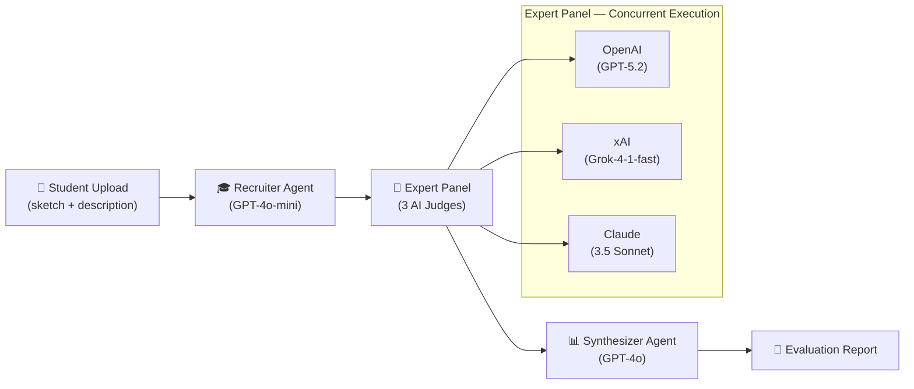
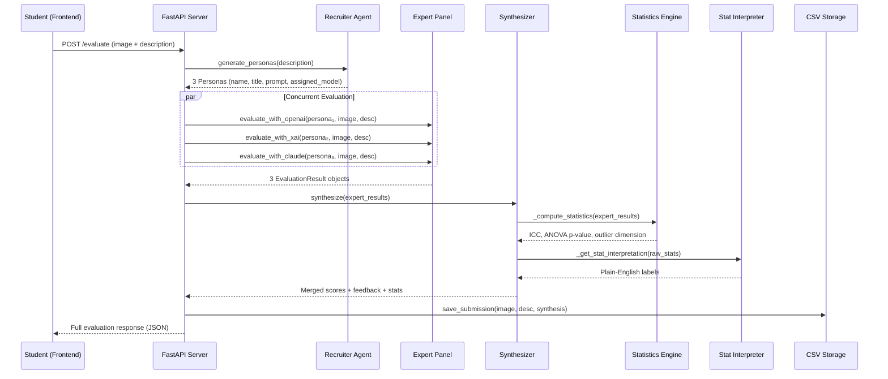
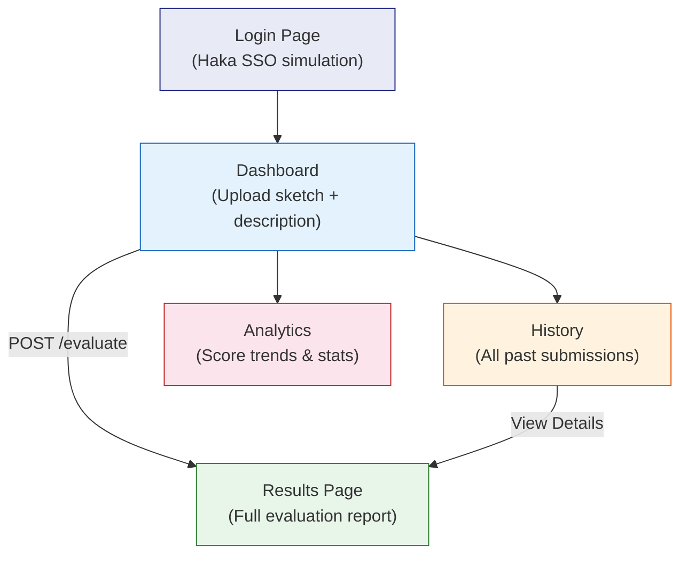
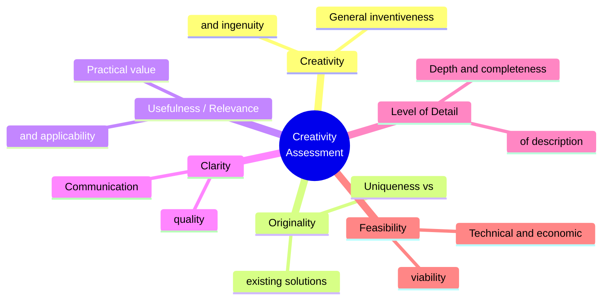
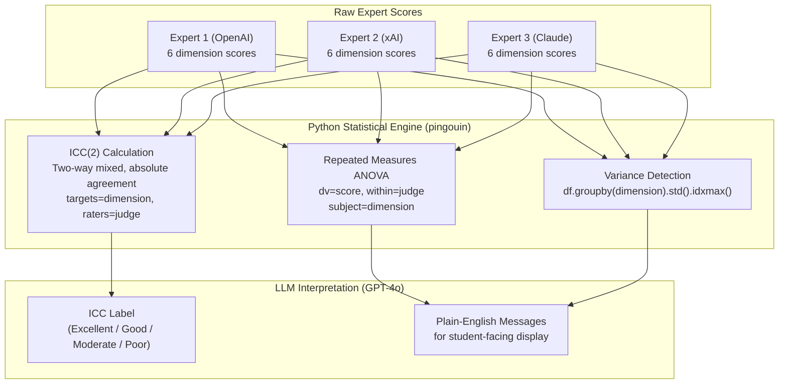

# Creativity Assessment Tool — Project Brief

> A multi-agent AI system that evaluates design creativity using the **Consensual Assessment Technique (CAT)** framework, built as a University of Oulu thesis project.

---

## 1. Problem Statement & Motivation

Evaluating creative design work is inherently subjective. The **Consensual Assessment Technique (CAT)**, the gold standard in creativity research, relies on multiple independent expert judges to score work, then measures **inter-rater reliability** to validate the assessment. This project replaces human judges with **multiple LLM models**, testing whether AI can replicate the CAT methodology. The key research question is: _Can a multi-agent LLM panel produce reliable, agreement-consistent creativity assessments?_

---

## 2. System Architecture

### 2.1 High-Level Pipeline



### 2.2 Detailed Backend Data Flow



### 2.3 Frontend Page Flow



---

## 3. Pipeline Steps — Detailed Breakdown

### Step 1: Recruiter Agent ([agents.py](file:///Users/danish/Desktop/ThesisWork/backend/services/agents.py))

| Property | Detail |
|----------|--------|
| **Model** | `gpt-4o-mini` |
| **Role** | Acts as a "Dean of Faculty" to assemble 3 expert judges |
| **Input** | Assignment description text |
| **Output** | 3 `Persona` objects (name, title, sub_text, evaluation prompt) |
| **Structured Output** | Uses OpenAI's `.beta.chat.completions.parse()` with Pydantic `RecruiterResponse` |
| **Model Assignment** | Distributes exactly one persona to each: `OpenAI`, `xAI`, `Claude` |

Personas are **dynamically generated** — titles and focus areas change based on the design domain (e.g., a medical device gets a "Biomedical Engineer", furniture gets a "Materials Scientist").

### Step 2: Expert Panel ([evaluators.py](file:///Users/danish/Desktop/ThesisWork/backend/services/evaluators.py))

Each evaluator receives the same sketch image (base64) + description but processes it through their unique persona prompt.

| Evaluator | Model | API | Vision Support | Fallback |
|-----------|-------|-----|----------------|----------|
| **OpenAI** | `gpt-5.2` | OpenAI SDK | ✅ via `image_url` | Falls back to `gpt-4o` on empty response |
| **xAI** | `grok-4-1-fast-reasoning` | OpenAI SDK (custom base_url) | ✅ via `image_url` | None |
| **Claude** | `claude-3-5-sonnet-20241022` | Anthropic SDK | ✅ via base64 `image` block | Strips markdown fences from output |
| **Gemini** _(disabled)_ | `gemini-2.5-pro` | HTTP API (httpx) | ✅ via `inlineData` | N/A — currently skipped |

All evaluators enforce `temperature=0.1` and `response_format: json_object` for determinism and parsability.

### Step 3: Synthesizer ([synthesizer.py](file:///Users/danish/Desktop/ThesisWork/backend/services/synthesizer.py))

| Sub-step | Engine | Detail |
|----------|--------|--------|
| **Score Synthesis** | `gpt-4o` | Computes mean scores, writes unified instructor feedback (intro, pivot, next_step) |
| **ICC Calculation** | `pingouin.intraclass_corr` | ICC(2) — two-way mixed, absolute agreement |
| **ANOVA** | `pingouin.rm_anova` | Repeated measures, tests for systematic rater bias |
| **Variance Detection** | `pandas` | Identifies the dimension with highest standard deviation across raters |
| **Stat Interpretation** | `gpt-4o` | Translates ICC value, ANOVA p-value into plain-English badges and messages |

### Step 4: Storage ([storage.py](file:///Users/danish/Desktop/ThesisWork/backend/services/storage.py))

- **Images** → `backend/data/images/{uuid}.{ext}`
- **Evaluation data** → appended as rows in `backend/data/results.csv` (20 columns)
- **Reset utility** → [reset_data.py](file:///Users/danish/Desktop/ThesisWork/backend/reset_data.py) renames the CSV with a timestamp backup

---

## 4. Evaluation Rubric

All judges independently score on a **0–5 scale** across **6 dimensions**:



Each judge also writes **Instructor Feedback** with 3 parts:
1. **Intro** — A catchy summary + detailed analysis
2. **Pivot** — Where to shift focus or what to avoid
3. **Next Step** — A concrete, immediate action

---

## 5. Tech Stack

### Backend

| Layer | Technology | Purpose |
|-------|-----------|---------|
| Framework | **FastAPI** + Uvicorn | Async REST API server |
| LLM (OpenAI) | `openai` SDK | GPT-4o-mini, GPT-5.2, GPT-4o |
| LLM (Anthropic) | `anthropic` SDK | Claude 3.5 Sonnet |
| LLM (xAI) | `openai` SDK (custom base URL) | Grok-4-1-fast |
| LLM (Google) | `httpx` (HTTP REST) | Gemini 2.5 Pro _(disabled)_ |
| Statistics | `pandas` + `pingouin` | ICC + Repeated Measures ANOVA |
| Storage | CSV + filesystem | Flat-file persistence |
| Config | `python-dotenv` | Environment variable management |

### Frontend

| Layer | Technology | Purpose |
|-------|-----------|---------|
| Framework | **React 19** + Vite 7 | SPA with TypeScript |
| Styling | **TailwindCSS 4** | Utility-first CSS |
| Routing | React Router v7 | Client-side navigation |
| Charts | **Recharts** | Radar chart + line chart |
| Animations | **Framer Motion** | UI transitions |
| PDF Export | `html2canvas` + `jsPDF` | Client-side report download |
| Icons | **Lucide React** + custom SVG | LLM brand icons (OpenAI, xAI, Claude, Gemini) |
| HTTP | **Axios** | API communication |

---

## 6. Project Structure

```
ThesisWork/
├── backend/
│   ├── main.py                          # FastAPI app entry point (4 endpoints)
│   ├── requirements.txt                 # Python dependencies
│   ├── reset_data.py                    # Data reset utility with timestamped backups
│   ├── .env                             # API keys (OPENAI, XAI, CLAUDE, GEMINI)
│   ├── data/
│   │   ├── results.csv                  # Evaluation results (20 columns per row)
│   │   └── images/                      # Uploaded sketch images (UUID-named)
│   └── services/
│       ├── creativity_judge.py          # Orchestrator: recruiter → panel → synthesizer
│       ├── agents.py                    # Recruiter Agent (dynamic persona generation)
│       ├── evaluators.py                # Multi-LLM evaluator functions (4 providers)
│       ├── synthesizer.py               # Score synthesis + ICC/ANOVA statistics
│       └── storage.py                   # CSV read/write + image persistence
├── frontend/
│   ├── src/
│   │   ├── App.tsx                      # Router definition (5 routes)
│   │   ├── main.tsx                     # React entry point
│   │   ├── pages/
│   │   │   ├── Login.tsx                # Haka SSO login simulation
│   │   │   ├── Dashboard.tsx            # Drag-and-drop upload + description input
│   │   │   ├── Results.tsx              # Full evaluation report (526 lines)
│   │   │   ├── History.tsx              # Tabular view of past submissions
│   │   │   └── Analytics.tsx            # Score trend chart + summary stats
│   │   └── components/
│   │       ├── Layout.tsx               # Shared sidebar layout (C.ai branding)
│   │       └── LLMIcons.tsx             # SVG icons for OpenAI, xAI, Claude, Gemini
│   ├── package.json                     # npm dependencies
│   ├── tailwind.config.js
│   └── vite.config.ts
└── Docs/                                # Reference research papers (PDFs)
```

---

## 7. API Endpoints

| Method | Path | Request | Response |
|--------|------|---------|----------|
| `GET` | `/` | — | Health check message |
| `POST` | `/evaluate` | `multipart/form-data`: `image` (file) + `description` (text) | Full evaluation: scores, reasoning, feedback, expert_panel, stats |
| `GET` | `/results/{id}` | — | Single evaluation record by UUID |
| `GET` | `/history` | — | All past evaluations (newest first) |
| `GET` | `/analytics` | — | `{ total_submissions, average_score, trend[], creative_standing }` |

---

## 8. Frontend Pages — Detail

### Login (`/login`)
- Simulates **Haka** (Finnish university SSO) login
- Organization dropdown (University of Oulu, Aalto, Helsinki)
- Redirects to Dashboard after 800ms delay

### Dashboard (`/dashboard`)
- **Drag-and-drop** image upload area (accepts `.jpg`, `.png`, `.pdf`)
- Text area for design description / rationale
- Submit button triggers `POST /evaluate`
- Loading spinner with "Evaluating with AI..." text during processing
- On success, navigates to `/results/{id}` with result data in router state

### Results (`/results/:id`)
The most complex page (~526 lines), containing 5 major sections:

| Section | Content |
|---------|---------|
| **Product Concept** | Uploaded sketch image (click-to-zoom modal) + description |
| **Aggregated Panel Consensus** | Radar chart (Recharts) + overall score badge |
| **Detailed Dimension Feedback** | All 6 dimensions with scores + reasoning + PDF download |
| **Instructor Feedback** | Intro paragraph + accordion for pivot/next step |
| **Individual Expert Panel** | 3 agent cards with mini score bars, persona info, and per-agent feedback |
| **Statistical Reliability** | ICC score with badge + ANOVA p-value with significance analysis |

### History (`/history`)
- Filterable table (date, description, score badge, status, view button)
- Color-coded score badges: green (≥4), yellow (≥2.5), red (<2.5)

### Analytics (`/analytics`)
- 3 stat cards: Total Submissions, Average Score, Creative Standing
- Line chart showing score trend over last 6 submissions

---

## 9. Statistical Methods — Deep Dive



| Metric | Threshold | Interpretation |
|--------|-----------|----------------|
| ICC ≥ 0.75 | Excellent | Strong agreement — all agents score similarly |
| ICC ≥ 0.60 | Good | Acceptable agreement |
| ICC ≥ 0.40 | Moderate | Some disagreement between agents |
| ICC < 0.40 | Poor | Substantial divergence — results less reliable |
| ANOVA p < 0.05 | Significant | Systematic bias detected between raters |
| ANOVA p ≥ 0.05 | Not Significant | No evidence of systematic rater bias |

---

## 10. How to Run

### Backend
```bash
cd backend
pip install -r requirements.txt
# Configure .env with: OPENAI_API_KEY, XAI_API_KEY, CLAUDE_API_KEY
python main.py
# → http://localhost:8000
```

### Frontend
```bash
cd frontend
npm install
npm run dev
# → http://localhost:5173
```

---

## 11. Key Design Decisions

| Decision | Rationale |
|----------|-----------|
| **3 different LLM providers** | Simulates multi-rater CAT; prevents single-model bias from inflating ICC |
| **Dynamic persona generation** | Tailors expertise to each assignment's domain instead of using generic evaluators |
| **Structured JSON output** | Pydantic models + `response_format: json_object` ensure parseable, consistent data |
| **Low temperature (0.1)** | Maximizes determinism for reproducible evaluations |
| **Concurrent evaluation** | `asyncio.gather` runs all 3 evaluators in parallel, reducing total latency |
| **ICC + ANOVA** | Academically recognized measures of inter-rater reliability, critical for thesis validation |
| **CSV storage** | Simple, inspectable, and sufficient for thesis-scale data without database overhead |
| **GPT-4o for synthesis** | Higher-capability model merges evaluations; cheaper `gpt-4o-mini` handles persona generation |

---

## 12. Future Improvements

### 🔬 Research & Validation
- **Human–AI Comparison Study**: Conduct a controlled experiment comparing AI panel scores with human expert scores on the same set of designs, computing cross-panel ICC to validate AI-as-judge
- **Larger Sample Analysis**: Evaluate a statistically significant number of design submissions (n > 30) to test score distribution normality and enable parametric testing
- **Prompt Sensitivity Analysis**: Systematically vary persona prompts and rubric phrasing to measure the effect on inter-rater reliability
- **Re-enable Gemini**: Expand the panel to 4 evaluators to increase rater count, strengthening ICC statistical power

### 🏗️ Architecture & Scalability
- **Database Migration**: Replace CSV with PostgreSQL or SQLite for concurrent access, indexing, and query capabilities
- **Authentication**: Replace the simulated Haka login with actual SAML/OIDC integration for university SSO
- **Background Processing**: Move evaluation to a task queue (Celery/Redis or FastAPI BackgroundTasks) with WebSocket progress updates
- **Caching Layer**: Cache Recruiter Agent responses for identical assignment descriptions to reduce API costs
- **Rate Limiting**: Add per-user rate limits to prevent API cost overruns

### 🎨 Frontend & UX
- **Real-time Progress**: Show a step-by-step progress indicator (Recruiter → Panel → Synthesis) during evaluation
- **Comparative View**: Allow side-by-side comparison of two submissions' evaluation reports
- **Assignment Management**: Add an instructor view for defining assignments and reviewing all student submissions
- **Mobile Responsiveness**: Optimize the Results page layout for tablet and mobile screens
- **Dark Mode**: Implement theme toggling with TailwindCSS dark variants

### 📊 Analytics & Reporting
- **Per-Dimension Trends**: Track how each of the 6 dimensions changes over time, not just the overall score
- **Cohort Analytics**: Aggregate and compare scores across an entire class of students
- **PDF Report Enhancement**: Include radar chart visualization, agent cards, and statistical data in the exported PDF
- **Export to CSV/Excel**: Allow bulk export of all historical evaluations for external statistical analysis

### 🔒 Robustness
- **Error Recovery**: Add retry logic with exponential backoff for failed LLM API calls
- **Partial Panel Results**: Gracefully handle scenarios where one evaluator fails but the other two succeed
- **Input Validation**: Enforce image size/format limits and description length constraints before hitting the API
- **Logging & Monitoring**: Add structured logging (JSON) and health check endpoints for production observability
