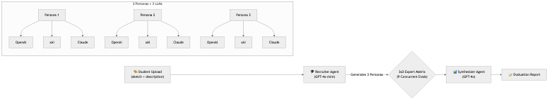
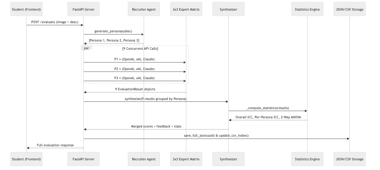
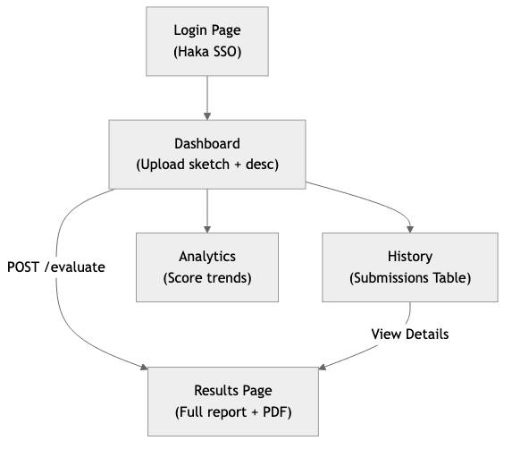

# Creativity Assessment Tool — Project Brief

> A multi-agent AI system that evaluates design creativity using the **Consensual Assessment Technique (CAT)** framework, built as a University of Oulu thesis project. It now features a powerful **3x3 Fan-Out matrix** architecture that yields 9 simultaneous evaluations.

---

## 1. Problem Statement & Motivation

Evaluating creative design work is inherently subjective. The **Consensual Assessment Technique (CAT)**, the gold standard in creativity research, relies on multiple independent expert judges to score work, then measures **inter-rater reliability** to validate the assessment. This project replaces human judges with a matrix of **multiple LLM models role-playing multiple expert personas**, testing whether AI can replicate the CAT methodology at scale. The key research question is: _Can a 3x3 multi-agent LLM panel produce reliable, agreement-consistent creativity assessments?_

---

## 2. System Architecture

### 2.1 High-Level Pipeline: The 3x3 Fan-Out

### 2.2 Detailed Backend Data Flow

### 2.3 Frontend Page Flow

---

## 3. Pipeline Steps — Detailed Breakdown

### Step 1: Recruiter Agent (`agents.py`)

| Property | Detail |
|----------|--------|
| **Model** | `gpt-4o-mini` |
| **Role** | Assembles a tailored expert panel |
| **Input** | Assignment description |
| **Output** | 3 `Persona` objects (name, title, sub_text, evaluation prompt) |
| **Dynamic** | Titles and focus areas change based on design domain |

### Step 2: Extract Panel: The 3x3 Matrix (`evaluators.py` & `creativity_judge.py`)

Once the 3 personas are generated, the orchestrator loops over them. For each persona, it fires off 3 asynchronous API requests to the LLM providers, yielding `3 Personas × 3 LLMs = 9 Evaluations` total.

| Evaluator | Model | API | Fallback |
|-----------|-------|-----|----------|
| **OpenAI** | `gpt-5.2` | OpenAI SDK | `gpt-4o` |
| **xAI** | `grok-4-1-fast-reasoning` | Custom base_url | None |
| **Claude** | `claude-3-5-sonnet-20241022` | Anthropic SDK | Strips markdown fences |

All 9 evaluators enforce `temperature=0.1` and `response_format: json_object`.

### Step 3: Synthesizer (`synthesizer.py`)

| Component | Detail |
|-----------|--------|
| **Score Synthesis** | Averages all 9 outcomes for the Composite Score |
| **Instructor Feedback** | `gpt-4o` writes Intro, Pivot, and Next Step |
| **ICC Calculation** | `pingouin` computes Overall ICC & Per-Persona ICC |
| **ANOVA** | Two-way ANOVA to detect systematic Model or Persona bias |
| **Interpretation** | LLM translates raw P-values and ICCs to plain-English badges |

### Step 4: Storage (`storage.py`)

- **Images** → `backend/data/images/{uuid}.{ext}`
- **Evaluations** → Full response saved as `backend/data/evaluations/{uuid}.json` to persist the 9 deep nested results.
- **Index** → Metadata (ID, overall score, date) appended to `backend/data/results.csv` for fast history populating.

---

## 4. Evaluation Rubric

All 9 parallel instances score the design on a **0–5 scale** across **6 dimensions**:
1. **Creativity** — General inventiveness
2. **Originality** — Uniqueness vs existing solutions
3. **Usefulness/Relevance** — Practical value
4. **Clarity** — Communication quality
5. **Level of Detail** — Depth and completeness
6. **Feasibility** — Technical/economic viability

---

## 5. Tech Stack

### Backend
| Layer | Technology | Purpose |
|-------|-----------|---------|
| Framework | **FastAPI** | Async REST API |
| Providers | `openai`, `anthropic` | LLM interactions |
| Statistics | `pandas`, `pingouin` | ICC(2) + Two-Way ANOVA |
| Storage | JSON + CSV + Filesystem | Persistence |

### Frontend
| Layer | Technology | Purpose |
|-------|-----------|---------|
| UI | **React 19** + Vite | SPA Framework |
| Styling | **TailwindCSS 4** | Component styles & Dark Mode |
| Charts | **Recharts** | Radar/polar charts |
| PDF Export| **jsPDF** | Data-driven, layout-independent PDF rendering |
| HTTP | **Axios** | API calls |

---

## 6. Frontend Pages — Detail

### Results (`/results/:id`)
The centerpiece of the application. Highlights include:
- **Assessment Summary**: Image inspection modal (dark hover-reveal), radar consensus chart, dimension score breakdown, and Instructor Feedback.
- **Data-Driven PDF**: Downloads an A4 report directly using `jsPDF` without unstable DOM captures.
- **Expert Panel Accordion**: Groups the 9 evaluations by the 3 Personas. Expanding a persona reveals a 3-column grid comparing how OpenAI, xAI, and Claude interpreted that specific persona's prompt.
- **Statistical Reliability**: Displays Overall ICC, Per-Persona ICC, and ANOVA (Model Effect vs Persona Effect).

---

## 7. Statistical Methods — Deep Dive

The matrix architecture (3 Personas, 3 Models) enables robust multi-dimensional analysis:
- **Overall ICC(2)**: How well do all 9 evaluation paths agree? (Excellent ≥ 0.75, Poor < 0.40)
- **Per-Persona ICC**: Holding the persona constant, how well do the 3 AI models agree?
- **Two-Way ANOVA**: 
  - *Model Effect* (p < 0.05): Is one LLM provider systematically scoring higher/lower than others?
  - *Persona Effect* (p < 0.05): Is one Persona archetype systematically harsher/more lenient?

---

## 8. Key Design Decisions

| Decision | Rationale |
|----------|-----------|
| **3x3 Fan-Out** | Provides statistically significant variance (N=9) while keeping latency low via concurrent execution. |
| **Two-Way ANOVA** | Standard 1-way ANOVA isn't enough; we must isolate *Provider variance* from *Persona variance*. |
| **Full JSON Storage** | Relational DBs are overkill, but CSVs cannot easily store 9 deeply nested agent results. JSON files solve this perfectly. |
| **jsPDF over window.print()** | Browser print dialogs struggle with `oklch` modern CSS and dark mode overrides. jsPDF builds a clean, readable document directly from the result data. |
| **Dark Mode First** | The UI utilizes Tailwind dark mode extensively to provide a sleek, focused analytical environment. |

---

## 9. Future Improvements

- **Human–AI Validation**: Compare the 3x3 AI matrix scores against true human expert judgments.
- **Customization Engine**: Let instructors define custom rubrics or force specific personas via the Dashboard UI.
- **Queue/Workers**: Move the heavy 9-request fan-out from synchronous HTTP requests to a Celery/Redis task queue with WebSockets for real-time progress bars.
- **Scale to N-x-N**: Allow dynamic configuration of `N personas x M models` based on varying computational budgets.
